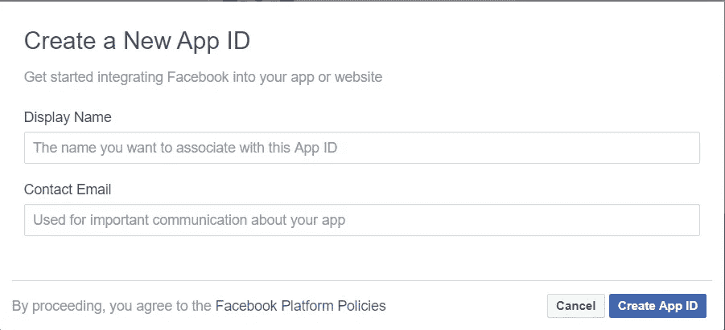

# 在 Angular 8 和脸书·奥厄斯一起签到

> 原文：<https://levelup.gitconnected.com/sign-in-with-facebook-oauth-in-angular-8-3a1625eceab2>

## 使用您的脸书帐户通过 OAuth 登录 Angular 应用程序


与脸书一起登录

使用脸书登录应用程序要容易得多。用户可以简单地点击“用脸书登录”按钮，他们将被导航到脸书给应用程序权限。然后，用户将收到一个带有其他个人信息的令牌密钥。

在这个演示中，我们将使用**Angular x-social-log in**Angular 模块在我们的应用程序和脸书之间进行集成。

# 添加脸书应用程序

首先，我们需要设置一个脸书应用程序并获取应用程序 ID。导航到[脸书的开发者仪表板](https://developers.facebook.com/apps/)。确保使用您的帐户登录。


面向开发人员的脸书仪表板

点击“添加新应用”并通过输入有效的显示名称和电子邮件创建新的应用 ID。



创建新的应用 ID

然后，完成安全检查并单击提交。


脸书开发者仪表板中的产品列表

在显示的产品列表中，单击脸书登录的“设置”按钮。选择 Web 作为平台，并输入如下 URL。此时，我们将在本地环境中测试我们的应用程序。单击保存并继续。


您的网站信息部分

别忘了复制并保存你的应用 ID。

# 设置角度应用

要创建新的角度应用程序，只需运行以下命令:

```
ng new newApp
```

导航到根文件夹，使用下面的命令运行应用程序。

```
cd newApp
ng serve -o
```

接下来，我们将在我们的应用程序中安装 **angularx-social-login** 模块。

```
npm install angularx-social-login --save
```

如下更新我们的 **app.module.ts** 文件。

```
import { BrowserModule } from '@angular/platform-browser';
import { NgModule } from '@angular/core';
import { AppRoutingModule } from './app-routing.module';
import { AppComponent } from './app.component';
import { ReactiveFormsModule } from '@angular/forms';
import { SocialLoginModule, AuthServiceConfig, FacebookLoginProvider } from 'angularx-social-login';const config = new AuthServiceConfig([
  {
    id: FacebookLoginProvider.PROVIDER_ID,
    provider: new FacebookLoginProvider('YOUR-APP-ID')
  }
]);export function provideConfig() {
  return config;
}@NgModule({
  declarations: [
    AppComponent
  ],
  imports: [
    BrowserModule,
    AppRoutingModule,
    ReactiveFormsModule,
    SocialLoginModule
  ],
  providers: [
    {
      provide: AuthServiceConfig,
      useFactory: provideConfig
    }
  ],
  bootstrap: [AppComponent]
})
export class AppModule { }
```

# 在带有脸书按钮的表单中显示一个标志

接下来，我们将设置一个带有脸书按钮的基本登录表单。我已经用 Bootstrap 初始化了应用程序。你可以查看这个[链接](https://medium.com/javascript-in-plain-english/build-angular-8-project-with-bootstrap-7b89775e5764)来了解更多关于如何在 Angular 应用中安装 Bootstrap 的信息。

更新我们的**app.component.html**和 **app.component.ts** 如下。

**app.component.html**

```
<html lang="en">
  <head>
    <meta charset="UTF-8">
    <meta name="viewport" content="width=device-width, initial-scale=1.0">
    <meta http-equiv="X-UA-Compatible" content="ie=edge">  
    <title>Document</title>
  </head><body class="bg-light">
  <div class="container">
    <div class="row py-5 justify-content-center">
      <div class="col-md-8">
        <h1 class="text-center py-4">Sign In with Facebook in Angular 8</h1> <div *ngIf="loggedIn===false">
          <form [formGroup]="signinForm">
            <div class="form-group">
              <label for="email">Email</label>
              <input type="text" class="form-control" id="email" formControlName="email">
            </div>

            <div class="form-group">
              <label for="password">Password</label>
              <input type="password" class="form-control" id="password" formControlName="password" >
            </div>
          </form>
          <div>
            <p>Or</p>
          </div>
          <div>
            <button type="button" (click)="signInWithFB()" class="btn btn-primary">Sign In With Facebook</button>
          </div>
        </div> <div *ngIf="loggedIn===true">
          <div class="form-group">
            <label for="firstname">First Name</label>
            <input type="text" class="form-control" id="firstname" [value]="user.firstName" readonly >
          </div> <div class="form-group">
            <label for="lastname">Last Name</label>
            <input type="text" class="form-control" id="lastname" [value]="user.lastName" readonly >
          </div> <div class="form-group">
            <label for="email2">Email</label>
            <input type="text" class="form-control" id="email2" [value]="user.email" readonly >
          </div>

          <button type="button" (click)="signOut()" class="btn btn-primary">Sign Out</button> </div>
      </div>
    </div>
  </div>
</body>
</html>
```

**应用组件**

```
import { Component, OnInit } from '@angular/core';
import { FormGroup, FormBuilder, Validators } from '@angular/forms';
import { AuthService, FacebookLoginProvider, SocialUser } from 'angularx-social-login';@Component({
  selector: 'app-root',
  templateUrl: './app.component.html',
  styleUrls: ['./app.component.scss']
})
export class AppComponent implements OnInit {
  signinForm: FormGroup;
  user: SocialUser;
  loggedIn: boolean; constructor(private fb: FormBuilder, private authService: AuthService) { } ngOnInit() {
    this.signinForm = this.fb.group({
      email: ['', Validators.required],
      password: ['', Validators.required]
    }); this.authService.authState.subscribe((user) => {
      this.user = user;
      this.loggedIn = (user != null);
      console.log(this.user);
    });
  } signInWithFB(): void {
    this.authService.signIn(FacebookLoginProvider.PROVIDER_ID);
  } signOut(): void {
    this.authService.signOut();
  }
}
```

使用此命令运行应用程序。

```
ng serve -o
```

如果您遇到如下图所示的问题“无法再从 http 页面调用该方法”,请查看此[链接](/create-a-valid-ssl-in-localhost-for-angular-applications-ed05054ec2e7)来解决它。这是因为来自脸书的方法只能从 https 页面调用。因此，您需要在本地主机中设置一个有效的 SSL 来解决这个问题。


通过执行以下命令重新运行您的应用程序:

```
ng serve --ssl
```

这是你点击“用脸书登录”按钮后的样子。您的脸书信息将显示在表单中。


用脸书表单登录结果

# 结论

在这篇文章中，我们学习了如何使用 angularx-social-login Angular 模块登录脸书的 Angular 应用程序。

如果你认为这篇文章是有帮助的，不要忘记与你的朋友分享。

# 资源

1.  [https://www . djam ware . com/post/5d 4628d 5721 E1 ce 9d 7 DC 95 b 0/angular-8-教程-Facebook-登录](https://www.djamware.com/post/5d4628d5721e1ce9d7dc95b0/angular-8-tutorial-facebook-login)