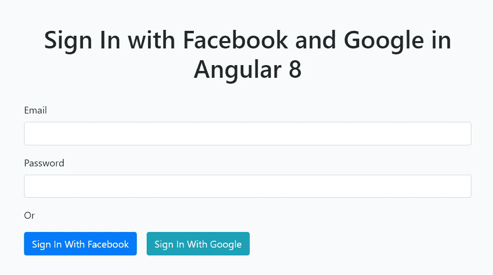
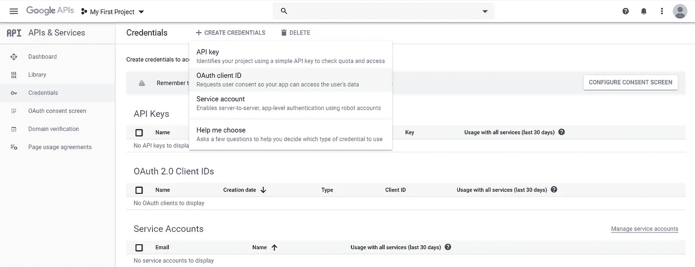
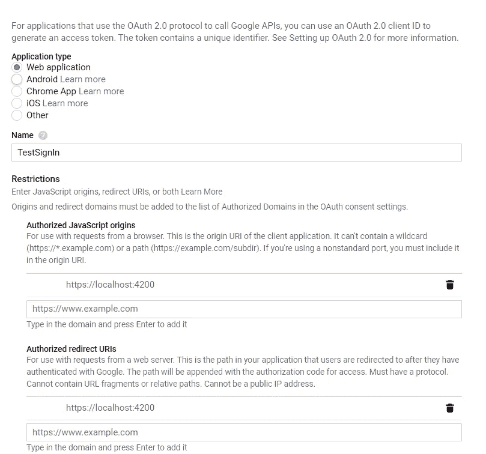
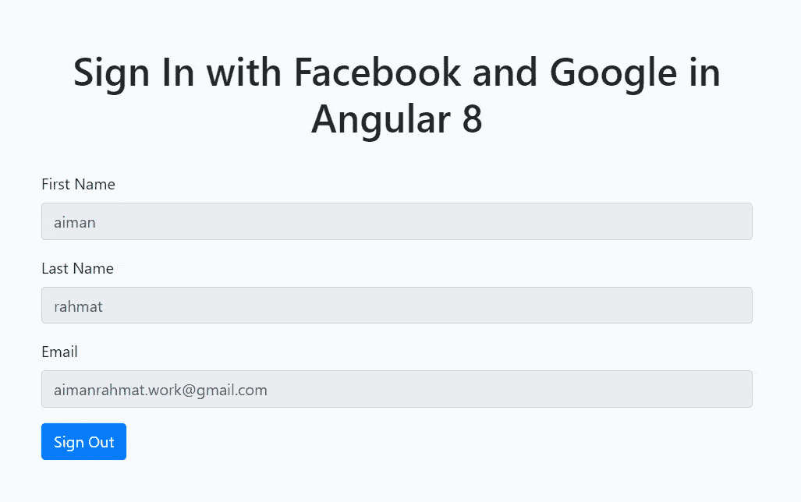

# 在 Angular 8 中登录 Google OAuth

> 原文：<https://levelup.gitconnected.com/sign-in-with-google-oauth-in-angular-8-e716ed7f3b2f>

## 只需点击一下鼠标，就可以在 Angular 应用程序中使用 Google 进行登录。



登录脸书和谷歌 OAuth

在我之前的帖子中，已经一步一步地解释了如何登录脸书。你可以点击查看链接[。现在，我们将添加另一个按钮来使用 Google 帐户登录。我们将使用与我之前的帖子相同的角度模块，即 **angularx-social-login** 。唯一的区别是我们需要从 Google API 控制台获取 OAuth 客户端 id。](/sign-in-with-facebook-oauth-in-angular-8-3a1625eceab2)

# 创建一个谷歌应用

首先，我们需要导航到 [Google API 控制台](https://console.developers.google.com/apis/credentials)并创建凭证。选择 OAuth 客户端 ID。



Google API 控制台

接下来，选择 Web 应用程序，输入我们的项目名称、项目 URL，然后单击 Create 按钮。



我们将使用 https 而不是 http，因为来自 Google API 的方法只能从 https 页面调用。您可以查看这篇文章，为 Angular 应用程序在 localhost 中创建一个有效的 SSL。

在下一个屏幕中，复制客户端 ID 并将其保存在记事本中。

接下来，按照我在[上一篇文章](/sign-in-with-facebook-oauth-in-angular-8-3a1625eceab2)中的副标题**设置 Angular 应用**的步骤，创建一个新的 Angular 应用并安装 angularx-social-login 模块。

# 用谷歌按钮显示一个登录表单

我们将在我们的登录表单中添加一个带有 Google 按钮的**登录。为此，我们需要如下更新这 3 个文件。**

**app.component.html**

```
<html lang="en">
  <head>
    <meta charset="UTF-8">
    <meta name="viewport" content="width=device-width, initial-scale=1.0">
    <meta http-equiv="X-UA-Compatible" content="ie=edge">  
    <title>Document</title>
  </head><body class="bg-light">
  <div class="container">
    <div class="row py-5 justify-content-center">
      <div class="col-md-8">
        <h1 class="text-center py-4">Sign In with Facebook in Angular 8</h1>        <div *ngIf="loggedIn===false">
          <form [formGroup]="signinForm">
            <div class="form-group">
              <label for="email">Email</label>
              <input type="text" class="form-control" id="email" formControlName="email">
            </div>

            <div class="form-group">
              <label for="password">Password</label>
              <input type="password" class="form-control" id="password" formControlName="password" >
            </div>
          </form>
          <div>
            <p>Or</p>
          </div>
          <div>
            <button type="button" (click)="signInWithFB()" class="btn btn-primary">Sign In With Facebook</button>
            <button type="button" (click)="signInWithGoogle()" class="btn btn-primary">Sign In With Google</button>
          </div>
        </div>        <div *ngIf="loggedIn===true">
          <div class="form-group">
            <label for="firstname">First Name</label>
            <input type="text" class="form-control" id="firstname" [value]="user.firstName" readonly >
          </div>          <div class="form-group">
            <label for="lastname">Last Name</label>
            <input type="text" class="form-control" id="lastname" [value]="user.lastName" readonly >
          </div>          <div class="form-group">
            <label for="email2">Email</label>
            <input type="text" class="form-control" id="email2" [value]="user.email" readonly >
          </div>

          <button type="button" (click)="signOut()" class="btn btn-primary">Sign Out</button>         </div>
      </div>
    </div>
  </div>
</body>
</html>
```

**应用组件**

```
import { Component, OnInit } from '@angular/core';
import { FormGroup, FormBuilder, Validators } from '@angular/forms';
import { AuthService, FacebookLoginProvider,GoogleLoginProvider, SocialUser } from 'angularx-social-login';@Component({
  selector: 'app-root',
  templateUrl: './app.component.html',
  styleUrls: ['./app.component.scss']
})export class AppComponent implements OnInit {
  signinForm: FormGroup;
  user: SocialUser;
  loggedIn: boolean;    constructor(private fb: FormBuilder, private authService: AuthService) { }    ngOnInit() {
    this.signinForm = this.fb.group({
      email: ['', Validators.required],
      password: ['', Validators.required]
    });    this.authService.authState.subscribe((user) => {
      this.user = user;
      this.loggedIn = (user != null);
      console.log(this.user);
    });
  }    signInWithFB(): void {
    this.authService.signIn(FacebookLoginProvider.PROVIDER_ID);
  } signInWithGoogle(): void {
    this.authService.signIn(GoogleLoginProvider.PROVIDER_ID);
  } signOut(): void {
    this.authService.signOut();
  }
}
```

**app.module.ts**

```
import { BrowserModule } from '@angular/platform-browser';
import { NgModule } from '@angular/core';
import { AppRoutingModule } from './app-routing.module';
import { AppComponent } from './app.component';
import { ReactiveFormsModule } from '@angular/forms';
import { SocialLoginModule, AuthServiceConfig, FacebookLoginProvider } from 'angularx-social-login';const config = new AuthServiceConfig([
  {
    id: GoogleLoginProvider.PROVIDER_ID,
    provider: new GoogleLoginProvider("YOUR-GOOGLE-CLIENT-ID")
  },
  {
    id: FacebookLoginProvider.PROVIDER_ID,
    provider: new FacebookLoginProvider('YOUR-APP-ID')
  }
]);export function provideConfig() {
  return config;
}@NgModule({
  declarations: [
    AppComponent
  ],
  imports: [
    BrowserModule,
    AppRoutingModule,
    ReactiveFormsModule,
    SocialLoginModule
  ],
  providers: [
    {
      provide: AuthServiceConfig,
      useFactory: provideConfig
    }
  ],
  bootstrap: [AppComponent]
})
export class AppModule { }
```

这是你点击“用谷歌登录”按钮后的样子。您的 Google 帐户信息将显示在表单中。



使用 Google 帐户登录后

# 结论

在本文中，我们学习了如何使用 angularx-social-login Angular 模块登录到我们的 Angular 应用程序。

如果你认为这篇文章是有帮助的，不要忘记与你的朋友分享。

# 资源

1.  https://dzone . com/articles/log in-with-Facebook-and-Google-using-angular-8