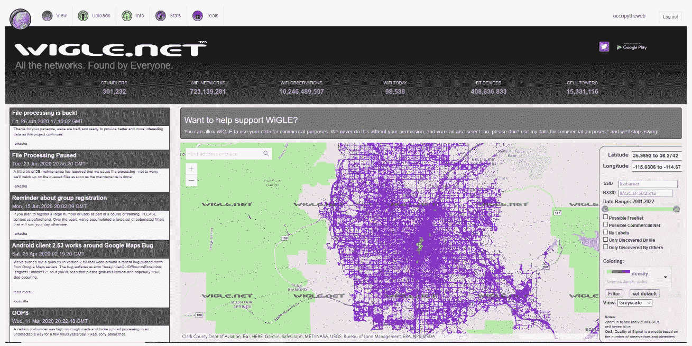
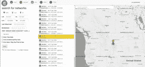
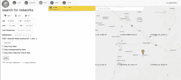
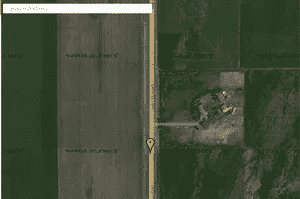
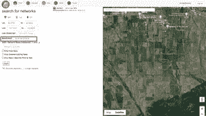

# Sim 卡、SSIDs、WiGLE 以及攻击者如何使用您的手机跟踪您

> 原文：<https://levelup.gitconnected.com/sim-cards-ssids-wigle-and-how-to-prevent-attackers-can-use-your-cell-phone-to-follow-you-b036cf5c37d9>

由 [Unsplash](https://unsplash.com?utm_source=medium&utm_medium=referral) 上的[萨尔茨堡](https://unsplash.com/@freewalkingtoursalzburg?utm_source=medium&utm_medium=referral)自由徒步之旅拍摄的照片

是的，女士们先生们，这是一件事。

所以让我们从 super duper basic 开始，定义一些术语。

**SIM 卡**(用户识别模块)是一种微型便携式存储芯片，可以存储你作为手机用户的信息。[1]在它上面，有一个 17 位数字的代码，标明它的国家代码、系统运营商(如 AT & T 或威瑞森)和一个唯一的用户 ID。[1]

**AP**—Wi-Fi 接入点

**SSID** -服务器端标识符。这是标识 AP 的名称

**BSSID** -这是设备的全球唯一 MAC 地址

## 什么是 **WiGLE** ？

**WiGLE** 是指**无线地理测井引擎**，可以从[https://wigle.net](https://wigle.net/)访问。它本质上是一个全球性的数据库，标出了数亿个无线接入点的地理位置。 [2]

是一个整合全球无线网络上的位置和其他数据的网站。这些数据是由志愿者收集的，他们将一个应用程序下载到手机上，该应用程序记录他们遇到的所有接入点及其 GPS 坐标。所有这些数据都被输入威格尔数据库。然后，这些数据会在一个易于使用的网站和应用程序中呈现给用户，如下所示。[4]

[4]奥辛特:使用 Wigle.net 追踪嫌疑犯的精确位置。2021 年 10 月更新。[https://www . hackers-rise . com/post/osint-tracking-the-suspect-s-precise-location-using-wig le-net](https://www.hackers-arise.com/post/osint-tracking-the-suspect-s-precise-location-using-wigle-net)

如果攻击者想要攻击一个偏远地区，他们只需输入邮政编码、地址或浏览地图，就可以了解该地区存在哪些网络以及该网络的大致位置。然后，通过查看目标区域的地图，攻击者可以通过网络名称(SSID)进行搜索，以决定攻击哪个网络。[2]

## 什么是网络名称？(SSID)

SSID 是**服务集标识符**的简称，通俗地说就是一个 WiFi 网络的名称。SSID 是用于识别无线网络的网络名称。但是不要混淆。SSID 不是我们分配给无线路由器的名称，尽管它可能是显示给用户的名称。相反，SSID 是一个不同的 32 个八位字节的字符串，用于区分任何其他附近的网络名称。

SSID 充当街道地址，有助于区分不同的 WLAN，因此所有试图连接到特定 WLAN 的接入点和设备都必须使用相同的 SSID。因为 SSID 可以在分组的纯文本中被嗅探到，所以设备将不被允许加入 BSS，除非它能够提供唯一的 SSID。这没有为网络提供安全性。[3]

# SSID 有多安全？

SSID 包含在通过**无线网络**发送的每个数据包中，确保通过空中发送的数据到达其预定目的地。[3]攻击者利用这些数据来交叉引用 SSIDs 和首选网络列表(pnl)。*简而言之，PNL 是设备先前已经连接的网络的列表，并且如果在广播范围内，已经被设备批准在将来任意再次加入。[2]* 您要求您的设备“自动连接”的所有接入点(AP)都将在您的 PNL 上…如咖啡店或医生办公室。PNL 是您的手机如何知道您的家庭网络是您的家庭网络，并在您进入范围时自动连接。这并不是说你的手机可以连接到任何同名的网络——它也需要相同的密码——但是你的手机会不断向外广播“你是我的网络吗？”试图找到家。[2]

# 如何使用 WIGLE 找到某人

例如，让我们假设嫌疑人的注册表包含 AP SSID“Big Black”。我们还假设，我们需要确定嫌疑人去过哪里，他们可能是犯罪嫌疑人。

打开 Wigle 网站，点击**查看**。将出现一个下拉菜单，点击**基本搜索**。

我们现在需要在搜索参数的 SSID 部分输入术语“大黑”，如下所示。

这揭示了美国西部数十个带有 SSID 的 AP。当我们点击 MAC 地址为 f9:AB:54:53:B8:FE 的 ap 时，地图显示这个“大黑”AP 位于蒙大拿州南部。

我们可以双击这个地图并放大，发现它就在波兹曼山外。

为了更好地了解该位置，我们可以放大并切换到卫星视图。这揭示了这张地图是在博兹曼南部南 19 大街的农场附近拍摄的。很可能 AP 是从那个牧场发射的，但另一种可能性是它可能是从在那条路上经过的车辆上被记录下来的。

要确定 AP SSID 是否属于某个位置和分支，我们可以通过全球唯一 MAC 地址或 BSSID 进行搜索。如果这个 BSSID 出现在其他位置，很可能这个 AP 是移动的而不是静态的，这使得我们的搜索更加困难。

让我们输入 BSSID 并搜索整个美国。如果是移动 AP，它很可能会出现在其他位置。当我们搜索这个 BSSID 时，我们可以看到唯一记录的 BSSID 位置是在 Bozeman 附近的那个牧场。

那就是我们的嫌疑犯最近所在的地方！

# 参考

[1]什么是 SIM 卡，它有什么作用:SIM 卡的简单历史。[https://kwikboost.com/blog/the-history-of-sim-cards/](https://kwikboost.com/blog/the-history-of-sim-cards/)

[2]什么是 WiGLE，为什么它对您的网络安全很重要？(pulsarsecurity.com)[https://blog . pulsar security . com/what-is-wig le-and-why-it-important #:~:text = wig ler refers % 20 to % 20 the % 20 wireless % 20 geographic % 20 logging % 20 engine % 2C % 20 and，wireless%20access%20points。% 20 w igle % 20 search % 20 of % 20 Boston % 2C % 20MA](https://blog.pulsarsecurity.com/what-is-wigle-and-why-is-it-important#:~:text=WiGLErefers%20to%20the%20Wireless%20Geographic%20Logging%20Engine%2C%20and,wireless%20access%20points.%20WiGLE%20search%20of%20Boston%2C%20MA)

[3]什么是 SSID？【https://www.tutorialspoint.com/what-is-an-ssid 

[4]奥辛特:使用 Wigle.net 追踪嫌疑犯的精确位置。2021 年 10 月更新。[https://www . hackers-rise . com/post/osint-tracking-the-suspect-s-precise-location-using-wig le-net](https://www.hackers-arise.com/post/osint-tracking-the-suspect-s-precise-location-using-wigle-net)

# 分级编码

感谢您成为我们社区的一员！在你离开之前:

*   👏为故事鼓掌，跟着作者走👉
*   📰查看[升级编码出版物](https://levelup.gitconnected.com/?utm_source=pub&utm_medium=post)中的更多内容
*   💰免费编码面试课程[查看课程](https://skilled.dev/?utm_source=luc&utm_medium=article)
*   🔔关注我们:[Twitter](https://twitter.com/gitconnected)|[LinkedIn](https://www.linkedin.com/company/gitconnected)|[时事通讯](https://newsletter.levelup.dev)

🚀👉 [**加入升级人才集体，找到一份神奇的工作**](https://jobs.levelup.dev/talent/welcome?referral=true)