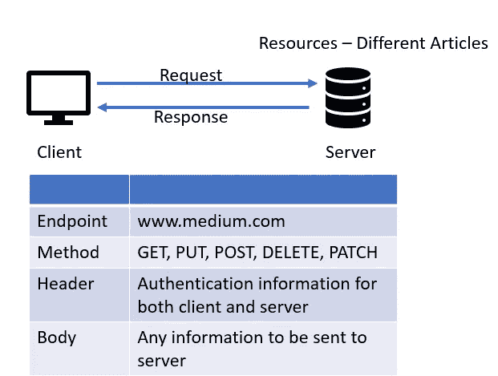
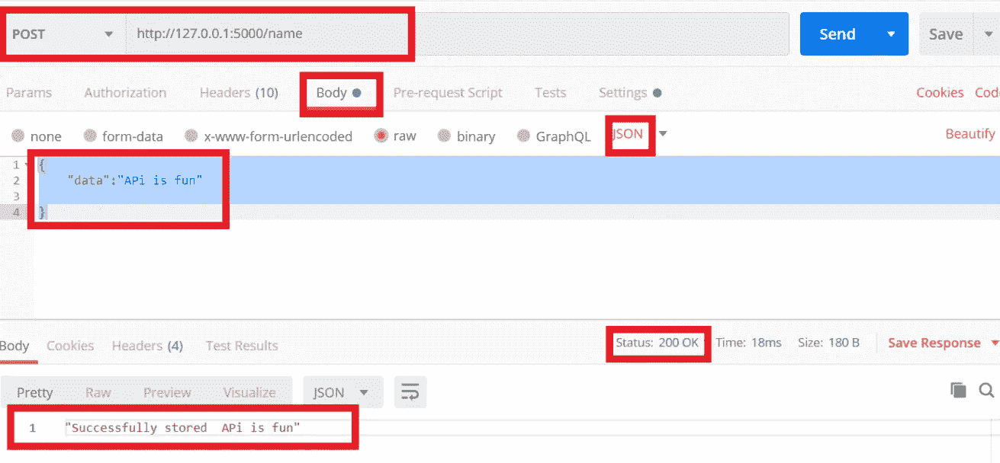
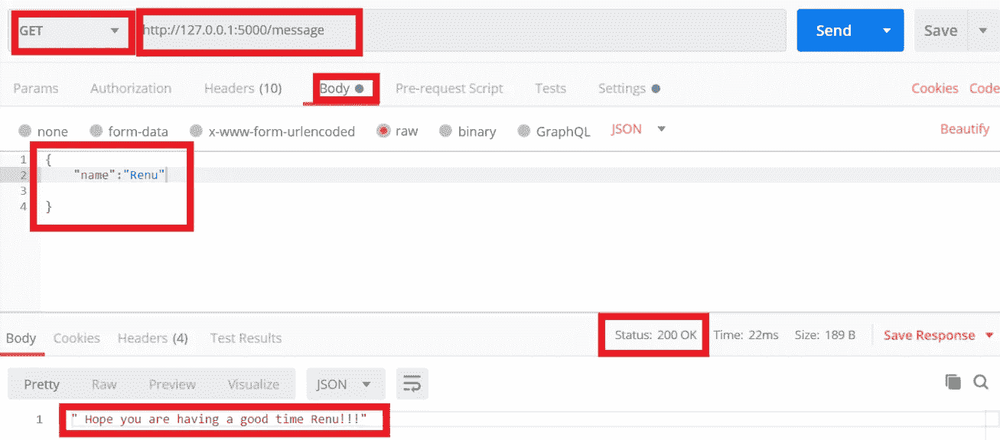
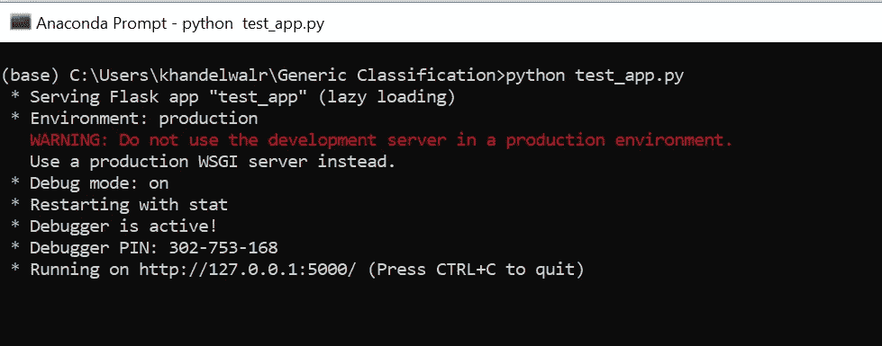

# 使用 Flask 的简单 API

> 原文：<https://levelup.gitconnected.com/simple-api-using-flask-bc1b7486af88>

## 使用 Flask 在 Python 中创建简单 API 的简单步骤

在本文中，我们将了解什么是 Rest API，以及如何使用 Flask 在 Python 中创建一个简单的 API。


[https://flask.palletsprojects.com/en/1.1.x/api/](https://flask.palletsprojects.com/en/1.1.x/api/)

## 什么是 REST API？

[**休息**代表 **RE** 表象 **S** 状态 **T** 转移](https://restfulapi.net/)，罗伊·菲尔丁于 2000 年提出的一种建筑风格。**REST 中信息的关键抽象是资源**。REST 使用这个资源标识符在两个组件之间进行交互。

API 是一个应用程序接口，它是一组允许程序相互通信的规则。REST 也是开发人员创建 API 时遵循的一组规则。



客户端和服务器之间的请求和响应

当你在浏览器中输入[www.medium.com](http://www.medium.com)时，你就是客户端，你的请求将被发送到托管网站的服务器。服务器用包含具有不同文章的网页的响应来响应。来自不同作者的文章可以被认为是资源。

**请求包含**

*   **端点**:API 可以用来访问资源的位置。www.medium.com 是访问各种主题文章的端点。
*   **方法**:客户端可以向服务器发送不同的请求。这些方法是 GET、PUT、POST、PATCH、DELETE。GET 就像一个 read。它从各种资源请求数据，PUT 和 POST 请求用于插入或更新资源。
*   **头**:包含客户端可以发送给服务器的信息，也包含客户端将从服务器接受的信息。身份验证、编码细节等信息。标头信息在属性-值对中。
*   **Body** :包含客户端要发送给服务器的信息。

**响应代码**

HTTP 定义了 40 种标准状态代码，可以用来传递客户端请求的结果。

状态代码分为五类

*   **1XX-信息**:客户应该继续他们的请求
*   **2XX- Success** :表示客户端请求被成功接受。状态代码 200 表示客户端请求的操作已成功执行。
*   **3XX-重定向**:表示需要采取进一步的行动。301 表示 API 被分配了一个新的永久 URI。
*   **4XX-客户端错误**:向客户端指示发生了错误。404 向客户端指示所请求的资源当前没有找到，但是将来可能可用。
*   **5XX —服务器错误**:表示服务器知道请求出错或无法执行请求

## 烧瓶是什么？

Flask 是一个轻量级 web 服务器网关接口(WSGI)，它是 web 应用程序和 web 服务器之间的接口，允许我们开发 Web 富应用程序。

什么是 Flask-RESTful？

*   Flask RESTful 是 Flask 的扩展，增加了对快速构建 REST APIs 的支持。
*   一个轻量级的抽象，可用于现有的对象关系映射(ORM)/库。
*   资源是 Flask-RESTful 提供的主要构件

了解了 REST API 之后，我们现在将创建一个简单的 API，使用 POST 方法接受一个字符串并将其存储在一个变量中。我们还将实现 GET 方法。GET 方法将向服务器发送一条带有 name 参数的 JSON 消息。

## 安装烧瓶

Flask 和 flask-restful 可以使用 pip 命令安装

```
**pip install flask
pip install flask-restful**
```

## 使用 Flask 实现 API

我们首先需要导入 Flask、jsonify 和 request 库，jsonify 函数将 JSON 输出变成一个响应对象。请求库有助于在请求期间跟踪请求级别的数据。

```
**from flask import Flask, jsonify, request**
```

然后，我们通过创建 Flask 的一个实例来创建一个应用程序对象，我们将一个预定义的变量“__name__”传递给它，该变量被设置为使用它的模块的名称。

```
# initialize our Flask application
**app= Flask(__name__)**
```

现在，我们使用 routes 为 GET 和 POST 请求创建要执行的功能。路由是客户端用来呼叫服务器的 URL 模式。

@app.route decorator 告诉我们的 app，每当有客户端用 POST 方法用 URL[http://127 . 0 . 0 . 1:5000/name](http://127.0.0.1:5000/name)调用我们的网站，那么就执行方法 setName()。

在方法 setName()中，我们检查调用是否是使用 POST 方法进行的，然后我们提取在主体中传递的变量“data”中的 JSON 信息

```
[**@app**](http://twitter.com/app)**.route("/name", methods=["POST"])**
**def setName():
    if request.method=='POST':
        posted_data = request.get_json()
        data = posted_data['data']
        return jsonify(str("Successfully stored  " + str(data)))**
```

当客户端使用 URL 127 . 0 . 0 . 1:5000/name 发送 POST 请求时，将执行下面的代码，如下所示。我已经使用了 [Postman](https://www.postman.com/) 来测试代码



对 URL 的 post 请求，在请求体中设置数据，并获得状态代码为 200 的响应

我们为 GET 请求编写了另一个方法

```
[**@app**](http://twitter.com/app)**.route("/message", methods=["GET"])
def message():
    posted_data = request.get_json()
    name = posted_data['name']
    return jsonify(" Hope you are having a good time " +  name + "!!!")**
```



对 URL 的 get 请求，在请求体中设置数据，并获得状态代码为 200 的响应

最后在调试模式下运行代码。

__name__ 是我们模块的名称，python 将我们模块的名称赋给 __main__，因此它运行。 **app.run()运行应用服务器。**

如果调试模式设置为真，那么我们将看到请求格式错误的错误，如果调试模式没有设置为真，那么我们将只看到一个通用消息“坏网关”

```
#  main thread of execution to start the server
**if __name__=='__main__':
   app.run(debug=True)**
```

我将完整的代码保存在 test_app.py 中，如下所示

```
**from flask import Flask, jsonify, request**# initialize our Flask application
**app= Flask(__name__)**[**@app**](http://twitter.com/app)**.route("/name", methods=["POST"])
def setName():
    if request.method=='POST':
        posted_data = request.get_json()
        data = posted_data['data']
        return jsonify(str("Successfully stored  " + str(data)))**[**@app**](http://twitter.com/app)**.route("/message", methods=["GET"])
def message():
    posted_data = request.get_json()
    name = posted_data['name']
    return jsonify(" Hope you are having a good time " +  name + "!!!")**#  main thread of execution to start the server
**if __name__=='__main__':
    app.run(debug=True)**
```

## 运行 API

要执行代码，请转到命令提示符并输入 python test_app.py。该命令将在 127.0.0.1 和端口 5000 上启动 web 服务器



现在我们可以进入 Postman 并输入 URL 来测试我们的 API。

**结论:** Flask 是一个轻量级 web 服务器网关接口(WSGI ),用于创建 Web 应用程序之间的快速接口

## 参考资料:

 [## Flask-RESTful—Flask-RESTful 0 . 3 . 8 文档

### Flask-RESTful 是 Flask 的扩展，增加了对快速构建 REST APIs 的支持。这是一个轻量级的…

flask-restful.readthedocs.io](https://flask-restful.readthedocs.io/en/latest/) 

【https://flask.palletsprojects.com/en/1.1.x/api/ 

[https://blog . keras . io/building-a-simple-keras-deep-learning-rest-API . html](https://blog.keras.io/building-a-simple-keras-deep-learning-rest-api.html)