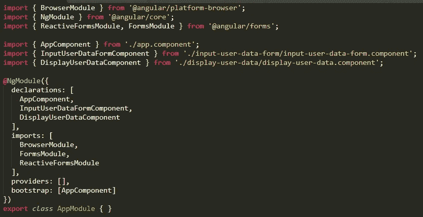

# 使用 Angular 6 + Node.js & Express 的简单应用程序

> 原文：<https://levelup.gitconnected.com/simple-application-with-angular-6-node-js-express-2873304fff0f>


让我们创建一个非常简单的 Angular form 应用程序，它将用户信息本地存储在服务器的内存中。

在提交表单时，我们将填充下一页的数据，并添加两个额外的元素来显示 *guid* 和客户 *uid* 。

[](https://skilled.dev) [## 编写面试问题

### 一个完整的平台，在这里我会教你找到下一份工作所需的一切，以及…

技术开发](https://skilled.dev) 

# 入门指南

首先，我们需要安装节点和 NPM。

要检查是否安装了节点，请在终端中运行以下命令:

```
**node -v**
```

要确认您已经安装了 npm，您可以运行以下命令:

```
**npm -v**
```

如果没有，你可以从 https://nodejs.org/en/[下载并安装**NodeJS**T43**NPM**](https://nodejs.org/en/)

安装 Angular CLI:

```
**npm install -g @angular/cli**
```

生成新的角度项目:

```
**ng new charts6**
```

导航到 [http://localhost:4200/](http://localhost:4200/) 。此时，如果您更改了任何源文件，应用程序将自动重新加载。初始页面应为默认的 Angular 6 页面:


主**应用**组件将有一个 UI 路由器，最初显示**输入用户数据表单**组件。在提交表单**时，应用**组件将显示**显示用户数据**组件。

# 流动


使用 **ng cli** 创建组件

```
**ng new angular-node-express
cd angular-node-express
ng generate component input-user-data-form --spec false**
```

CLI 将创建所有适当的文件，并将它们放入 app 文件夹


还应该将**声明**添加到 **app.module.ts** 中


接下来，我们将**将 bootstrap 3 CSS 库添加到项目**中以添加样式。

```
**npm install --save bootstrap@3**
```

然后在 **angular.json** 中添加一个指向“ **styles** 数组的路径

```
"styles": [
              "node_modules/bootstrap/dist/css/bootstrap.min.css",
              "src/styles.css"
          ]
```

引导网格系统使用保存行和列的容器。行和列是基于百分比的。响应性地改变的是容器。

容器被用作内容的包装。

我们将选择一个*液体容器*，其宽度将始终是设备的宽度。

网格**行**就像列的包装器。

一个**行**是通过将类`**row**`添加到容器内的一个元素中而创建的。

理想情况下，每行的列数等于 12。不同大小的设备使用不同的列类前缀。这里 1 列占用了 12 列的大小。

将**app.component.html**改为如下:

# 在开发模式下运行应用程序

Angular CLI 使用底层的 webpack 在端口 4200 上运行应用程序。

我们将在端口 ***3000*** 上运行我们的 **Node.js API** 端点。但是对另一个服务器进行 API 调用(从端口 ***4200*** )会导致 **CORS 浏览器异常**。

这就是为什么我们将使用代理作为*同源策略*的变通办法。代理将把我们的 API 调用重新路由到 Node.js 服务器，以避免 CORS 异常。CORS 是一个浏览器安全问题，不适用于“后端到后端”通信。

从我们的应用程序中向`/api/...`发出的所有请求都将被转发给`[http://localhost:3000/api/...](http://localhost:3000/api/....)`

有了代理，我们的应用程序图将如下所示:


在根文件夹中创建 **proxy.conf.json**

启动 Angular & Proxy 服务器时，使用以下命令:

```
**ng serve --proxy-config proxy.conf.json**
```

# 创建输入用户数据组件

首先让我们关注创建 UI，然后再关注 API 端点

制作自举表单时，您必须遵循 3 条规则:

1.  每个字段都必须包装在一个 **div** 元素中
2.  每个 **<标签>** 都要有**。control-label** 类及其值的**必须与相应的< **输入** >的 **id、**相匹配，这样当标签被点击时，输入成为焦点。**
3.  每一个 **<输入>** 都要给**。形状控制**

将**input-user-data-form.component.html**设置到以下位置:

将**输入用户数据表单组件**中的**选择器**改为**输入用户数据表单**


并将其添加到**app.component.html**


## 使用 Bootstrap 进行现场验证

我们将不得不在提交表单到后端之前验证我们的字段。如果一个字段无效，我们可以通过将整个字段变成红色来告知用户。

对于每个领域，我们将:

将类别`**.has-error**`添加到`**.form-group**` div 中

并且用`**.has-text**` 创造一个`**<p>**`来说明这个问题

下面是每个字段都添加了错误的表单:


## 制作反应式表单

反应式表单与模板驱动的表单略有不同，它提供了对数据模型的同步访问的更多可预测性、可观察操作符的不变性以及通过可观察流的变更跟踪。

要使用反应式表单，我们必须从 **@angular/forms** 包中导入**表单模块** **&反应式表单模块**并将其添加到我们的 **app.module.ts**



接下来，让我们修改**输入用户数据表单组件**。

我们将把 **formBuilder** 注入到用于 **ngOnInit** 生命周期方法的组件中。帮助简化表单的服务。

**FormBuilder** 将创建一个 **FormGroup *userForm* 和 **FormControls。每个**表单控件**都有一个默认值和一组**验证器**。****

将**用户表单**视为实际值的模式。它保存表单内字段的验证规则。

我们将把**注册的** & **提交的**布尔标志添加到**组件中。**我们将使用这些来指示当前的表单状态**。**

同样，我们将为每个输入创建一个验证器函数，参见 **invalidFirstName** ()， **invalidLastName** ()， **invalidEmail** ()， **invalidZipcode** ()， **invalidPassword** ()。

在标记中将使用验证器函数来隐藏/显示每个字段的错误消息。

在**input-user-data-form.component.html**中，对于每一个 ***反应形式*** ，我们将使用一个指令`[formGroup]`来绑定到我们在组件中定义的`userForm`变量

我们将通过`(ngSubmit)`指令绑定 **onSubmit** 处理程序。

为了将一个 HTML 输入元素连接到一个*反应式表单*，我们需要为每个表单输入添加`formControlName`属性。

我们将使用*** ngIf**&**【ng class】**指令来控制错误消息。用户尝试提交表单后，将显示样式和验证标记。这是由组件的`[submitted]`属性控制的。

提交表单后，每次用户更改输入值时都会进行验证，导致错误动态显示和隐藏。

下面是表单最初的样子:


以及填写了一些有错误的字段后的表单:


目前看来还不错！让我们继续下一个组件。

# 创建显示用户数据组件

下一个角度分量将显示用户数据。这将是一个简单的组件，可视化传递给它的数据模型。

让我们在 **app/models，**中创建一个数据模型 **UserInfoModel** ，当它被传递到构造函数中时，我们将使它反序列化一个对象。

视图**display-user-data.component.html**通过插值绑定到模型{{…}}并显示信息。


出于测试目的，**DisplayUserDataComponent**类会将一些默认值赋给 **UserInfoModel**


两个页面看起来都很棒！

现在，让我们将**路由器**连接到 **AppComponent** 来建立一个页面流

# 连接路线和路线模块

我们的路由目标是当 url 为`/`时呈现`**InputUserDataFormComponent**` ，当 url 为`/user/:uid`时显示`**DisplayUserDataComponent**`

首先，让我们设置对 **@angular/router** 的导入，然后定义一个数组**路由**我们的路径和目的页面。

```
const routes: Routes = [
  {
    path: '',
    component: **InputUserDataFormComponent**
  },
  {
    path: '*user/:uid*',
    component: **DisplayUserDataComponent**
  }
];
```


在`**imports**`中添加`**RouterModule.forRoot**(routes)`

将`**router-outlet**` 放置在**app.component.html**中

现在，初始的“/”根页面如下所示:


在地址栏中输入“/user/a01 ”,您将看到**用户信息**页面


客户端上的所有预期工作！现在让我们继续创建 API 端点。

# 在 Node.js & Express 中创建 API 端点

我们将使用 **express-generator-api** 通过生成项目来快速制作 Node.js API。

安装快速发电机:

```
npm install -g express-generator-api
```

创建 API:

```
express-api angular-node-express-api & cd angular-node-express-api
```

安装依赖项:

```
npm install
```

生成的文件结构应该如下:


此时，生成器已经实现了 API 的所有基础。

比如**正文解析器** & **cookie 解析器**都是 ***app.js*** 的一部分。这里，express 将尝试识别进入我们应用程序的任何 JSON 数据，并为我们解析它。

接下来，我们将创建以下 API 端点。

`/customer`将插入一个新客户并返回自动递增的 customer.id

`/customer/:uid`将通过客户 uid 检索单个客户

`/generate_guid`将生成一个 tracking_guide，Angular UI 将在创建新客户时使用它

## 路由器/生成 _uid

让我们将 **users.js** 复制到 **generate_uid.js** 来拥有一个基本的路由器。我们将修改这个路由器来返回一个随机的 uid

安装 **uid-safe** ，它为 cookies 生成一个 **uid** safe

```
npm install uid-safe
```

包含在 **generate_uid.js** 中

```
var uid = require('uid-safe')
```

并将其与响应一起返回

我们需要在 *app.js* 中连接 generate_uid 路由器

```
app.use('/api/v1/generate_uid', generate_uid);
```

该路由返回一个带有 GUID 的 JSON。太好了！

```
{"guid":"K7VPC3I9kxIJ4Ct2_2ZR7Xb1"}
```

## 路由器/客户

对于每个 API 服务，我通常有一个用于数据的 ***模型*** 和一个用于执行所有 CRUD 操作的 ***服务***；这样，在 API 请求、存储验证之间就有了一个抽象层次，同时也是从应用程序的任何地方访问服务的一个好方法。

在本例中，我们将简单地将客户数据存储在内存中。

每次创建新客户时，该服务都会增加一个客户 UID。

我们还将使用该客户 UID 来检索客户数据。

创建 **models** 目录，并在其中添加下面的 **model.customer.js** 。

然后，创建**服务**目录，并在其中添加一个 **service.customer.js** 。

**CustomerService** 实现所有 CRUD 操作，创建、读取、更新和删除 **CustomerModel** 。它使用**计数器**递增客户**uid**；并将所有客户存储到**客户**对象中。

在服务器和客户机上验证我们的数据是很重要的。我通常将验证作为服务对象的一部分，它或者是一个单独的方法，或者是 *CRUD 操作*的一部分。

我们将使用**最快验证器**库来实现验证。

安装**最快验证器**库:

```
npm install fastest-validator --save
```

将其导入到 **CustomerService** 服务对象中，并使用自定义模式创建一个**验证器**的实例。

```
var validator = require('fastest-validator');
```

**模式**对象包含所有验证规则，然后被**验证器**实例用来验证数据。

然后，如果服务器上的验证失败，我们需要通知 UI。如果发生这种情况， **create** 操作将抛出一个**错误**，并为每个失败的验证列出错误列表。


services\service.customer.js

错误列表将传播到响应中，由 Angular 处理以传达错误。

让我们将**客户服务**连接到快速路由器。

我们将使用 async / await，这是编写异步代码的更好方法。前面的选项是回调和承诺，事实上 async/await 是建立在承诺之上的；但是 async / await 使代码的行为&读起来更像同步代码。

在下面的路由器中，我们使用**CustomerService**singleton 实现了所有的 CRUD 操作。

看看 ***create*** 操作，在这里我们提交用户数据，以及错误如何通过 try / catch 块传播到响应中。代码很容易读懂。


routes\customer.js

接下来，我们需要修改**input-user-data-form . component**&的 ***模板*** ，以支持显示服务器端错误，以防服务器端验证失败。

在**InputUserDataFormComponent**中，我们将添加***service errors***对象，该对象将包含每个字段的所有服务器端错误。并添加到 ***验证器方法*** 中，检查该字段的错误消息是否存在，如下所示:


应用程序\输入-用户-数据-表单.组件. ts

我们还将修改 **onSubmit** 方法，并向我们的请求添加一个错误处理程序，该程序将简单地设置 **serviceErrors** 对象。


app \ input-用户数据表单\ input-用户数据表单. component.ts

接下来，我们将在**input-user-data-form.component.html**模板中添加对服务器端错误的引用，以便在服务器端错误存在的情况下显示该错误:


应用程序\输入-用户-数据-表单\输入-用户-数据-表单.组件. html

现在，我们将知道服务器上的验证是否失败，因为消息将被传播到 Angular UI。

一切看起来都很好，让我们在 **app.js** 中连接路由器


# 我们快到了！

我们已经完成了应用程序的创建，现在是一些次要的细节。

我们使用代理是为了通过让端口 4200 上的 Webpack 与端口 3000 上的 Node.js 服务器通信来解决 ***CORS 浏览器问题*** 。对于开发环境来说，这是一个很好的解决方案，但是在进入生产环境时，我们需要一个更好的实现。

API 服务器需要为所有来源启用 API，或者将我们的接入点列入白名单。

## 现在，让我们只为所有来源启用 CORS

为了让我们的 API 变得简单，只需将下面的代码添加到 **app.js**

## 未捕获的异常

另一个我们没有涉及的小细节是对 ***未捕获异常*** 的处理

因为 Node.js 运行在单个处理器上，所以在开发应用程序时，未捕获的异常是一个需要注意的问题。

当你的应用程序抛出一个 ***未被捕获的异常*** 时，你应该考虑你的应用程序现在运行在一个不干净的状态。在这一点上，您不能可靠地继续您的程序，因为您并不真正知道什么受到了错误的影响。

处理崩溃的最好方法是收集尽可能多的数据，将错误发送给外部崩溃服务或记录下来；并重新启动服务器。

对于我们的简单应用程序，我们将实现适当的函数，只需将它们放在 app.js 的开头

我将保持 **reporter** 方法为空，我们将在后面的文章中将其连接到外部崩溃服务

终于！要启动 API 服务器:

```
npm start
```

尝试点击[http://localhost:3000/API/v1/generate _ uid](http://localhost:3000/api/v1/generate_uid)

或者[http://localhost:3000/API/v1/customer](http://localhost:3000/api/v1/customer)

您应该会看到一些 JSON 数据。

# 将服务集成到角度应用程序中

为了快速集成角度应用，我们将:

导入并注入**http client**&**Router**到**InputUserDataFormComponent**


接下来，我们将从**InputUserDataFormComponent**的构造函数中的“**/API/v1/generate _ uid**”API 服务中检索 **GUID** ，并设置 **guid** 变量


InputUserDataFormComponent 的构造函数

在**InputUserDataFormComponent**的 **onSubmit** 方法中，我们将数据发布到“ **/api/v1/customer** ”服务&中，导航角度路由器到下一页 **/user/:id**


app \ input-用户数据表单\ input-用户数据表单. component.ts

完整的源代码:

然后让我们将**http client**&**activated route**导入并注入到**DisplayUserDataComponent**中


从'**/API/v1/customer/:id**' API 中检索客户数据，并用新数据填充 **UserInfoModel** ，并让**DisplayUserDataComponent**视图通过插值用新数据重新绘制自身{{…}}


应用程序“/”的初始页面:


填写表格并按注册键:


下一页显示用户信息。


创建客户后，您还可以键入客户 url，后跟客户 uid，以检索客户数据:

[http://localhost:3000/API/v1/customer/c0](http://localhost:3000/api/v1/customer/c0)

```
{"customer":{"first_name":"John","last_name":"Doe","email":"[john.doe@gmail.com](mailto:john.doe@gmail.com)","zipcode":"12345","password":"Udsakln12dsa","uid":"c0","guid":"gCnqJdp3saMNPpJfXPj6DORy"}}
```


# 源代码可从 Github 获得，如下所示:

棱角分明的 UI:
https://github.com/jsmuster/angular-node-express

node . js+Express API:
[https://github.com/jsmuster/angular-node-express-api](https://github.com/jsmuster/angular-node-express-api)

## 查看我的开源框架 QQ:

[https://github.com/jsmuster/qq](https://github.com/jsmuster/qq)

## 查看我的其他文章:

[](https://medium.com/swlh/raising-baby-chicks-with-javascript-5bff92e4f94c) [## 用 JavaScript 养育小鸡

### 几年前，我决定开始养鸡。那时我有甲虫、蠕虫、蛇和青蛙；你的名字…

medium.com](https://medium.com/swlh/raising-baby-chicks-with-javascript-5bff92e4f94c) [](https://medium.com/@jsmuster/going-over-iterators-of-javascript-e3b9a1ddadb1) [## 查看 Javascript 的迭代器

### ES6 大力改进迭代器，理由很充分。对一组值进行迭代，如果你是…

medium.com](https://medium.com/@jsmuster/going-over-iterators-of-javascript-e3b9a1ddadb1) [](https://medium.com/@jsmuster/awesome-es6-features-by-example-58974b356955) [## 出色的 ES6 功能示例

### 许多 Javascript 开发人员对 ES5 非常熟悉，但是在一系列采访之后，我意识到…

medium.com](https://medium.com/@jsmuster/awesome-es6-features-by-example-58974b356955) 

请给文章一些👏和*分享一下！。*

[](https://gitconnected.com/learn/angular) [## 学习角度-最佳角度教程(2019) | gitconnected

### 47 大角度教程。课程由开发人员提交并投票，使您能够找到最佳的角度…

gitconnected.com](https://gitconnected.com/learn/angular)