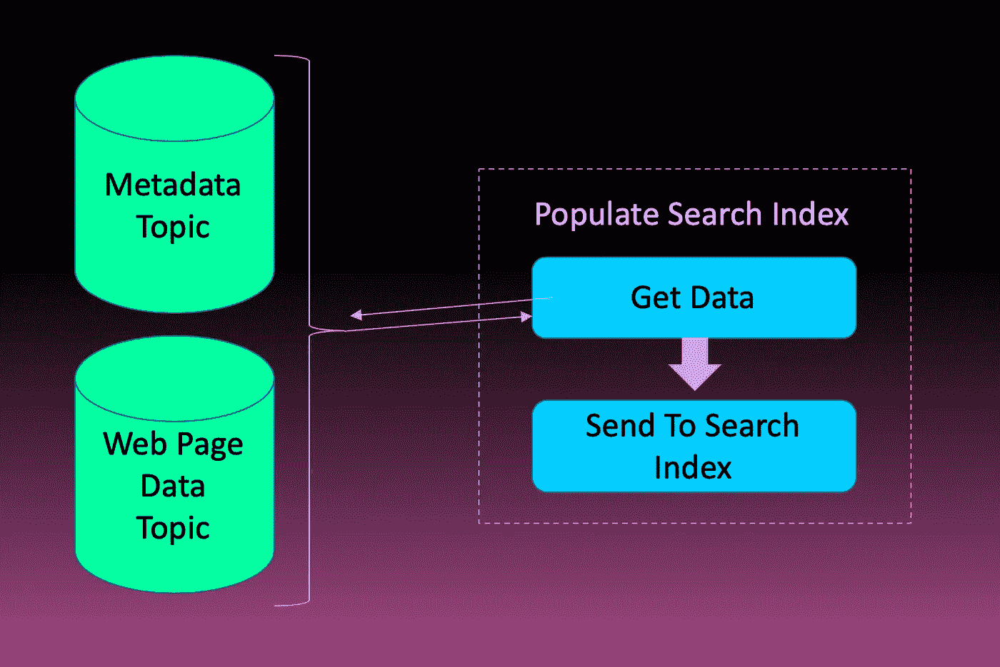

# 创建可扩展搜索引擎的简单架构

> 原文：<https://levelup.gitconnected.com/simple-architecture-for-creating-a-scaleable-search-engine-b6db74b122f7>

## 构建搜索引擎的简单方法

又一个搜索网站

这篇文章已经在我的待办事项列表里放了太久了。我研究得越多，似乎就越深入。通过我的研究，我相信我已经找到了一个简单的方法来设计一个搜索引擎。它将缺少许多其他人拥有的功能，比如同义词替换或图像分类。**但是**，它将会是一个搜索引擎，并且会扩大规模。

# 搜索引擎核心服务

这里有一点背景是必要的。搜索引擎有三个主要的服务来维持它们的运行。

**爬虫**是第一服务。这是一个程序，将访问一个网页，抓取网页上的所有链接，然后访问它们。这就是搜索引擎不断发现新内容并保持更新的方式。这些网站通常不得不使用轮流代理来确保网站不会阻止他们发出太多的请求。我们将使用的代理提供商是 [infactica.io](https://infatica.io/aff.php?aff=42) 。

关于爬虫的另一个重要注意事项是，我们必须尊重 robots.txt。不是每个网站都会有一个，但对于那些有，我们必须尊重，只根据网站的指导方针刮。

爬虫服务

你可能会注意到，上面我并没有在这个服务中提取 URL。原因是每个服务应该有一个已定义的作业，并且只执行该作业。下面是从页面中提取 URL 并存储它们的服务。

处理 URL 服务

该服务在读取页面时与网页处理器共享角色。它恰好与爬行服务有一些重叠，并提供主题。

网页处理器读取网页上的内容，并将其分解成更简单的形式。这些形式可以按照主题、关键词甚至情感(它们传达的情感)来分组。他们还将从页面中提取元数据，这些元数据通常包含关键字和描述。

流程元数据服务

以上只是元数据处理服务。这将与自然语言处理(NLP)服务分开，以添加关于网页的相关信息。

处理页面文本服务

**索引**是以易于搜索的方式组织信息的过程。通常，索引使用关键字和页面排名来返回最相关的信息。索引需要大量的研究和开发。找到最相关的搜索结果取决于你在搜索什么。

下面的服务并不关心提供给它的数据，而是将它推入搜索索引。

填充索引

# 建筑

库伯涅茨和卡夫卡

构建一个可扩展的架构意味着我们需要限制依赖性，并使流程能够线性扩展。为此，我们需要将每个组件分解成一个或多个独立的服务。另一个需要衡量的是沟通的方式。每个服务不需要知道它的数据最终在哪里。服务应该在提示时处理数据。

三项核心技术将使我们能够满足上述要求。

[**Kubernetes**](https://kubernetes.io/) 是一个可扩展的 Docker 容器平台。它允许您设置服务器，而不需要知道哪些容器最终将在服务器上运行。这是确保软件不关心它在什么硬件上运行的好方法。同样，硬件不应该关心在它上面运行什么软件。

这是上一节提到的所有服务的容器。它将允许我们扩展每项服务来满足需求。

[**卡夫卡**](https://kafka.apache.org/) 将控制服务的所有数据流。在这里，容器将监听和写入主题。Kafka 的主题能够在一个主题上有多个相同类型的容器处理数据，而不会重复数据。这样，如果一个服务停止运行，所有服务都不会崩溃。

在上一节中，您可能已经注意到每个服务都有相似的格式。他们要么都是消费者，要么都是生产者，要么都是卡夫卡主题的消费者和生产者。

[**弹性搜索**](https://www.elastic.co/products/elasticsearch) 允许你创建一个搜索索引。弹性搜索是一个基于文本的搜索应用程序。它允许您使用几个不同的字段进行搜索。这样，您可以优先考虑哪些值是记录与搜索匹配的最佳指标。

# 齐心协力

又一种搜索站点架构

哇…看来即使是一个简单的搜索引擎也不是那么简单。在上面，我已经尝试绘制了提到的数据流程图。一个主题可以有多个订阅者，这允许我们横向扩展。您可以通过查看网页主题的消费者来了解这一点。这些服务都不依赖于其他服务的输出，所以它们可以并行运行。

我们为一个相当模块化、可扩展和健壮的搜索引擎制定了计划。将每个服务分开可以让一个或多个进程失败，而不会导致整个系统瘫痪。工作可能会积压，但这就是这个系统的美妙之处。你可以简单地扩展消费服务来赶上。

跟随我开始创建我在本文中描述的服务和搜索引擎。