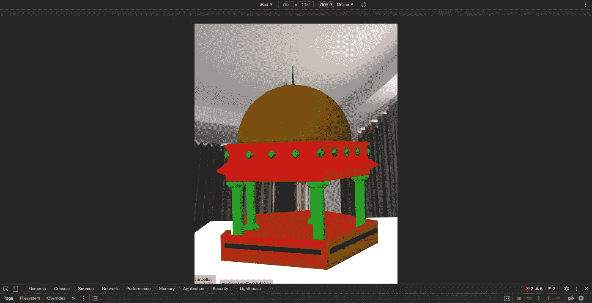
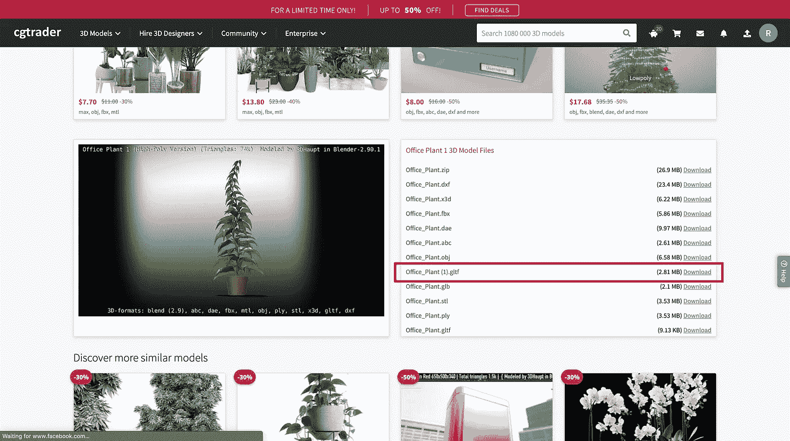
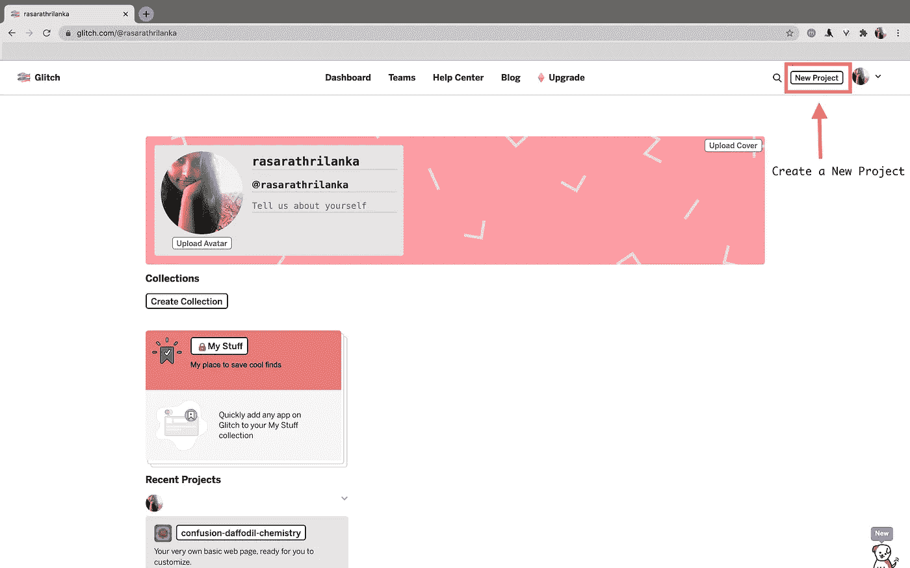
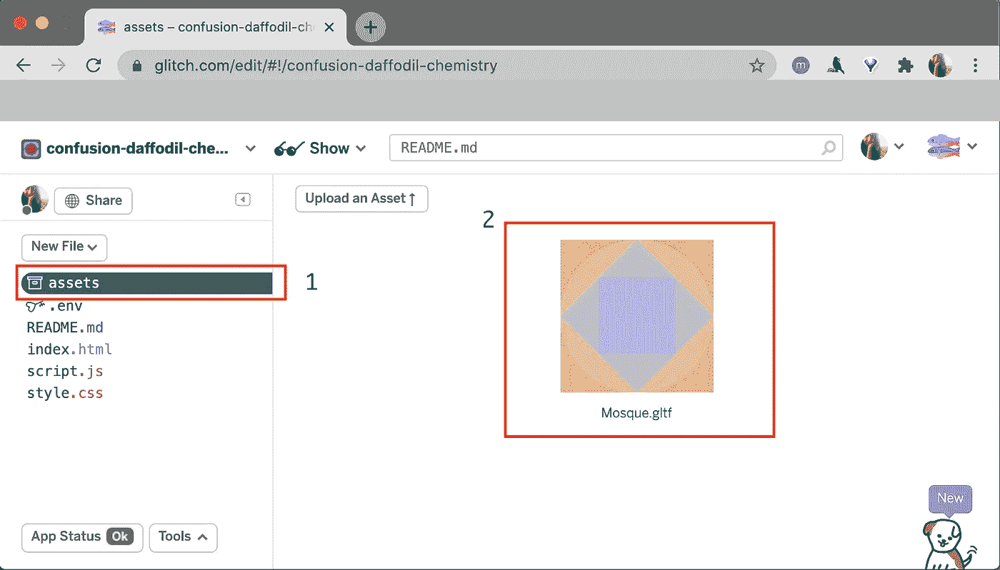
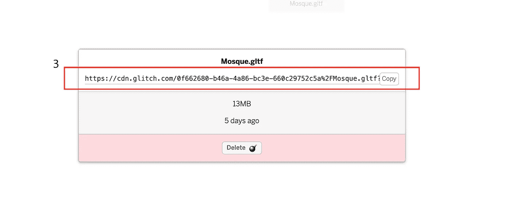

# 简单的增强现实(AR)与 A-FRAME 集成

> 原文：<https://levelup.gitconnected.com/simple-augmented-reality-ar-integration-with-a-frame-30bb315fed47>

## 教程:使用 AR.js 查看 glTF 模型的分步指南



图 1:预期输出

嘿，伙计们，又是我，拉莎拉👋本教程将帮助您使用 a-frame 开发一个简单的增强现实集成到您的移动或 web 应用程序中。

> 你可以在 [A-Frame 官方文档](https://aframe.io/docs/1.1.0/introduction/)中找到使用 A-Frame 的全面指南，但我想分享我的经验和一些我遵循的小技巧。因此，让我演练一下完成上述预期输出的过程(图 1)。

# 找到一个 glTF 模型

您需要做的第一件事是找到一个符合您要求的 glTF 模型。有几个网站可以免费下载 glTF 模型，但最具挑战性的是找到一个更好的模型。因为在我的情况下，我必须付出很大的努力来找到这样一个工作的 3D 模型。`gltf` 扩展。

以下是一些网站，我可以推荐你找到三维模型。

1.  [CGTrader](https://www.cgtrader.com/)
2.  [草图制作](https://sketchfab.com/feed)

您可以点击其中一个可以自由下载的 3D 模型，您必须下载扩展名为`.gltf`的文件，如下所示。



图 2:下载一个 gltf 模型

# 将 3D 模型应用到您的项目中

在这里，我试图解释代码，我们需要这样做的 a 帧。作为基本步骤，首先您需要包含相关的库并定义页面主体。

```
<!DOCTYPE html>
<html lang="en">
<head>
    <!-- this line calls aframe -->
    <script src="https://aframe.io/releases/0.8.0/aframe.min.js"></script> <!-- this line calls the AR.js component to be used for aframe and finds the source of different assets like the description of 3D objects, the camera calibration-->
    <script src="https://cdn.rawgit.com/jeromeetienne/AR.js/1.6.0/aframe/build/aframe-ar.js"></script>
</head><body style='margin : 0px; overflow: hidden;'>
    <!-- include the body content here -->
</body>
</html>
```

如果对以上不熟悉，可以参考我之前写的文章(*教程:使用 ar.js* 开发简单 AR 函数的示例代码)了解一下这个的基本思路。

现在，您需要包含页面的正文内容来应用这个 3D 模型。这可以分为两种不同的方式。

## 1.将模型添加到本地的项目路径中

第一个是你可以简单地将模型添加到你的项目路径中，然后将模型的路径设置为代码，如下所示。

```
<body style='margin : 0px; overflow: hidden;'>
    <a-scene embedded arjs='sourceType: webcam;'>
        <a-marker-camera preset='hiro'>
            <a-entity gltf-model=**"assets/images/Mosque.gltf**" scale="0.2 0.2 0.2"></a-entity>
        </a-marker-camera>
    </a-scene>
</body>
```

但是这将使得加载模型**的一些问题有时**因为一些局部变化。

在我的情况下，我尝试了这一点，但它对我不起作用。所以，我选择了第二种方案。

## 2.将模型上传到你的故障账户

在我看来，将 gltf 模型应用到您的应用程序中的最佳和最简单的方法是这样的。

这里你需要遵循一些步骤。我将一个一个地检查它们。

**01。创建你的故障帐户，并创建一个新项目。**

去[glitch.com](https://glitch.com/)官方网站并在那里创建一个账户。然后创建一个新的 Glitch 项目(图 3)。



图 3:创建新的 Glitch 项目

**02。将 glTF 模型上传到您的 Glitch 项目**

当你创建了一个新项目，你会看到在项目结构下有一个名为**资产**的文件夹(图 4 -(1))。选择它并上传你的 glTF 模型。那么就会是这个样子(图 4 -(2))。



图 4:将模型上传到 Glitch 项目

**3。获取模型的 cdn URL**

单击您上传的 gltf 模型，然后您可以看到下面的弹出窗口(图 5)。现在您可以复制您的 glTF 模型的 cdn url。



图 5:获取 cdn url

**4。将 URL 添加到您的代码中**

现在，您可以简单地包含 glTF 模型的 cdn url，而不是将其添加到本地的项目路径中。这将向您显示一个快速加载的 glTF 模型。

所以，最终的代码会是这样的，

```
<!DOCTYPE html>
<html lang="en">
<head>
    <!-- this line calls aframe -->
    <script src="https://aframe.io/releases/0.8.0/aframe.min.js"></script>
    <!-- this line calls the AR.js component to be used for aframe and finds the source of different assets like the description of 3D objects, the camera calibration-->
    <script src="https://cdn.rawgit.com/jeromeetienne/AR.js/1.6.0/aframe/build/aframe-ar.js"></script>
</head><body style='margin : 0px; overflow: hidden;'>
<a-scene embedded arjs='sourceType: webcam;'>
    <a-marker-camera preset='hiro'>
        <a-entity position="0 0 0" scale="0.2 0.2 0.2" **gltf-model="https://cdn.glitch.com/0f662680-b46a-4a86-bc3e-660c29752c5a%2FMosque.gltf?v=1611234341037"**></a-entity>
    </a-marker-camera>
</a-scene>
</body>
</html>
```

现在，您已经完成了第一幅图像(图 1)中的预期输出。😉！

试试这个有趣的教程，别忘了给你的反馈。

干杯伙计们…！