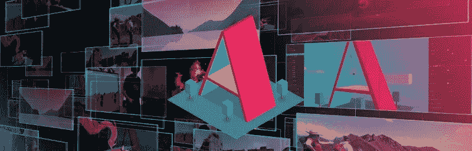
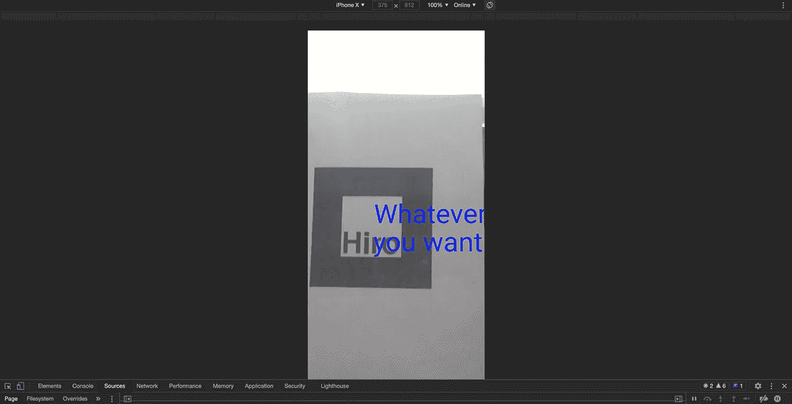
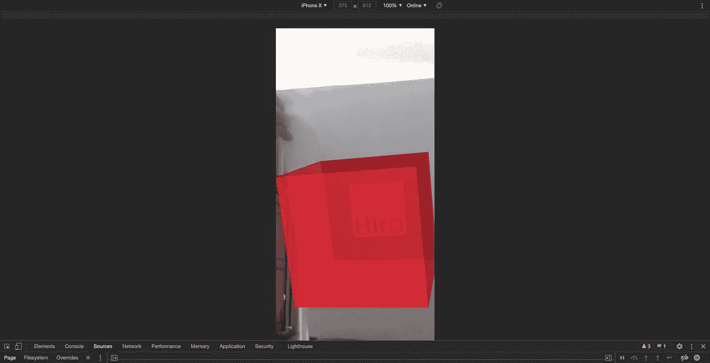
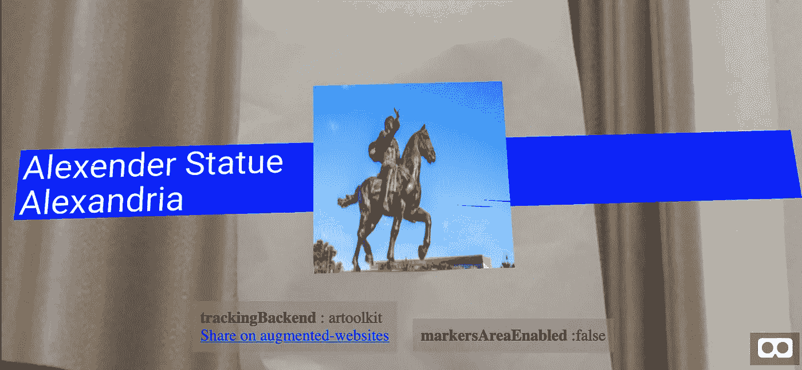

# 简单的增强现实(AR)与 A-FRAME 集成

> 原文：<https://levelup.gitconnected.com/simple-augmented-reality-ar-integration-with-a-frame-f625e9dc66b8>

## 教程:使用 AR.js 开发简单 AR 函数的示例代码



照片由 aframe.io 提供

嘿，伙计们👋这一次，我想让你们体验一个对你们所有人都有点吸引力的 web 应用程序的 AR 集成。在做任何事情之前，你需要知道一个关于 A 型框架的基本概念。

# 什么是 a 字架？

[A-Frame](https://aframe.io/) 是一个构建虚拟现实(VR)体验的网络框架。这是基于 HTML 之上的，让入门变得简单。A-Frame 不仅仅是一个 3D 场景图或一种标记语言，它还是一个强大的实体组件框架，提供了一个声明性的、可扩展的、可组合的结构。

通过这篇文章，让我告诉你我们将如何使用 a-frame 开发 AR 集成。让我们一步一步来。

# 包括库

您需要做的第一件事是在 HTML 脚本中包含这些库。基本上，您必须添加两个库，如下所示。

最初，您必须包含一个 a-frame 库，它调用 a-frame。

```
<script src="[https://aframe.io/releases/0.8.0/aframe.min.js](https://aframe.io/releases/0.8.0/aframe.min.js)"></script>
```

然后你需要包含一个 a 帧的 AR.js。以下代码调用 AR.js 组件用于 a-frame，并找到不同资源的来源，如 3D 对象的描述、摄像机校准。

```
<script src="[https://cdn.rawgit.com/jeromeetienne/AR.js/1.6.0/aframe/build/aframe-ar.js](https://cdn.rawgit.com/jeromeetienne/AR.js/1.6.0/aframe/build/aframe-ar.js)"></script>
```

# 定义几何体

这只是一个普通的 HTML 页面，它需要被定义的主体。

```
<body style='margin : 0px; overflow: hidden;'>
    <!-- include the body content here -->
</body>
```

下一步是如何编写页面的主体。因此，现在我将向您展示最常用的增强现实集成的 **3 个示例**。让我们一个一个地试一试。

以下所有示例将使用`<a-marker-camera>`和`'hiro’`预设。在这篇文章的结尾，你会明白它应该包括的方式以及它将如何工作。

## 1.在 AR 中显示文本

如果您想用 AR 特性显示任何文本，下面是一个示例代码。此外，您可以更改几个属性；字体颜色、字体大小、文本的位置和旋转等。

```
<body style='margin : 0px; overflow: hidden;'>
   <a-scene embedded arjs='sourceType: webcam;'>
      <a-text text="value: Whatever \n you want !" color="blue"    rotation="-90 0 0"></a-text>
      <a-marker-camera preset='hiro'></a-marker-camera>
   </a-scene>
</body>
```

输出将看起来像这样，



显示文本的输出

## 2.显示增强现实框

这个例子是关于显示一个定制大小、颜色和外观的盒子。

```
<body style='margin : 0px; overflow: hidden;'>
 <a-scene embedded arjs='sourceType: webcam;'>
  <a-box position='0 0.5 0' material='opacity: .7;' color="red"></a-box>
  <a-marker-camera preset='hiro'></a-marker-camera>
 </a-scene>
</body>
```

它的输出是，



显示方框的输出

## 3.显示带有文本和图像的 AR 平面

```
<body style='margin : 0px; overflow: hidden;'>
<a-scene embedded arjs='sourceType: webcam;'>
    <a-entity
            rotation="-90 0 0"
            geometry="primitive: plane; width: 4; height: auto"
            material="color: blue"
            text="value: Alexender Statue\n Alexandria"></a-entity><a-image src="images/ar.png" rotation="-90 0 0"></a-image>
    <a-marker-camera preset='hiro'></a-marker-camera>
</a-scene>
</body>
```

如果你想用文本和图像显示一个平面，你可以用上面的代码，



显示带有文本和图像的 AR 平面的输出

这些是我选择的一些基本教程，只是为了让你感受这种奇妙的体验。通过 [a-frame 官网文档](https://aframe.io/docs/1.1.0/introduction/)，你会发现更多根据你的需求使用 A-Frame 集成 AR 的形状和方式。

# 你怎么能经历这些？

您可以允许打开您的网络摄像头并捕捉您拥有的**‘Hiro’**标记。这应该是一个硬拷贝的清晰图像，或者你可以通过你的手机很容易地捕捉到这个清晰的照片。


Hiro 标记

在移动或网络应用程序中，捕捉到该标记后，您将会根据您的正文内容看到图像或文本，如上所述。

让我们开始吧，伙计们…希望这对你有所帮助。

这涵盖了使用 a-frame 集成 AR 的简单指南。我们将再次遇到另一个稍微高级一点的 AR 教程。

干杯…！