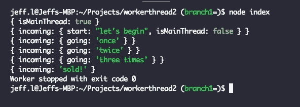

# Node.js 工作线程中的简单双向消息传递

> 原文：<https://levelup.gitconnected.com/simple-bidirectional-messaging-in-node-js-worker-threads-7fe41de22e3c>

## *和你的工人说话，他们也会回嘴。*


# 什么是工作线程？

Node.js 工作线程允许 JavaScript 代码的并发执行。如果您熟悉 Unix 线程模型，您会知道每个进程组都有一个[父进程和几个](https://en.wikipedia.org/wiki/Parent_process#Unix-like_systems)子进程。类似的模型用于工作线程，如下所示。

## 你为什么要用它们？

如果您有几个 CPU 密集型任务需要完成，并且这些任务彼此独立运行，那么线程允许任务并行运行，从而节省时间。(您不需要工作线程来进行 I/O 处理——node . js 非阻塞 I/O 模型已经很好地处理了这一点。)

例如，我一直在(缓慢地)为[通用国际象棋接口](http://wbec-ridderkerk.nl/html/UCIProtocol.html)(又名，UCI)开发一个 [GraphQL](https://hackernoon.com/graphql-subscriptions-using-apollo-2-3eb3184768c4) [包装器](https://medium.freecodecamp.org/wrapping-an-streaming-i-o-interface-in-graphql-931650dafd3b)。我想做的一件事是把几个象棋引擎放在一起，让它们独立运行。

# 创建工作线程

真的没什么！所需的只是高于 10.5.0 的节点版本。Node 的 10.x 版本要求在命令行上传递`--experimental-worker`标志，但是我运行的是 11.11.0 版本，不需要这么做。

以下是在文档的[开头给出的工作线程示例:](https://nodejs.org/api/worker_threads.html#worker_threads_worker_threads)

```
const {
  Worker, isMainThread, parentPort, workerData
} = require('worker_threads');if (isMainThread) {
  module.exports = function parseJSAsync(script) {
    return new Promise((resolve, reject) => {
      const worker = new Worker(__filename, {
        workerData: script
      });
      worker.on('message', resolve);
      worker.on('error', reject);
      worker.on('exit', (code) => {
        if (code !== 0)
          reject(new Error(`Worker stopped with exit code ${code}`));
      });
    });
  };
} else {
  const { parse } = require('some-js-parsing-library');
  const script = workerData;
  parentPort.postMessage(parse(script));
}
```

不太令人兴奋，还有点神秘。从“worker_threads”导入的内容是:

*   **工人** : a 类
*   **isMainThread** :如果这是主进程，则为真，否则为假
*   **parentPort** :父节点和工作节点之间的通信端口
*   **workerData** :传递给线程的 Worker 构造函数的数据的克隆。

这里，主线程导出一个方法，该方法获取一些 JavaScript 并将其交给工作线程进行处理。如果**是主线**是真的，我们知道我们是主线。否则，我们就是工作线程( **else{}** block)，我们解析脚本并使用工作方法 **postMessage()** 将结果返回给父线程。

如果这仍然令人困惑，这里有一个[到另一个例子](https://blog.logrocket.com/node-js-multithreading-what-are-worker-threads-and-why-do-they-matter-48ab102f8b10#9fc1)的链接，可能更容易理解。

# 与工作线程对话

到目前为止，worker 收到的唯一数据是从构造函数参数发送的 **workerData** 。在上面的例子中，主线程从 worker 获得一条消息，这条消息是一些经过解析的 JavaScript。

那是相当*无聊的*，尤其是因为工人，一旦它得到它的**工人数据**:

*   做它的事情，
*   将结果发送回主线程，
*   退出。

对于我计划中的象棋引擎工人来说，只要有游戏要设置，有棋要走，有象棋分析要做，就会有大量的交互(通过 UCI)持续进行。我将在以后写这方面的细节，但是这篇文章的标题是“简单”，所以我将举例说明与一个基础工作者的双向交互。一、职工守则:

因此，除了“ **exit** ”之外，所有这些主要做的就是回显它给出的消息，我一会儿就会谈到这一点。

创建 worker 的主线程类似于前面提到的示例，但是不涉及承诺:

需要注意的主要问题是，除了通过 worker 构造函数(即 workerData)发送的消息之外，还有几条消息被发送到 Worker。那么当我运行这个时会发生什么呢？



让我们将这些消息行与代码行对应起来:

`{isMainThread: true}`来自 index.js 的第 19 行

`{ incoming: { start: “let’s begin”, isMainThread: false } }`:service . js 的第 14 行(工作线程)。

```
{ incoming: { going: 'once' } }
{ incoming: { going: 'twice' } }
{ incoming: { going: 'three times' } }
```

这些都来自 service.js 的第 10 行

`{ incoming: ‘sold!’ }`是 service.js 的 7 号线

`Worker stopped with exit code 0`将我们带回 index.js，第 9 行。

## 退出线程

我添加了从主线程中退出工作线程的功能。当主线程发布“ **exit** ”消息时，工作线程关闭端口。这在主线程中触发了一个退出事件，并记录了退出状态(第 9 行)。

如果您试图在工作人员退出后发布另一条消息，会发生什么情况？index.js 的第 14 行试图做到这一点。请注意，该消息不会出现在控制台输出中。

# 搞定了。

工作线程还有很多其他的东西，但这只是“简单”的概括。完整代码可以在 [**这里**](https://github.com/JeffML/workerthread2/tree/branch1) 找到。

[](https://gitconnected.com/learn/node-js) [## 学习 Node.js -最佳 Node.js 教程(2019) | gitconnected

### 排名前 45 的 Node.js 教程-免费学习 Node.js。课程由开发人员提交和投票，使您能够…

gitconnected.com](https://gitconnected.com/learn/node-js)