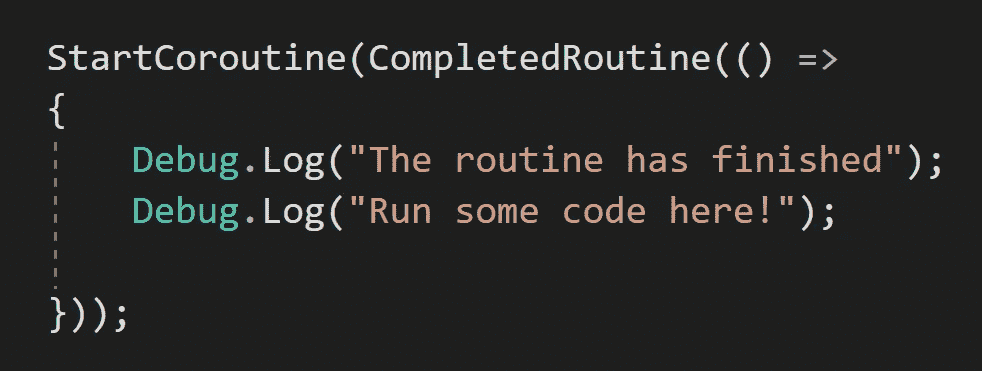

# 简单的匿名回调系统

> 原文：<https://levelup.gitconnected.com/simple-callback-system-with-anonymous-method-30245d5b6279>



利用在过去几篇关于委托和 lambda 表达式的文章中学到的知识，让我们看看如何使用匿名方法设置一个基本的回调系统。

一个*匿名*方法是一个没有*名字*的*内联*方法。它本质上是一个带有*主体*的*无名委托*，其中*参数*和*返回*是可选的。

这里有一个名为 *CompletedRoutine* 的*协程*，它有一个*动作*委托作为*参数*。通过将*动作*指定为*空*，当启动协程时，它变成完全可选的。还有一个新的 *5 秒*的 *WaitForSeconds* ，已经被*缓存*在 *void Start* 变量名 *completedWaitTime* 下。作为最佳实践，调用 *onCompleteRoutine* 委托之前会对*进行空检查*。

```
private IEnumerator CompletedRoutine(Action onCompleteRoutine = null)
{
    yield return _completedWaitTime;

    if (onCompleteRoutine != null)
            onCompleteRoutine();
}
```

这里在 *void Start* 中，*协程*是 *started* 然后一个 *lambda 表达式*转到一个*匿名*方法。在此方法中，两条*调试*消息被发送到控制台。匿名方法的传入使得 *onCompleteRoutine* 不再 *null* ，所以 *onCompleteRoutine* 会在等待 *5 秒*后运行。

```
StartCoroutine(CompletedRoutine(() => 
{
    Debug.Log("The routine has finished");
    Debug.Log("Run some code here!");
}));
```

这里是等待时间过后显示的调试消息。


下一次我们将从代表开始，让他们使用 Unity 的*新输入系统*工作。感谢阅读！