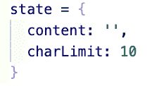

# 在 React.js 中构建简单的字符计数器

> 原文：<https://levelup.gitconnected.com/simple-character-counter-in-react-js-f988c696c2fb>


今天，让我们限制用户可以在输入字段中输入的字符！

**注意**:如果你不知道如何控制你的表单或者为什么我们应该在 React.js 中这样做，我推荐你看看我关于如何做的简短博文[这里](/building-a-simple-controlled-form-in-react-js-b7e28236bf2e)！

以下是我们正在构建的功能的 gif 图:


弹出模式是使用 Sweet Alert npm 包创建的。你可以在这里查看！

如您所见，这里发生了许多事情:

1.  当输入字段中没有字符时，提交按钮被禁用。
2.  应用程序跟踪用户可以提交的字符的特定限制，并传递剩余的字符数(限制和当前字符数之间的差异)
3.  如果超过了限制，应用程序在提交时会抛出一个错误。如果字符数没有超过限制，则表单提交成功。

现在让我们来看看代码。顺便说一下，你可以在这里找到这个公共 GitHub 库[的链接。](https://github.com/jonathanbrierre/Character-Counter)

下面是我的 App.js 文件，一切都在这里发生。

```
import React from 'react';import Swal from 'sweetalert2'class App extends React.Component {
 state = { content: '', charLimit: 10 } handleOnChange = (e) => { this.setState({[e.target.name]:e.target.value}) } handleOnSubmit = (e) => { e.preventDefault() if(this.state.content.length <= this.state.charLimit){ Swal.fire({icon: 'success', text: 'Successful Submission'}) }else{ Swal.fire({icon: 'error', text: 'Character Limit Exceeded'}) } } render(){ return( <div style ={{textAlign: "center", height: '100vh'}}> <form onSubmit = {this.handleOnSubmit} style={{marginTop: '50vh'}}> <input type = 'text' name = 'content' value = {this.state.content} onChange = {this.handleOnChange}/> <input type = 'submit' disabled ={this.state.content.length > 0 ? false:true}/> <h2>Remaining Characters: {this.state.charLimit - this.state.content.length}</h2> </form> </div> ); }}export default App;
```

让我们打破这一点！

**App 状态**:



包含输入字段内容的键，以允许控制表单。它还包含常量“charLimit”，记录用户可以输入的最大字符数。

**handleOnChange 功能**:


允许控制表单。同样，如果你在理解这个受控表单的概念上有困难，[这里有一个链接](/building-a-simple-controlled-form-in-react-js-b7e28236bf2e)指向我的帖子！

**handleOnSubmit 功能:**


1.  e.preventDefault()防止应用程序在提交时刷新。
2.  这里有一个条件语句，它从我们的受控状态中导出值。提交表单时，会检查内容的长度是大于、等于还是小于预定义的限制。

**JSX:**


1.  在我们的表单中，有一个受控的文本输入字段和一个用于提交按钮的输入标签。对于提交按钮，我们添加了指向三元语句的禁用属性(this.state.content.length > 0？假:真)。如果你不熟悉 JavaScript 的三元运算符，你可以在这里找到关于它的更多信息[！这将检查文本字段中是否有字符。如果有，那么三元组返回 false，从而导致 disabled 属性为 false。如果字段中没有任何内容，那么三元组将返回 true，从而导致按钮被禁用。](https://developer.mozilla.org/en-US/docs/Web/JavaScript/Reference/Operators/Conditional_Operator)
2.  在 submit 按钮元素下面，我们通过采用预先确定的字符限制并减去状态和输入字段中不断变化的文本长度来动态显示剩余的字符。

现在你知道了！您现在可以控制用户可以在其表单中键入/提交多少内容，这是 messenger 和社交媒体应用程序中常见的功能。

# 资源:

[](https://developer.mozilla.org/en-US/docs/Web/JavaScript/Reference/Operators/Conditional_Operator) [## 条件(三元)运算符

### 条件(三元)操作符是唯一接受三个操作数的 JavaScript 操作符:一个条件后跟一个…

developer.mozilla.org](https://developer.mozilla.org/en-US/docs/Web/JavaScript/Reference/Operators/Conditional_Operator) [](https://github.com/jonathanbrierre/Character-Counter) [## jonathanbrierre/字符计数器

### 这个项目是用 Create React App 引导的。在项目目录中，您可以运行:在…中运行应用程序

github.com](https://github.com/jonathanbrierre/Character-Counter) [](/building-a-simple-controlled-form-in-react-js-b7e28236bf2e) [## 在 React.js 中构建简单的控件表单

### 今天，我们将在 React.js 中构建一个简单的受控表单。

levelup.gitconnected.com](/building-a-simple-controlled-form-in-react-js-b7e28236bf2e)