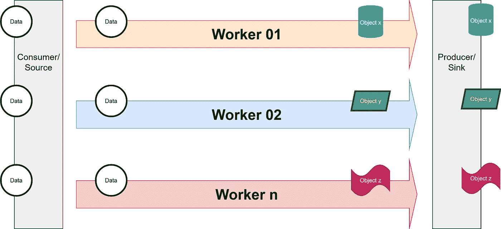

# 使用 GoRoutines 的简单消费者生产者并行

> 原文：<https://levelup.gitconnected.com/simple-consumer-producer-parallelism-using-goroutines-f2b2bc654eed>

使用 GoRoutines 的简单消费者生产者并行

# 为什么？

Go 编程语言的一个关键优势是通过使用 GoRoutines 提供了开箱即用的并发支持。大家都知道，GoRoutines 可以支持并行支持。然而，并行性在某些情况下是有价值的，例如同时从多个机器学习模型中获得预测。在这种情况下，并发性并不理想。

现在的问题是一个简单的并行管道看起来像什么？在本文中，我将讨论一个如何使用 GoRoutines 实现并行的例子。

# 怎么

下面是构成这个例子的组件，

*   消费者/来源
*   工人 01
*   工人 02
*   生产者/接收器

在这个例子中，消费者/源将生成数据。接下来，数据将并行移动到 worker 01 和 worker 02。Worker 01 和 worker 02 将并行处理数据，并将处理后的数据移动到生产者/接收器，在这种情况下，生产者/接收器将结束流水线。

## 消费者

这里，我们设置了一个消费者/源函数，它无限循环地生成整数并存储在一个通道中。

## 工人 01

我们定义 worker 01，它打印出工人号和当前任务。然后，将消息存储在已完成任务的通道中，并通知等待组任务已完成。

## 工人 02

工人 02 被定义为与工人 01 相同。

## 生产者

在这里，生产者/接收器打印出工人完成的任务。

## 主要功能

现在，最关键的部分。在 main 函数中，我们定义了固定数量的例程，并为完成的工作创建了一个通道。接下来，我们定义等待组，并将例程的数量添加到等待组中。

我们使用 GoRoutine 调用在后台运行的消费者。调用另一个 GoRoutine 从消费者/源检索任务。对于每个任务，worker 01 和 worker 02 在后台处理相同的任务。然后，生产者检索由工人完成的任务。等待组在检索每个任务后存储相同数量的例程。

# 结论

我希望这个例子简单易懂。我在下面添加了源代码的链接，供你参考。感谢您的阅读。✌️

GitHub 源代码:[https://GitHub . com/leonardyoexl/Consumer-Producer-Parallelism-using-go routines](https://github.com/leonardyeoxl/Consumer-Producer-Parallelism-using-Goroutines)