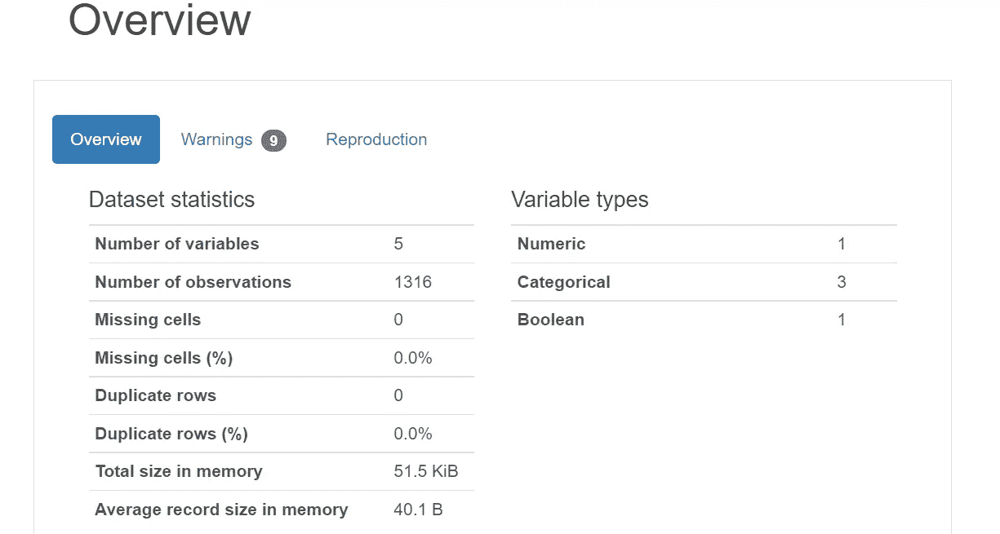
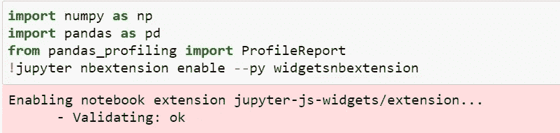
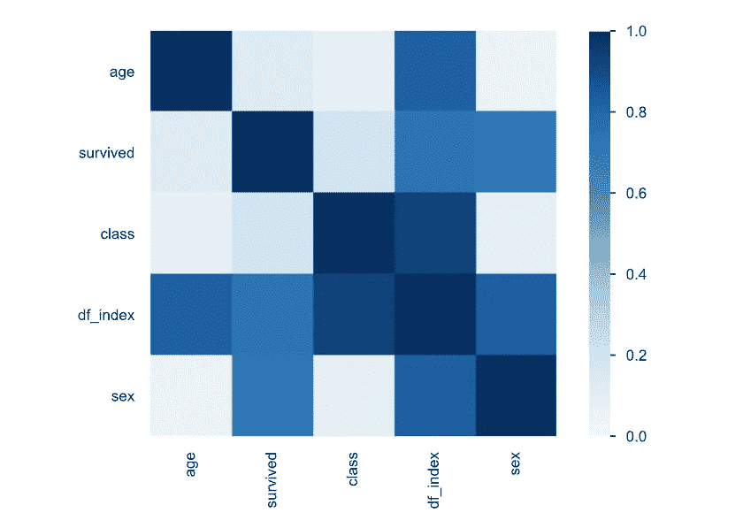
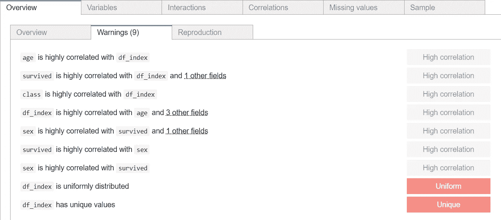

# 用 10 行代码进行简单的数据探索

> 原文：<https://levelup.gitconnected.com/simple-data-exploration-with-10-lines-of-code-f6d1ad6772db>



探索性数据分析(EDA)是处理数据的一个关键步骤。根据复杂性和所需的定制，可以添加额外的选项，但其核心是，您将学习如何用 10 行 Python 代码执行简单的 EDA。

最后，您还可以选择将包含常用 EDA 统计信息的报告摘要导出到一个 HTML 文档中，该文档可以通过本地机器共享和访问。

对于本指南，我们将利用以下库，并在 Jupyter 笔记本中工作:

*   [熊猫侧写师](https://pandas-profiling.github.io/pandas-profiling/docs/master/rtd/)

首先，您可以通过 pip 软件包管理器安装它:

```
pip install -U pandas-profiling[notebook]
!jupyter nbextension enable --py widgetsnbextension
```

如果你计划将它安装在 LambdaLabs、Google Colab 或 Kaggle 上，请执行以下操作:

```
import sys
!{sys.executable} -m pip install -U pandas-profiling[notebook]
!jupyter nbextension enable --py widgetsnbextension
```

最后，为了使进度条和本指南的加载在 Jupyter notebook 中工作，我们可以激活小部件:

```
!jupyter nbextension enable --py widgetsnbextension
```

完成后，让我们从生成快速报告开始吧！我们将首先为这个项目导入必要的库:

```
**import** **numpy** **as** **np**
**import** **pandas** **as** **pd**
**from** **pandas_profiling** **import** ProfileReport
!jupyter nbextension enable --py widgetsnbextension
```

如果一切顺利，您应该正在验证数据帧:ok



接下来，数据集的源。在野外有大量公开可用的数据集，但是对于本指南，我将只使用 PyDataset 库中的一个数据集。

如果您尚未安装该库，您可以这样做:

```
pip install PyDataset
```

并查看库中可用数据集的列表:

```
from pydataset import data
data()
```

我选择使用图书馆中的经典泰坦尼克号数据集:

```
titanic = data('titanic')
titanic.head()
```


我们可以用一行代码为任何数据帧生成一个样本 HTML 报告:

```
profile = ProfileReport(titanic, title=”Titanic Report”)
profile
```

输出为我们提供了有用的信息，如概述、相关性和缺失值。这些可以通过报告顶部的不同选项卡进行切换。


相关图:



此外，我们还可以使用小部件查看报告结果:

```
profile.to_widgets()
```



最后，我们还可以将 HTML 报告导出为 HTML 或 json 文件，如下所示:

```
profile.to_file("My Report.html")
```

JSON

```
profile.to_file("My Report.json")
```

现在你有了它，用不到 10 行代码用 Python 实现了一个快速简单的数据帧 EDA 过程。

```
import numpy as np
import pandas as pd
from pandas_profiling import ProfileReport
!jupyter nbextension enable --py widgetsnbextension# HTML report in notebook
profile = ProfileReport(titanic, title="Titanic Report")# non-HTML report in notebook
profile.to_widgets()# Write out as a HTML file
profile.to_file("My Report.html")# Write out as a JSON file
profile.to_file("My Report.json")
```

好奇的学习者？释放你在媒体上学习的全部潜力，用不到一杯咖啡的钱支持像我这样的作家。

[](https://lzpdatascience.medium.com/membership) [## 通过我的推荐链接加入媒体——杰森·LZP

### 作为一个媒体会员，你的会员费的一部分会给你阅读的作家，你可以完全接触到每一个故事…

lzpdatascience.medium.com](https://lzpdatascience.medium.com/membership)