# 使用 Terraform 的简单 DotNet 核心 API 和 AWS ECS Fargate

> 原文：<https://levelup.gitconnected.com/simple-dotnet-core-api-with-aws-ecs-fargate-using-terraform-f36f4664dcf0>

AWS Fargate 是一个用于容器的无服务器计算引擎，可以与亚马逊弹性容器服务(ECS)和亚马逊弹性容器服务(EKS)一起工作。Fargate 使您可以轻松地专注于构建应用程序。Fargate 消除了供应和管理服务器的需要，允许您为每个应用程序指定和支付资源，并通过设计应用程序隔离来提高安全性。([参见](https://aws.amazon.com/fargate))

在本文中，我们将使用 Terraform 向使用 Fargate 启动类型的 ECS 提供 DotNet 容器 API。为了使事情更简单，我删除了所有可选属性；仅填写有助于我们使用 Fargate 部署到 ECS 的必需属性。如果你对实现的细节感兴趣，可以随意参考[这里的](https://registry.terraform.io/providers/hashicorp/aws/latest/docs/resources/ecs_service)。

首先，我们需要计划这些堆栈需要什么。

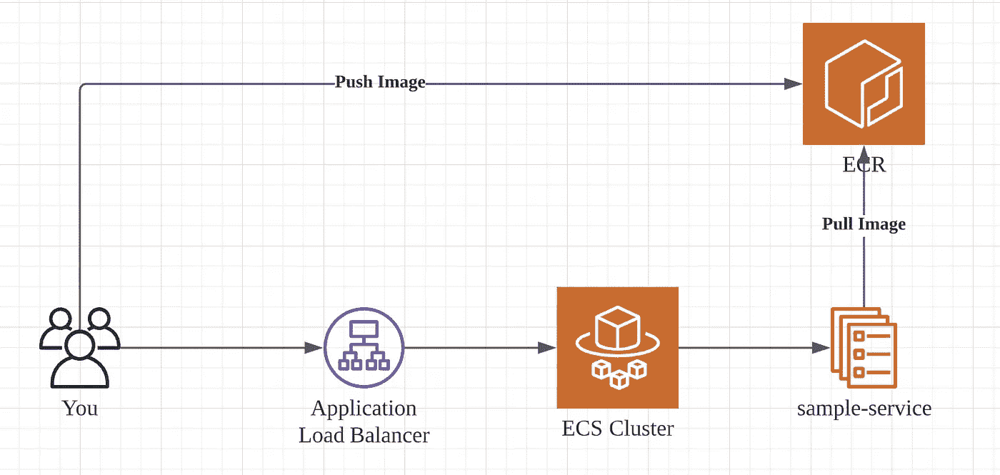

基本 API 服务

AWS Fargate 中的基本 API 需要以下组件:-

1.  应用程序负载平衡器:接受公共请求并路由到您的示例服务
2.  ECS 集群:管理您所有的 Fargate 服务
3.  ECR:存储您的图像工件
4.  示例服务:您应用程序在 ECS 服务中运行，使用 Fargate 启动类型

# 先决条件

为了遵循设置，您需要以下内容:-

1.  [AWS 账户](https://aws.amazon.com/free/?trk=ps_a134p000003yHrnAAE&trkCampaign=acq_paid_search_brand&sc_channel=PS&sc_campaign=acquisition_MY&sc_publisher=Google&sc_category=Core&sc_country=MY&sc_geo=APAC&sc_outcome=acq&sc_detail=%2Baws%20%2Baccount&sc_content=Account_bmm&sc_segment=444351555789&sc_medium=ACQ-P|PS-GO|Brand|Desktop|SU|AWS|Core|MY|EN|Text&s_kwcid=AL!4422!3!444351555789!b!!g!!%2Baws%20%2Baccount&ef_id=Cj0KCQiAnb79BRDgARIsAOVbhRpTdbVEw6q2GhWhOsQS-AfLEUC04_VYhKfpHa28oKyBwdQf1J7fn2saAu1hEALw_wcB:G:s&s_kwcid=AL!4422!3!444351555789!b!!g!!%2Baws%20%2Baccount&all-free-tier.sort-by=item.additionalFields.SortRank&all-free-tier.sort-order=asc)带有访问密钥，密钥准备就绪
2.  [Docker 桌面](https://www.docker.com/products/docker-desktop)已安装
3.  [Visual Studio 代码](https://code.visualstudio.com/)已安装(可选)
4.  [Makefile](https://opensource.com/article/18/8/what-how-makefile) 工具已安装

> *我们将运行并测试 docker 环境中的所有内容以及引用 Makefile 的所有命令。虽然这个项目在 Mac 环境下运行，但是对 Makefile 做最小的修改就可以在 Window 环境下运行。*

# 环境设置

为了使环境对每个人都一样，我们将使用 docker 来运行和测试我们的项目。我们还使用 makefile 来存储我们需要的所有命令。

## Makefile 设置

创建新文件夹并创建 Makefile，如下所示:-

Makefile 会保留所有的命令来构建我们的实验室环境，创建 DotNet 项目，规划，应用和杀死 terraform 状态。

## 在 docker 中设置实验室环境

在根项目中创建一个包含以下内容的 docker 文件，以便我们可以在 docker 中创建我们的实验室环境:-

我们将使用 aws-cli 映像作为基础映像，并包括 terraform 和 dotnet 依赖项。

在根项目中运行`make lab`命令来构建实验室映像，如下所示:-

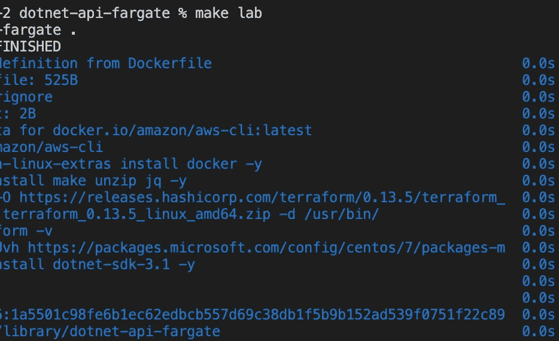

运行`make login-lab`构建 docker 实验室环境，你要用交互模式运行。

# 创建示例项目

在同一个 docker 交互终端中，运行根文件夹中的`make sample-project`，一个新的 webapi 项目将在`src/SampleApi`中创建，如下所示:-

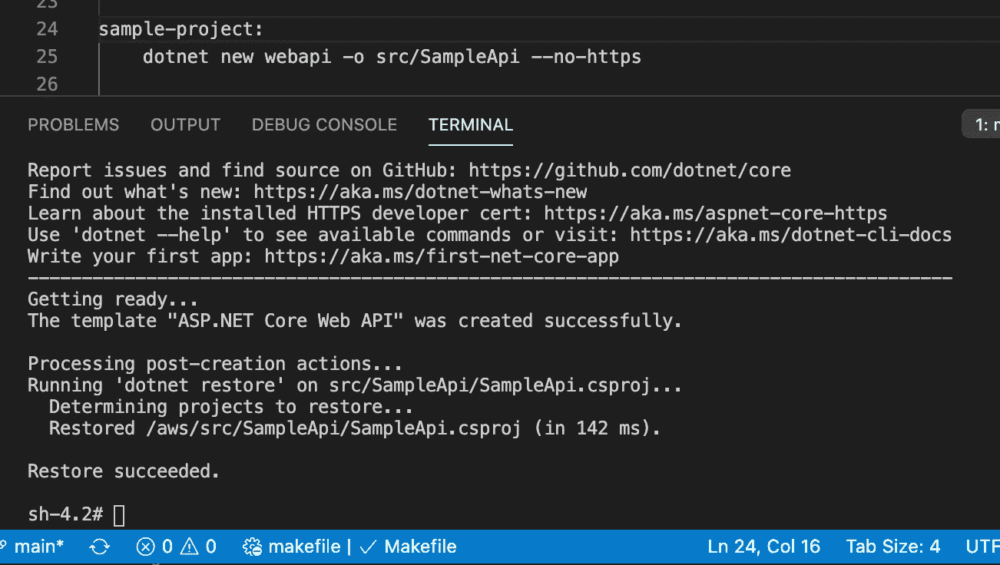

## 测试运行您的 API

运行`make run-project`命令来测试你的 api，你将能够从`localhost:5000/WeatherForecast`触发它。

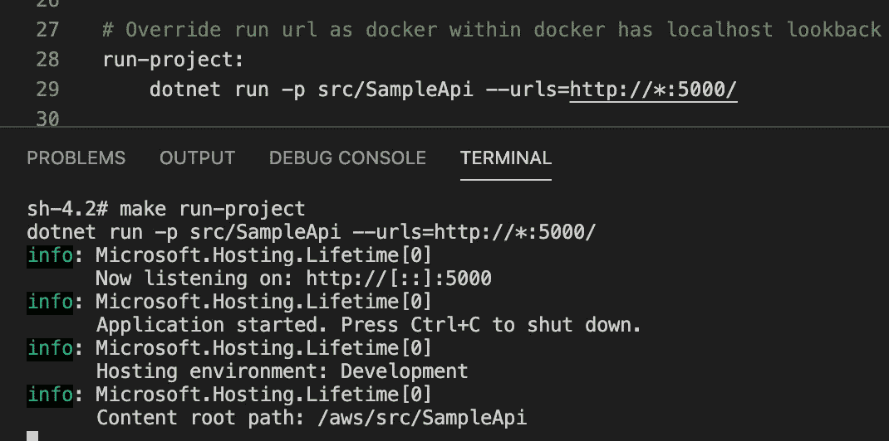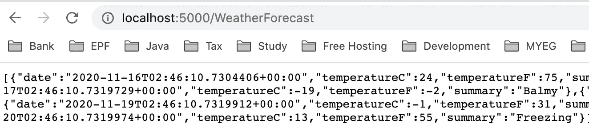

## 向 API 项目添加健康检查支持

应用程序负载平衡器要求目标 ECR 服务具有 healthcheck 终结点，以便了解您的服务运行状况。添加`ConfigureServices`中的`services.AddHealthChecks()`和`Startup.cs`文件中`Configure`部分的`app.UseHealthCheck("/")`如下:-

## 将您的 API 项目归档

将新的 Dockerfile 添加到`src/SampleApi`文件夹中，内容如下:-

# 将图像推送到 ECR

现在我们已经准备好了我们的 DotNet API 项目，是时候创建图像并将其推送到我们的 ECR 了。

## 设置 AWS CLI 凭据

在您的交互式终端中，运行`aws configure`来设置您的 AWS 凭证。或者，您可以使用命令`export AWS_ACCESS_KEYID=<your access key> && export AWS_SECRET_ACCESS_KEY=<your secret access key>`。如果您使用的是 AWS SSO，则需要填写`AWS_SESSION_TOKEN`。

## 测试您的 AWS CLI

运行命令`aws sts get-caller-identity`来验证您的 AWS 帐户设置。如果您的凭证设置成功，您应该能够看到正确的帐号。

## 创建 ECR 新存储库

运行命令`make repo`在您的 AWS 账户中创建新的回购，如下所示:-

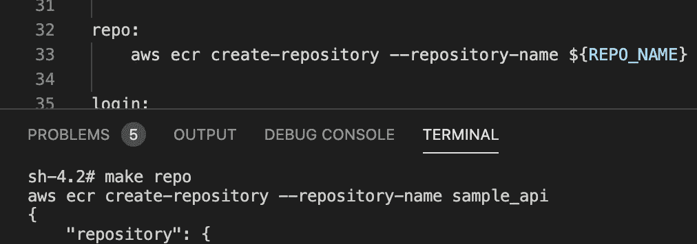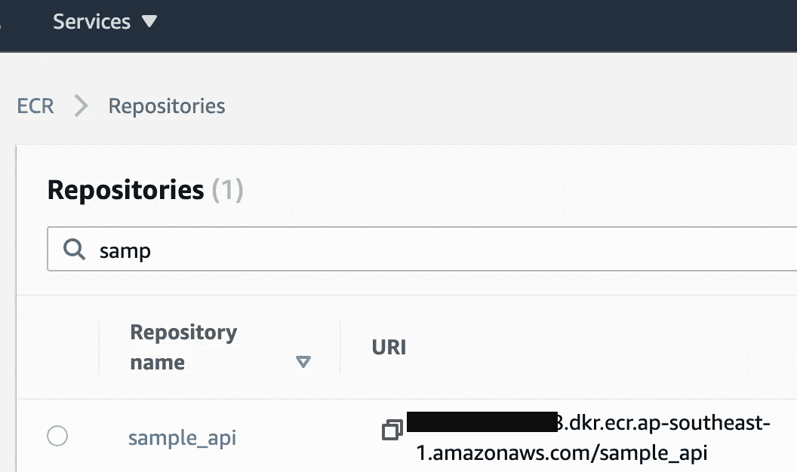

您可以登录 AWS 控制台来验证您的存储库。

## 登录 ECR

为了将您的本地映像推送到 ECR，您需要登录 ECR。运行命令`make login`登录您的 ECR。

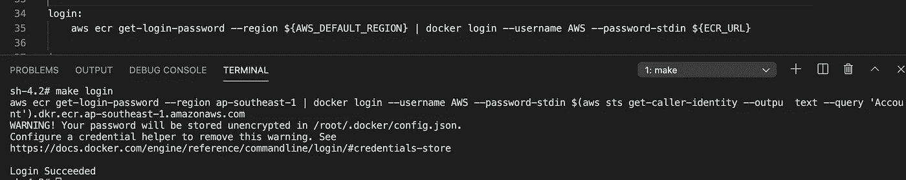

## 提升你的形象

跑`make image`把你的形象推到 ECR。

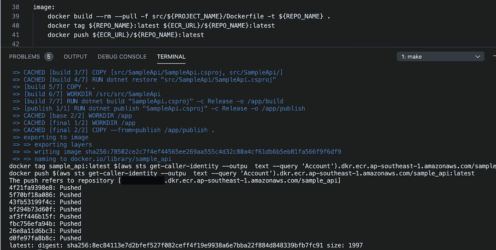

# 设置地形脚本

我们已经完成了应用程序方面的工作。现在，我们需要建设我们的基础设施。在项目根目录下创建文件夹`infra`，并设置如下内容。

## **数据资源**

Terraform 资源允许我们读取现有基础设施属性，如 VPC 和子网。在我们的例子中，我们重用现有的默认 VPC。

在 infra 文件夹中创建文件`data.tf`，内容如下:-

## 应用负载平衡器

在 infra 文件夹中创建文件`alb.tf`，内容如下:-

> 我们用默认的静态内容和路径`/WeatherForecast*`的路由规则设置 ALB 到我们的 ECS 资源。

## **ECS 集群**

在 infra 文件夹中创建文件`cluster.tf`，内容如下:-

## 安全组

我们将为 ALB 和服务创建一个共享的安全组，在 infra 文件夹中创建`sg.tf`，包含以下内容:-

> 我们创建的安全组将允许端口 80 的内部流量和公共流量

## ECS 服务

我们创建一个 ECS 服务`my-api`在我们的 ECS 集群中运行。在 infra 文件夹中创建文件`service.tf`，内容如下:-

> ECS 服务将使用运行任务的基本设置，并从 ALB 路由流量

## 任务内容

任务定义用于描述我们需要运行什么样的容器配置和映像。在 infra 文件夹中创建文件`task-def.tf`，内容如下:-

> 我们使用之前为这个任务定义推出的图像

## 任务角色和任务执行角色

ECS 有两种权限模型来管理资源。一个是`Task Role`来承担容器的角色访问，另一个是`Task Execution Role`让 ECS 集群代表我们运行，比如拉映像。为了简单起见，我们将对两种权限使用一个角色。在以下文件夹中创建文件`task_role.tf`,内容如下:-

> 该角色仅提供基本的 ECSTaskExecution 角色策略和 CreateLogGroup 权限。如果需要其他权限，您可以添加更多。

## 输出文件

最后，我们需要打印出我们的 ALB 信息，这样我们就可以触发它。在以下内容的基础文件夹中创建`output.tf`

# 部署您的基础设施

太好了！您已经使用 terraform 脚本设置完成了所有基础设施。事实上，大多数组件可以被设置为可重用的组件，以简化新服务的设置。现在，让我们回到你的 docker 交互终端。

## 初始化地形

运行`make init`来初始化所有需要的插件和提供者。

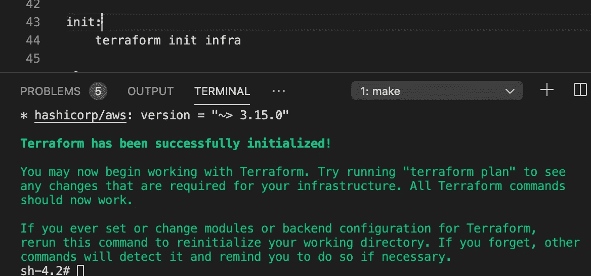

## 规划地形

运行`make plan`以验证所有 terraform 设置是否正确。

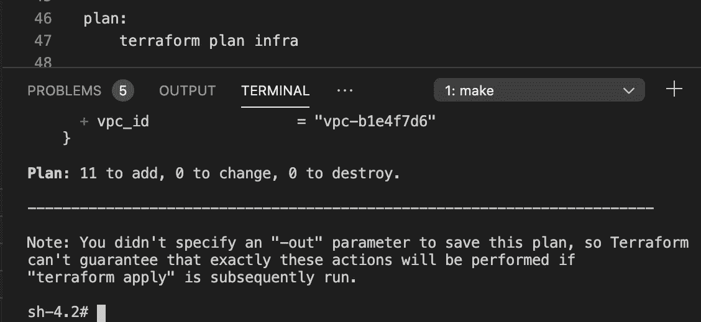

## 应用地形

运行`make apply`将更改应用到我们的 AWS 帐户。

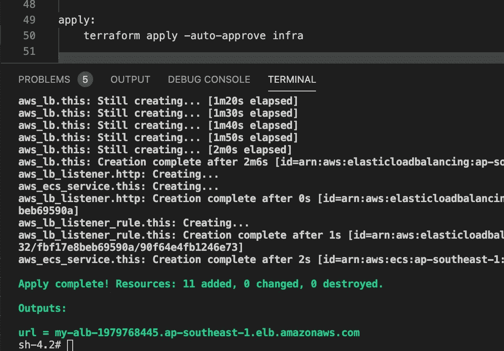

> 成功应用上面的脚本后，您将能够在输出中找到您的 ALB url。

## 测试 API

运行`make test`来测试你的 api，或者用`{url}/WeatherForecast`打开浏览器。您可能需要尝试几次，直到所有都集成在一起。

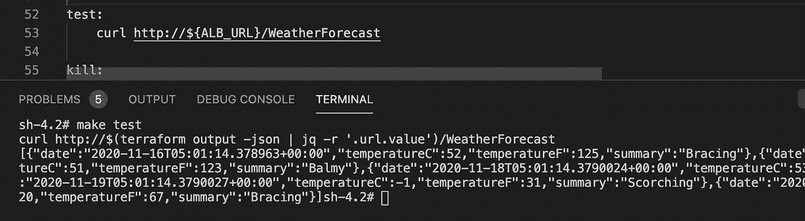

## 清除资源

您可以登录 AWS 帐户来验证 ECS cluster、ALB 和 cloudwatch。满意后，运行`make kill`清空所有资源。

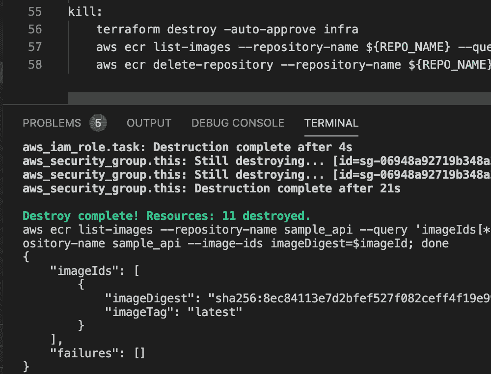

# 结论

在本文中，我们将了解如何使用 terraform 脚本在 AWS 的 Fargate launch 类型中设置整个 ECS 服务。除此之外，我们还学习使用 docker 环境来完成所有步骤，并将所有命令打包到 Makefile 中。所有源代码可以参考[这里](https://github.com/jazztong/dotnet-api-fargate)。