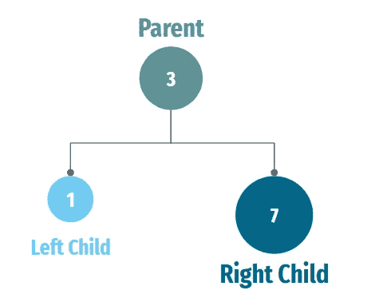

# 二叉查找树的简单例子

> 原文：<https://levelup.gitconnected.com/simple-example-of-a-binary-search-tree-426c2dfda24>

> 实际 Python 代码的解释和示例！


照片由 [benzoix](https://www.freepik.com/author/benzoix) 拍摄

**什么是二叉查找树？**

二叉查找树是一种用于以分层方式存储数据的数据结构。每条数据称为一个 ***节点*** ，每个 ***节点*** 有一个**左**和**右**。

通过以这种方式组织数据，可以很容易地快速搜索树中的特定数据，因为您只需要将每个节点上的数据与您正在寻找的数据进行比较。这就是数据结构被称为“二分搜索法”树的原因。



图片作者 Timothy Kozaki

***左子*** 包含小于父节点的数据，而 ***右子*** 包含大于父节点的数据。


照片由 [starline](https://www.freepik.com/author/starline) 拍摄

为什么我应该使用二叉查找树？

有几个原因可以解释你为什么想使用二叉查找树。其中一个主要原因是它们在搜索数据时*非常高效。因为树中的数据是以分层方式组织的，所以您可以通过将每个节点的数据与您要查找的数据进行比较来快速缩小搜索空间。这使得在二叉查找树中搜索数据比在其他数据结构(如数组或链表)中搜索数据要快得多。*

> *“在搜索数据方面非常高效。”*

*二分搜索法树的另一个优点是它们是 ***易于实现和使用*** 。插入和搜索数据等基本操作可以使用简单的递归算法来实现。这使得编写使用二分搜索法树的代码变得容易，并且使得代码易于理解和维护。*

> *“易于实施和使用”*

*最后，二分搜索法树还具有 ***的灵活性，可用于多种应用*** 。例如，您可以使用它们来存储需要快速访问的数据，例如在数据库索引中。您还可以使用它们来实现其他数据结构，例如集合和映射，这在许多不同的上下文中都很有用。总的来说，二分搜索法树是组织和搜索数据的一个有用和强大的工具。*

> *"灵活，可用于各种应用."*

*下面是一个用 Python 实现二叉查找树的例子。这段代码定义了一个`BinarySearchTree`类，该类具有在树中插入和搜索数据的方法；输出 ***真*** 或 ***假。****

```
*class BinarySearchTree:
    def __init__(self, data):
        self.data = data
        self.left = None
        self.right = None

    def insert(self, data):
        if data < self.data:
            if self.left is None:
                self.left = BinarySearchTree(data)
            else:
                self.left.insert(data)
        else:
            if self.right is None:
                self.right = BinarySearchTree(data)
            else:
                self.right.insert(data)

    def search(self, data):
        if data < self.data:
            if self.left is None:
                return False
            else:
                return self.left.search(data)
        elif data > self.data:
            if self.right is None:
                return False
            else:
                return self.right.search(data)
        else:
            return True*
```

*要使用这个类，首先要创建一个`BinarySearchTree`对象，并使用`insert`方法将一些数据插入其中。然后，您可以使用`search`方法在树中搜索特定的数据。*

*例如:*

```
*tree = BinarySearchTree(10)
tree.insert(5)
tree.insert(15)

if tree.search(5):
    print("5 is in the tree")
else:
    print("5 is not in the tree")*
```

*这段代码创建了一个`BinarySearchTree`对象，它有一个包含值 10 的节点。然后，它会再插入两个包含值 5 和 15 的节点。最后，它将搜索值 5，并输出一条消息，表明是否在树中找到了它。*

*以下是如何将二叉查找树用于数据集的示例。假设您有一个想要存储在二叉查找树中的数字列表。您可以这样做:*

```
*data = [10, 5, 15, 3, 7, 12, 18]
tree = BinarySearchTree(data[0])

for i in range(1, len(data)):
    tree.insert(data[i])

if tree.search(12):
    print("12 is in the tree")
else:
    print("12 is not in the tree")*
```

*这段代码创建一个`BinarySearchTree`对象，将`data`列表(10)中的第一个元素作为根节点。然后，它使用`insert`方法将列表中剩余的元素插入到树中。最后，它在树中搜索值 12，并输出一条消息，表明是否找到了它。*

*如果您要在插入所有数据后可视化二叉查找树，它看起来会像这样:*

```
 *10
       /  \
      5    15
     / \   / \
    3   7 12  18*
```

*如您所见，数据在树中的组织方式是，每个节点的 ***左子节点*** 包含的数据比 ***父节点*** 小，而 ***右子节点*** 包含的数据大。这使得快速搜索树中的特定数据变得容易。*

*很酷吧！？*

# *第二个示例—搜索和提取数据*

*在本例中，我们将搜索与我们的搜索相匹配的数据行。为此，概念是相似的，但是搜索功能被调整为输出结果。*

```
*class Node:
    def __init__(self, val, data):
        self.left = None
        self.right = None
        self.val = val
        self.data = data

class BinarySearchTree:
    def __init__(self):
        self.root = None

    def insert(self, val, data):
        new_node = Node(val, data)
        if self.root is None:
            self.root = new_node
            return

        current_node = self.root
        while True:
            if val < current_node.val:
                if current_node.left is None:
                    current_node.left = new_node
                    break
                else:
                    current_node = current_node.left
            else:
                if current_node.right is None:
                    current_node.right = new_node
                    break
                else:
                    current_node = current_node.right

    def search(self, val):
        current_node = self.root
        while current_node is not None:
            if val == current_node.val:
                return current_node.data
            elif val < current_node.val:
                current_node = current_node.left
            else:
                current_node = current_node.right
        return None*
```

*在这个修改后的实现中，每个`Node`对象都包含一个`data`属性，用于存储与节点值相关的数据。`insert`方法现在接受一个额外的`data`参数，它存储在新节点的`data`属性中。`search`方法返回它找到的节点的`data`属性，而不仅仅是`True`。*

*要使用这个修改过的`BinarySearchTree`类从数据帧中搜索和检索特定的行数据，您可以这样做:*

```
*import pandas as pd

# Create a sample dataframe
df = pd.DataFrame({'id': [1, 2, 3, 4, 5], 
                   'name': ['Alice', 'Bob', 'Charlie', 'Dave', 'Eve']})*
```

*在这个例子中，我们创建了一个带有一个`'id'`列和一个`'name'`列的 dataframe。*

```
*# Create a binary search tree using the 'id' column as the values, and storing the entire row as the data
bst = BinarySearchTree()
for _, row in df.iterrows():
    bst.insert(row['id'], row)*
```

*然后，我们创建一个二叉查找树，使用`'id'`列作为要存储在树中的值，并将整行存储为与每个值相关联的数据。*

```
*# Search for a value in the tree and retrieve the associated data
result = bst.search(3)
print(result)  

# Output
# 'id': 3, 
# 'name': 'Charlie'*
```

*最后，我们使用`search`方法来搜索值 3 和 6。*

```
*result = bst.search(6)
print(result)  

# Output
# None*
```

# *跟我来。*

*我希望这篇文章对你有帮助！*

*我正在深入研究 Python、SQL、机器学习、AR、VR 和可视化，目标是确定最佳实践、提高效率并不断提升！*

*在这里整理我的想法/笔记，希望它能让媒体社区的每个人受益！*

*请关注我，这样我就知道我的故事正在帮助人们，如果您有任何问题，请随时与我联系！感激不尽！*