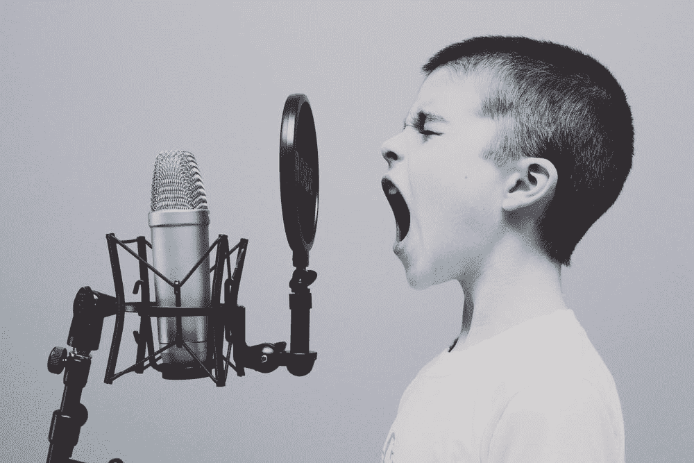

# Python 中的谷歌语音转文本

> 原文：<https://levelup.gitconnected.com/simple-example-of-speech-to-text-a86fff4ab626>

## 一个演示如何在 [Python](https://chatbotslife.com/tagged/artificial-intelligence) 中将语音应用于文本的例子



由[杰森·罗斯韦尔](https://unsplash.com/@jasonrosewell)在 [Unsplash](https://unsplash.com/photos/ASKeuOZqhYU) 上拍摄的照片

[](https://jorgepit-14189.medium.com/membership) [## 用我的推荐链接加入媒体-乔治皮皮斯

### 阅读乔治·皮皮斯(以及媒体上成千上万的其他作家)的每一个故事。您的会员费直接支持…

jorgepit-14189.medium.com](https://jorgepit-14189.medium.com/membership) 

语音识别(或语音转文本)还远未完善。然而，SpeechRecognition 库提供了一种与许多语音转文本 API 进行交互的简单方法。在本帖中，我们将展示如何使用[Python](http://becominghuman.ai)[speech recognition](https://pypi.org/project/SpeechRecognition/)库轻松地将音频文件中的口语转换成文本。

# 具有语音识别功能的语音转文本

SpeechRecognition 是一个用于执行语音识别的库，支持多种在线和离线引擎和 API。

语音识别引擎/API 支持:

*   [CMU 狮身人面像](http://cmusphinx.sourceforge.net/wiki/)(离线工作)
*   谷歌语音识别
*   [谷歌云语音 API](https://cloud.google.com/speech/)
*   [Wit.ai](https://wit.ai/)
*   [微软 Azure 演讲](https://azure.microsoft.com/en-us/services/cognitive-services/speech/)
*   [微软必应语音识别(已弃用)](https://www.microsoft.com/cognitive-services/en-us/speech-api)
*   [验证 API](https://houndify.com/)
*   [IBM 语音转文字](https://www.ibm.com/smarterplanet/us/en/ibmwatson/developercloud/speech-to-text.html)
*   [Snowboy 热门词检测](https://snowboy.kitt.ai/)(离线工作)

对于我们的例子，我们将使用`recognize_google`，但是也有一些其他的选择，如`recognize_bing()`、`recognize_wit()`。我们将在本例中使用的音频文件`.wav`可以在[这里](https://drive.google.com/file/d/15Y8rAL2p9b6N4vf8FV1NxTwmPtFafO1Z/view)找到。注意，`recognize_google`允许每天 **50 次免费通话**。

```
# Importing the speech_recognition library
import speech_recognition as sr# Create an instance of the Recognizer class
recognizer = sr.Recognizer()# Set the energy threshold
recognizer.energy_threshold = 300# Convert audio to AudioFile
clean_support_call = sr.AudioFile("staytuned.wav")# Convert AudioFile to AudioData
with clean_support_call as source:
    clean_support_call_audio = recognizer.record(source)# Transcribe AudioData to text
text = recognizer.recognize_google(clean_support_call_audio,
                                   language="en-US")
print(text)
```

我们得到的输出是:

```
hello everybody today we are going to talk about speech-to-text stay tuned
```

# 带噪声音频的语音转文本

有时候，我们不得不处理嘈杂的音频文件。我们可以使用`Recognizer`的`adjust_for_ambient_noise()`功能来抵消背景噪声。我们将使用[这个音频文本](https://drive.google.com/open?id=1dM0gG4plX628CdPT35stwRqvvgmT717W)作为示例。

```
# Importing the speech_recognition library
import speech_recognition as srrecognizer = sr.Recognizer()# Convert audio to AudioFile
noisy_support_call = sr.AudioFile("2-noisy-support-call.wav")# Record the audio from the noisy support call
with noisy_support_call as source:
 # Adjust the recognizer energy threshold for ambient noise
    recognizer.adjust_for_ambient_noise(source, duration=0.5)
    noisy_support_call_audio = recognizer.record(noisy_support_call)

# Transcribe the speech from the noisy support call
text = recognizer.recognize_google(noisy_support_call_audio,
                                   language="en-US")print(text)
```

我们得到的输出是:

```
hello I'd like to get to help setting up my account please
```

# 讨论

这是一个简单的可重复的例子，展示了如何轻松地将 T [分机转换为语音](https://chatbotslife.com/)。在下面的帖子里，我们会给出更多的例子。请随时将您对新帖子的偏好发送给我们。

最初发布于[预测黑客](https://predictivehacks.com/simple-example-of-speech-to-text/)