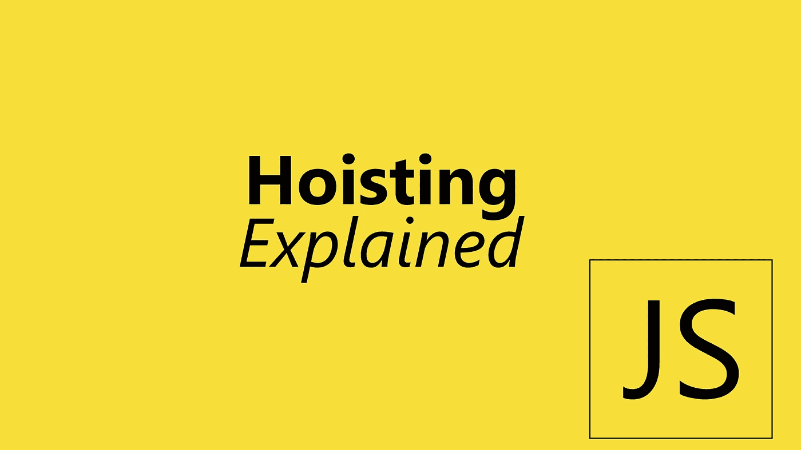

# JavaScript 中提升的简单解释

> 原文：<https://levelup.gitconnected.com/simple-explanation-of-hoisting-in-javascript-7e13fde9da53>



提升是 JavaScript 的一个非常简单的概念，我将用不到 2 分钟的时间用 10 行代码向你解释。

让我们看看下面的代码:

```
function sumFunction(a, b){
 return a + b;
}const sumArrowFunction = (a , b ) => a + bconsole.log(sumFunction(1, 2))
console.log(sumFunction(3, 4))
```

在 JavaScript 中，所有的代码都是从上到下运行的，所以我们在这里定义了两个函数，然后我们注销它们，结果就是简单的 3 和 7，对吗？

但是如果你使用 JavaScript 有一段时间了，你会发现如果你像这样把第一个函数移到底部:

```
const sumArrowFunction = (a , b ) => a + bconsole.log(sumFunction(1, 2))
console.log(sumFunction(3, 4))function sumFunction(a, b){
 return a + b;
}
```

一切仍然工作，虽然它看起来很奇怪，对不对？这在 JavaScript 中叫做**提升**。它会自动移动你的一些代码并放到文件的顶部。在这种情况下，JavaScript 会在运行之前将`sumFunction`放在文件的顶部，因此它将被定义。

如果你像这样使用箭头函数，事情会变得很奇怪:

```
console.log(sumFunction(1, 2))
console.log(sumFunction(3, 4))function sumFunction(a, b){
 return a + b;
}
const sumArrowFunction = (a , b ) => a + b
```

一旦运行代码，您会注意到在初始化之前不能调用`sumArrowFunction`。这是为什么呢？这种情况下，只有带有`function`关键字的正常函数会被提升，其他使用`let`或`const`的函数不会被提升。

函数不是 JavaScript 中唯一提升的东西，现在让我们进入**提升变量，**下面是例子:

```
console.log(num);
var num = 2;
```

所以`num`不是一个函数，但是当你运行代码的时候，它工作了，但是值是`undefined`。因为带有`var`关键字的变量也会被提升，而`let`和`const`不会。带有`var`关键字的变量将被创建为文件顶部的`var someVar = undefined`，在定义变量的地方，它只是设置变量值。
记住:`var`关键字仅**提升变量的初始化**

你很幸运，现在几乎没有人在实际使用中使用`var`关键字，只有在棘手的面试问题中。所以只要记住**吊装**的概念就行了哈哈

# 遗言

虽然我的内容对每个人都是免费的，但是如果你觉得这篇文章有帮助，你可以在这里给我买杯咖啡