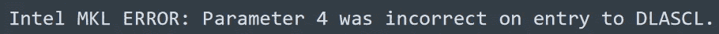

# 使用 Python 通过 ARIMA 进行预测

> 原文：<https://levelup.gitconnected.com/simple-forecasting-with-auto-arima-python-a3f651271965>


预测

# **简介**

做预测的一些方法有:指数平滑，单方程回归，联立方程回归，**自回归综合移动平均(ARIMA)，**向量自回归(VAR)。

# **ARIMA**

在这个故事中，我将重点介绍 ARIMA 以及如何在 Python 上自动设置参数。你可以在这里找到更多我的数据科学之旅[。](https://medium.com/@joseph.magiya)

ARIMA 模型是一类用于分析和预测时间序列数据的统计模型。它明确地迎合了时间序列数据中的一套标准结构，因此提供了一种简单而强大的方法来进行熟练的时间序列预测。

*   AR:自回归。利用一个观测值和一些滞后观测值之间的依赖关系的模型。
*   我:综合的。使用原始观测值的差分(例如，从上一时间步的观测值中减去一个观测值)，以使时间序列平稳。
*   马:移动平均线。一种模型，利用观测值与应用于滞后观测值的移动平均模型的残差之间的相关性。

> *ARIMA 模型的参数定义如下:*
> p:模型中包含的滞后观测值的个数，也叫滞后阶数。
> d:原始观测值有差异的次数，也称为差异度。
> 问:移动平均线窗口的大小，也叫移动平均线的顺序。

您可以在下面实现这些功能:

```
p_values = [0, 1, 2, 4, 6, 8, 10]
d_values = range(0, 3) #this is the range for the values
q_values = range(0, 3) #this is the range for the values
```

构建包括指定数量和类型的项的线性回归模型，并且通过一定程度的差异来准备数据，以使其稳定，即去除对回归模型有负面影响的趋势和季节结构。

值 0 可用于参数，表示不使用模型的该元素。这样，ARIMA 模型可以配置为执行 ARMA 模型的功能，甚至是简单的 AR、I 或 MA 模型。

可使用`statsmodels`库创建 ARIMA 模型，如下所示:

1.  通过调用`ARIMA()`并传入`p`、`d`和`q`参数来定义模型。
2.  通过调用`fit()`函数，在训练数据上准备模型。
3.  可以通过调用`predict()`函数并指定要预测的一个或多个时间的索引来进行预测。

通过使用**网格搜索**程序，我们可以自动评估 ARIMA 模型的大量超参数。我们可以在模型超参数的不同组合上自动化训练和评估 ARIMA 模型的过程。在机器学习中，这被称为网格搜索或模型调整。

方法分为两部分:
1 .评估一个 ARIMA 模型。
2。评估 ARIMA 参数集。

# **先决条件**

*   警告信息
*   熊猫
*   statsmodels(这个库提供了拟合 ARIMA 模型的能力)
*   sklearn(均方误差)

对于以上内容，将它们导入到您的脚本中，如下所示:

```
import warnings
from pandas import Series
from statsmodels.tsa.arima_model import ARIMA
from sklearn.metrics import mean_squared_error
```

# **评估一款 ARIMA 车型**

1.  将数据集分成训练集和测试集。
2.  遍历测试数据集中的时间步骤。
    a .训练一个 ARIMA 模型。
    b .做一步预测。
    c .店铺预测；获取并存储实际观察值。
3.  计算预测值与预期值相比的误差分数。

```
def evaluate_arima_model(X, arima_order):
    # prepare training datasettrain_size = int(len(X) * 0.66)
    train, test = X[0:train_size], X[train_size:]
    history = [x for x in train]
    # make predictions
    predictions = list()
    for t in range(len(test)):
        model = ARIMA(history, order=arima_order)
        model_fit = model.fit(disp=0)
        yhat = model_fit.forecast()[0]
        predictions.append(yhat)
        history.append(test[t])
    # calculate out of sample error
    error = mean_squared_error(test, predictions)
    return error
```

# **评估 ARIMA 参数集。**

指定一个网格的`p`、`d`和`q` ARIMA 参数进行迭代。为每个参数创建一个模型，通过调用上一节描述的`evaluate_arima_model()`函数来评估其性能。

还有两个额外的考虑。
1。首先是确保输入数据是浮点值(而不是整数或字符串)，因为这可能导致 ARIMA 过程失败。

2.`statsmodels` ARIMA 程序在内部使用数值优化程序为模型寻找一组系数。这些过程可能会失败，进而引发异常。我们必须捕捉这些异常并跳过那些导致问题的配置。

```
warnings.filterwarnings("ignore")
```

这种情况比你想象的更常见

```
def evaluate_models(dataset, p_values, d_values, q_values):
    dataset = dataset.astype('float32')
    best_score, best_cfg = float("inf"), None
    for p in p_values:
        for d in d_values:
            for q in q_values:
                order = (p,d,q)
                try:
                    mse = evaluate_arima_model(dataset, order)
                    if mse < best_score:
                        best_score, best_cfg = mse, order
                    print('ARIMA%s MSE=%.3f' % (order,mse))
                except:
                    continue
    print('Best ARIMA%s MSE=%.3f' % (best_cfg, best_score))
```

最小均方误差是最佳参数集。

# **运行它**

```
evaluate_models(series.values, p_values, d_values, q_values)
```

详细的例子请看我的 Git 上的[这个](http://github.com/JosephAnyona/Auto-ARIMA)。

# **奖励:问题和变通办法**

运行查询后，在代码执行过程中，我多次遇到这个错误。



英特尔 MKL 错误:参数 4 在进入 DLASCL 时不正确。

如果你也遇到了这种情况，请使用此链接更新 [conda](https://software.intel.com/en-us/articles/using-intel-distribution-for-python-with-anaconda) ，看看这里的。

**干杯！**