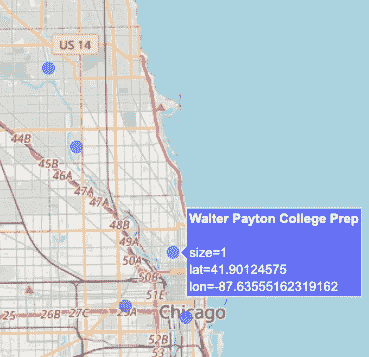

# Python 中的简单地理编码

> 原文：<https://levelup.gitconnected.com/simple-geocoding-in-python-fb28ee5272e0>

## Python 地理定位


在 [Unsplash](https://unsplash.com?utm_source=medium&utm_medium=referral) 上由 [Waldemar Brandt](https://unsplash.com/@waldemarbrandt67w?utm_source=medium&utm_medium=referral) 拍照

主格是拉丁语的意思(“按名字”)。它也是一个按地址或位置(地理编码)搜索 OpenStreetMap 数据的工具。Nominatim 包含在 GeoPy Python 库中的 GeoPy 中。它帮助我完成了最近的几个项目，在这些项目中，我有带地址的数据集，但没有地图绘制和几乎任何其他基于位置的任务所需的纬度/经度数据。

## 查找单个地址

我们将从基础代码开始，类似于在 https://geopy.readthedocs.io/en/stable/[的优秀文档中提供的内容。](https://geopy.readthedocs.io/en/stable/)

这段代码创建了一个名称对象

上面的代码在第 4 行实例化了一个名为**地理定位器**的名称对象。请注意, **user_agent** 参数是必需的，并且应该是应用程序的 referer HTTP 地址。如果您计划进行大量的查找，您还应该添加一个**email = ' your email @ me . com '**参数，以便在出现问题时能够得到通知。提名是一项免费服务，请求限制较低。如果你需要快速查找很多地址，你可能需要付费服务。

在第 5 行，geocode 方法施展了它的魔法，返回一个**geo py . location . location**对象，其中包含我们地址所需的所有地理数据。

## 位置对象

我们设法获取了一个位置对象。现在，我们能用它做什么呢？下面的代码提取了最有用的信息。

**位置**对象(保存为**位置**)存储了包含我们需要的数据的属性。

**raw** 属性包含对象中存储的所有数据。它是一个字典对象，如下所示:

```
{'place_id': 99356088, 'licence': 'Data © OpenStreetMap contributors, ODbL 1.0\. [https://osm.org/copyright',](https://osm.org/copyright',) 'osm_type': 'way', 'osm_id': 31065707, 'boundingbox': ['41.900608', '41.9020128', '-87.6366191', '-87.634464'], 'lat': '41.90124575', 'lon': '-87.63555162319162', 'display_name': 'Walter Payton College Prep, 1034, North Wells Street, Chicago River North, Near North Side, Chicago, Cook County, Illinois, 60610, United States', 'class': 'amenity', 'type': 'school', 'importance': 0.6210731310973492, 'icon': 'https://nominatim.openstreetmap.org/ui/mapicons//education_school.p.20.png'}
```

这里有一些非常有趣和有用的数据，对一些项目非常有用(类型、重要性、图标、边界框)。

来自**位置**(地址、纬度、经度)的其他属性更加直接，将为我们提供本例所需的数据:

```
Walter Payton College Prep, 1034, North Wells Street, Chicago River North, Near North Side, Chicago, Cook County, Illinois, 60610, United States(41.90124575, -87.63555162319162)
```

请注意，地址是字符串格式，但是格式和顺序在所有查找中都是一致的。通过简单地分割和索引字符串，可以将它们提取为单独的字段。

## 查找一系列位置

既然我们对如何进行地理编码查找有了一个基本的概念，我们可以对更大的数据集进行自动化。同样，对于大型项目来说，速度和允许的下载可能会受到限制。

我以前是芝加哥公立学校的高中老师，所以我会选择我熟悉的学校。我们将查找芝加哥公立学校中排名前五的高中的地址和位置。

在下面的代码中，我制作了一个学校的 Pandas 数据帧，并使用 Pandas 系列的 apply 方法为所有五个学校创建位置对象。

这段代码创建了包含学校和位置的数据帧

这给了我一个包含两列(学校和位置)的 df。location 列是我们在第 12 行查找的一系列 **geopy.location.Location** 对象。我们使用了之前在单地址查找部分中使用的相同的**地理定位器**对象和方法。您会注意到，这次我没有使用任何地址，我只是在查询中使用了学校名称(类似于您可能会进行的任何 Google 地图搜索)。此外，类似于谷歌地图搜索，当你不够具体时，你可能会得到错误的结果。


地理编码查找后的 df

现在，我们更进一步，从位置对象中提取地址、纬度和经度。我只在代码中添加了最下面的三行。就像我们做的单位置地理编码一样，我们使用**位置**对象属性来获得我们想要的数据。这次，我们通过提取位置属性来创建新的 DataFrame 列。

生成的数据帧如下。


运行最后一个代码后的结果

我们注意到莱恩技术高中的一些事情。地址和经度不是芝加哥。就像你的谷歌地图搜索一样，如果你不提供细节，有时搜索会出错。如果有完整的地址，最好使用完整的地址。让我们再次尝试整个代码，但是这次我们将在查询中包括芝加哥。


专一性固定

注意:即使将芝加哥添加到查询中，它仍然只返回学校旁边的 Lane Tech 汽车站。我们会接受它，但要知道这是一个普遍现象。官方名称是“莱恩技术学院预备高中”，但没有人使用它。

现在，我们有了学校的正确地址和地理数据。我喜欢绘制地图，所以让我们用 Plotly 绘制五所学校来结束这个话题。我更喜欢 plotly，因为地图很漂亮，但有时我也喜欢使用目前更通用的叶子。([看看我的其他故事](http://sciencelee.medium.com))



我们能够简单地列出五所学校的名称，使用 GeoPy 查找地址/位置，并将其绘制在地图上。我们可以轻松地对任何地址、城市、建筑名称等列表进行同样的操作。下面的地图是当你标绘所有芝加哥公立学校并按小学或中学给它们上色时的样子。


所有芝加哥公立学校

谢谢你让我与你分享这个。希望对你以后的项目有帮助。祝你好运！

如果您在运行代码时有任何问题或困难，请随时联系我们，我会尽力帮助您。