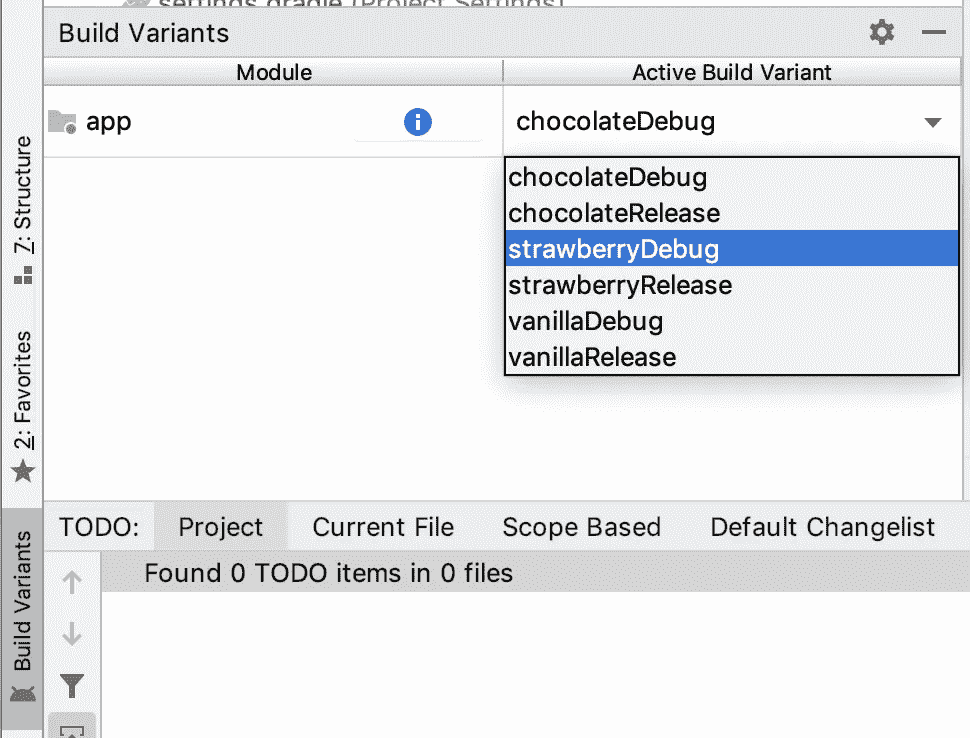

# Android 产品风格的简单指南

> 原文：<https://levelup.gitconnected.com/simple-guide-to-android-product-flavors-674106455038>


巴赫尔·凯里在 [Unsplash](https://unsplash.com?utm_source=medium&utm_medium=referral) 上拍摄的照片

前一段时间在做一个项目时，我的任务是为一个“事件”移动应用程序创建一个变种。它应该具有主应用程序的核心功能，但改变了配色方案和信息，使其特定于特定的事件。

马上，我最初的想法是克隆项目并改变文件以适应特定的事件。听起来像个计划，对吧？问题是，随着将来更多事件的增加，代码的维护变成了一个巨大的头痛和噩梦！—输入产品风味来拯救世界！；)"

我写这篇文章的目的是介绍 Android 中我们称之为“产品风格”的东西，我将带你完成基本的设置。

# 我们走吧

**产品风味那么它们是什么呢？**

简单来说，产品风格是你的应用程序的变体。当你想创建应用程序的多个版本时，这是非常有用的。这意味着你可以使用一个代码库生成不同版本或变体的应用程序。

产品口味是 Android Studio 的 Gradle 插件的一个强大功能，用于创建定制版本的产品。它们构成了我们称之为**构建变体**的一部分。

# **构建变体**

构建变体由构建类型和产品风格组成。

根据 Google 文档，构建变体是 Gradle 使用一组特定的规则来组合您的构建类型和产品风格中配置的设置、代码和资源的结果。

**构建类型**应用不同的构建和打包设置。构建类型的一个例子是“调试”和“发布”。

**产品风格**指定不同的特性和设备需求，例如定制源代码、资源和最低 API 级别。

**为什么是产品风味？**

*   它们解决了每个版本的应用程序都有单独的项目代码，但仍然只有一个项目代码的问题。
*   假设你有一个免费和一个付费应用程序，你可以限制免费应用程序的功能，而在付费应用程序中展示所有其他功能。
*   在另一个场景中，您希望根据国家实现特定于地区的功能，您可以将产品风格用于这样的用例。
*   白标(这些是某公司开发的 app，被其他公司重新贴牌转卖)。

# **利弊**

**优点**

它们解决了每个版本的应用程序都有单独的项目代码库的问题。

它们保持代码整洁，并使在代码库中导航变得更加容易和快速，因为与特定产品风格相关的所有内容都将保存在相应的文件夹中。

**缺点**

(向上扩展)变体越多，复杂性就越大，从而使得维护代码库更加困难。

在变体之间切换之后，ide 有时需要时间来构建项目。

# **设置产品口味**

在应用程序模块中打开你的`build.gradle`文件，在 android 部分添加你的口味。


以下示例添加了 3 种产品口味，每种都有自己的`applicationIdSuffix`。每种产品风格有不同的`applicationIdSuffix`有助于创建不同的应用程序，可以部署在 PlayStore 上。

```
android {
 ...
 defaultConfig {...}  
 buildTypes {...}flavorDimensions **"icecream"** productFlavors {
    strawberry {
        dimension **"icecream"** applicationIdSuffix **".strawberry"** }
    chocolate {
        dimension **"icecream"** applicationIdSuffix **".chocolate"** }
    vanilla {
        dimension **"icecream"** applicationIdSuffix **".vanilla"** }
}
```

快速注意:所有风味必须属于一个命名的风味维度。风味维度是一组产品风味。如果不指定风味维度，将会出现错误。

构建项目，一旦完成，在菜单栏中选择**Build**>**Select Build Variant**，您将看到当您添加产品口味时自动生成的不同构建变体。



构建变体

## **构建你的口味**

您的主文件夹是包含所有不同风格之间的公共和共享代码的文件夹，您可以通过为每个风格创建不同的源代码集来创建风格特定的代码`MyProject/app/src/main`

打开**项目**窗格，从窗格顶部的下拉菜单中选择**项目**视图。

1.  导航到`MyProject/app/src/`
2.  右击`src`并添加一个`java`文件夹
3.  在“目标源集”下，根据您的喜好选择一个源集，然后单击“完成”

请记住，您应该遵循与主文件夹相同的文件夹结构。


在`java`文件夹中，您可以在您选择的风味文件夹下创建您的风味特定代码。

您还可以添加风味特定的资源。你基本上遵循与上面相同的步骤，不使用`java`文件夹，你可以选择`res`文件夹

# **结论**

在我的旅程中，对产品风味的了解对我来说是非常有见地的，我的主要努力是找到一个简单直接的产品风味介绍和解释，这就是本文的概念。下面是供你细读的更详细的阅读材料。

# 进一步阅读

[配置构建变体](https://proandroiddev.com/advanced-android-flavors-part-1-building-white-label-apps-on-android-ade16af23bcf)

[高级安卓口味](https://proandroiddev.com/advanced-android-flavors-part-1-building-white-label-apps-on-android-ade16af23bcf)