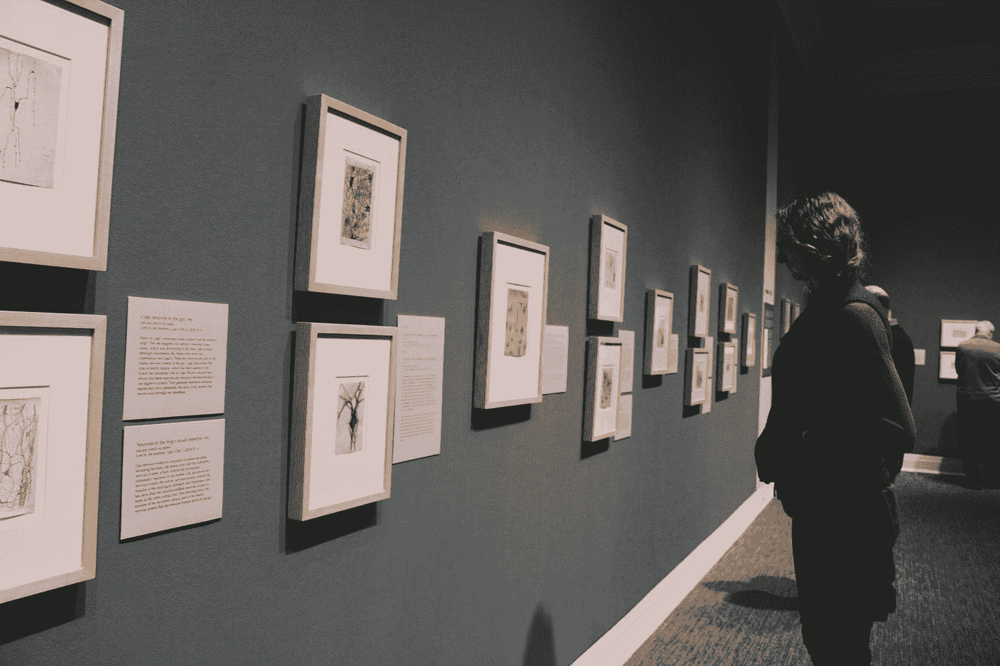
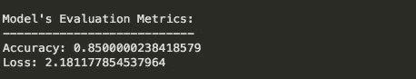
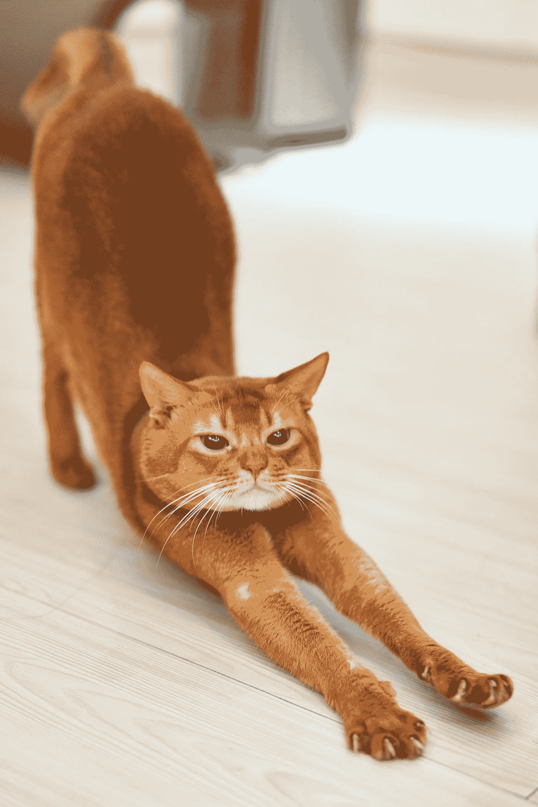

# 基于 CNN 的简单图像分类

> 原文：<https://levelup.gitconnected.com/simple-image-classification-with-cnn-dd5ee3b725>

## Python 代码来收集照片，并训练 CNN 对它们进行分类。

在本文中，我将向您展示如何构建一个卷积神经网络来执行二值图像分类的简单任务。



[阿丽娜·格鲁布尼亚](https://unsplash.com/@alinnnaaaa?utm_source=medium&utm_medium=referral)在 [Unsplash](https://unsplash.com?utm_source=medium&utm_medium=referral) 上的照片

我们还将编写代码，使用 **Flickr API** 和 [**urllib**](https://pypi.org/project/urllib3/) 库下载照片进行抓取。

通过在终端/命令提示符下运行以下命令，下载这两个库。此外，确保您的计算机上安装了 Keras 和 TensorFlow 库，或者使用以下命令来安装它们。

```
pip install flickrapipip install urllib3pip install keraspip install tensorflow
```

有趣的是，我们将训练 CNN 区分猫和猫头鹰。为什么是猫和猫头鹰？它们是我最喜欢的动物，所以我选择了它们。

此外，我觉得猫头鹰相当于鸟类中的猫，鉴于它们都拥有巨大而圆的*(放大时)*眼睛，这给 CNN 带来了一些挑战。

简而言之，猫头鹰和猫有一些相似之处和不同之处，这将为我们的 CNN 学习和区分提供良好的特征。

你可以查看全部代码，托管在我的 GitHub repo 里， [***这里***](https://github.com/shraddha-an/cnns/blob/master/image_classification.ipynb) 。

在开始之前，您需要在项目目录中创建两个文件夹，分别名为 ***train*** 和 ***test* 。**在每个文件夹里面，再创建两个文件夹，分别命名为 ***猫*** 和 ***猫头鹰*** *、*来分别存放猫和猫头鹰的照片。

# 1)数据收集—

您将需要来自 Flickr 的 API 认证密钥来通过 HTTP 请求访问他们的服务。

你可以在这里 申请一个非商业的 [***。***](https://www.flickr.com/services/api/misc.api_keys.html)

一旦你有了 API 密匙和密码，你就可以从 Flickr 网站访问照片并下载它们了。

创建一个 FlickrAPI 对象，将 API 密钥作为第一个参数插入，将密码作为第二个参数插入，以进行身份验证。

下一步是提取存储在“url_c”中的 url。我们将为每个类下载大约 960 张图片，并将 10 张*(随机)*图片从每个类移动到各自的文件夹中，*，即 10 张猫图片到 test/cat 文件夹，10 张 owl 图片到 test/owl 文件夹。*

在这里，我们还将使用时间模块中的睡眠功能暂停一会儿，从 Flickr 下载照片。这样做是为了尊重 Flickr，而不是垄断它的资源。

还因为我注意到在连续下载了大约 494 张图片后，Flickr 服务会抛出超时错误，所以我将任务分成多个块，中间有 100 秒的延迟。

***urlretrieve*** 方法要求您指定存放图像的 URL 以及 ***完整的目标路径*** 和文件名。由于我们有很多文件，我决定用前缀和计数来命名图像文件。

不要忘记将猫和猫头鹰各 10 张图片移动到测试目录中它们各自的文件夹中，这样我们可以稍后评估 CNN 的性能。

# 2) CNN 架构—

我们将使用 Keras 库和 Tensorflow 后端来实现我们的 CNN。如果你是卷积神经网络的新手，我强烈建议你阅读本教程中的解释。

[](https://adventuresinmachinelearning.com/convolutional-neural-networks-tutorial-tensorflow/) [## TensorFlow 中的卷积神经网络教程-机器学习中的冒险

### 在之前的两篇教程文章中，神经网络介绍和张量流介绍，三层…

adventuresinmachinelearning.com](https://adventuresinmachinelearning.com/convolutional-neural-networks-tutorial-tensorflow/) 

CNN 的架构与人工神经网络的架构有很大的不同，如果你是初学者，一开始可能会觉得很复杂。

> CNN 通常用于的一些任务包括图像分类、图像分割、计算机视觉，甚至应用于其他领域，如 NLP、时间序列和推荐系统。
> 
> 它有助于记住我们的 CNN 将不得不执行的任务和它必须处理的数据类型，同时试图理解它是如何工作的。

图像和照片的结构不同于存储在 CSV 中的普通数据，如果它们是彩色的，则包含更多的信息。这意味着我们必须首先将照片转换成网络能够理解的数字阵列。

> 灰度图像将由单通道数字输入组成，指示一个像素有多暗。类似地，对于彩色图像，将有 3 个通道(R、G、B)的数字向网络传递颜色、色调和饱和度等信息。

CNN 由连接到全连接层的隐藏层组成，该全连接层基于流经先前层的像素信息来处理分类决策。我们将在下面更详细地定义每一层。

我们的 CNN 架构将由多层组成:

## 1)卷积层:


CNN 架构。图片来自维基百科。

这一层首先通过在图像上移动，一次移动几个像素，并应用卷积运算，从图像中提取信息。这些像素的输出将是过滤器值和像素值的点积。对其余的像素继续这一过程，最后我们将整个图像卷积成一个特征图。

简而言之，卷积层通过连续放置和移动滤波器来检测图像的特征/信息。

## 2)最大池化:

汇集层减小了该特征图的大小，以仅保留重要信息，并使训练过程更加容易和快速。在我们的 CNN 中，我们将使用一个最大池层，它将以类似于前一个过滤器的方式在特征图上移动，并且只取它所聚焦的聚类的最大值。

## 3)全连接层:

全连接层是通常的神经网络，在我们的情况下，它由 2 层组成；一个具有 64 个节点，最后一个具有用于二进制分类的单个输出节点。

这是一个简单的概述，解释了我们模型中所有不同的层。实际模型实际上是由一系列连接到 2 层神经网络的卷积层和最大池层组成的。

下面是构建 CNN 的代码。

由于我们的任务是对图像进行分类，我们将损失设置为 ***【二元交叉熵】*** *(对于 2 类)* &度量为 ***【准确度】*** 。

# 3)图像增强—

为了达到实用的精确度，CNN 在数百万张图片上被训练。我们既没有如此庞大的数据集，也不具备这种训练过程所需的计算资源。

图像增强帮助我们扩大非常有限的数据集的范围。已经存在的照片可以通过诸如剪切、旋转、缩放、翻转等技术进行处理。，生成新样本并扩展我们的数据集，而无需下载更多图像。

下面，我们将定义 ImageDataGenerator 类的两个对象来扩充我们现有的图像集。

通过重新缩放、剪切、缩放和水平翻转，训练数据集将进一步增加新的样本，我们还将调整所有图像的大小，使其高度和宽度为 300。

对于测试数据集，我们将只重新调整照片的大小。

# 4)培训和评估—

现在剩下的就是训练模型，评估它在测试照片上的表现。

训练过程将花费相当多的时间，一旦完成，对模型运行评估方法以获得模型的损失和准确性分数。

这是我们的模型的结果，在测试集上实现了 85%的准确率和 2.18 的损失。



CNN 的性能指标。

请记住，根据您为测试数据集选择的 10 个图像，这些指标可能会有所不同。



蒂莫·沃尔茨在 [Unsplash](https://unsplash.com?utm_source=medium&utm_medium=referral) 上的照片

这就完成了这个非常长的教程。希望你发现它是有帮助的，并且能够理解卷积神经网络中的不同层。

欢迎你在不同类别的图像上训练/测试模型，玩得开心！

页（page 的缩写）作为坚持到最后的奖励，这里有一只可爱的猫代表你伸懒腰。

感谢您的阅读，我们将在下一篇文章中再见。

如果你决定跟随我。