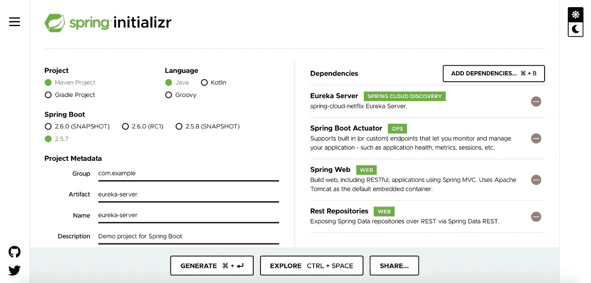
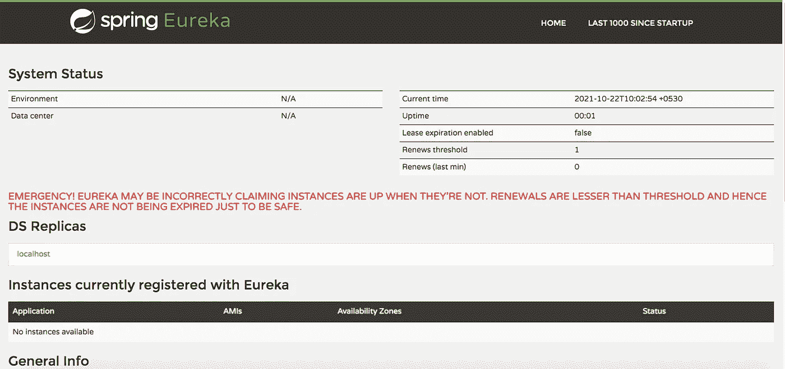

# 用 SpringBoot 简单实现 Eureka 服务器

> 原文：<https://levelup.gitconnected.com/simple-implementation-of-eureka-server-with-springboot-780b64e19735>

阿诺·弗朗西斯卡在 [Unsplash](https://unsplash.com/s/photos/coding?utm_source=unsplash&utm_medium=referral&utm_content=creditCopyText) 上的照片

# 什么是服务发现？

一旦构建并部署了微服务，就需要由客户端来定位它。当服务部署在物理服务器中时，这是一个相当容易的任务，主机和端口信息或者端点本身可以存储在配置文件中。在应用程序部署在云中的环境中，服务实例将具有不能通过文件系统配置的动态位置。为了解决这个问题，需要一个发现工具来动态地识别服务实例。

有两种类型的服务发现—客户端和服务器端。

在本文中，我们将使用网飞尤里卡实现客户端发现。

# 履行

1.  创建一个 SpringBoot 应用程序并添加 Eureka 服务器依赖——如果你使用 STS 作为 IDE，那么创建一个 spring boot 项目作为一个新项目，如果你使用旧的 Eclipse，那么转到 https://start.spring.io/的[并生成 spring boot 项目，如下所示。](https://start.spring.io/)

2.用@EnableEurekaServer 注释主类，这将通知服务充当 eureka 服务器

3.在属性文件中—添加默认端口并禁止服务向 eureka 自行注册

完成这些更改后，构建并运行应用程序。同样，如果您在 STS 上，那么将应用程序作为 spring boot 运行，如果您在 Eclipse 上，那么将它作为 java 应用程序运行。

当服务启动时，在属性文件中给定的默认端口访问它。在这种情况下，应该是 [http://localhost:8761/](http://localhost:8761/)

你会看到尤里卡服务开始运行。因为我们还没有创建任何将注册到 Eureka 服务器的微服务，所以我们没有看到任何关于注册到 Eureka 的实例的信息。

我们将在下一篇教程中看到如何实现一个 eureka 客户端。

本例的完整代码可在 [GitHub](https://github.com/rubykv/code-examples/tree/master/eureka-server) 上获得。