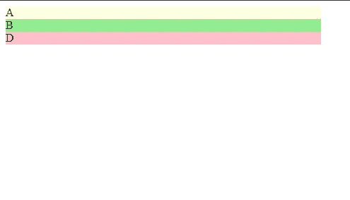

# CSS 网格简单介绍

> 原文：<https://levelup.gitconnected.com/simple-introduction-to-css-grid-31a17922f12>


[兰斯·安德森](https://unsplash.com/@lanceanderson?utm_source=medium&utm_medium=referral)在 [Unsplash](https://unsplash.com?utm_source=medium&utm_medium=referral) 上的照片

CSS grid 让我们可以轻松地用 CSS 创建布局。

这也有利于创建响应式布局，因为我们可以将不同的项目组合在一起。

在本文中，我们将看看如何定义一个网格布局，并使其具有响应性。

# 定义网格布局

我们可以用一些 HTML 和 CSS 定义一个网格布局。

如果我们想定义 4 个 div，其中一个是页眉，一个是左右 div，中间有一个空格，还有一个是页脚，我们可以这样做。

首先，我们添加 HTML:

```
<div class='container'>
  <div class='item-a'>
    A
  </div>
  <div class='item-b'>
    B
  </div>
  <div class='item-c'>
    C
  </div>
  <div class='item-d'>
    D
  </div>
</div>
```

然后我们添加 CSS:

```
.item-a {
  grid-area: header;
  background-color: lightyellow;
}.item-b {
  grid-area: main;
  background-color: lightgreen;
}.item-c {
  grid-area: sidebar;
  background-color: lightblue;
}.item-d {
  grid-area: footer;
  background-color: pink;
}.container {
  display: grid;
  grid-template-columns: 24vw 25vw 25vw 24vw;
  grid-template-rows: auto;
  grid-template-areas:
    "header header header header"
    "main main . sidebar"
    "footer footer footer footer";
}
```

然后我们得到以下结果:


CSS 有以下几个部分。

首先，我们看一下`container`类。这是网格中最重要的部分。

我们有`display: grid;`，它指定带有`container`类的 div 有一个网格布局。

然后我们用`grid-template-columns`定义网格列，我们将它的值设置为`24vw 25vw 25vw 24vw`。

这意味着我们有 4 列，最左边和最右边的列有`24vw`，中间的列有`25vw`。

然后我们有`grid-template-rows: auto;`。我们将其保留为 auto，因为我们不关心行的高度。

为了用`container`类定义网格如何在 div 内部的组件之间共享，我们编写:

```
grid-template-areas:
    "header header header header"
    "main main . sidebar"
    "footer footer footer footer";
```

我们用第一行中的`header`区域填充了第一行。

然后在新行中，我们用`main`区域填充最左边的两列。一个点代表空白区域，而`sidebar`区域代表最右边的列。

在最下面一行，我们让`footer`区域填充整行。

然后我们可以指定具有`item`类别的区域，如下所示:

```
.item-a {
  grid-area: header;
  background-color: lightyellow;
}.item-b {
  grid-area: main;
  background-color: lightgreen;
}.item-c {
  grid-area: sidebar;
  background-color: lightblue;
}.item-d {
  grid-area: footer;
  background-color: pink;
}
```

在上面的代码中，我们用`grid-area`将具有`item-a`类的东西指定为`header`，并设置背景颜色。

这意味着任何具有类`item-a`的都将是填充顶行的`header`。

然后我们对其他 3 个类做同样的事情，所以任何有类`item-b`的都将填充第二行最左边的 2 列。具有类`item-c`的元素填充第二行最右边的列。具有类`item-d`的元素填充所有的底部行。

这就是我们如何定义一个网格布局。


照片由 [Erol Ahmed](https://unsplash.com/@erol?utm_source=medium&utm_medium=referral) 在 [Unsplash](https://unsplash.com?utm_source=medium&utm_medium=referral) 上拍摄

# 响应式布局

我们可以用 CSS 选择器定义一个响应式布局，并为窄屏幕添加一个新的布局。

我们可以定义一个仅显示`header`、`main`和`footer`区域的窄屏幕布局，如下所示:

```
.item-a {
  grid-area: header;
  background-color: lightyellow;
}.item-b {
  grid-area: main;
  background-color: lightgreen;
}.item-c {
  grid-area: sidebar;
  background-color: lightblue;
}.item-d {
  grid-area: footer;
  background-color: pink;
}.container {
  display: grid;
  grid-template-rows: auto;
}[@media](http://twitter.com/media) only screen and (min-width: 751px) {
  .container {
    grid-template-columns: 24vw 25vw 25vw 24vw;
    grid-template-areas:
      "header header header header"
      "main main . sidebar"
      "footer footer footer footer";
  }
}[@media](http://twitter.com/media) only screen and (max-width: 750px) {
  .item-c {
    display: none;
  }.container {
    grid-template-columns: 90vw;
    grid-template-rows: auto;
    grid-template-areas:
      "header"
      "main"
      "footer";
  }
}
```

我们所做的就是当屏幕宽度小于或等于 750 像素时，用类`item-c`隐藏任何东西。否则，我们保持和以前一样的布局。

否则，我们只是稍微移动一下代码以防止重复。

当我们的屏幕变窄时，我们得到



# 结论

使用 CSS 网格，制作布局比以往任何时候都容易。

首先，我们将容器 div 设置为`display: grid`，使其成为网格的容器。

然后我们可以定义布局，用`grid-template-columns`定义列，用`grid-template-rows`定义行。这将形成一个网格。

然后我们设置`grid-template-areas`属性来定义我们的布局，一次一行。

我们可以通过使用 CSS 媒体查询，然后为不同的屏幕尺寸定义不同的布局来扩展这种响应。