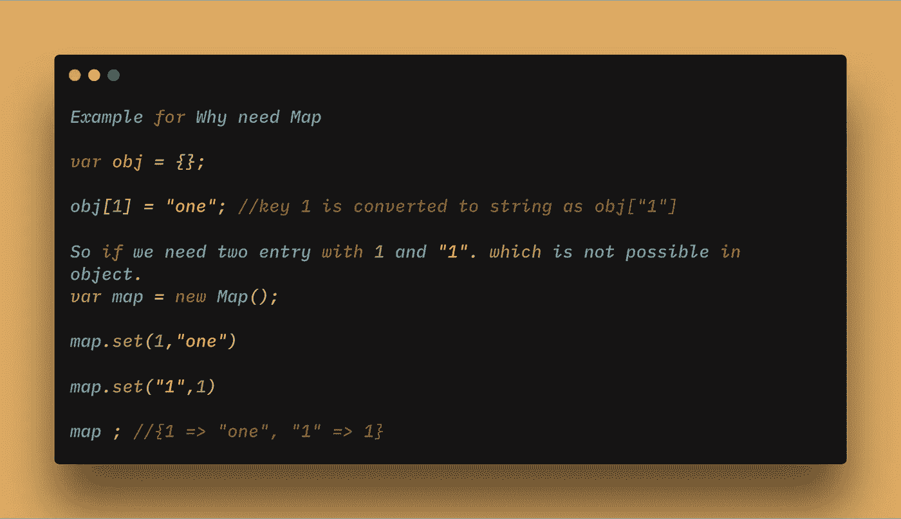
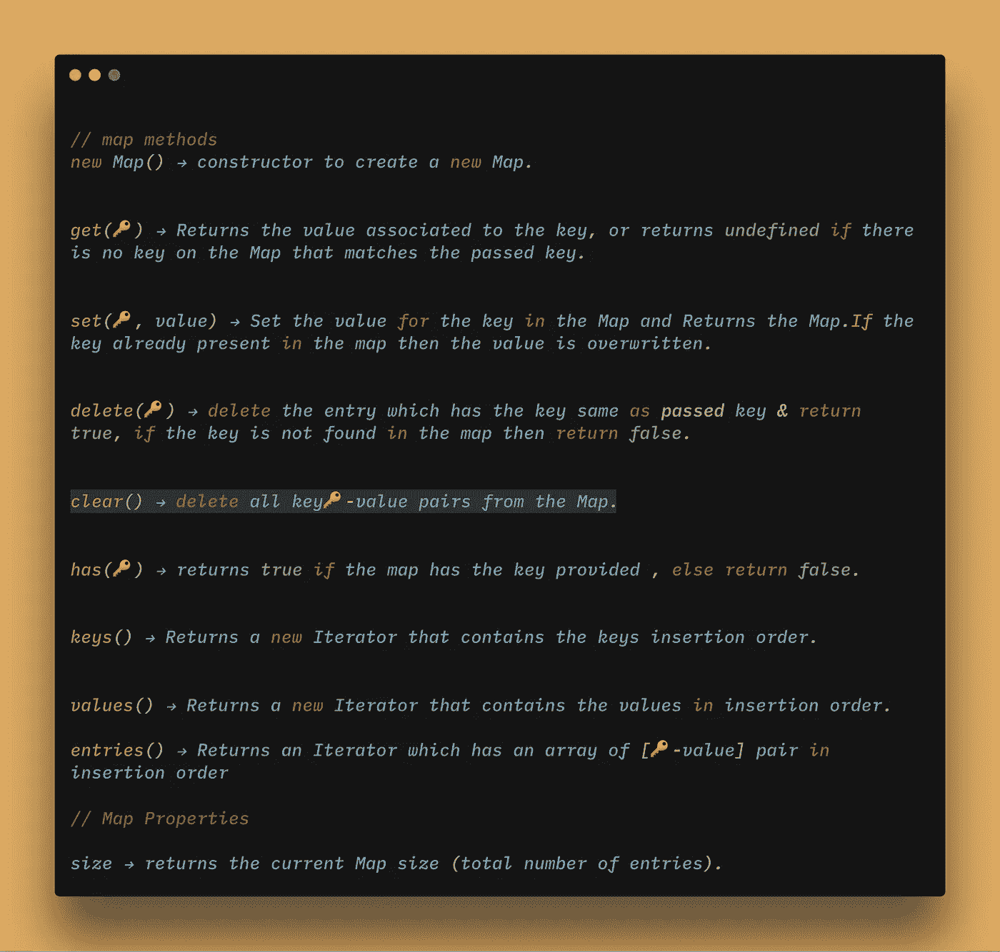
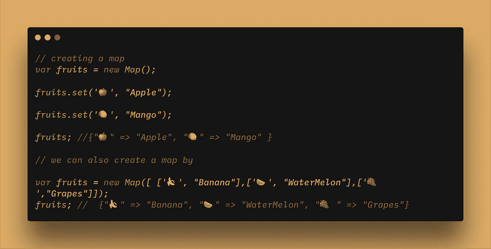

# JavaScript 中 ES6 地图数据结构的简单介绍

> 原文：<https://levelup.gitconnected.com/simple-introduction-to-map-in-javascript-6786034f9154>


一个`Map`是一个`key🔑 — value`对的集合，类似于一个对象。它按照插入顺序存储`key🔑 — value`对。

我们可以通过传递一个 iterable 对象来创建一个`Map`，该对象的元素是`key🔑 — value`(例如`**[ [1,”one”], [2,”two”] ]**`)的形式，或者您可以创建一个空的`Map`，然后插入条目。

## **如果我们有对象，为什么我们需要地图**

1.  映射类似于对象，但是任何值都可以用作映射中的键，但是对象中的键只是字符串和符号



2.`Map`中的 `key🔑 — value`对保持插入顺序，而 Object 不保持。

3.你可以获取`Map`的`size`，但是我们没有内置的方法来获取 Object 中的 size(但是我们可以手动完成)。

4.映射是可迭代的，而默认情况下对象是不可迭代的。

5.贴图具有普通对象不可用的附加方法

## **中的方法**中的`**Maps**`



地图备忘单

示例:

1.  创建地图的不同方法



2.地图方法

让我们创建简单的地图:

```
// **creating a map** 
var fruits = new Map();fruits.set('🍎', "Apple");fruits.set('🍋', "Mango");fruits; //{"🍎" => "Apple", "🍋" => "Mango"}
```

Map 有一个属性`size`，它返回当前的 Map 大小(条目总数)。

```
// sizefruits.size; // 2
```

`**set(🔑, value)**` →设置地图中键的值并返回地图。如果键已经存在于映射中，那么值将被覆盖。

```
// **set(key , value) method**fruits.set( '🍇', "Grapes");fruits; // {"🍎" => "Apple", "🍋" => "Mango", "🍇" => "Grapes"}
```

`**get(🔑)**` →返回与键相关联的值，如果地图上没有与传递的键匹配的键，则返回 undefined。

```
**// get(key)**
fruits.get('🍇'); // GRAPES.fruits.get('🍊'); //undefined.
```

`**delete(🔑)**` →删除与键匹配的条目，返回 true。如果在映射中找不到该键，则返回 false。

```
**// delete(key)**fruits.delete('🍊') //falsefruits.delete('🍇'); // true
```

`**has(🔑)**` →如果地图提供了关键字，则返回 true，否则返回 false。

```
**//HAS(key)**fruits.has('🍇'); // truefruits.has('🍊'); //false
```

`**keys()**` →返回一个新的迭代器，其中包含按插入顺序排列的键。

```
**//keys**fruits.keys() // MapIterator {"🍎", "🍋"}
```

`**values()**` →返回一个新的迭代器，其中包含按插入顺序排列的值。

```
**// values**fruits.values() // MapIterator {"Apple", "Mango"}
```

`**entries()**` →返回一个迭代器，它有一个数组[🔑-value]按插入顺序对。

```
**//entries --> returns key value pair**fruits.entries() // MapIterator {"🍎" => "Apple", "🍋" => "Mango"}
```

`**clear()**` →删除所有键🔑-映射中的值对。

```
**// clear**fruits.clear(); // deletes all elementfruits; // Map(0) {}
```

## 关于地图你应该知道的事情

您可以使用任何值(对象、函数或原语)作为`Map`中的键。`Map`使用 [SameValueZero](https://developer.mozilla.org/en-US/docs/Web/JavaScript/Equality_comparisons_and_sameness#Same-value-zero_equality) 算法。它类似于严格的等式(`===`)，但区别在于`NaN`被认为等于`NaN`(即 NaN === NaN → true。在正常的 JS 中，这是不成立的。在这种情况下，`NaN`可以用作键，我们没有任何重复的 NaN)。

```
var map = new Map()var obj = {};var arr = [];var nan = NaN;var fun = function() {}**map.set(obj, "object");****map.set(arr , "array");****map.set(fun, "function");****map.set(nan, "Wrong number");**map.keys(); // MapIterator {**{…}, Array(0), ƒ, NaN**}map.values(); // **MapIterator {"object", "array", "function","Wrong number"}**
```

## 遍历地图

使用`**for…of**`

```
// **creating a map** 
var fruits = new Map();fruits.set('🍎', "Apple");fruits.set('🍋', "Mango");fruits; //{"🍎" => "Apple", "🍋" => "Mango"}--------------------------------------------------------------------//Method 1:for(**var [key, val] of fruits**) { **console.log(key, value);**}
🍎 Apple
🍋 Mango--------------------------------------------------------------------Method 4 --> using entriesfor (**var [key, val] of fruits.entries()**) { **console.log(key , val);**}🍎 Apple
🍋 Mango--------------------------------------------------------------------
// Method 2 --> using keysfor(**var key of fruits.keys()**) { **console.log(key, fruits.get(key));**}
🍎 Apple
🍋 Mango
--------------------------------------------------------------------
Method 3 --> using valuesfor(**var val of fruits.values()**) { **console.log(val);**}Apple 
Mango
```

如果你发现这个有用的惊喜🎁我这里的[](https://www.paypal.me/jagathishSaravanan)****。****

****开心就分享。****

****跟随** [**Javascript Jeep🚙**](https://medium.com/u/f9ffc26e7e69?source=post_page-----6786034f9154--------------------------------) **如果你觉得值得。****