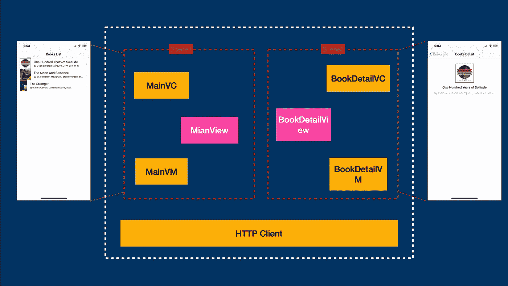
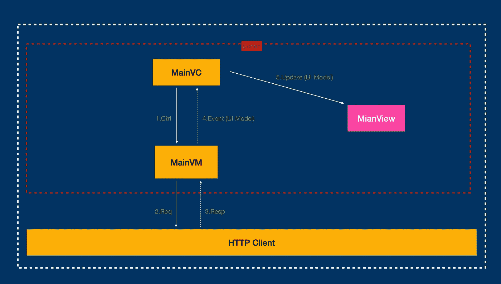
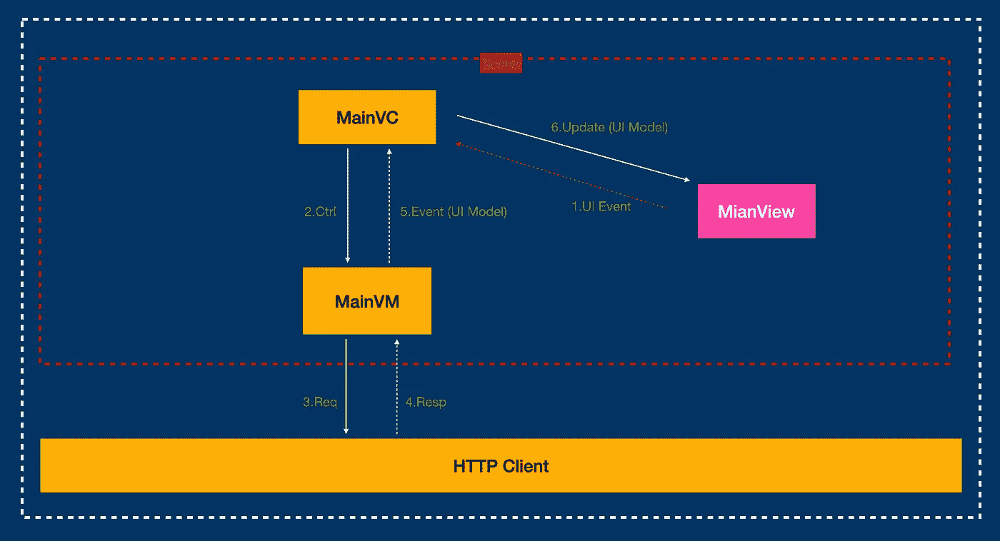

# 改进编码的简单 MVVM

> 原文：<https://levelup.gitconnected.com/simple-mvvm-to-improve-coding-2eb06d0a5e7c>

无束缚，简单，轻便，灵活

由 [Rohit](https://unsplash.com/@romiem?utm_source=medium&utm_medium=referral) 在 [Unsplash](https://unsplash.com?utm_source=medium&utm_medium=referral) 上拍摄的照片

从一个公式开始:

> 程序=数据结构+算法

将数据作为输入、处理数据并在视图上显示数据的程序。

在这个故事中，我分享了如何在项目中实现 MVVM。这是我在几个项目中总结出来的。看完这个故事你可以知道:**一个简单的 MVVM 是如何实现的。**在故事的结尾，有一个源代码的链接。

*重要:这个故事可能比较主观，希望大家可以参考一下。*

demo 的作用是什么？

它可以:

*   显示图书列表
*   显示图书详细信息
*   删除图书

它需要 2 页:

*   MainVC 负责显示图书列表
*   BookDetailVC 负责显示图书的详细信息

这两个页面都将使用 MVVM 组织，但我将主要关注 MainVC 页面。

示例代码主要通过 HTTP 请求获取书籍相关的信息，然后显示在页面上。

这是应用程序的整体架构:

显示图书列表的事件流:

1.  当`MainVC`收到系统事件`ViewDidLoad`时，调用`MainVM`；
2.  `MainVM`打电话给`HTTPClient`获取图书清单；
3.  `HTTPClient`通过网络请求数据并将其返回给`MainVM`
4.  原始数据经过`MainVM`处理后，会生成适合 UI 显示的数据；
5.  在`View`上更新和显示数据

这里有一个非常重要的数据转换，`MainVM`将原始数据转换成适合视图显示的数据。(在源代码中，从`HttpClient.Book`到`MainView.Info`)

同样，用户点击屏幕的事件也可以是这样的(删书):

`MainVM`负责将`View Events`转换为外部发起的请求事件。最后更新视图。

**您可以在源代码中获得更多详细信息:** [代码链接](https://github.com/zhuyuping/SimpleMVVM)

总结:

*   `Model`:存储各种形式的数据，像一个盒子。
*   `View`:像电脑显示器一样显示和互动
*   `VC`:顶级业务控制，拥有`View`和`VM`
*   `VM`:帮助`VC`搬运重物，数据处理，将原始数据转换成适合视图显示的数据。()

它们之间的通信通过直接调用方法和`delegate`回调来完成。不再需要事件流绑定，也不需要依赖反应式编程库。`View`和`VM`互不依赖。这种模式水平扩展。

我把这种模式称为简单 MVVM，它有以下优点:

1.  简单。这就像是 MVC 的一个超集。开发者沟通更容易；
2.  轻量级，低门槛。没有绑定操作。无需学习 RxSwift
3.  要灵活。`Views`可以重复使用。`VM`可重复使用；

# 请跟我来。让我们在接下来的帖子中见面。

在我之前的故事中，我介绍了一些 swift 技巧和代码简单性的建议:

1.  [**迅捷:让代码更迅捷的 6 个小技巧**](/swift-6-tips-to-make-code-more-swift-a8ff9f8fd919?source=your_stories_page-------------------------------------)
2.  [**改进 Swift 编码的 6 个技巧**](/6-tips-to-improve-coding-of-swift-1498bcc45f63)
3.  [**12 招使迅捷少码**](/12-tips-to-make-swift-more-concise-4f4ed63f3063)
4.  [**Swift:提高代码质量的几个技巧**](/swift-a-few-tips-for-improving-code-quality-ae39c1220c9)

其他故事:

1.  [**IOS 还是 IOS？**](https://medium.com/@zhuyp/ios-or-ios-7c7d23905c35)
2.  [**Swift 提示:函数**](https://medium.com/@zhuyp/tip-for-swift-from-async-to-sync-in-function-1-c1337f0d60b3) 中从异步到同步
3.  [**UICollectionView:经常出现的错误**](https://medium.com/@zhuyp/uicollectionview-an-error-that-often-occurs-a494ca70fc4b)
4.  [**App 中的简单错误系统**](https://medium.com/@zhuyp/simple-error-system-in-app-f72278168634)

> ***关于我:*** *我是 iOS 的开发者，曾经在 XAG 工作。现在我想在 medium 上分享故事，总结自己的经验来帮助别人。如果你有任何问题，请给我反馈，我会积极给你我的答复。*