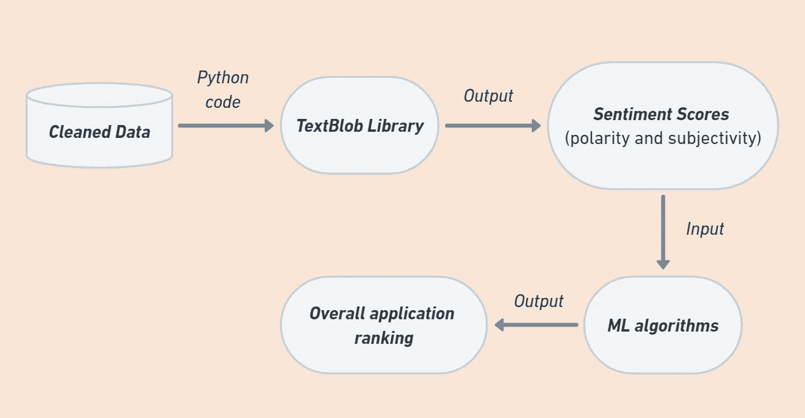

# Python 中的简单 NLP

> 原文：<https://levelup.gitconnected.com/simple-nlp-in-python-2cb3243239d3>

## 使用 TextBlob 进行情感分析


照片由[克里斯蒂娜·莫里洛](https://www.pexels.com/photo/woman-programming-on-a-notebook-1181359/)在[的像素](https://www.pexels.com/)上拍摄

CNLP 领域目前的成果为我们提供了能够在不同层面上分析自然语言的工具:从 [*单词*](https://medium.com/quick-code/simple-nlp-in-python-c73ef0dfc6) 和 [*文本*](/simple-nlp-in-python-f5196db63aff) 切分到对隐藏在静态单词背后的情绪的实际理解，称为情感分类方法。

尽管如此，一些方法的复杂性并不必然意味着您应该在编程方面非常先进，以便在 Python 中实现高级任务，如情感分析。

# 情感分析

> 情感分析集中于区分文本语料库中的观点、态度甚至表情符号。

因此，定义的情感的范围从一种方法到另一种方法有很大的不同。虽然标准分析仪可以确定多达三种基本极性情绪(*积极、消极、中性*)，但精细模型的限制要广泛得多。

因此，他们可以超越极性，确定六种“普遍的”情绪，如愤怒、厌恶、恐惧、快乐、悲伤和惊喜 T21。


[腾雅特](https://unsplash.com/@tengyart?utm_source=medium&utm_medium=referral)在 [Unsplash](https://unsplash.com?utm_source=medium&utm_medium=referral) 上拍照

此外，根据您正在处理的任务，还可以从上下文中收集额外的信息，如作者或主题。这些数据有助于避免更复杂的问题，而不仅仅是进一步分析中通常的极性分类——即，主观性/客观性识别。

比如，让我们从一个 [*商业内幕*](https://www.businessinsider.com/elon-musk-says-some-tweets-were-extremely-dumb-2020-5?r=US&IR=T) 中取出这句话

> 今年 3 月，埃隆·马斯克(Elon Musk)将对冠状病毒爆发的担忧描述为“恐慌”和“愚蠢”，此后他在推特上发布了不正确的信息，如他的理论，即儿童对病毒“基本免疫”。

正如你所看到的，这里的主观性是通过马斯克和本文作者的个人观点来表达的。

# TextBlob 包

T[TextBlob](https://textblob.readthedocs.io/en/dev/)包的优势在于其基于规则的性质:为了进行情感分析，text blob 需要一组预定义的分类单词，例如，可以从 [NLTK 数据库](https://www.nltk.org/howto/data.html)中下载。

此外，基于语义关系和每个单词在输入句子中的频率来确定情感，结果允许更准确的输出。

一旦第一步完成，并且 Python 模型被输入了必要的输入数据，用户就会收到上面已经提到的以*极性*和*主观性*形式的情感分数。我们可以在下图中看到这个过程是如何工作的:



作者制作的图表

TextBlob 对于**极性**任务的输出是范围`[-1.0, 1.0]`内的浮点数，其中

*   `-1.0`为负值
*   `1.0`是正极性
*   这个分数也可以等于`0`，它代表对语句的中性评估，因为它不包含来自训练集的任何单词。

而**主观性/客观性**识别任务报告范围`[0.0, 1.0]`内的浮动

*   `0.0`很客观
*   `1.0`是一个非常主观的句子

Python 与 TextBlob 情感分析器的交互有多种示例:从基于不同 [Kaggle](https://www.kaggle.com/) 数据集(例如电影评论)的模型开始，到通过 Twitter API 计算推文情感。

# 如何建立一个情感分析器

让我们来看一个简单的分析器，我们可以将它应用于一个特定的句子或一个短文本。我们首先从导入 TextBlob 库开始:

```
*# Importing TextBlob* from textblob import TextBlob
```

导入后，让我们加载一个句子进行分析，并实例化一个`TextBlob`对象，同时将`sentiment`属性分配给我们自己的`analysis`:

```
# Preparing an input sentencesentence = '''The platform provides universal access to the world's best education, partnering with top universities and organizations to offer courses online.'''# Creating a textblob object and assigning the sentiment propertyanalysis = TextBlob(sentence).sentiment
print(analysis)
```

**注意**的`sentiment`属性是`Sentiment(polarity, subjectivity)`形式的`namedtuple`。

其中，分析的预期输出为:

```
Sentiment(polarity=0.5, subjectivity=0.26666666666666666)
```

如果您只对两个指标中的一个感兴趣，也可以通过简单地执行以下命令来分别获得结果:

```
from textblob import TextBlob# Preparing an input sentence
sentence = '''The platform provides universal access to the world's best education, partnering with top universities and organizations to offer courses online.'''analysisPol = TextBlob(sentence).polarity
analysisSub = TextBlob(sentence).subjectivityprint(analysisPol)
print(analysisSub)
```

这将给出我们的输出:

```
0.5
0.26666666666666666
```

TextBlob 的一大优点是它允许用户选择算法来实现高级 NLP 任务:

*   `PatternAnalyzer` -基于模式库的默认分类器
*   `NaiveBayesAnalyzer` -在电影评论语料库上训练的 NLTK 模型

要更改默认设置，我们只需在代码中指定一个`NaiveBayes`分析器。

## 从实践到实际数据

让我们对直接来自 [Twitter](https://twitter.com/) 的推文进行情感分析:

```
from textblob import TextBlob# For parsing tweets
import tweepy# Importing the NaiveBayesAnalyzer classifier from NLTK
from textblob.sentiments import NaiveBayesAnalyzer
```

之后，我们需要通过 API keys(可以通过一个 [*开发者账号*](https://developer.twitter.com/en) )建立与 Twitter API 的连接:

```
# Uploading api keys and tokens
api_key = 'XXXXXXXXXXXXXXX'
api_secret = 'XXXXXXXXXXXXXXX'
access_token = 'XXXXXXXXXXXXXXX'
access_secret = 'XXXXXXXXXXXXXXX'# Establishing the connection
twitter = tweepy.OAuthHandler(api_key, api_secret)
api = tweepy.API(twitter)
```

现在，我们可以对任何话题的推文进行分析。被搜索的单词(例如*锁定*)可以是一个或多个单词。由于大量的推文，这项任务可能非常耗时，因此强烈建议限制输出:

```
# This command will call back 5 tweets within a “lockdown” topiccorpus_tweets = api.search("lockdown", count=5) 
for tweet in corpus_tweets:
    print(tweet.text)
```

这最后一段代码的输出将返回五条 tweets，以下面的形式提到您搜索的单词:

```
RT[@DhwaniPandya](http://twitter.com/DhwaniPandya): How Asia's densest slum contained the virus and the economic catastrophe that stares at the hardworking slum population...
```

本例中的最后一步是将默认模型切换到 NLTK 分析器，该分析器将结果作为形式为`Sentiment(classification, p_pos, p_neg)`的`namedtuple`返回:

```
# Applying the NaiveBayesAnalyzer
blob_object = TextBlob(tweet.text, analyzer=NaiveBayesAnalyzer())# Running sentiment analysis
analysis = blob_object.sentiment
print(analysis)
```

最后，我们的 Python 模型将为我们提供以下情感评估:

```
Sentiment(classification='pos', p_pos=0.5057908299783777, p_neg=0.49420917002162196)
```

在这里，它被归类为*积极*情绪，其中`p_pos`和`p_neg`值分别为~ `0.5`。

# 结论

在本文中，我们不仅介绍了情感分析的基础知识，还通过使用 TextBlob 包完成了构建实际分析器的教程。

TextBlob 是一个用于解决 NLP 挑战的强大库，因为它提供了一个简单的 API，让用户可以快速执行 NLP 任务。

如果你喜欢阅读这样的故事，并想支持我成为一名作家，可以考虑[注册成为一名媒体会员](https://medium.com/@natalia.kzm/membership)。每月 5 美元，你可以无限制地阅读媒体上的故事。如果你用我的链接注册，我会赚一小笔佣金。

当我创作内容的时候，你也可以给我买杯咖啡来支持我的不眠之夜。

# 相关文章:

在下面的文章中，您可以通过 TextBlob 包探索进一步的文本分析，并了解标记化和 N 元语法检测方法:

[](https://medium.com/quick-code/simple-nlp-in-python-c73ef0dfc6) [## Python 中的简单 NLP

### 使用 TextBlob 包进行标记化

medium.com](https://medium.com/quick-code/simple-nlp-in-python-c73ef0dfc6) [](/simple-nlp-in-python-f5196db63aff) [## Python 中的简单 NLP

### 使用 TextBlob 包的 n 元文法检测

levelup.gitconnected.com](/simple-nlp-in-python-f5196db63aff) 

# 分级编码

感谢您成为我们社区的一员！在你离开之前:

*   👏为故事鼓掌，跟着作者走👉
*   📰查看[级编码出版物](https://levelup.gitconnected.com/?utm_source=pub&utm_medium=post)中的更多内容
*   🔔关注我们:[推特](https://twitter.com/gitconnected) | [LinkedIn](https://www.linkedin.com/company/gitconnected) | [时事通讯](https://newsletter.levelup.dev)

🚀👉 [**加入升级人才集体，找到一份惊艳的工作**](https://jobs.levelup.dev/talent/welcome?referral=true)