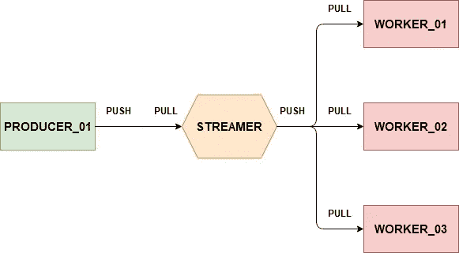

# 带有 ZeroMQ 和 Docker 容器的简单并行消息传递管道

> 原文：<https://levelup.gitconnected.com/simple-parallelized-messaging-pipeline-with-zeromq-and-docker-containers-5d6ea18aa659>



你可能是一名跟踪工程师/开发人员，正在为如何扩展你的机器学习微服务管道而挠头。您可能读过一篇关于使用流设备进行并行管道消息传递的文章[1]，但不知道如何测试源代码或扩展到多个服务。本文对知识进行了扩展，并试图填补知识空白。

您计划的机器学习微服务管道可能涉及多个需要相应扩展的服务。这可能包括一个服务，它并行地为多个工作服务生成数据。本文解释了相关的技术、一些源代码和程序的输出。

**GitHub 储存库**:[https://GitHub . com/leonardyoexl/parallelised-Pipeline-Messaging-using-ZeroMQ-and-Docker-containers . git](https://github.com/leonardyeoxl/Parallelized-Pipeline-Messaging-using-ZeroMQ-and-Docker-Containers.git)

[](https://www.eduelk.com/) [## 教育

### 通过我们的练习题为您的下一次技术认证考试树立信心。我们提供课程来加速…

www.eduelk.com](https://www.eduelk.com/) [](https://www.eduelk.com/about-us) [## 关于我们-教育

### 在爱德克教育，我们相信熟能生巧。我们知道准备参加技术认证是…

www.eduelk.com](https://www.eduelk.com/about-us) [](https://www.eduelk.com/shop-for-practice-questions) [## 通过我们负担得起的练习题获得自信——教育

### 编辑描述

www.eduelk.com](https://www.eduelk.com/shop-for-practice-questions) [](https://www.eduelk.com/book-a-lesson) [## 联系方式 1 -教育

### 编辑描述

www.eduelk.com](https://www.eduelk.com/book-a-lesson) 

# 技术

该计划涉及的技术如下:

*   码头工人
*   Docker 撰写
*   计算机编程语言
*   零 MQ

# 码头工人

该程序依靠 docker 和 docker compose 来封装微服务。

## Dockerfile 文件

```
FROM python:3.6-slim

WORKDIR /app
COPY requirements.txt .
COPY device_bind.sh .
RUN chmod +x device_bind.sh
RUN pip install -r requirements.txt
```

## requirements.txt

```
pyzmq==19.0.2
```

## Docker 撰写

```
version: "2"
services:
  device:
    build: .
    environment:
      - ZMQ_PRODUCER_DEVICE_ADDRESS=tcp://*:5559
      - ZMQ_WORKER_DEVICE_ADDRESS=tcp://*:5560
      - ZMQ_WORKER_SENDER_DEVICE_ADDRESS=tcp://*:5562
      - ZMQ_END_OF_PIPELINE_RECIEVER_DEVICE_ADDRESS=tcp://*:5563
    volumes:
      - $PWD:/app/
    command: "./device_bind.sh"
    tty: true
  producer:
    build: .
    environment:
      - ZMQ_PRODUCER_ADDRESS=tcp://device:5559
    volumes:
      - $PWD:/app/
    command: "python task_producer.py"
    tty: true
  worker:
    build: .
    environment:
      - ZMQ_WORKER_ADDRESS=tcp://device:5560
      - ZMQ_WORKER_TO_END_OF_PIPELINE_ADDRESS=tcp://device:5562
    volumes:
      - $PWD:/app/
    command: "python task_worker.py"
    tty: true
  end_of_pipeline:
    build: .
    environment:
      - ZMQ_END_OF_PIPELINE_ADDRESS=tcp://device:5563
    volumes:
      - $PWD:/app/
    command: "python task_end_of_pipeline.py"
    tty: true
```

这里，4 个主要服务是设备、生产者、工人和管道末端。每个服务都是卷装载的，并且有各自的环境变量。

# 生产者

```
import time
import zmq
import os

def producer():
    ZMQ_PRODUCER_ADDRESS = os.environ["ZMQ_PRODUCER_ADDRESS"]
    context = zmq.Context()
    zmq_socket = context.socket(zmq.PUSH)
    zmq_socket.connect(ZMQ_PRODUCER_ADDRESS)

    for num in range(20000):
        work_message = { 'num' : num }
        zmq_socket.send_json(work_message)
        time.sleep(1)

producer()
```

生产者服务执行推送方法来向流设备发送数据。

# 流光设备 01

```
import zmq
import osdef main():
    ZMQ_PRODUCER_DEVICE_ADDRESS = os.environ["ZMQ_PRODUCER_DEVICE_ADDRESS"]
    ZMQ_WORKER_DEVICE_ADDRESS = os.environ["ZMQ_WORKER_DEVICE_ADDRESS"] try:
        context = zmq.Context(1)
        # Socket facing clients
        producer = context.socket(zmq.PULL)
        producer.bind(ZMQ_PRODUCER_DEVICE_ADDRESS)

        # Socket facing services
        worker = context.socket(zmq.PUSH)
        worker.bind(ZMQ_WORKER_DEVICE_ADDRESS) zmq.device(zmq.STREAMER, producer, worker)
    except Exception as e:
        print(e)
        print("bringing down zmq device")
    finally:
        pass
        producer.close()
        worker.close()
        context.term()if __name__ == "__main__":
    main()
```

这个流设备通过它们各自的 IP 地址和端口连接生产者和工作者服务。

# 工人

```
import sys
import time
import zmq
import random
import os

def worker():
    ZMQ_WORKER_ADDRESS = os.environ["ZMQ_WORKER_ADDRESS"]
    ZMQ_WORKER_TO_END_OF_PIPELINE_ADDRESS = os.environ["ZMQ_WORKER_TO_END_OF_PIPELINE_ADDRESS"]
    worker_id = random.randrange(1,10005)
    print("I am worker #{}".format(worker_id))

    context = zmq.Context()
    # receive work
    worker_receiver = context.socket(zmq.PULL)
    worker_receiver.connect(ZMQ_WORKER_ADDRESS)

    # send work
    worker_sender = context.socket(zmq.PUSH)
    worker_sender.connect(ZMQ_WORKER_TO_END_OF_PIPELINE_ADDRESS)

    while True:
        work = worker_receiver.recv_json()
        data = work['num']
        result = { 'worker' : worker_id, 'num' : data }
        print(result)
        worker_sender.send_json(result)

worker()
```

工作者服务从流播设备 01 拉出数据，并将数据推送到流播设备 02

# 流光设备 02

```
import zmq
import osdef main():
    ZMQ_WORKER_SENDER_DEVICE_ADDRESS = os.environ["ZMQ_WORKER_SENDER_DEVICE_ADDRESS"]
    ZMQ_END_OF_PIPELINE_RECIEVER_DEVICE_ADDRESS = os.environ["ZMQ_END_OF_PIPELINE_RECIEVER_DEVICE_ADDRESS"] try:
        context = zmq.Context(1) worker_sender = context.socket(zmq.PULL)
        worker_sender.bind(ZMQ_WORKER_SENDER_DEVICE_ADDRESS) end_of_pipeline_reciever = context.socket(zmq.PUSH)
        end_of_pipeline_reciever.bind(ZMQ_END_OF_PIPELINE_RECIEVER_DEVICE_ADDRESS)

        zmq.device(zmq.STREAMER, worker_sender, end_of_pipeline_reciever)
    except Exception as e:
        print(e)
        print("bringing down zmq device")
    finally:
        pass
        worker_sender.close()
        end_of_pipeline_reciever.close()
        context.term()if __name__ == "__main__":
    main()
```

这里，流设备 02 通过它们各自的 IP 地址和端口连接工作者和流水线服务的末端。

# 管道末端

```
import sys
import time
import zmq
import random
import os

def end_of_pipeline():
    ZMQ_END_OF_PIPELINE_ADDRESS = os.environ["ZMQ_END_OF_PIPELINE_ADDRESS"]
    end_of_pipeline_id = random.randrange(1,10005)
    print("I am end #{}".format(end_of_pipeline_id))

    context = zmq.Context()
    # receive work
    end_of_pipeline_receiver = context.socket(zmq.PULL)
    end_of_pipeline_receiver.connect(ZMQ_END_OF_PIPELINE_ADDRESS)

    while True:
        work = end_of_pipeline_receiver.recv_json()
        data = work['num']
        worker_id = work['worker']
        result = { 'end_of_pipeline_id' : end_of_pipeline_id, 'worker_id': worker_id, 'num' : data}
        print(result)

end_of_pipeline()
```

流水线服务的结束从流设备 02 拉出数据。

# 命令过程

```
#!/bin/bash
echo "running streamer device 1"
python streamer_device1.py &
echo "running streamer device 2"
python streamer_device2.py &
while true; do sleep 1; done
```

该外壳脚本允许流设备 01 和流设备 02 脚本在后台运行，并执行连续循环以防止流设备服务退出。

# 输出

## 规模工人

在这里，工作人员扩展到 2 个工作人员服务。

```
~/zmq-docker-streamer$ docker-compose scale worker=2
Creating and starting zmqdockerstreamer_worker_1 ... done
Creating and starting zmqdockerstreamer_worker_2 ... done
```

## 运行 Docker 撰写

运行 docker compose 将启动容器服务，管道也将运行。

```
~/zmq-docker-streamer$ docker-compose up
Starting zmqdockerstreamer_producer_1
Starting zmqdockerstreamer_device_1
Starting zmqdockerstreamer_end_of_pipeline_1
zmqdockerstreamer_worker_2 is up-to-date
zmqdockerstreamer_worker_1 is up-to-date
Attaching to zmqdockerstreamer_worker_2, zmqdockerstreamer_worker_1, zmqdockerstreamer_producer_1, zmqdockerstreamer_end_of_pipeline_1, zmqdockerstreamer_device_1
worker_2           | I am worker #2198
device_1           | running streamer device 1
device_1           | running streamer device 2
worker_1           | I am consumer #1259
end_of_pipeline_1  | I am end #4027
worker_1           | {'worker': 9001, 'num': 7}
end_of_pipeline_1  | {'end_of_pipeline_id': 4027, 'worker_id': 9001, 'num': 7}
worker_1           | {'worker': 9001, 'num': 8}
end_of_pipeline_1  | {'end_of_pipeline_id': 4027, 'worker_id': 9001, 'num': 8}
worker_2           | {'worker': 2198, 'num': 9}
end_of_pipeline_1  | {'end_of_pipeline_id': 4027, 'worker_id': 2198, 'num': 9}
worker_1           | {'worker': 9001, 'num': 10}
end_of_pipeline_1  | {'end_of_pipeline_id': 4027, 'worker_id': 9001, 'num': 10}
worker_2           | {'worker': 2198, 'num': 11}
end_of_pipeline_1  | {'end_of_pipeline_id': 4027, 'worker_id': 2198, 'num': 11}
worker_1           | {'worker': 9001, 'num': 12}
end_of_pipeline_1  | {'end_of_pipeline_id': 4027, 'worker_id': 9001, 'num': 12}
worker_2           | {'worker': 2198, 'num': 13}
end_of_pipeline_1  | {'end_of_pipeline_id': 4027, 'worker_id': 2198, 'num': 13}
worker_1           | {'worker': 9001, 'num': 14}
end_of_pipeline_1  | {'end_of_pipeline_id': 4027, 'worker_id': 9001, 'num': 14}
worker_2           | {'worker': 2198, 'num': 15}
end_of_pipeline_1  | {'end_of_pipeline_id': 4027, 'worker_id': 2198, 'num': 15}
worker_1           | {'worker': 9001, 'num': 16}
end_of_pipeline_1  | {'end_of_pipeline_id': 4027, 'worker_id': 9001, 'num': 16}
```

# 结论

我希望这篇文章能够澄清您在使用 Python 和 ZeroMQ/ZMQ 开发管道时可能会遇到的一些困难。如果这篇文章对你有帮助，不要忘了鼓掌，并关注即将到来的文章。谢谢你。和平✌️

[](https://www.eduelk.com/) [## 教育

### 通过我们的练习题为您的下一次技术认证考试树立信心。我们提供课程来加速…

www.eduelk.com](https://www.eduelk.com/) [](https://www.eduelk.com/about-us) [## 关于我们-教育

### 在爱德克教育，我们相信熟能生巧。我们知道准备参加技术认证是…

www.eduelk.com](https://www.eduelk.com/about-us) [](https://www.eduelk.com/shop-for-practice-questions) [## 通过我们负担得起的练习题获得自信——教育

### 编辑描述

www.eduelk.com](https://www.eduelk.com/shop-for-practice-questions) [](https://www.eduelk.com/book-a-lesson) [## 联系方式 1 -教育

### 编辑描述

www.eduelk.com](https://www.eduelk.com/book-a-lesson) 

# 参考

1.  [https://learning-0mq-with-pyzmq . readthedocs . io/en/latest/pyzmq/devices/streamer . html](https://learning-0mq-with-pyzmq.readthedocs.io/en/latest/pyzmq/devices/streamer.html)