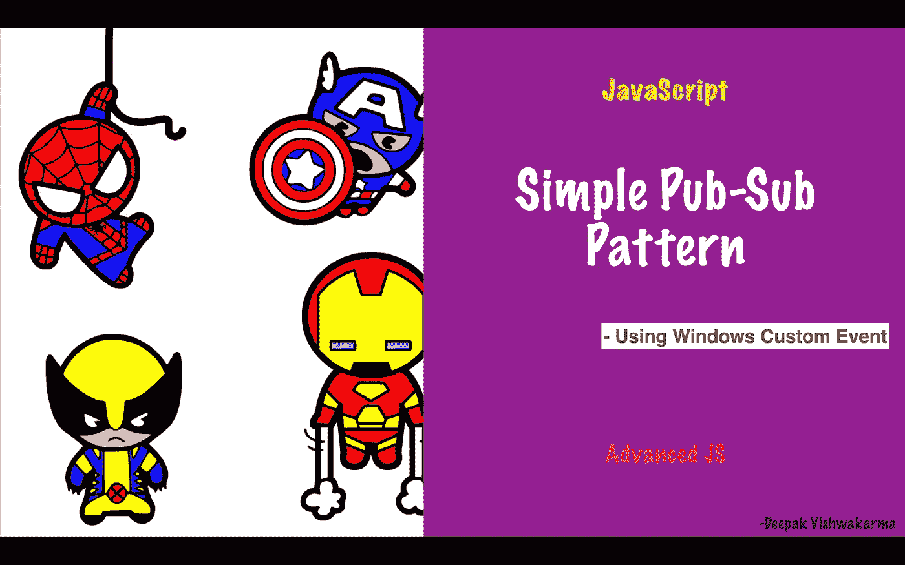

# 使用 Windows 自定义事件| JavaScript 的简单发布-订阅模式

> 原文：<https://levelup.gitconnected.com/simple-pub-sub-pattern-using-windows-custom-event-219b2883069>



[https://www.pinterest.com/pin/572872015086305665/](https://www.pinterest.com/pin/572872015086305665/)

在开发 Web 应用程序时，您可能会遇到这样的情况:您确实需要一个**发布-订阅**设计模式来发送和接收消息。你总是可以使用一些外部模块。然而，在这篇博客中，我将分享如何使用简单的 JavaScript 在几行代码中快速构建**发布-订阅**设计模式。

你可能会想，当我可以简单地使用 **window.addEventListener** 注册一个函数时，为什么我需要阅读这篇文章。是的，你是正确的。如果您有一个很少自定义事件的小应用程序，那么您根本不需要阅读这篇文章。本文将帮助您构建一个小型的可重用模块，该模块定义了一种清晰简洁的方法来注册和注销事件侦听器。

# **1。创建一个模块**

您可以用一些导出的方法创建一个简单的文件。

```
// src/EventManager.jsconst register = (type, fn) => {};const unregister = (id) => {};const emit = (type, detail) => {};const unregisterAll = () => {};export { emit, register, unregister, unregisterAll };
```

# 2.实现 Register 方法

**寄存器**方法将非常简单。需要注册事件的**类型**，并调用相应的**函数**。

```
const functionMapper = new Map();const register = (type, fn) => {
  const id = `${type}__${Date.now()}__${Math.floor(Math.random() * 1000)}`;
  functionMapper.set(id, { type, fn });
  window.addEventListener(type, fn);
};
```

在上面这里，我添加了一个带有**类型**和**功能**的窗口事件监听器。如果你注意到了，我正在生成一个唯一的 id。这对于查找未注册的方法非常有用。我还在**函数映射器**中保存了 id 到函数的映射。

# 3.实现取消注册方法

**unregister** 方法将获取一个 id，即已注册方法的 Id。首先，它将使用**window . removeeventlistener**删除事件监听器。稍后，它将从 **functionMapper 中删除函数到 id 的映射。**

```
const unregister = (id) => {
  if (functionMapper.has(id)) {
    const { type, fn } = functionMapper.get(id);
    window.removeEventListener(type, fn);
    functionMapper.delete(id);
  }
};
```

现在，既然我们有了**注销**的方法。我们也可以在注册函数时返回 unregister。

```
const register = (type, fn) => {
  // ...
  window.addEventListener(type, fn);
  **return unregister.bind(this, id);**
};
```

# 4.实现发出方法

在 emit 方法中，它将使用 **CustomEvent** 创建一个自定义事件，并使用 **window.dispatchEvent** 调度它。

```
const emit = (type, detail) => {
  window.dispatchEvent(new CustomEvent(type, { detail }));
};
```

# 5.最后一试

因为我们有所有需要的方法。我们可以在基本的 HTML 上试试。为此，让我们创建一个基本的 HTML

```
<!-- // index.html --><!DOCTYPE html>
<html>
  <head>
    <title>Parcel Sandbox</title>
    <meta charset="UTF-8" />
  </head>
  <body>
    <div class="log"></div>
    <script src="src/index.js"></script>
  </body>
</html>
```

接下来，让我们创建 **index.js** 来测试我们的库

```
//index.jsimport { emit, register } from "./EventManager";
const log = (message) => {
  document.querySelector(".log").innerHTML = `${document.querySelector(".log").innerHTML}<span>${JSON.stringify(
    message
  )}</span><br/>`;
};
const timePrintUnsubscribe = register("time", () => {
  log(`Time: ${new Date()}`);
});register("stop-emit", () => {
  timePrintUnsubscribe();
});setInterval(() => {
  emit("time");
}, 100);setTimeout(() => {
  emit("stop-emit");
}, 1000);
```

**输出:**

```
"Time: Fri May 20 2022 22:48:15 GMT+0800 (Singapore Standard Time)"
"Time: Fri May 20 2022 22:48:15 GMT+0800 (Singapore Standard Time)"
"Time: Fri May 20 2022 22:48:15 GMT+0800 (Singapore Standard Time)"
"Time: Fri May 20 2022 22:48:15 GMT+0800 (Singapore Standard Time)"
"Time: Fri May 20 2022 22:48:15 GMT+0800 (Singapore Standard Time)"
"Time: Fri May 20 2022 22:48:15 GMT+0800 (Singapore Standard Time)"
"Time: Fri May 20 2022 22:48:15 GMT+0800 (Singapore Standard Time)"
"Time: Fri May 20 2022 22:48:16 GMT+0800 (Singapore Standard Time)"
"Time: Fri May 20 2022 22:48:16 GMT+0800 (Singapore Standard Time)"
```

如果你注意到，事件“时间”将在 100 英里的间隔触发。这将在 DOM 上记录一条消息。1000 英里后，将发出另一个超时**，将触发“停止发射”**，并取消注册**“时间”**事件回调。

**注意:** Log 只是一个在 DOM 上打印日志的基本实用函数。

# 6.结论

正如你所看到的，使用 **timePrintUnsubscribe** 方法可以方便地取消注册**“time”**事件回调。调用**寄存器**方法返回。只需添加一个地图就可以解决携带方法引用的问题。作为奖励，你还可以创建一个 **unregisterAll** 方法。

```
const unregisterAll = (filter = () => true) => {
  for (let [id, data] of functionMapper) {
    if (filter(data)) {
      window.removeEventListener(data.type, data.fn);
      functionMapper.delete(id);
    }
  }
};
```

现在，您可以通过 filter 函数取消注册所有方法。默认情况下，它将删除所有寄存器功能。

## 源代码:

完整的解决方案可以在 **codesandbox** 找到。