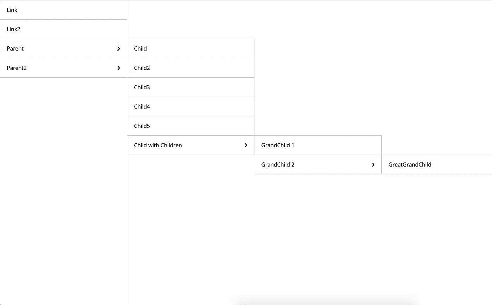
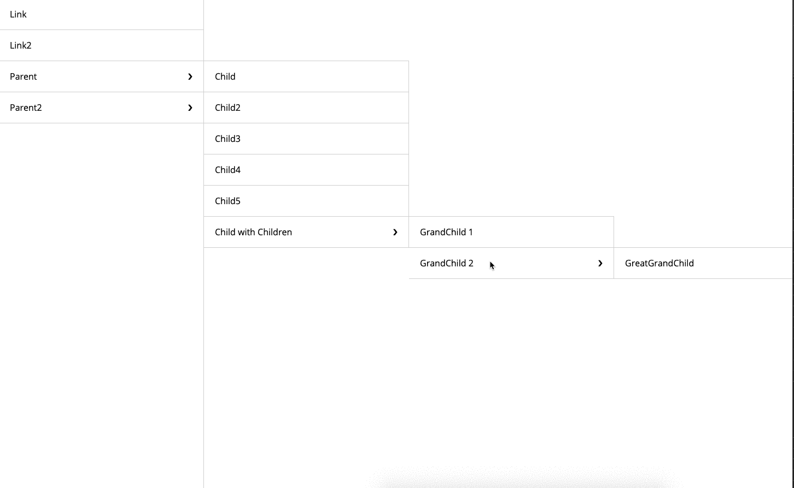

# React 中的简单递归导航

> 原文：<https://levelup.gitconnected.com/simple-recursive-navigation-in-react-511d0a013ae4>


照片由[Tine ivani](https://unsplash.com/@tine999?utm_source=medium&utm_medium=referral)在 [Unsplash](https://unsplash.com?utm_source=medium&utm_medium=referral) 上拍摄

在你创建的任何网站中，导航可能是你最常看到的东西(否则你的用户如何在网站中导航？).此外，如果你的导航结构有一个层次结构，很明显递归可能是你的解决方案。

首先，什么是递归？**JavaScript 中的 Googles 递归**

> 递归函数是一个[函数](https://www.javascripttutorial.net/javascript-function/)，它调用自己直到它不调用为止。这种技术叫做递归。
> [https://www . JavaScript tutorial . net/JavaScript-recursive-function/](https://www.javascripttutorial.net/javascript-recursive-function/)

## 源代码可以在这里查看

很好，现在这个问题已经解决了，让我们来看看我们的导航数据可能是什么样子，它可能会受益于递归。

[https://github.com/bautistaaa/react-recursive-nav](https://github.com/bautistaaa/react-recursive-nav)

注意`links`数组中物体的形状。我们称每个对象为`link`。

一个`link`可以有两种形状:

*   `label`和`path`——这意味着它应该被呈现为一个锚标记
*   `label`和`children`——意味着标签可以呈现为文本，子标签将呈现为子菜单中的链接

因为`children`的级别可以无限增长，所以在这里使用递归是有意义的。

让我们看看如何在组件中使用这个`links`数组来递归地呈现子元素。

[https://github.com/bautistaaa/react-recursive-nav](https://github.com/bautistaaa/react-recursive-nav)

让我们暂时忽略`handleMenuSelection`函数，分解我们在 JSX 中看到的。

[https://github.com/bautistaaa/react-recursive-nav](https://github.com/bautistaaa/react-recursive-nav)

这部分很简单。我们简单地循环所有的`link`对象，并为每个对象渲染一个`SidebarItem`。但是，请注意我们正在传递的道具:

*   `handleMenuSelection` —每当我们悬停/选择导航中有子导航的部分时，就会调用这个函数
*   `selectedMenus` —这将跟踪当前活动的菜单，以便我们知道哪些菜单应该对用户隐藏/显示

[https://github.com/bautistaaa/react-recursive-nav](https://github.com/bautistaaa/react-recursive-nav)

`SidebarItem`部分更有趣一些。这里基本上有两条逻辑路径。

*   如果`link`对象有`children`,我们就呈现文本和一个孩子的列表。
*   如果`link`对象没有`children`,我们渲染一个锚标签

从高层次来看，逻辑相当简单。现在，最后一部分是简单地管理哪些当前菜单是活动的，并控制哪些菜单对用户呈现/隐藏。这就是`handleMenuSelection`函数和`selectedMenus`一起发挥作用的地方，我们通过`useState`保持状态。

如果你看看上面的`SidebarItem`要点，你会注意到当我们将鼠标悬停在`label`或`anchor`标签上时，我们正在调用`handleMenuSelection` 。对于`label`场景，我们用一个`label`来调用`handleMenuSelection`，表示当前链接对象的文本，用`depth`来表示我们所在的子层。否则，如果我们悬停在一个没有子标签的`anchor`标签上，我们会清除当前`depth`处的标签。让我们仔细看看`handleMenuSelect`功能。

```
const handleMenuSelection = (label, depth) => {
    setSelectedMenus((selectedMenus) => {
      const newSelectedMenus = [...selectedMenus];
      // trim any menus after the depth
      newSelectedMenus.length = depth;
      if (label !== '') {
        newSelectedMenus[depth] = label;
      }
      return newSelectedMenus;
    });
  };
```

首先，我们将获取深度并将其赋给数组的`length`属性。这允许我们修剪当前显示的任何菜单，这些菜单是当前所选菜单的子菜单。为了更好地形象化这一点，如果我有显示 3 层深度的菜单`['Parent', 'Child with Children', 'GrandChild 2']`，这里是`selectedMenus`的样子。这是用户看到的样子。



[https://github.com/bautistaaa/react-recursive-nav](https://github.com/bautistaaa/react-recursive-nav)

那么深度在这里是如何发挥作用的呢？本质上只是指示标签在数组中显示的索引。如果我们再次查看这个数组`['Parent', 'Child with Children', 'GrandChild 2']`，我们会看到`Parent`的`depth`为 0，`Child with Children`的`depth`为 1，等等..有道理吗？因此，如果我们将`Parent2`悬停在上面的图像中，我们的`selectedMenus`将变为`['Parent2']`并截断数组的其余部分。

现在我们如何控制出现的内容？

`selectedMenus[depth] === label`将检查特定索引(`depth`)处的数组，如果匹配，将显示下拉列表。



[https://github.com/bautistaaa/react-recursive-nav](https://github.com/bautistaaa/react-recursive-nav)

注意，这是 ***完成这样一项任务的多种方式中的一种*** 。此外，请注意，这个例子是面向导航的，但实际上它可以应用于任何可以用递归解决的问题。

如果你有其他方法来完成这个，请在下面留下评论！我很想去看看。

源代码可查看@[https://github.com/bautistaaa/react-recursive-nav](https://github.com/bautistaaa/react-recursive-nav)