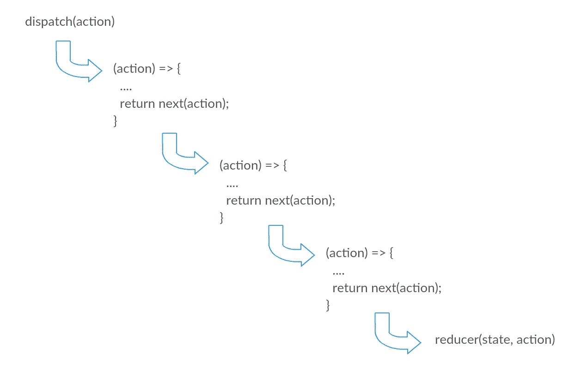

# 简化冗余

> 原文：<https://levelup.gitconnected.com/simple-redux-implementation-4fb54b01704d>

[Redux](https://redux.js.org/) 是不是让你很头疼？导航 Redux 的代码库时，你会感到沮丧吗？在本文中，我们将用大约 30 行代码实现 Redux 的核心功能！

**TL；DR** -这是我们对`createStore`和`combineReducers`的实现，涵盖了 Redux 最常见的 API。

`createStore`

`combineReducers`

让我们看看 Redux 的 [API 参考](https://redux.js.org/api/api-reference)。列表上的第一项是 [createStore](https://redux.js.org/api/createstore) ，我们现在就要实现它！

## createStore 接收 3 个参数:

1.  还原剂
2.  初态
3.  增强器(为了简单起见，我们将只使用中间件)

## createStore 返回一个具有以下函数的对象:

1.  `getState`
2.  `dispatch`
3.  `subscribe`

首先，我们将为`createStore`创建线框:

好了，现在我们有了线框，我们可以开始一步一步地实现它。

首先，我们需要添加一个名为`state`的局部变量，它是用传递给`createStore`函数的`initialState`初始化的。由于`getState`只是返回状态，我们可以很容易地实现它:

```
let state = initialState;
return {
  getState: () => state,
  ...
}
```

另一个简单的实现是`subscribe`:

`subscribe`是一个接收侦听器并返回`unsubscribe`函数的函数，该函数将删除侦听器，以便在存储更改时不再调用它。

```
const listeners = [];
return {
  subscribe: (listener) => {
    listeners.push(listener);
    return () => {
      listeners.splice(listeners.indexOf(listener), 1);}
    }
  },
  ...
}
```

在我们继续进行`dispatch`之前，让我们实现 Redux 实现的最后一步，即评估缩减器、调用监听器并返回新状态:

```
let state = initialState;
const listeners = [];let dispatchAction = (action) => {
  state = reducer(state, action);
  listeners.forEach(listener => listener());
  return state;
}
```

现在，`dispatch`是一个接收动作并触发存储状态变化的函数。基本上，它用接收到的动作调用最后一步:

```
return {
  dispatch: (action) => dispatchAction(action),
  ...
}
```

在上面的实现中，我们只使用了 reducer 来触发存储的状态变化，但是我们的中间件呢？在 Redux 改变状态之前，我们想执行的所有副作用呢？在此之前，我们先来探索一下中间件的结构:

```
/* A */ (middlewareAPI) => /* B */ (next) => /* C */ (action) => { 
  ....
  return next(action);
}
```

一个中间件是返回另一个函数的另一个函数，以此类推……但有趣的是，当前中间件的**函数 B，接收到数组**中下一个中间件的函数 C 的引用。这种组合使我们能够从当前的中间件调用下一个中间件，以此类推，直到我们覆盖所有的中间件。只有这样，我们才能继续对减速器进行评估。我们这里实际上是一个中间件链！

让我们深入到我们实现中最有趣的部分:

```
let state = initialState;
const listeners = [];let finalMiddleware = (action) => {
  state = reducer(state, action);
  listeners.forEach(listener => listener());
  return state;
}const middlewareAPI = {
  getState: () => state,
  dispatch: (action) => finalMiddleware(action)
}const newMiddleWares = middlewares.map(middleware => middleware(middlewareAPI));for(let i = newMiddleWares.length - 1; i >= 0; i--) { 
  finalMiddleware = newMiddleWares[i](finalMiddleware);
}
```

注意我们把`dispatchAction`改成了`finalMiddleware`。不要担心，当我们完成所有的事情时，一切都会变得有意义！

首先，我们通过调用中间件 API 来评估每个中间件。现在`newMiddleWares`是一个具有以下结构的函数集合:

```
(next) => (action) => { 
  ....
  return next(action);
}
```

在最后一步，我们反向检查新的中间件，用之前执行的值评估每个中间件。这部分有点混乱，所以让我们从最后一个中间件开始。

最后一个中间件接收`finalMiddleware`的第一个值，这个值是为了评估 reducer，它返回中间件结构中的最后一个函数。`finalMiddleware`现已更新该功能。

之前的中间件将接收该函数并返回它在结构中的最后一个函数。我们重复这个过程，直到我们到达第一个中间件。

最后，`finalMiddleware`将是集合中的第一个中间件，所以当我们调用`dispatch`时，它将调用第一个中间件。



在上图中，我们可以看到每个中间件中的`next`参数是对数组中下一个中间件中获取 `action` **的函数的**引用。****

让我们回顾一下 createStore 的最终实现:

现在，我们可以进入 API 参考中的下一部分，即- `[combineReducers](https://redux.js.org/api/combinereducers)`:

## `combineReducers`接收 1 个参数:

1.  减速器(对象)

## **combineReducers 返回:**

1.  接收状态和动作并返回状态的函数

线框非常简单:

`combineReducers`返回的函数其实是一个**减速器**本身！减速器是做什么的？它接受一个`state`和一个`action`并返回一个新的`state`！

所以我们需要做的就是检查所有的减速器，用它们相应的状态来评估它们。迭代完成后，我们返回新的状态！

请注意我们还没有谈到的。Redux 的核心部分是结构共享，这意味着如果状态树的某个部分没有改变，我们也不会改变它的引用。让我们看一个例子:

```
state
 |-- part-a
 |-- part-b
 |    |-- part-b-1
 |    |-- part-b-2
 |-- part-c
```

因此，如果我们在我们的状态中改变`part-b-1`，我们不希望`part-a`或`part-c`或`part-b-2`丢失它们的原始引用，因为它们没有被改变。确实需要改变的是`part-b-1` `part-b`和`state`。这就是为什么我们有`hasChanged`，如果*树的某些*部分实际上发生了变化，我们就返回新创建的状态。

我鼓励你去尝试自己去实现！不要看实现，只要看一看 API，了解它们实际上是做什么的，然后一头扎进去。你会发现这并不像你想象的那么难:

1.  `createStore`-[https://redux.js.org/api/createstore](https://redux.js.org/api/createstore)
2.  `combineReducers`-[https://redux.js.org/api/combinereducers](https://redux.js.org/api/combinereducers)
3.  `store`-[https://redux.js.org/api/store](https://redux.js.org/api/store)

作为练习，看看将`replaceReducer`和`bindActionCreators`添加到您的实现中有多难！

就是这样！希望你喜欢它！

[](https://gitconnected.com/learn/redux) [## 学习 Redux -最佳 Redux 教程(2019) | gitconnected

### 8 大 Redux 教程-免费学习 Redux。课程由开发人员提交并投票，使您能够…

gitconnected.com](https://gitconnected.com/learn/redux)