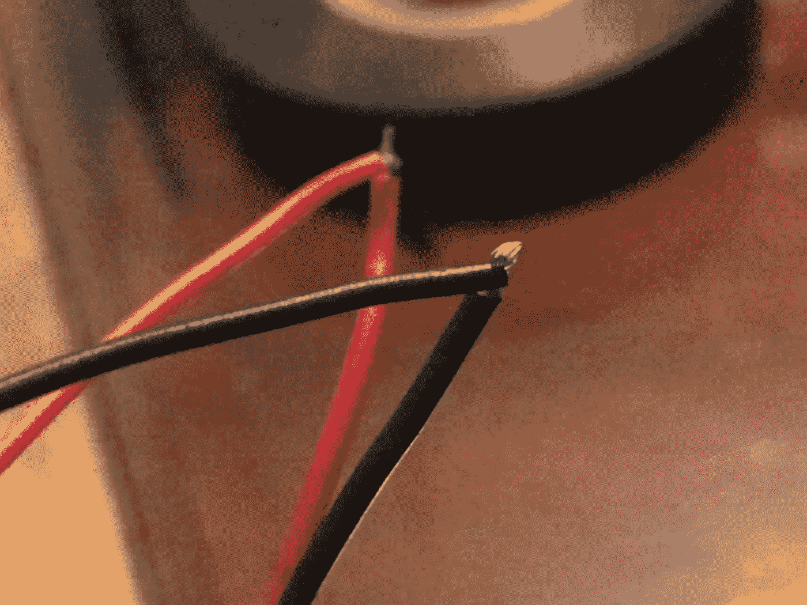

# 任何人都能制造的简单机器人汽车

> 原文：<https://levelup.gitconnected.com/simple-robot-car-anyone-can-make-2e8fc474ec5e>

80-20 法则，也称为帕累托原则，指出 80%的结果(输出)来自 20%的原因(输入)。帕累托原理可以应用于工程。只要你学会几个关键概念，你就能完成 80%的工作。

尽管这个项目的功能目标是制造一辆机器人汽车，但这个项目的真正目标是了解 DC 汽车公司。关于 DC 汽车公司的知识将是你产生未来 80%项目所需的 20%知识。

# 项目目标:

首先，我们来分解一下我们想要达到的目标。这个项目的大背景是制造一辆汽车，但当你分解到关键元素时，我们主要想制造一个装有 DC 发动机的轮子。是的，用简单的语言来说，这个项目的目标是让一个轮子不停地旋转。这将提供 DC 发动机一般如何工作的知识。

## 原始项目供应:

[2 轮驱动电机底盘机器人套件](https://www.amazon.com/Wheel-Drive-Motor-Chassis-Robotics/dp/B06ZZRWGJJ/ref=sr_1_3?dchild=1&keywords=2+wheel+drive+motor+chassis+robotics+kit&qid=1605490571&sr=8-3)

[带引线的 4 包电池座](https://www.amazon.com/LAMPVPATH-Battery-Holder-Leads-Wires/dp/B07T7MTRZX/ref=sr_1_4?dchild=1&keywords=4+pack+battery+holder&qid=1605490420&sr=8-4)

[电工胶带](https://www.amazon.com/dp/B077Z5FJ19/ref=sspa_dk_detail_0?psc=1&pd_rd_i=B077Z5FJ19&pd_rd_w=iWHRK&pf_rd_p=7d37a48b-2b1a-4373-8c1a-bdcc5da66be9&pd_rd_wg=sypJG&pf_rd_r=5HQZ6S3SE13MBGXC1V2R&pd_rd_r=7f06e9eb-2418-425c-9bbd-3ae24f1fed98&spLa=ZW5jcnlwdGVkUXVhbGlmaWVyPUExMFZWVFZLSlo4Rk9YJmVuY3J5cHRlZElkPUEwMzI5MzQxMjRQMEJERlpZN0ZZTiZlbmNyeXB0ZWRBZElkPUEwNDEzMjEwMjNKRkk3R0VDQjZBQyZ3aWRnZXROYW1lPXNwX2RldGFpbCZhY3Rpb249Y2xpY2tSZWRpcmVjdCZkb05vdExvZ0NsaWNrPXRydWU=)

## 替代项目基本物资:

[2pc DC 电机](https://www.amazon.com/Aoicrie-Electric-Plastic-Geared-Magnetic/dp/B07VT6D54B/ref=sr_1_12?dchild=1&keywords=2pc+dc+motor&qid=1605490385&sr=8-12)

[带引线的 4 包电池盒](https://www.amazon.com/LAMPVPATH-Battery-Holder-Leads-Wires/dp/B07T7MTRZX/ref=sr_1_4?dchild=1&keywords=4+pack+battery+holder&qid=1605490420&sr=8-4)

[电工胶带](https://www.amazon.com/dp/B077Z5FJ19/ref=sspa_dk_detail_0?psc=1&pd_rd_i=B077Z5FJ19&pd_rd_w=iWHRK&pf_rd_p=7d37a48b-2b1a-4373-8c1a-bdcc5da66be9&pd_rd_wg=sypJG&pf_rd_r=5HQZ6S3SE13MBGXC1V2R&pd_rd_r=7f06e9eb-2418-425c-9bbd-3ae24f1fed98&spLa=ZW5jcnlwdGVkUXVhbGlmaWVyPUExMFZWVFZLSlo4Rk9YJmVuY3J5cHRlZElkPUEwMzI5MzQxMjRQMEJERlpZN0ZZTiZlbmNyeXB0ZWRBZElkPUEwNDEzMjEwMjNKRkk3R0VDQjZBQyZ3aWRnZXROYW1lPXNwX2RldGFpbCZhY3Rpb249Y2xpY2tSZWRpcmVjdCZkb05vdExvZ0NsaWNrPXRydWU=)

以上列出了本项目所需的物资。“替代项目”只有 DC 电机和车轮的链接，而“原始项目”有一个链接到我在这个项目中使用的机器人套件。机器人套件带有预先钻孔的安装板。你不一定要得到机器人套件来完成这个项目，该项目的最重要的部分是使 DC 电机工作。

# 直流电动机

DC 电机或直流电机将电能转化为机械能。对于这个项目，我们将使用 4 节 AA 电池为汽车的每个车轮供电。我们只需要 DC 发动机，电池盒和绝缘胶带。

带开关的 DC 电机的最简单电路

# 装配

[机器人套件](https://www.amazon.com/Wheel-Drive-Motor-Chassis-Robotics/dp/B06ZZRWGJJ/ref=sr_1_3?dchild=1&keywords=2+wheel+drive+motor+chassis+robotics+kit&qid=1605490571&sr=8-3)带有预先钻孔的安装板和螺钉，易于组装。

该套件没有配备电池座或 Arduino。有很多关于如何用 Arduino 或 raspberry pi 给轮子供电的教程。我选择用电池供电，因为在我看来这是最容易让它工作的。

带轮子的 DC 发动机

将车轮连接到 DC 电机上。DC 电机有两条电线，一条红色，一条黑色。这些电线是电机的正极和负极。

我们的电池座还配有红色和黑色电线。我们需要做的是将 DC 电机和电池座的两端缠绕在一起，然后用电工胶带将它们粘在一起。

缠绕 DC 电机和电池架的正极和负极

用胶带将电池座和 DC 电机的末端固定到位。

打开两个电池盒的电源，瞧！DC 电机应该打开，车轮应该转动。

有一点需要注意的是，我使用了 2 个电池座，并分别为每个车轮布线。在成品中，我发现车轮走的方向相反，这使得汽车在旋转而不是前进。一个简单的解决办法是交换一个轮子的电线，将相反颜色的电线缠绕在一起(红色和黑色)。这将解决这个问题，汽车将继续前进。

# **完工项目:**

# 20%的知识

DC 汽车公司的知识可以用于其他项目。希望这个小项目给了你 20%的知识，你可以用在未来 80%的项目中！