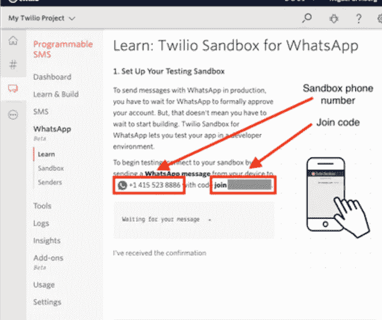
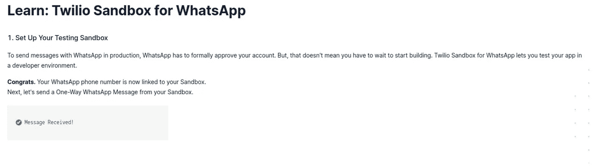
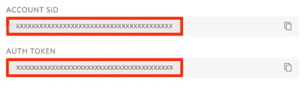
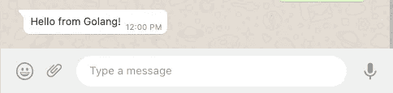

# 使用 Golang 实现 WhatsApp 消息自动化的简单步骤

> 原文：<https://levelup.gitconnected.com/simple-steps-to-automate-whatsapp-messages-with-golang-ff5244f0ae73>

这是一个简短的操作指南，用几行代码通过 WhatsApp 发送消息或通知。


马頔·索罗明在 [Unsplash](https://unsplash.com?utm_source=medium&utm_medium=referral) 上拍摄的照片

Twilio 提供了一个 [WhatsApp 沙盒](https://www.twilio.com/console/sms/whatsapp/learn)，我们需要它来开发和测试您的应用程序。

在本节中，您将把您的智能手机连接到沙盒。从你的 [Twilio 控制台](https://www.twilio.com/console)中，选择[消息](https://www.twilio.com/console/sms/dashboard)，然后选择*尝试一下侧边栏上的*。在 Twilio 控制台中打开 [WhatsApp](https://www.twilio.com/console/sms/whatsapp/learn) 部分。WhatsApp 沙盒页面将显示分配给你的帐户的沙盒号码和加入代码。

第一步是用 Twilio 创建一个帐户，使用这个[链接](http://www.twilio.com/referral/7fB3Je)从你的 [Twilio 控制台](https://www.twilio.com/console)创建一个帐户后，选择[消息](https://www.twilio.com/console/sms/dashboard)，然后选择*尝试一下侧边栏上的*。在 Twilio 控制台中打开 [WhatsApp](https://www.twilio.com/console/sms/whatsapp/learn) 部分。WhatsApp 沙盒页面将显示分配给你的帐户的沙盒号码和加入代码。



完成设置后，您应该会看到如下消息



# 配置 Twilio 凭据

为了能够发送 WhatsApp 消息，Go 应用程序需要访问您的 Twilio 帐户凭据以进行身份验证。我们可以将这些设置为环境变量。

所需的 Twilio 凭证“帐户 SID”和“身份验证令牌”都可以在 [Twilio 控制台](https://twilio.com/console)的仪表板上找到:



如果你想了解更多关于环境变量的知识，请点击链接[https://gobyexample.com/environment-variables 有关于如何做的例子。](https://gobyexample.com/environment-variables)

# 发送 WhatsApp 消息

一旦设置了环境变量，你现在就可以编写一个简短的 Go 程序来发送 WhatsApp 消息。找到一个合适的位置来存储您的项目，并为 Go 项目创建一个新的目录:

```
mkdir whatsapp
cd whatsapp
```

然后为您的新项目创建一个 [Go 模块](https://golang.org/doc/tutorial/create-module):

```
go mod init whatsapp
```

这个项目唯一需要的依赖项是 Twilio Go Helper 库，它可以用下面的命令安装:

```
go get github.com/twilio/twilio-go
```

启动您最喜欢的代码编辑器，在上面创建的项目目录中打开一个名为“main.go”的文件。在其中输入以下代码:

```
package main

import twilio "github.com/twilio/twilio-go"
import openapi "github.com/twilio/twilio-go/rest/api/v2010"
import "fmt"

func main() {
    client := twilio.NewRestClient()
    params := &openapi.CreateMessageParams{}
    params.SetTo("whatsapp:<YOUR-PHONE-NUMBER-HERE>")
    params.SetFrom("whatsapp:+14155238886")
    params.SetBody("Hello from Golang!")
    _, err := client.ApiV2010.CreateMessage(params)
    if err != nil {
        fmt.Println(err.Error())
    } else {
        fmt.Println("Message sent successfully!")
    }
}
```

确保您使用的是 [E.164 格式](https://support.twilio.com/hc/en-us/articles/223183008-Formatting-International-Phone-Numbers)，其中包括一个加号前缀和国家代码。

这段代码从创建一个 Twilio REST 客户端对象开始。这个对象是用 Account SID 和 Auth Token 环境变量自动初始化的。

然后，它创建一个`CreateMessageParams`结构并用“to”和“from”电话号码初始化它。添加到该结构的最后一个参数是您将要发送的实际文本消息。

Twilio 客户端对象用于创建一个新的消息资源，用上面创建的参数结构进行初始化。对`CreateMessage()`的调用返回一个响应和一个 error 对象，如果消息发送失败，这将为您提供有用的信息。

保存“main.go”文件，然后从终端运行该文件，如下所示:

```
go run main.go
```

过一会儿，你会在 WhatsApp 上收到这条消息！



# 结论

这个简短的教程给了你一个使用 twilio go 库和 WhatsApp 发送消息的方法。请务必查看[文档](https://www.twilio.com/docs/libraries/go)和[源代码库](https://github.com/twilio/twilio-go)，了解如何使用该库的最新更新。