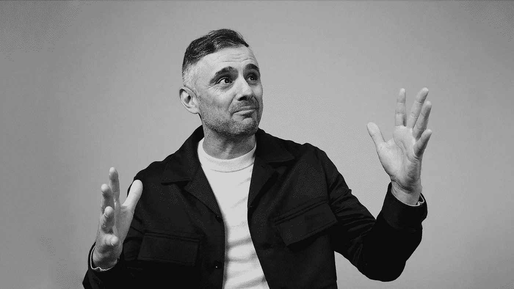

# 可以用来评估 NFT 项目的简单策略

> 原文：<https://levelup.gitconnected.com/simple-strategies-you-can-use-to-evaluate-an-nft-project-1776c15dbd3d>

线索就在创始人身上

[信用——Inc.com](https://www.inc.com/magazine/202111/christine-lagorio-chafkin/gary-vee-vaynerchuk-nft-innovation-advice.html)

当网络 3 中一个有影响力的人反复重复某件事时，坐起来听是明智的。

根据世界著名的连续投资者和企业家[加里·维纳查克](https://medium.com/u/c4ec9163657c?source=post_page-----1776c15dbd3d--------------------------------)的说法，目前 NFT 98%的项目将归零，但是为了给自己最好的成功机会，你应该像他说的那样瞄准

> "赌赛马骑师，而不是马。"

如果他是对的，那么你有 2%的机会成功进入 NFT 项目。

这还是在你考虑加密货币的“风险”本质之前。

以下是加里在最近接受[雅虎财经](https://www.youtube.com/watch?v=gFQUauCHsS0)采访时给出投资建议时所说的话

> “知道你在用你的钱做什么，理论上有很多地方给我提供了很好的机会，但我真的不明白。”

> “成千上万的人将资金投入到 crypto、NFTs 和公开市场，但他们真正做的是追逐对话的势头。”

阅读这篇文章会让你觉得你有更好的机会赢得彩票。

你可能是对的。

酪

有一个万全之策可以给你带来最大的成功机会。

**投资那些有着良好业绩记录的高技能创始人！**

这里有一些因素，你可以看看，以增加你的成功机会，并帮助你避免失误。

## 创始人必须热爱创业

作为一个基准，创始人必须有经营成功企业的历史，并且是一名成功的企业家。

如果他们很优秀，他们的成功将会被广泛记载。

假设你不能清楚地说出一个创始人的任何事情，也不能投资他们的项目。你更像是加里之前描述的投机者。

找到创始人的起源故事，你很快就会发现这是他们一生的热情，还是对他们来说只是短暂的一瞬间。

我最喜欢的是柠檬水摊的故事或者在休息时间让学校的小吃店歇业。

如果创始人是有创业倾向的人，而这并不是他们真正的样子，他们会发现很难坚持做一些他们并不完全感兴趣的事情。

[信贷—Express.com](https://www.newindianexpress.com/lifestyle/spirituality/2021/nov/28/how-perseverance-pays-2388164.html)

## 他们害怕失去名誉吗？

跨越数年的辉煌职业生涯，已经有了成功和金钱，这让投资者处于一个令人兴奋的位置。

这些创始人通常重视他们努力赢得的声誉，而且总有一种感觉，这些高成就者希望带着人们一起踏上旅程。

web3 的全部本质是让我们所有人分享创始人项目的经济价值。我们要做的就是选对人。

有前途的创始人不太可能孤注一掷，从最支持他们的粉丝那里获取资本。冒着风险从一个失败的 NFT 项目中脱身。

我确信这已经发生了。我得说几率很低。

## 创始人必须有辉煌的业绩记录。

你可以在没有任何经验的情况下第一次创业，然后变得非常成功。我不会冒险投资这类项目。

如果一位创始人在过去几十年里有着杰出的高成就记录，这显然会增加你的投资机会。

和相当大的安全信号。

我强调几十年不仅仅是为了复利经验，也是为了他们将经历的充满衰退和多重挫折的手。

战争创伤、失败和挫折造就了一个伟大的战时将军，使他们在未来的任何逆境中都保持良好的状态。

## 竞争和消极给了他们动力。

对自己的工作不感兴趣的人通常会以更多的消极来回应消极。创始人对待批评的态度与球迷在运动场上嘘球员的态度没有什么不同，他们拥有最大的优势。

这个世界的加里·维斯和凯文·罗斯对他们的技能非常满意。几十年杰出商业成功的信心必然会帮助他们摆脱批评和微小的失败。

在某种程度上，这可能对他们有影响。

强有力的创始人总是想在比赛结束时把它坚持给坐在廉价座位上的一群诘问者。

对失败永不放弃的态度对 NFT 项目来说是个好兆头，因为你的资金被套牢了。

做足功课，明智选择。

在 [Medium](https://t.co/0WsCUfngD2) 、 [LinkedIn](https://www.linkedin.com/in/jayden-levitt-aa93511b9/) 或 [Twitter](https://twitter.com/JaydenLevitt) 上关注我。

*本文仅供参考；不应将其视为财务、税务或法律建议。在做出任何重大财务决定之前，请咨询财务专家。*