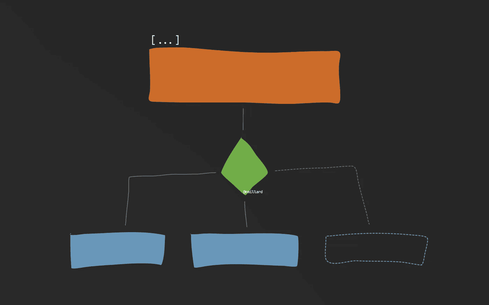
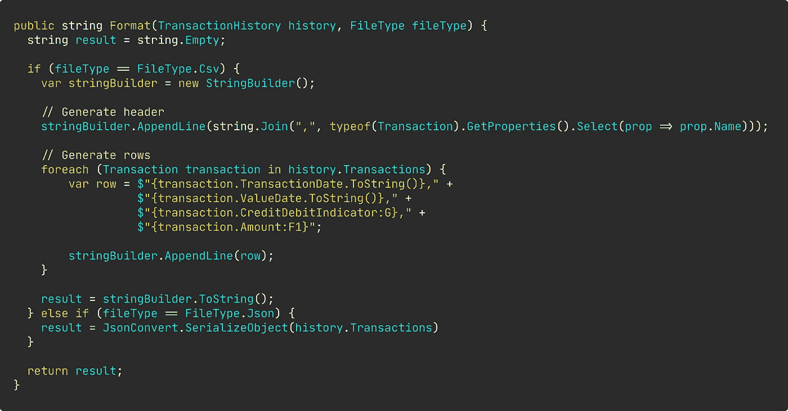
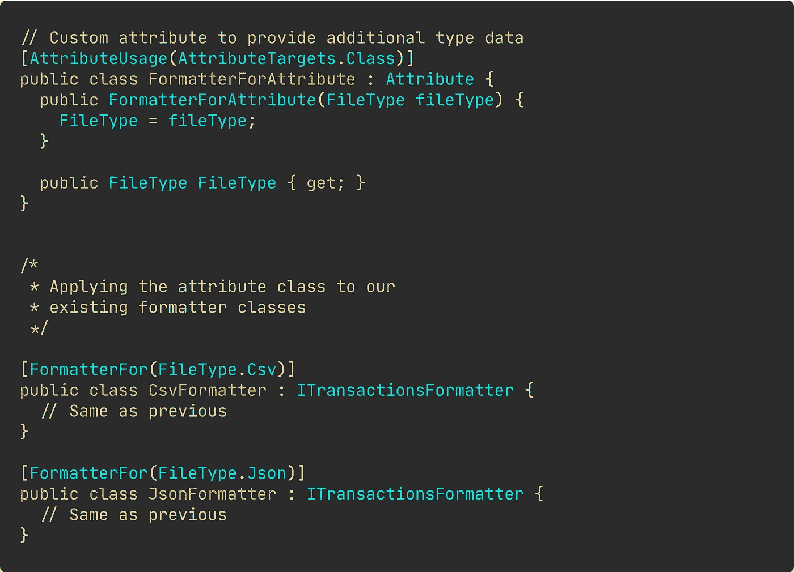
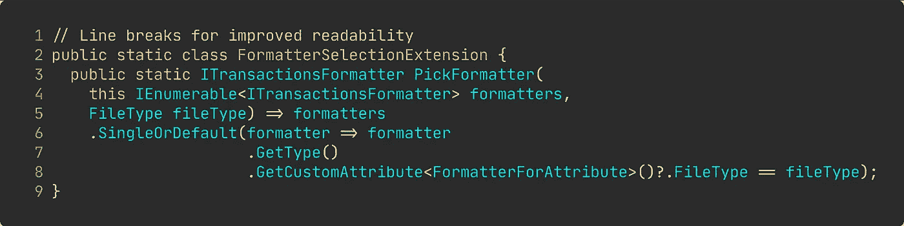
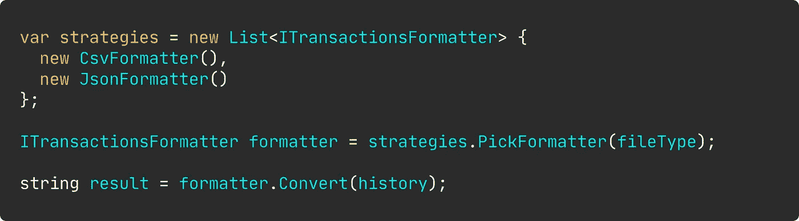

# 使用属性的简单策略模式

> 原文：<https://levelup.gitconnected.com/simple-strategy-pattern-using-attributes-880c55988215>

## 实用设计模式

## 如何改进传统的分支并理解策略模式如何降低圈复杂度。



尼古拉斯·米勒德的插图

您是否正在为策略模式而挣扎，或者想要额外的“建议”来应用它？

希望在本文结束时，您会对策略模式如何工作、为什么有用有一个清晰的理解，甚至可能认识到自定义 C#属性如何为您的应用程序增加价值。

让我从一开始就说明这一点，即使您的主要语言是 JavaScript、Python 或像 Swift 这样的晦涩语言，我相信您会在这里找到一些有用的东西。阅读这篇文章并不需要成为 C#开发人员。

T 战略模式很可能是你尝试自己实现的第一个设计模式。您可能已经通过简单地使用传统的分支技术，如 switch 或 if-else 语句，实现了这个模式无数次。

虽然这在很多情况下都很好，但是您可能需要在某个时候提高代码库的内部代码质量。您通常可以将分支语句转换成对象，从而将每个 if 或 switch 用例封装在一个非常简洁且易于理解的类中。本质上，这就是策略模式。就这么简单。

在我看来，将分支分成不同的类提供了许多优势，比如高内聚，更少的类依赖，更低的[认知和圈复杂度](https://docs.codeclimate.com/docs/cognitive-complexity#:~:text=Cognitive%20Complexity%20is%20a%20measure,be%20to%20read%20and%20understand.)，以及总体更短的类。批评家可能会指出更多的类是不可取的，因为每个额外的类和抽象都会增加一些开销，并增加整个项目的复杂性。

虽然将策略模式应用于较小的项目确实会有一些负面的结果，但是我认为长期的收益是值得的——但是这显然是您必须进行的逐案评估。

## 在编写任何代码之前，创建一个测试项目。

在开始为策略模式创建类之前，先帮自己一个忙，创建一个测试项目。

每当我要实现一个设计或者重构我正在工作的应用程序的一部分时，我通常会从创建一个新的测试项目开始。你可能认为我这样做是因为我想严格坚持测试驱动开发，但事实并非如此。我发现这种方法在设计过程中提供了一种流畅的体验。代码覆盖率只是一个附加的好处。

## 【属性】有什么好大惊小怪的？

如果你曾经使用过 C#和。尤其是 aspnet(core ),你非常习惯于将属性应用到你的类中，比如控制器、对象属性等等。但是，您真的知道这些特殊类的用途以及框架是如何使用它们的吗？

属性基本上就像附加到现有类上的额外类型元数据。属性本身可能并不真的做什么——尽管它们可以——它们最常被其他类通过反射来搜索。

令人惊叹的是，您可以读取类型的元数据，包括提供给属性的数据，而不需要您感兴趣的元数据所在的类的实例。

如果没有这方面的实践经验，这听起来可能会不必要的复杂。当我们开始实现策略模式时，您将掌握它的窍门。

# 传统分支技术的问题。

[📝如果你只是想看一些代码，可以看看 GitHub repo。](https://github.com/NMillard/CSharpDesignPatterns/blob/main/src/Strategy/FileFormatting/Strategies.cs)

想象一下，我们需要生成不同格式的事务报告，比如 JSON 和 CSV——未来还会有更多的格式。

然而，如果您只需要生成 JSON 和 CSV，您可以轻松地实现如下所示的伪策略。



用 if-else 举例说明伪策略。图片由[

应用于类的 C#属性。](https://medium.com/u/7c7a43b3d9de#中，我们创建“特殊”的属性类，可以应用于我们的类，扩展我们的类型数据。</p><figure class=) 

[我们已经应用了属性，但是仍然没有任何代码读取属性值。我们需要一种方法，根据我们想要的报告文件格式来选择正确的格式化程序。](https://medium.com/u/7c7a43b3d9de#中，我们创建“特殊”的属性类，可以应用于我们的类，扩展我们的类型数据。</p><figure class=)

[您可以通过许多不同的方式来选择正确的格式化程序。根据用例，我会选择三种方法之一:创建扩展方法、](https://medium.com/u/7c7a43b3d9de#中，我们创建“特殊”的属性类，可以应用于我们的类，扩展我们的类型数据。</p><figure class=)[工厂](https://medium.com/swlh/factory-pattern-without-switch-this-is-how-it-should-be-done-cd895e356f44)或[定制集合类](https://medium.com/swlh/the-most-overlooked-collection-feature-in-c-7ca2c67b408d)。

我们将选择扩展方法。原因很简单，因为它易于实现，并且提供了很多价值。



C#扩展方法。

如果您不习惯扩展方法，这个语法可能看起来很奇怪。这个类所做的就是允许我们在格式化程序列表上使用自定义方法`PickFormatter(FileType)`。看一下第 8 行。这就是我们使用反射来读取自定义属性的地方。

下面的代码片段展示了如何使用我们的新类和扩展方法。



格式化程序类和扩展方法的演示。

## 最终产品。

总而言之，我们有更多的代码。我们增加了项目的复杂性。但是，每一部分都更容易测试和理解。你所采取的每一种方法都会涉及到一些权衡。

任何开发人员都需要建立一个工具和方法库。我希望这个例子能让你对如何实现策略模式有一个新的认识。

```
**Resources for the curious**
--------------------------
[Using Cyclomatic Complexity to Determine Test Coverage for SAS programs](https://www.lexjansen.com/pharmasug/2004/FDACompliance/FC06.pdf) by Michael C. Harris
```


**Nicklas Millard** 是一名软件开发工程师，供职于一家发展最快的银行，负责构建任务关键型金融服务基础设施。

此前，他是 Big4 的高级技术顾问，为商业客户和政府机构开发软件。

> [新的 YouTube 频道(@Nicklas Millard)](https://www.youtube.com/channel/UCaUy83EAkVdXsZjF3xGSvMw)
> 
> *连接上* [*LinkedIn*](https://www.linkedin.com/in/nicklasmillard/)