# 使用 Python 和 AWS Lambda 的简单电报机器人

> 原文：<https://levelup.gitconnected.com/simple-telegram-bot-with-python-and-aws-lambda-5eab1066b466>

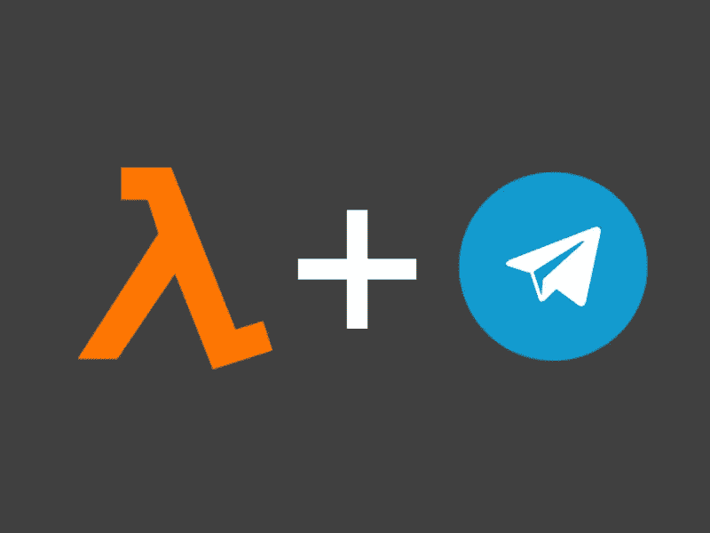

对于简单的自动化任务来说，Python 是一种极好的语言。它是世界上最受欢迎的语言之一，这要归功于它简单易用的语法，以及庞大的工具和库生态系统。结合像 [AWS Lambda](https://aws.amazon.com/lambda/) 这样的无服务器服务，你可以用它来实现非常划算和有用的自动化。在本文中，我将向您展示我如何构建一个简单的 Python 机器人，它提取雷达图像和数据并将其发送到 [Telegram](https://telegram.org/) 。我们正在使用网站 [lietus.lv](http://lietus.lv) 上生成的天气雷达图像，并使用机器人将其发送到 Telegram。

# 电报设置

我们要做的第一件事是创建一个**电报机器人**。所有电报机器人都使用公开可用的[机器人 API](https://core.telegram.org/bots/api) 。这就是我们的 Lambda 将如何与 Telegram API 服务器通信，以实际执行 Telegram 中的命令，比如发送消息。机器人是在 messenger 中使用名为[机器人父亲](https://telegram.me/BotFather)的机器人创建的。

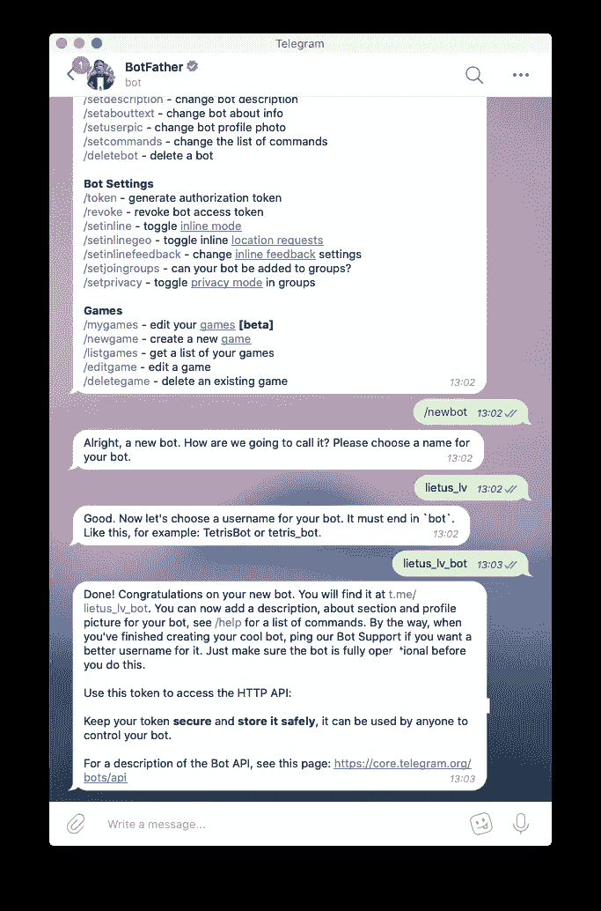

使用 Telegram 中的 BotFather bot 权限来创建 bot 并获取我们的 API 令牌。

我们需要使用 BotFather 向 Telegram 注册我们的 bot，并获得一个 **API 令牌**。这是 API 的主要授权机制。确保不要在任何公开的地方泄露这个令牌！否则，有人可以很容易地控制你的机器人。如果发生这种情况或者您只是忘记了令牌，不要担心——您可以随时通过再次使用 BotFather 来更改它。

现在我们有了 API 令牌，我们已经可以开始使用我们的 bot 向 Telegram 发送消息了！从技术上来说，一个合适的电报机器人应用程序与电报 API 进行双向通信，有两种方式:

*   **长轮询**(循环轮询电报 API 更新)
*   **Web-hook** (注册新更新时调用的应用程序请求端点)

然而，我们不需要这些，因为我们的机器人只会发送消息。相反，我们可以简单地使用 Telegram API[send photo](https://core.telegram.org/bots/api#sendphoto)方法。我们甚至根本不需要处理文件——我们只是将雷达图像的 URL 直接发送给 Telegram。

接下来，我们将为机器人创建一个发布内容的通道。确保将机器人添加为管理员。

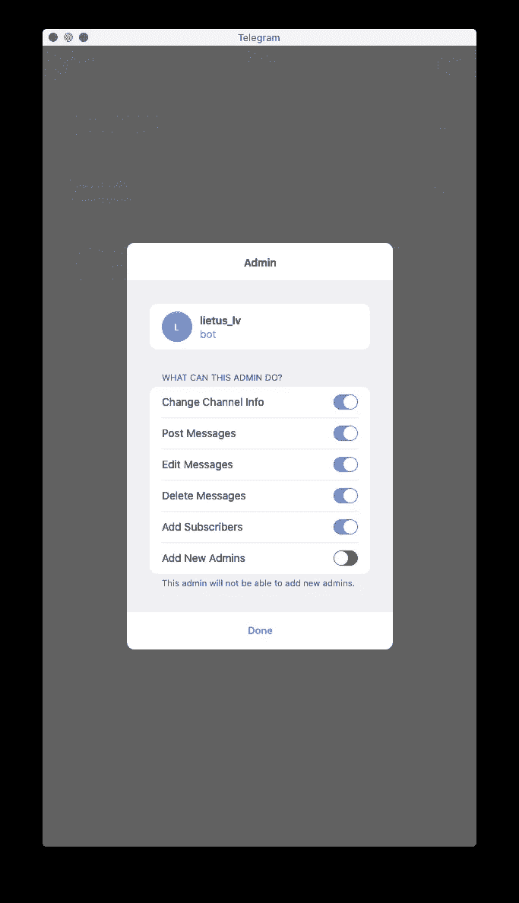

现在这里有一个小的棘手的部分。API 中的所有聊天交互方法都通过特定的带符号整数 ID 来识别电报聊天。没有一种简单的方法可以得到它，但是一种方法是发送一条测试消息给聊天工具，然后转发给一个非常有用的机器人，叫做[电报机器人 Raw](https://t.me/RawDataBot) 。它将打印出消息的原始元数据。

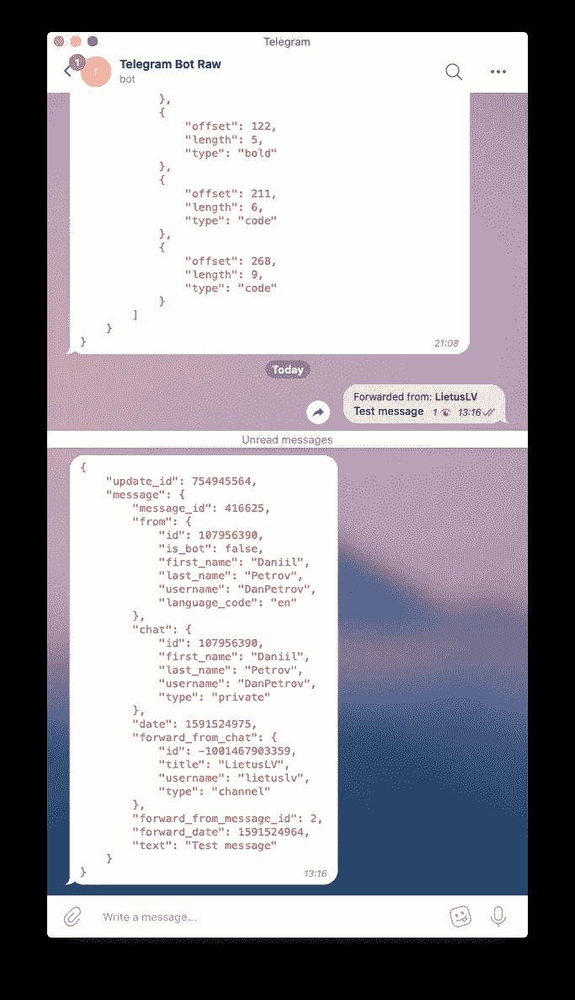

我们对**“forward _ from _ chat”**键中的 **id** 感兴趣。那是我们的 **chat_id。**

# 设置 AWS Lambda

现在是时候创建我们的λ了。Lambda 是一个非常强大和廉价的 AWS 服务，简单地说，它允许你按需运行一些代码，而不必担心托管虚拟服务器。这意味着只有当您的代码运行时，您才需要付费。在当前的定价模式下，Lambda 实际上对大量的初始执行和运行时是免费的。此时，我假设您有一个 AWS 帐户。我们做的第一件事是前往 [AWS 控制台](https://console.aws.amazon.com/)并前往 Lambda 部分。

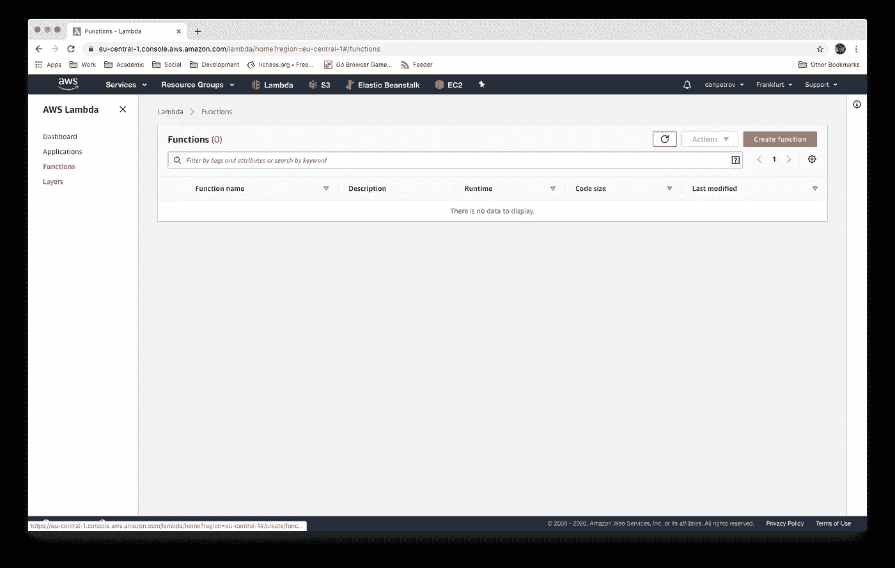

点击**“创建功能”**，会出现一个表格。我们对一个 **Python 3.8** 运行时环境感兴趣(在撰写本文时，这是 Python 的最新稳定版本)，并给它一个有意义的名字。

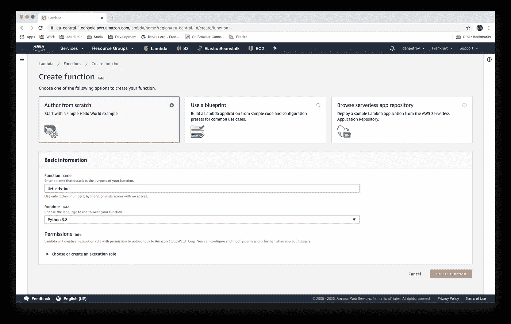

我们的 Lambda 诞生了！现在我们需要做更多的设置。就像我之前说过的，你应该**永远不要**在你的代码中明文放置敏感的凭证或令牌。相反，我们可以从**环境变量**加载电报 API 令牌。设置一个很容易:

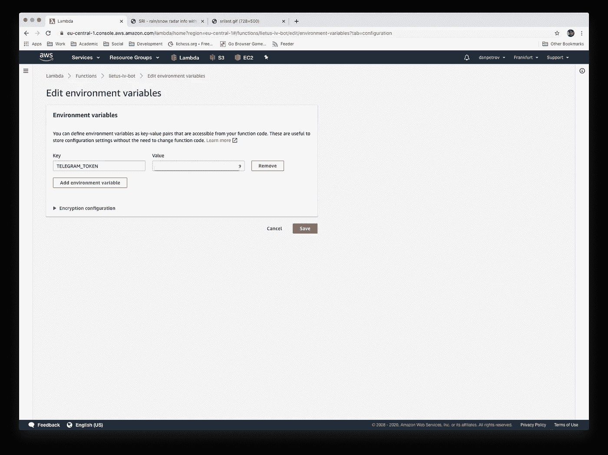

默认情况下，环境变量将使用一个新的对称密钥对静态进行**加密。在生产中，强烈建议在传输过程中也加密密钥。你可以在这里阅读更多相关信息[。](https://docs.aws.amazon.com/lambda/latest/dg/security-dataprotection.html)**

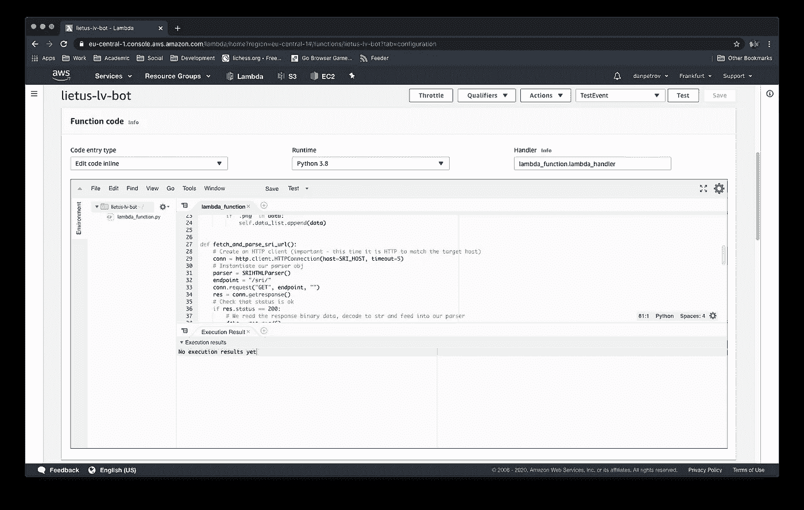

这次我们可以直接在 Lambda 编辑器中编写代码，因为我们不需要任何外部库，这次我们保持简单。

# 编写代码

这一次，我们将内置的`http.client`模块用于 HTTP 请求。我们通过附加从先前定义的环境变量中获得的`telegram_token`来构造端点。`lambda_handler`是我们的处理函数——它是 Lambda 被触发时将被调用的函数。另一个选择是使用[请求](https://requests.readthedocs.io/en/master/)库，但是这次我们保留了它的准系统。我刚刚使用了一个类似于[失眠症](https://insomnia.rest/)的 **REST** 客户端，它允许你在编写任何代码之前测试一个 API，以及**在大多数语言和库中生成代码**。我使用的 source 在一个子资源中保存了一个生成的雷达图像列表，如下所示:

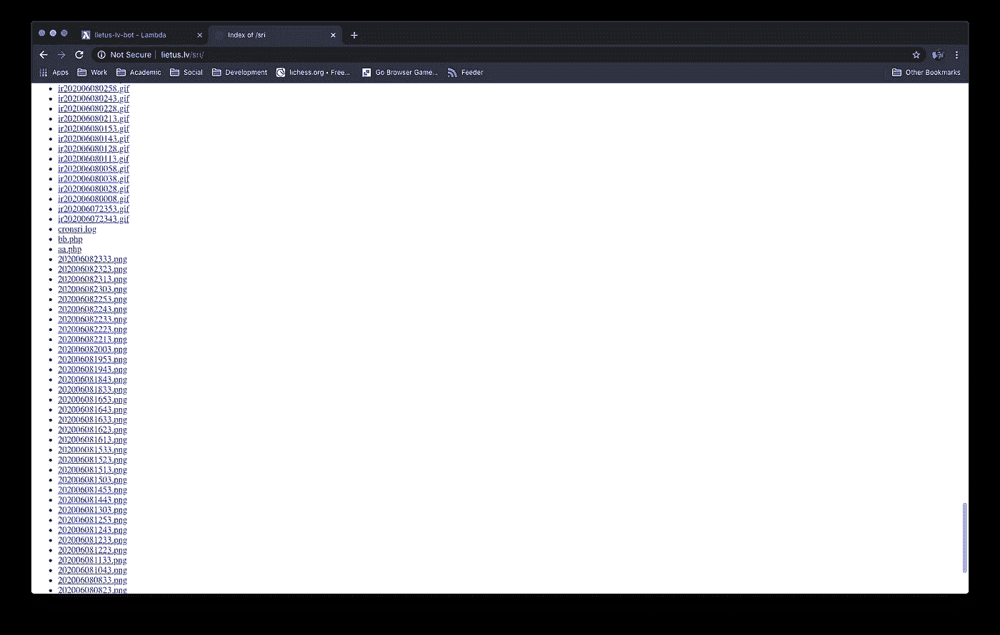

幸运的是，我们甚至不需要使用任何库，因为 Python 已经内置了`html.parse`模块。

在编写了我们自己的小解析器并一起尝试之后，最终结果将如下所示:

我们可以通过发送一些虚拟负载来测试我们的 Lambda:

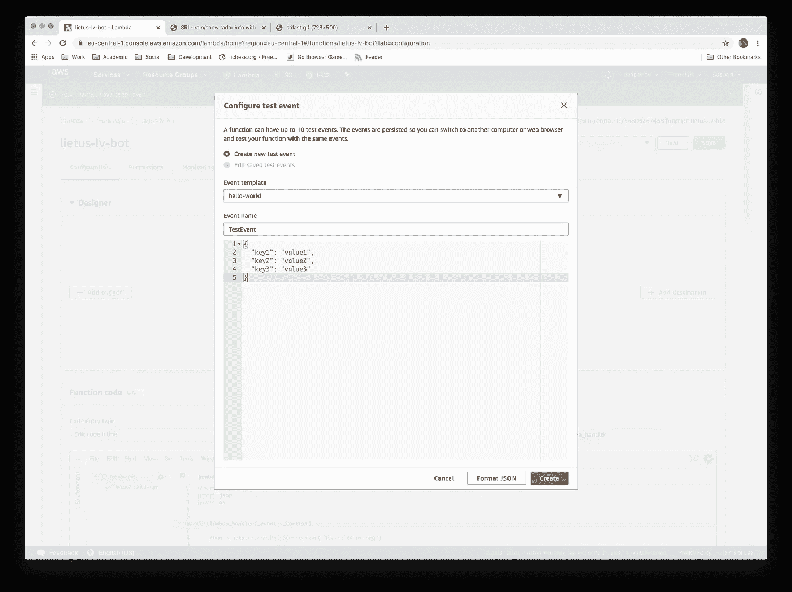

# 最后的步骤:AWS EventBridge

最后一步是根据一些时间表执行我们的 Lambda。典型的方法是创建一个 [EventBridge](https://aws.amazon.com/eventbridge/) 触发器。您可以使用**费率**或典型的 **cron** 时间表。

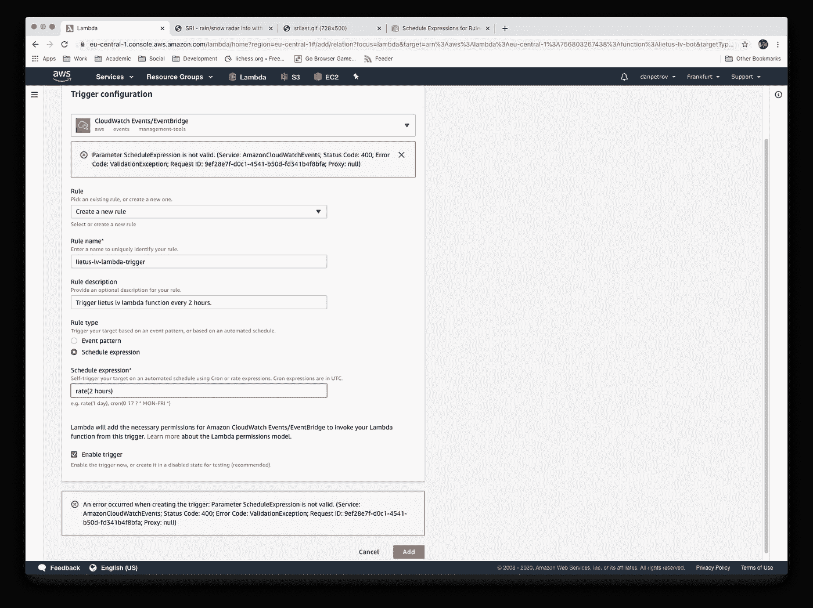

就是这样！您应该在 Lambda 设计器中看到连接器。

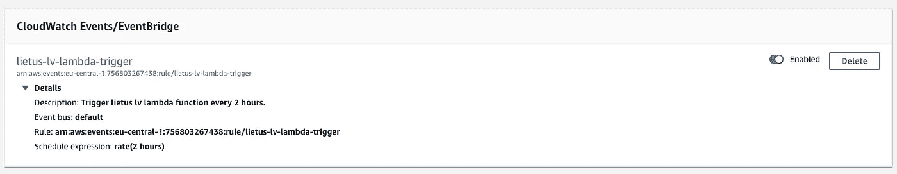

最终结果:

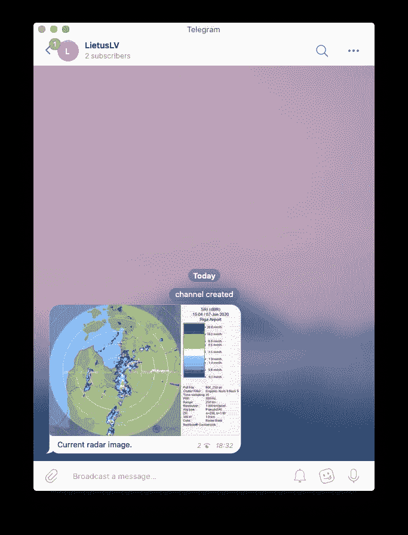

# 感谢阅读！

我希望你学到了新东西。下一次，我们可以尝试一些更高级的东西——创建一个交互式机器人，它将根据用户命令提供图像/响应。如果你有任何额外的问题，请在推特上联系我