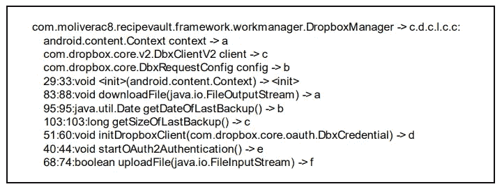
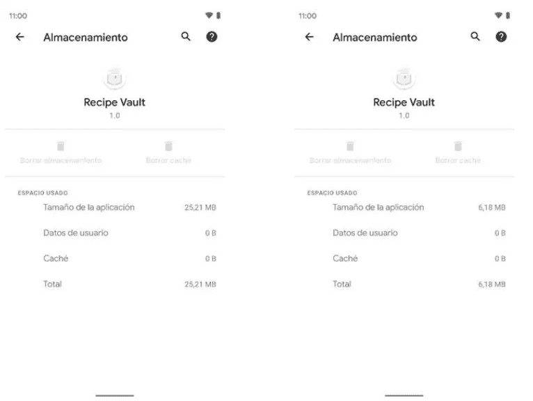

# 如何提高安全性并减小 Android 应用的大小

> 原文：<https://levelup.gitconnected.com/simple-tips-to-optimize-android-apps-334355a318d5>

## 用几行代码优化你的 Android 应用的大小和性能


萨姆·丹·张在 [Unsplash](https://unsplash.com?utm_source=medium&utm_medium=referral) 上的照片

因此，你已经在空闲时间开发了几个月的 Android 应用程序，基本功能正在工作，你已经编写了足够多的测试来确定你的代码，你已经准备好发布了。

您已经了解了使用 [Android 应用捆绑包](https://developer.android.com/guide/app-bundle) (ABB)的好处，它通过依赖 Play Store 控制台简化了应用的签名，并通过仅提供语言、drawables 和其他一些将根据设备使用的文件来增加应用的大小。

现在，最后一步是签署您的应用程序，并为 Play Store 构建一个发布版本，对吗？好了，还有最后一个要改进最终产品的东西， [**缩小和模糊**](https://developer.android.com/studio/build/shrink-code) 。

# 收缩

收缩过程会删除应用程序没有使用的类、属性和方法，而开发人员可能忘记了删除它们。这还包括来自集成到项目中的库的代码(这是大多数未使用的代码将被移除的地方)。

> 这项技术针对的是超过 Android 支持的 65，536 种方法限制的应用程序。

收缩过程依赖于 R8 编译器，并试图找到应用程序的入口点，如活动或服务。然后，它检查应用程序的代码，并构建一个包含运行时将使用的所有方法、变量和类的图，如果一个节点没有连接到该图，则与其相关联的代码将被删除。

大多数情况下，这个过程工作得完美无缺，但有时它会删除应用程序实际使用的代码。使用 JNI 或使用反射时会发生这种情况。在这些情况下，必须告诉编译器保留这些代码，这样应用程序才能在运行时正常工作，不会出现意外崩溃。为此，我们需要修改`proguard-rules.pro`文件，如下例所示。

```
-keep class * implements androidx.navigation.NavArgs
-keep class * extends androidx.navigation.NavArgsLazy
-keep class kotlin.reflect.KClass-keep class * extends android.os.Bundle
```

在代码上完成这个过程后，它会移除没有被使用的静态资源。随着代码的缩减，可以指定您想要维护的文件。

还有其他技术可以减少最终编译的代码，但它们更激进，增加了意外崩溃的可能性。例如，它所做的事情之一是，如果一个函数只被调用一次，在编译后的代码中，这个函数被直接嵌入到调用它的函数的代码中(类似于 Kotlin 对`inline`关键字所做的)。在我看来，这种更激进的方法太冒险了，因为每次我使用它时都有不好的经历，而且它不会对最终结果产生巨大的影响。

# 困惑

这个过程通过用字母替换代码中的名称，减少了类的名称、它们的属性和方法。R8 编译器会生成一个包含新旧名称映射的文件，这样您就可以在激活模糊处理时进行调试或尝试查看错误。老实说，在混淆后调试代码实际上是不可能的，但如果你觉得勇敢，你可以检查映射。

在下图中，您可以看到一个示例，展示了类的变量和方法的映射是如何工作的，以及它为什么对减少应用程序的最终大小有如此大的帮助。



混淆视听的例子

# 如何激活收缩和模糊

要激活这个特性，我们只需要进入我们的应用程序的 Gradle 模块，将下面几行添加到我们想要优化的构建类型中。

```
release {            
    shrinkResources true            
    minifyEnabled true            
    proguardFiles getDefaultProguardFile('proguard-android-optimize.txt'), 'proguard-rules.pro'        
}
```

> 在应用这个配置后，不要忘记测试应用程序的崩溃或任何其他问题，这样你就可以像我们在帖子开头看到的那样用 Proguard 规则排除类。

# 结论

在我看来，应用这些技术的结果是相当疯狂的。这是一个我用了大约 6 个月开发的 Android 应用程序的例子，如果你想的话，你可以在文章的结尾找到它。

正如你在图中看到的，没有这些优化的应用程序大了四倍，所以想象一下如果你有一个你已经工作了多年的项目，会有什么不同。



尺寸比较

当然有一些风险，特别是我之前谈到的反射问题，但回报很高，我认为这是值得的。

[](https://github.com/molidev8/Recipe-Vault) [## GitHub - molidev8/Recipe-Vault:一个存储、共享和备份食谱的 Android 应用程序

### Recipe Vault 是一个 Android 应用程序，允许用户存储、共享和备份他最喜欢的食谱。它遵循干净…

github.com](https://github.com/molidev8/Recipe-Vault) 

如果你想阅读更多这样的内容，并支持我，不要忘记检查我的个人资料，或给媒体一个机会，成为会员，以获得我和其他作家的无限故事。每月只要 5 美元，如果你使用这个[链接](https://medium.com/@molidev8/membership)，我会得到一小笔佣金。

[](https://medium.com/@molidev8/membership) [## 通过我的推荐链接加入 Medium—Miguel

### 阅读米格尔的每一个故事(以及媒体上成千上万的其他作家)。你的会员费直接支持米盖尔…

medium.com](https://medium.com/@molidev8/membership)