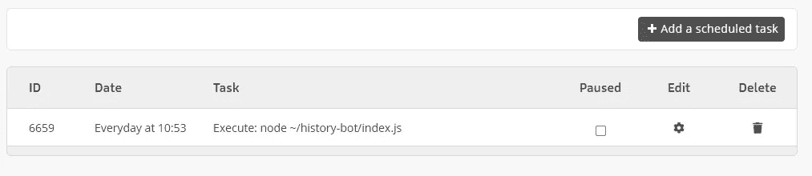
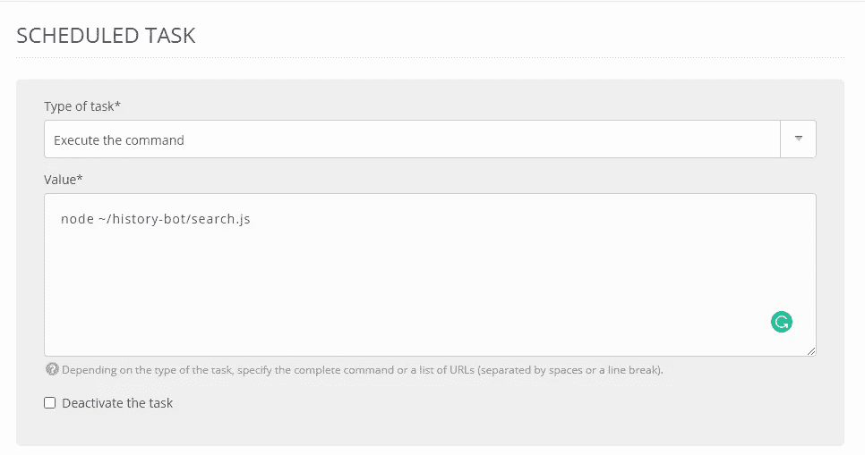
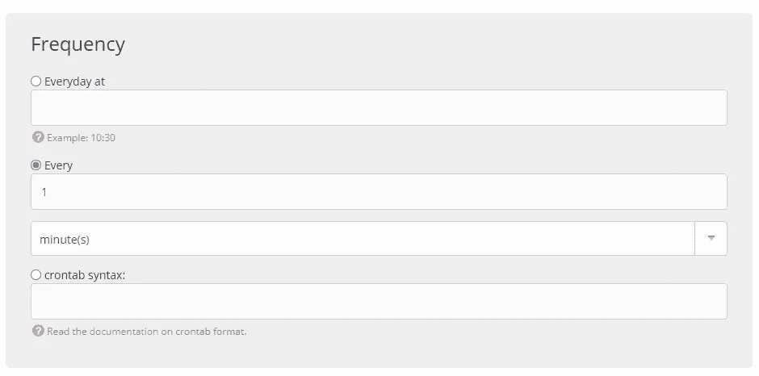

# 带有 Node.js 的简单 Twitter Bot 教程第 3 部分:搜索和转发

> 原文：<https://levelup.gitconnected.com/simple-twitter-bot-tutorial-part-3-search-and-retweet-d96b60731b48>


*本文原载于* [*我的个人博客*](https://blog.shahednasser.com/simple-twitter-bot-tutorial-part-3-search-and-retweet/) *。*

在本教程的前两部分中，我们讨论了如何创建一个 Twitter bot，它从历史上的 API 中的[发送推文，然后创建了一些计划任务，确保这些推文在一天的特定时间自动发布。我们使用](https://history.muffinlabs.com/) [twitter-api-client](https://github.com/FeedHive/twitter-api-client) 来轻松连接 Twitter API。你可以在 [@HistoryBot7](https://twitter.com/HistoryBot7) 上看到这个教程的机器人真人版。

在教程的这一部分，我们将基于特定的查询来搜索推文并转发它们。你可能见过很多机器人这样做。你发一条带有标签或关键词的微博，机器人会立刻转发。这就是我们将要做的。我们将每分钟搜索带有标签“#HistoryBot”的推文，并转发它们。

您可以在 [GitHub 资源库](https://github.com/shahednasser/history-bot)上继续阅读本教程的代码。

# 搜索推文

第一步是搜索带有标签“#HistoryBot”的最新推文，以便我们稍后转发它们。

我们将在项目的根目录下创建一个名为`search.js`的新文件。我们在一个单独的文件中这样做的原因是，我们以后需要在这个文件上单独运行一个预定的命令。

该文件应该从初始化 TwitterClient 开始，如下所示:

```
//search.js
require('dotenv').config()
const {TwitterClient} = require('twitter-api-client')

const twitterClient = new TwitterClient({
    apiKey: process.env.TWITTER_API_KEY,
    apiSecret: process.env.TWITTER_API_SECRET,
    accessToken: process.env.TWITTER_ACCESS_TOKEN,
    accessTokenSecret: process.env.TWITTER_ACCESS_TOKEN_SECRET
})
```

如果你一直关注教程，你会注意到这和`index.js`中的完全一样。所以，与其重复代码。我们将把这段代码移动到另一个名为`init.js`的文件中，在其中导出`twitterClient`，然后在我们的`index.js`文件和`search.js`文件中需要它。(如果只是按照自己项目的教程来做，就不需要做这一步了。)

因此，现在我们将拥有包含以下内容的`init.js`:

```
//init.js
require('dotenv').config()
const {TwitterClient} = require('twitter-api-client')

const twitterClient = new TwitterClient({
    apiKey: process.env.TWITTER_API_KEY,
    apiSecret: process.env.TWITTER_API_SECRET,
    accessToken: process.env.TWITTER_ACCESS_TOKEN,
    accessTokenSecret: process.env.TWITTER_ACCESS_TOKEN_SECRET
})

module.exports = twitterClient
```

然后，我们将在`index.js`中需要 twitterClient，并删除之前初始化 Twitter 客户端的代码:

```
//index.js
const twitterClient = require('./init')
const axios = require('axios')

axios.get... //rest of the code from before
```

并将`search.js`修改如下:

```
//search.js
const twitterClient = require('./init')
```

这样，我们可以避免在不同的文件中重复相同的代码。

现在回到我们的搜索脚本。初始化 Twitter 客户端后，我们需要搜索包含“#HistoryBot”的 tweets。为此，我们将在`twitterClient`上使用方法`tweets.search`。这个方法采用可变数量的参数，例如，`since_id`帮助您在特定的 tweet 之后获得 tweet。这可以帮助你优化你正在做的搜索和你正在检索的推文。你可以在这里找到它们所有参数的列表[。](https://developer.twitter.com/en/docs/tweets/search/api-reference/get-search-tweets)

对于我们示例的基本用法，我们将向它传递两个参数:`q`这是我们正在执行的搜索查询，在我们的教程中是“#HistoryBot ”,但是您可以在其中放置任何类型的关键字或标签，以便在 tweet 中查找。第二个参数是`result_type`，值将是`recent`。这是为了确保我们得到最新的结果，因为这个参数的默认值是`mixed`，它检索最近的推文和热门推文的组合。我们需要使用`recent`，因为我们的目标是转发推文。

默认情况下，该方法调用的端点最多检索 15 条 tweets。如果您愿意，可以通过传递参数`count`来更改它，该参数最多可以是 100。

因此，我们在`search.js`中的代码如下:

```
const twitterClient = require('./init')

twitterClient.tweets.search({
    q: '#HistoryBot',
    result_type: 'recent', //get latest tweets with this hashtag
}).then ((response) => {
	console.log(response)
}).catch ((err) => console.error(err))
```

这将检索最后 15 条包含“#HistoryBot”的推文，然后将它们打印到控制台。

要对此进行测试，请在您的终端中运行以下命令:

```
node search.js
```

如果一切正常，您将看到一个包含`status`属性的对象，它有一个状态数组。每个状态都有类似于`id`、`id_str`、`text`以及许多其他属性。请记住，有这个标签的推文并不多(可能没有)，因为我使用这个标签是为了确保教程不会随机转发任何东西。因此，您可以用任何其他东西替换这个标签来查看它的效果。

# 转发推文

在基于我们的查询搜索推文之后，我们将希望把它们转发到我们的机器人中。为此，我们将在`twitterClient`上使用`tweets.statusesRetweetById`方法。这个方法取参数`id`，这个参数将是我们之前收到的状态对象的`id_str`。

需要注意的是，如果一条推文已经发了，Twitter 会忽略它。如果您已经达到了转发的限制，您将收到一个状态代码为 403 的错误。你可以在这里阅读更多关于这个端点[的信息。](https://developer.twitter.com/en/docs/twitter-api/v1/tweets/post-and-engage/api-reference/post-statuses-retweet-id)

因此，我们将修改`search.js`中的代码，如下所示:

```
//...
twitterClient.tweets.search({
    q: '#HistoryBot',
    result_type: 'recent', //get latest tweets with this hashtag
}).then ((response) => {
    if (response.statuses) {
        response.statuses.forEach((status) => {
            twitterClient.tweets.statusesRetweetById({
                id: status.id_str
            })
            .then ((resp) => console.log(`Retweeted tweet #${status.id}`))
            .catch ((err) => console.error(err))
        })
    }
}).catch ((err) => console.error(err))
```

我们没有将来自`tweets.search`的响应打印到我们的控制台，而是迭代响应中接收到的`statuses`数组，并使用`tweets.statusesRetweetById`转发每条推文，将每种状态的`id_str`传递给它。如果成功，它将打印到控制台`Retweeted tweet #${status.id}`，其中`status.id`是状态的 id。如果失败，它会将收到的错误打印到控制台。

现在，让我们通过运行相同的命令再次测试这一点:

```
node search.js
```

你会看到它会转发带有这个标签的推文。


注意:我已经在@HistoryBot7 上发了这条推文[，所以如果没有任何带有标签的推文，你也可以测试一下！](https://twitter.com/HistoryBot7/status/1373249880324501511)

# 部署到服务器

如果你看过我们教程的第 2 部分，你会发现我们在 alwaysdata 上部署了这个机器人。我们现在将使用更新后的代码更新服务器，这样我们就可以调度一个每分钟运行一次的任务并执行`search.js`。

首先，用最新的更改更新您在服务器上使用的 GitHub 存储库:

```
git add . 
git commit -m "added retweet functionality" 
git push origin master
```

然后，用 SSH 连接到您的服务器，就像我们在第 2 部分中所做的那样，使用您的凭证。

连接后，导航到包含 bot 代码的目录，并从 GitHub 存储库中提取代码:

```
cd history-bot 
git pull origin master
```

这将使用最新的更改更新我们服务器上的代码。

现在，让我们在 alwaysdata 服务器上创建计划任务。如果您使用不同的服务器，这只是创建 cron 作业的一种简单方法。

在 alwaysdata 管理控制面板中，转到侧栏中“高级”下的“计划任务”。然后单击“添加计划任务”



在下一页的表单中，为“任务类型”选择“执行命令”，然后为“值”键入命令“node ~/history-bot/search.js”。确保根据您自己的服务器路径和文件替换该命令。



在 Environment 部分，从下拉列表中选择您的 SSH 用户，并输入工作目录字段`/home/history-bot/history-bot`，其中第一个 history-bot 是您在 alwaysdata 上为 bot 创建的应用程序的名称，第二个是我们拥有 history bot 的目录。您也可以选择省略它，因为我们的命令已经指定了`search.js`的完整路径

在“频率”部分，选择“每”，并在字段中键入 1，以每分钟执行一次命令。当然，您可以根据您的使用情况进行更改。



完成后，点击提交。然后，转到侧边栏中 Web 下的 Sites，重启你的应用。现在，脚本将每分钟执行一次！

要测试本教程的历史机器人，只需用#HistoryBot 发布一些东西，它就会转发给你！

请注意，如果您的机器人已经在整个教程中转发了一些推文，您需要取消转发才能看到它现在生效。

如果机器人不能正常工作，你可以检查你的服务器上的日志以获取更多信息。如果你使用的是 alwaysdata，你可以在`~/admin/logs/job/2021`下找到日志。

# 结论

按照这 3 个教程，你应该能够创建一个机器人，定期发推文，并根据特定的关键字或标签搜索 Twitter，并转发推文，然后部署机器人。希望你能用它创造一些伟大的东西！

*原载于 2021 年 3 月 20 日 https://blog.shahednasser.com**的* [*。*](https://blog.shahednasser.com/simple-twitter-bot-tutorial-part-3-search-and-retweet/)