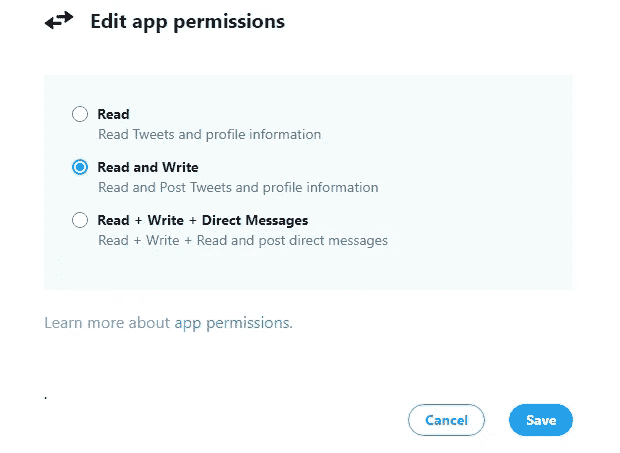
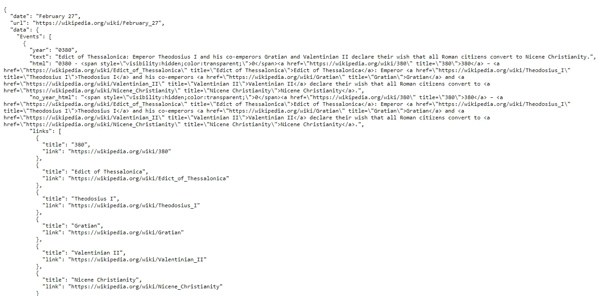
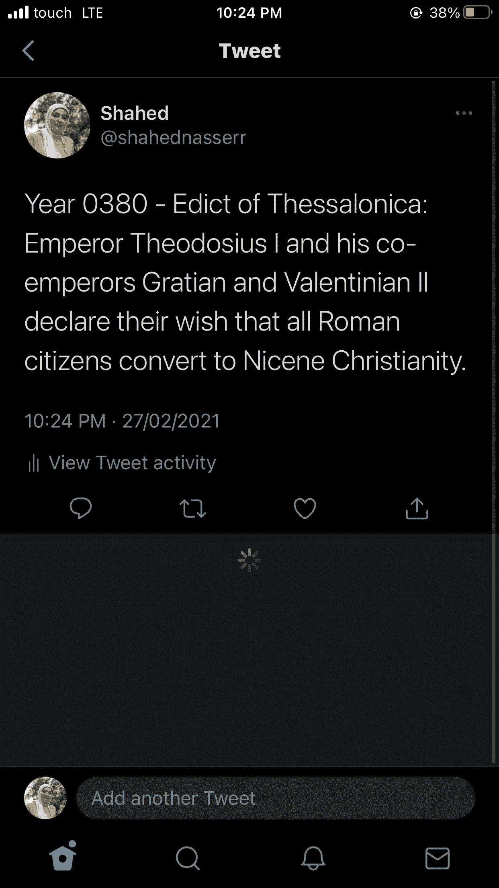

# 使用 Node.js 的简单 Twitter Bot 教程

> 原文：<https://levelup.gitconnected.com/simple-twitter-bot-tutorial-with-node-js-9a6fb42aeea>


*本文原帖* [*我的个人 blo*](https://blog.shahednasser.com/simple-twitter-bot-tutorial-with-node-js/) *g.*

你可能已经在 Twitter 上看到了这么多的 Twitter 机器人，并且想“嗯，我怎么也能创建一个呢？”

在本教程中，我们将创建一个简单的 Twitter 机器人，它使用[历史上的今天](https://history.muffinlabs.com/) API 来发布历史上今天发生的事情。我们称它为历史机器人。您可以在这里找到包含完整代码[的存储库。](https://github.com/shahednasser/history-bot)

# 创建 Twitter 应用程序

在开始技术部分之前，我们首先需要创建一个 Twitter 应用程序。首先，用你想让机器人发微博的 Twitter 账户登录 [Twitter 开发者门户](https://developer.twitter.com/)。

完成后，点击[此处](https://developer.twitter.com/en/portal/apps/new)创建一个新应用。您也可以在项目&应用>概述>创建应用下找到它。

您将被要求输入信息，如应用程序的名称、应用程序的描述以及您将使用该应用程序的目的。一旦你完成了，你会看到一组钥匙。您还不需要保存这些密钥，因为我们稍后会重新生成它们。只需向下滚动并点击应用程序设置。

当你进入你的应用程序的仪表板，点击设置选项卡，然后向下滚动到应用程序权限。你会看到上面写着读。如果我们要发 tweet，我们需要把它改成 Read 和 Write，所以点击 edit 按钮，从列表中选择 Read + Write，然后点击 Save。



现在，返回到“密钥和令牌”页面，向下滚动到“访问令牌和密码”，然后单击“重新生成”。我们需要重新生成它们的原因是，初始令牌仅用于读取权限，不能用于添加 tweet，即写入。单击“重新生成”并获得新密钥后，请确保保存它们，因为除非再次重新生成，否则以后看不到它们。

如果您没有 API 密匙和密码，您还需要重新生成它们。如果你这样做了，确保保存它们以备后用。

# 创建机器人

现在我们将进入技术部分。我们首先需要初始化我们的项目:

```
mkdir history-bot 
cd history-bot 
npm init
```

当您运行`npm init`时，您将需要输入一些信息，如包名或描述。您也可以跳过这一步，通过运行`npm init -y`使用默认设置

当你完成了上面的命令，你就有了这个项目的框架。

接下来，我们将安装 [twitter-api-client](https://github.com/FeedHive/twitter-api-client) 包，以便与 twitter 的 api 轻松交互:

```
npm i twitter-api-client
```

为了安全地使用我们的令牌和 API 密钥，我们将使用 dotenv 包:

```
npm i dotenv
```

接下来，创建应该包含以下键的`.env`文件:

```
TWITTER_API_KEY= 
TWITTER_API_SECRET= 
TWITTER_ACCESS_TOKEN= 
TWITTER_ACCESS_TOKEN_SECRET=
```

**注意**:如果你正在使用库的代码，有一个`.env.sample`文件，你可以把它重命名为`.env`，并在其中添加你的密钥。

在`.env`中添加您之前保存的密钥并保存文件。

现在，创建`index.js`，它将保存我们的代码。我们将通过要求我们将使用的包来开始脚本:

```
require('dotenv').config() 
const {TwitterClient} = require('twitter-api-client')
```

第一行确保我们可以使用我们在`.env`文件中添加的变量。

然后，我们将使用我们在`.env`中的凭证创建一个 Twitter 客户端:

```
const twitterClient = new TwitterClient({
 apiKey: process.env.TWITTER_API_KEY,
 apiSecret: process.env.TWITTER_API_SECRET,
 accessToken: process.env.TWITTER_ACCESS_TOKEN,
 accessTokenSecret: process.env.TWITTER_ACCESS_TOKEN_SECRET 
})
```

所以让我们回到我们说过的机器人会做什么。该机器人将从历史上的今天 API 中获取历史上这一天发生的事情，然后将它发送到我们的帐户。要向 API 发送请求，我们需要安装 axios:

```
npm i axios
```

让我们看一下 API。对端点 https://history.muffinlabs.com/date[的 GET 请求将会给我们一个类似这样的对象:](https://history.muffinlabs.com/date)



因此，响应是一个具有属性`date`、`url`和`data`的对象。在`data`中有一个`Events`属性，它保存了历史上这一天发生的一系列事件。在本教程中，我们将只发送数组中的第一个项目。

我们将添加以下代码向 API 发送请求并检索事件:

```
axios.get('http://history.muffinlabs.com/date')
    .then(response => {
    const data = response.data.data ? response.data.data : {}
    let tweet
    if (data.Events && data.Events.length) {
        //tweet the first event in the array
        tweet = 'Year ' + data.Events[0].year + ' - ' + data.Events[0].text
    } else {
        tweet = 'Nothing happened today :)'
    }

    //TODO send the tweet
}).catch (err => {
    console.error(err)
})
```

下面是我们正在做的详细工作:

我们向端点发送 GET 请求，然后通过`response.data`获取数据。由于响应对象具有保存`Events`的属性`data`，我们将它赋给一个新变量`data`:

```
const data = response.data.data ? response.data.data : {}
```

接下来，我们将设置将要发送的 tweet。如果在接收到的数据对象中有一个`Event`属性，并且至少包含一个条目，我们将 tweet 设置为年份加上文本:

```
if (data.Events && data.Events.length) {
	//tweet the first event in the array
	tweet = 'Year ' + data.Events[0].year + ' - ' + data.Events[0].text
}
```

如果没有收到 Events 属性，或者这一天没有事件，我们将把 tweet 设置为默认文本:

```
else {
	tweet = 'Nothing happened today :)'
}
```

我们还在 GET 请求中添加了一个 catch，以防出现错误:

```
.catch (err => {
    console.error(err)
})
```

剩下的就是使用我们之前创建的 Twitter 客户端将推文发送到我们的帐户。我们将使用`twitterClient.tweets.statusesUpdate`方法，该方法可以接受许多可选参数(您可以在这里查看所有细节)，但需要一个参数`status`，即 tweet 的文本。

这将是发送推文的代码:

```
twitterClient.tweets.statusesUpdate({
    status: tweet
}).then (response => {
    console.log("Tweeted!", response)
}).catch(err => {
    console.error(err)
})
```

如果 tweet 通过，我们将使用响应对象记录到“Tweeted”控制台。如果出现错误，我们会将错误记录到控制台。

现在，我们的脚本应该是这样的:

```
require('dotenv').config()
const {TwitterClient} = require('twitter-api-client')
const axios = require('axios')

const twitterClient = new TwitterClient({
    apiKey: process.env.TWITTER_API_KEY,
    apiSecret: process.env.TWITTER_API_SECRET,
    accessToken: process.env.TWITTER_ACCESS_TOKEN,
    accessTokenSecret: process.env.TWITTER_ACCESS_TOKEN_SECRET
})

axios.get('http://history.muffinlabs.com/date')
    .then(response => {
    const data = response.data.data ? response.data.data : {}
    let tweet
    if (data.Events && data.Events.length) {
        //tweet the first event in the array
        tweet = 'Year ' + data.Events[0].year + ' - ' + data.Events[0].text
    } else {
        tweet = 'Nothing happened today :)'
    }

    twitterClient.tweets.statusesUpdate({
        status: tweet
    }).then (response => {
        console.log("Tweeted!", response)
    }).catch(err => {
        console.error(err)
    })
}).catch (err => {
    console.error(err)
})
```

我们现在准备运行脚本来发送推文。

转到`package.json`并在`scripts`中添加启动脚本:

```
"scripts": {
    "start": "node index.js"
},
```

然后，在终端或命令行中运行:

```
npm start
```

如果所有步骤都正确完成，您将在控制台中看到带有响应对象的“Tweeted”。你也可以进入你在 Twitter 上创建该应用的账户，你将看到你的推文！



如果您遇到与身份验证或授权相关的错误，请确保您的所有密钥和令牌都是正确的，并确保您启用了读+写权限。

# 结论

恭喜你，你已经创建了你的第一个 Twitter 机器人！我建议你浏览一下 Twitter 的文档和 twitter-api-client 包，看看你还能做些什么。

*原载于 2021 年 2 月 27 日 https://blog.shahednasser.com*[](https://blog.shahednasser.com/simple-twitter-bot-tutorial-with-node-js/)**。**