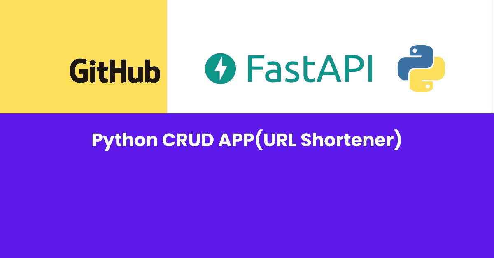
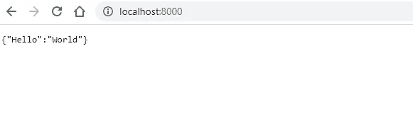
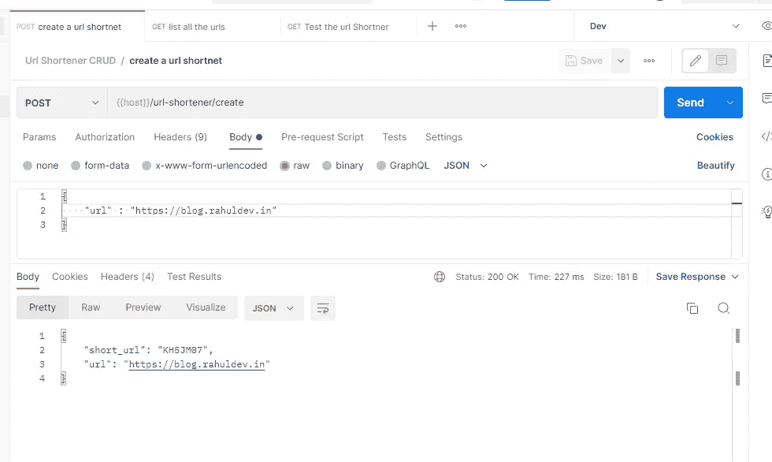
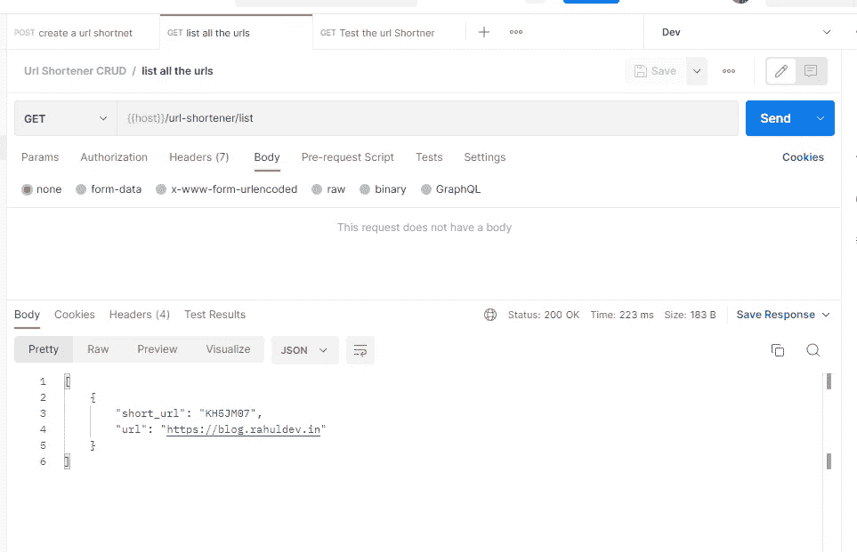
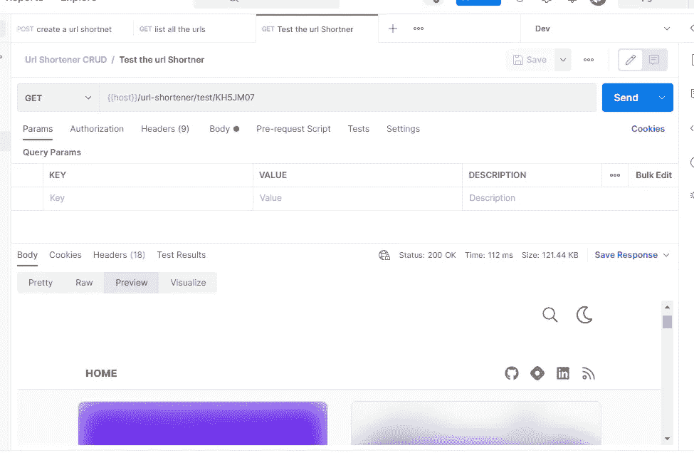
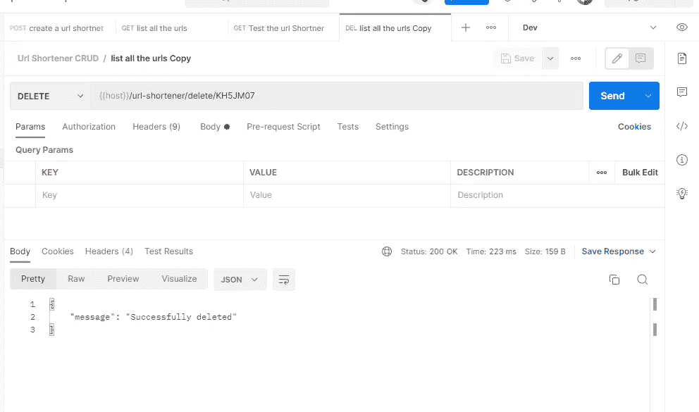

# Python 中的简单 URL shortener 应用程序，适合初学者(🔥FastAPI 演示)

> 原文：<https://levelup.gitconnected.com/simple-url-shortener-app-in-python-for-beginners-fastapi-demo-7978049f3532>



fastapi-url-shortener-app

# 介绍

这是一个用 Python FastAPI 开发的简单的 url 缩写应用程序。
[点击此处](https://github.com/rahul-yr/learn-fastapi-simple-url-shortner)进入 Github repo。
[点击此处](https://www.postman.com/rahul-public/workspace/fastapi-simple-url-shortner-crud/collection/8974578-e4dd76aa-0334-47c3-ba64-c84e27ff58f6)访问 Postman API 集合。

在本教程中，我们将主要关注 3 件事

*   它是初学者友好的。
*   专注于行业最佳实践。
*   部署到云。

本教程的范围主要集中在构建 API 上，而不是 Python 基础。如果你对 Python 完全陌生，我强烈建议你在阅读本文之前，对 Python 的基础知识有一个很好的了解。

# 先决条件

*   从[这里](https://code.visualstudio.com/download)下载并安装 VS 代码
*   从[这里](https://www.python.org/downloads/)下载并安装 Python

## 什么是虚拟环境？

虚拟环境是一个隔离的环境，用于保持您的项目依赖关系独立于任何其他项目或系统配置。这有助于避免不同版本之间的依赖冲突。

# 现场演示

点击此处测试[实时端点](https://learn-fastapi-url-shortener.herokuapp.com/url-shortener/list)

# 开发 URL 缩写 API

## 设置

*   打开 VS 代码，在根文件夹中创建一个名为`main.py`的新文件。
*   这个`main.py`文件负责运行您的应用程序，并作为应用程序的入口点。
*   使用这个命令`python -m venv virtual_env_name`创建一个 Python 虚拟环境
*   使用各自的操作系统命令激活您的虚拟环境。

```
# Linux
source virtual_env_name/bin/activate# Windows
virtual_env_name\Scripts\activate.bat#Mac
source virtual_env_name/bin/activate
```

*   在 Python 虚拟环境中安装所有必需的依赖项。

```
# add fast api package
pip install fastapi# add web server for running fast api
pip install "uvicorn[standard]"# add package for cleaning cache files
pip install pyclean
```

将下面的代码片段添加到`main.py`文件中。这个代码片段有两个 GET 请求方法类型的端点。一个端点返回`{"hello" : "world"}` json 响应，另一个返回您作为`item_id`传递的动态参数

*   使用下面的命令运行应用程序。默认的主机 url 是`[http://localhost:8000](http://localhost:8000)`

```
uvicorn main:app --reload
```

打开默认端点，如果您看到类似这样的内容，那么您已经成功地🔥在本地部署您的应用程序。



示例-fast API-端点

*   与 GET 方法类似，您可以定义您需要的任何支持的请求方法。
*   删除您添加的两个方法，即`read_root`、`read_item`，现在是实现真正的 url 缩短端点的时候了。

## 创建 URL 缩写端点。

*   在根文件夹中创建以下文件和目录。

```
# folder : 
url_shortener# files
url_shortener/__init__.py
url_shortener/database.py
url_shortener/router.py
url_shortener/models.py
```

*   `__init__.py` file 用于将当前文件夹表示为一个包。以便它可以在其他包中被引用。
*   `router.py`文件负责处理 url 捷径路由。
*   `models.py`是一个通用文件，用于定义所有必要的 url 缩写模型。
*   `database.py`文件负责处理数据库操作。由于互联网上有数百种数据库选项，为了简单起见，这里我们用 sleep 命令模拟数据库操作，并将数据存储在内存变量中。

## 定义模型

*   下面是`models.py`的片段。正如您在代码中看到的，它有两个模型。
*   `CreateUrlShortener`模型负责验证短 URL 的创建。
*   `CreateUrlShortenerResponse`模型被用作 json 响应模型。

## 定义数据库操作

*   下面是`database.py`文件的代码片段。它有一个成员变量`all_data`，将所有数据存储在内存中。在这里，您可以定义各自的数据库实例，而不是`in memory`变量。以及它有 3 个功能，创建一个短网址，删除一个短网址和获取所有的短网址。
*   这个代码片段有定义明确的注释，可以帮助您详细理解逻辑。

## 创建端点

*   下面是`router.py`文件的代码片段。
*   在这里，我们定义了一个名为`url_shortener`的 api 路由器和一个名为`mock_db_operations`的数据库实例。
*   `url_shortener`用于将这些端点安装到主路由器上。
*   `mock_db_operations`用于执行数据库操作。
*   它为创建、删除、列出端点定义了 3 个方法，为测试 url 重定向定义了 1 个方法。使用行内注释来详细理解逻辑。

## 更新主文件

*   下面是安装了 url 路由器的`main.py`文件片段，即`url_shortener`。

# 使用以下命令在本地运行应用程序

```
uvicorn main:app --reload
```

*   使用[这个 postman 集合](https://www.postman.com/rahul-public/workspace/fastapi-simple-url-shortner-crud/collection/8974578-e4dd76aa-0334-47c3-ba64-c84e27ff58f6)作为 API 规范并测试端点。
*   下面是使用 Postman 的 API 请求和响应的一些快照。

## 创建 URL 缩写快照



创建短网址

## 列出所有短 URL



列表-短网址

## 实际测试重定向



测试-重定向-URL

## 删除短网址



删除短网址

# 部署到云

知道如何将这个回购部署到 Heroku 吗？[点击这里找到正确的方法](https://blog.devgenius.io/how-to-deploy-any-backend-to-heroku-easily-3194d48dd810)

# 摘要

可怕的🔥，您已经成功完成了本教程。我会💝听听你的反馈和意见，看看你能用它做些什么。如果你被困在某个地方，请随意评论。我随时都有空。

请在 [github](https://github.com/rahul-yr/learn-fastapi-simple-url-shortner) 找到完整的代码

# 分级编码

感谢您成为我们社区的一员！更多内容请参见[升级编码出版物](https://levelup.gitconnected.com/)。
跟随:[推特](https://twitter.com/gitconnected)，[领英](https://www.linkedin.com/company/gitconnected)，[通迅](https://newsletter.levelup.dev/)
**升一级正在改造理工大招聘➡️** [**加入我们的人才集体**](https://jobs.levelup.dev/talent/welcome?referral=true)