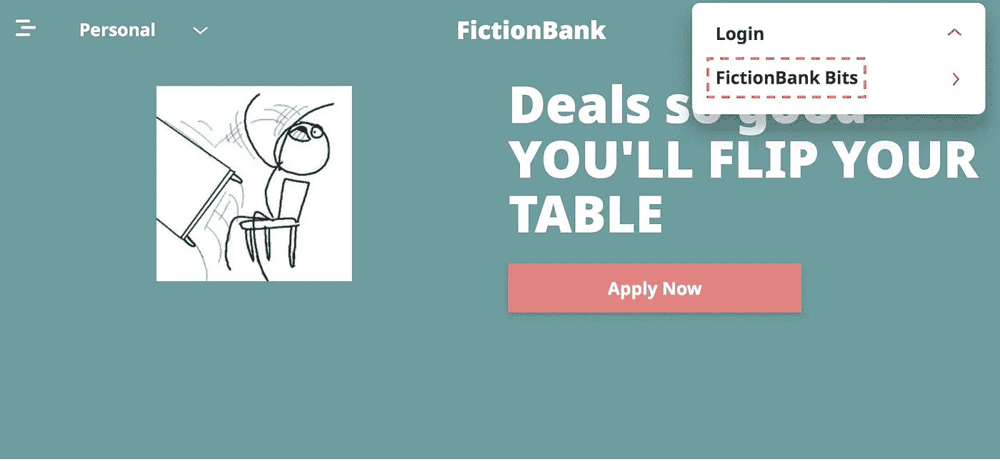
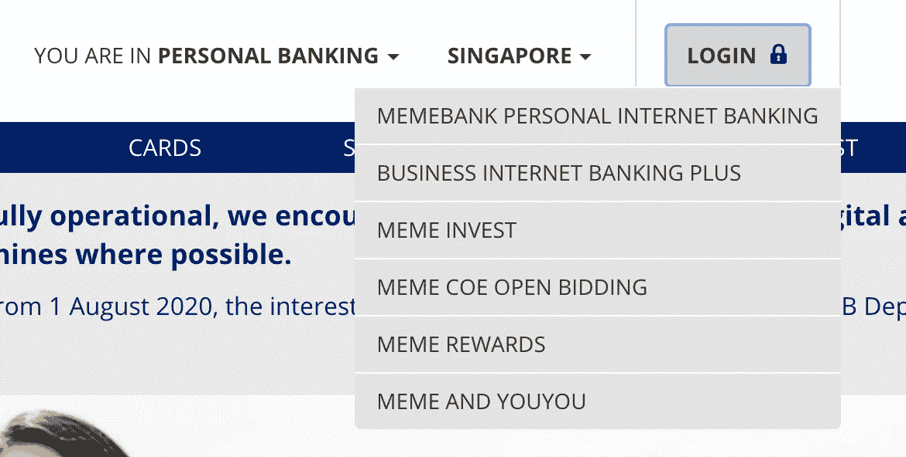
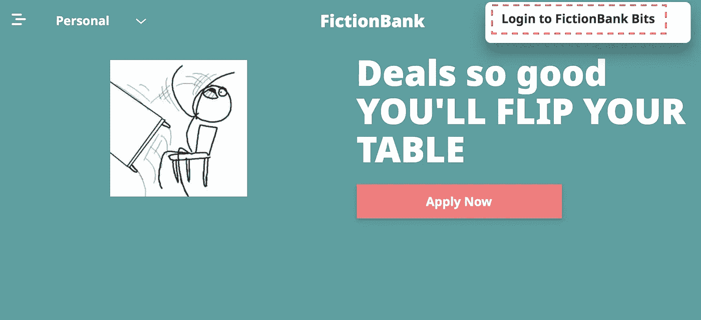
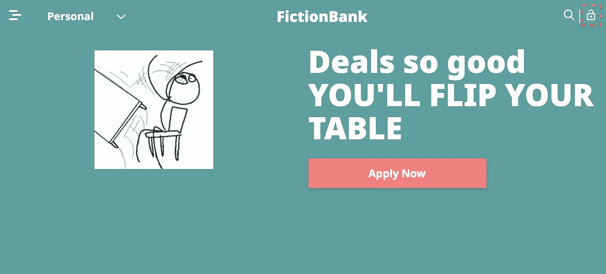
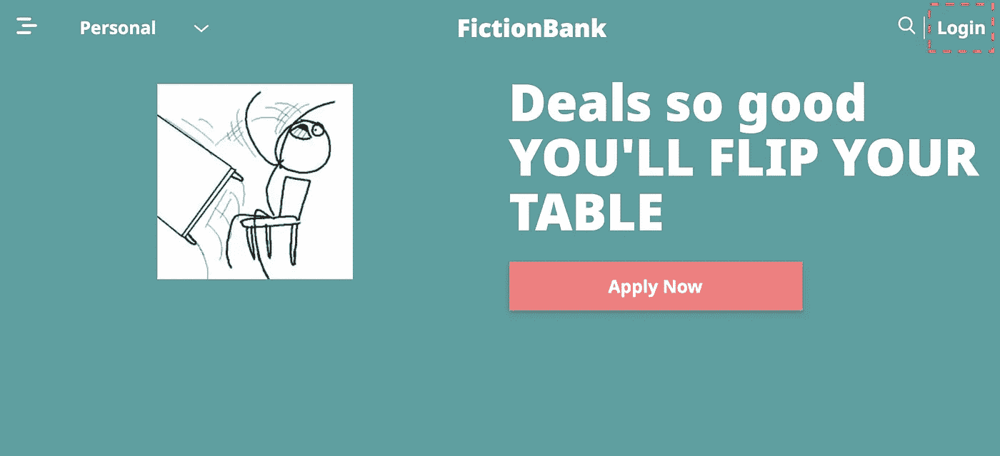
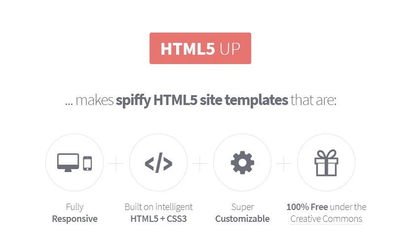

# 工程师的简单 UX——少即是多(有时),简单就好

> 原文：<https://levelup.gitconnected.com/simple-ux-for-engineers-less-is-more-sometimes-and-simple-is-fine-1c672713ad1c>

来源: [pixabay](https://pixabay.com/photos/man-happy-face-smiley-mask-390342/) ，作者: [PDPics](https://pixabay.com/users/PDPics-44804/)

> 漂亮的用户界面只会让你赢得 1/2 的战斗——如果你的用户界面使用不当，UX 很可能会被冲进马桶

当我们每天构建应用程序时，我们努力寻找最好的方法来制作最吸引人的用户界面(UI)，并将其与带来最佳用户体验的用例配对(UX)。毫无疑问，最好的用户界面考虑到了它的用户，以提供最好的 UX，这是我绝对想投入我的“客户忠诚度”的东西。

然而，UI 和 UX 的故事并不是一场简单的战斗，可以轻松地战斗并赢得胜利。**UX 比 UI 更是如此，任何 UI 都可以作为一个整体来评估其“审美得分”，但在用户旅程的任何一点上，一个破损的 UX 都很容易导致用户给出一个不及格的分数，并完全停止他们的使用。**

作为一名工程师，我与非常有才华的设计师一起工作，尽我们所能呈现最好的用户体验。**然而，在有些情况下，我没有机会和设计师一起工作(例如，我自己的项目是一个人的团队)。在这些情况下，我逐渐意识到我可以用这两点来指导我自己的设计，而不会让我的用户太多犯错。这些是:**

**少即是多(有时)** — **减少**视觉干扰，**让用户完成更多**建设性工作。

**简单就好—** 简单的工作流程很酷。当用户只想做一件事的时候，复杂的小部件和工作流程只会诱发挫败感。

这篇文章的部分灵感来自于我使用时遇到的一些问题，特别是银行应用程序。在几分钟的尝试之后，我认为这是一个很好的关于不要做什么的案例研究。**我将匿名展示来自同一应用程序的示例，并分享我对减少内容和简化用户界面如何更好地为您的用户服务的想法。**

# 案例研究:登录

我在网站上遇到的第一个棘手问题是登录。在我从主页开始的用户之旅的第一个 30 秒，你可以看到以下内容。

正如我所观察到的，UI 看起来很光滑，但是我不知道如何登录。所有我期望完成的按钮都让我失望了。我曾以日常用户的身份问过我的妻子，她既不是工程师也不是设计师，她也不明白这一点。

经过一些随机点击，我们发现**“虚拟银行位”**选项导致登录屏幕。从上下文来看，**“fiction bank Bits”**是我行个人银行服务的名称。

Wuuuuuuuuuuut

有几个原因让我觉得很奇怪。

首先，“登录”文本显然不符合我的解释，让我踏上用户登录之旅。大多数其他网站都是这样工作的，这让我对这个特殊的 UI 感到困惑。

其次，仔细一看，发现“登录”代表一个可折叠菜单的链接是很奇怪的。在我看来，对于“登录”这个动作来说，将目标产品放在这个动作下似乎有些奇怪。在我看来，下面的重新分类(字体粗细减少)感觉更好:

交换顺序，以便可操作的链接有一个明显的位置

或者，如果产品必须在动作下分组，产品名称可以用更简单易懂的文字代替。这是另一家银行使用的类似用户界面:

容易分辨吗？对我来说，我可以看到第一个选项是我想要的！

第三，可折叠菜单似乎是多余的，因为每个菜单只有一个选项。去掉菜单怎么样:

更进一步，完全删除菜单:

既然 navbar 中有这么多的资产空间，为什么不简化并显示全文呢？对于较小的屏幕尺寸，我们可以恢复使用图标。

有了这个修改，我把它展示给了我的妻子，她设法在 5 秒内精确定位了登录按钮，这与以前的 UI 大相径庭。

对于以上所述，我只想补充一点，因为这主要是我的观点，我努力从我周围的人那里收集更多的意见，而不是让我的意见来定义我的叙述。对于生产系统，获得适当的用户反馈来做同样的事情将有利于满足用户。

现在我们有了一些简单的指导原则，任何工程师都可以从中获得对 UI / UX 的基本期望。如果需要更复杂的元素和漂亮的设计，我仍然会向我的设计师队友和专业人士寻求急需的建议。

在结束之前，我对以上两点还有一点看法，虽然这更像是一个提示，但不是这次讨论的核心。**(声明:我不拥有这些网站中的任何一个)**

来自像 **html5up** 这样的网站的可定制模板使得创建漂亮的网络应用程序变得容易——来源: [html5up](https://html5up.net/)

**使用网上找到的模板—** 如果你像我一样，不是前端工程师，并且独自从事一个项目，你可能不想把所有时间都花在 CSS 和创建小部件上。像 [bootstrap](https://getbootstrap.com/) 和 [html5up](https://html5up.net/) 这样的网站可以帮助你快速提升你的项目。

Boomz，我只有这些了。

再见