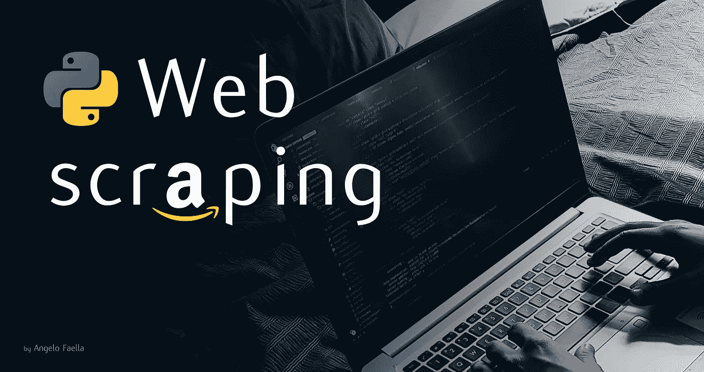
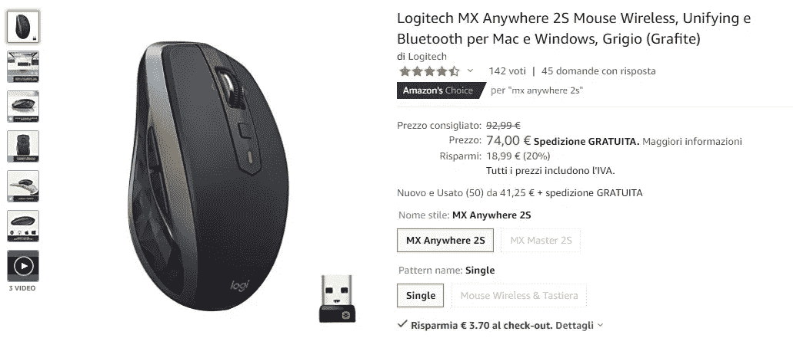
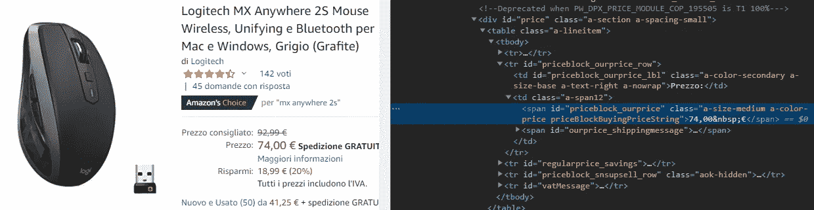
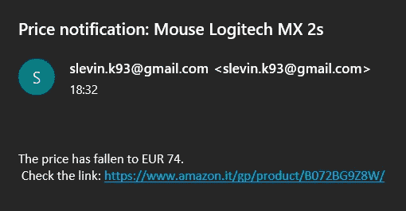

# 用 Python 实现简单的 Web 抓取

> 原文：<https://levelup.gitconnected.com/simple-web-scraping-with-python-1692c11e3b1a>

## 学习 Python 中的 web 抓取，使用它在黑色星期五发现交易并通过电子邮件提醒您

黑色星期五就要到了，和往常一样，你会在等待大折扣的同时不断刷新你想要的商品页面。

别担心，还有另一种方法来关注你喜欢的产品的价格。用 **Python** 就可以了！在这篇简短的文章中，我们将看到如何创建一个 Python 脚本，当我们最喜欢的商品在亚马逊上的价格低于某个阈值时，它会向我们发送一封电子邮件。

## 目标

因为我需要一个鼠标，例如我选择了*罗技 MX 2S 无线。*

*罗技 MX 2S 无线*

从该产品的亚马逊页面，我们需要 2 样东西:

1.  页面的 URL
2.  包含价格的 HTML 元素的`id`。

第一件事非常简单，只需复制页面的 URL 并粘贴到一个便笺中。对于第二个，您需要检查页面的 HTML 代码。

HTML 源代码

如上图所示，价格包含在带有`*id="priceblock_ourprice"*` *的`**` 元素中。*完美！保存这些信息并进入您最喜欢的 IDE。

## 剧本

让我们开始导入我们需要的模块:`requests`请求网页，`BeautifulSoup` 解析 HTML，`smtplib`发送电子邮件。

模块导入

我们将把代码分成两个函数:`check_price` 和`send_email` *。*我们的“主要”将是这样的:

主要的

如您所见，当产品的实际价格低于阈值时，我们会发送一封电子邮件(`MY_PRICE`)。在这种情况下，我将阈值设置为大于实际价格，只是为了测试一切正常。

现在让我们编写`check_price`函数:

检查价格

首先要做的是使用`request`的`get(…)`方法请求网页。我们传入页面的 URL 和 HTTP 请求的头。然后，我们可以用 BeautifulSoup 解析 HTML，用`*id="priceblock_ourprice"*` *解析`find(…)`元素。*完成后，我们可以提取价格并将其作为`int`返回。

一旦我们得到实际价格，如果它低于我们的阈值，我们就发送一封带有`send_email`功能的电子邮件:

发送电子邮件

使用`smtplib`，我们首先通过`ehlo()`向服务器表明自己的身份(在本例中是 G *mail* ，然后我们使用`starttls()`建立一个 **TLS** 连接。下面所有的 SMTP 命令都会被加密，所以我们应该再次调用`ehlo(…)`(见 [smtplib 文档](https://docs.python.org/3/library/smtplib.html))。除了您的电子邮件地址之外，您还可以通过`login()`方法登录，即您的 Gmail 帐户密码或 [**应用程序密码**](https://myaccount.google.com/apppasswords) (推荐)。请注意，要使用应用程序密码，您必须在您的 Google 帐户中启用双重身份验证。

对于要发送的消息，我简单地写了一个包含实际价格和产品页面链接的字符串。当然，你可以自定义它，并添加其他信息。最后，我们可以使用`sendmail()`方法发送电子邮件，将发件人、收件人和消息作为输入。邮件发出后，我们可以用`quit()`关闭与服务器的连接。

## 结果呢

一旦我们完成并执行了脚本，我们将会收到一封这样的电子邮件:

电子邮件通知

太好了！一切都很好。

您可能想知道如何让这个脚本按计划自动运行。嗯，有不止一个选项可以做到这一点，我的建议是创建一个 [AWS Lambda](https://aws.amazon.com/it/lambda/) 函数，并使用 [AWS CloudWatch](https://aws.amazon.com/it/cloudwatch/) 事件来调度它。下面是 AWS 简单有效的教程: [*使用 CloudWatch events*](https://docs.aws.amazon.com/AmazonCloudWatch/latest/events/RunLambdaSchedule.html) 调度 Lambda 函数。

## 最后的话

当然这个小脚本 [( *完整代码在这里* )](https://gist.github.com/AngeloFaella/c0e55b0485a31198aaaef09b7599f7ca) 可以用不同的方式改进，你可以把它作为更复杂的东西的快速起点。

*想法？有问题吗？错误？请在下面的评论中告诉我，如果你喜欢这篇文章，请分享！*

*查我上* [*Linkedin*](https://www.linkedin.com/in/angelo-faella/) *，*[*GitHub*](https://github.com/AngeloFaella)*或*[*Dribbble*](https://dribbble.com/angelo_faella)*。回头见*😉👋