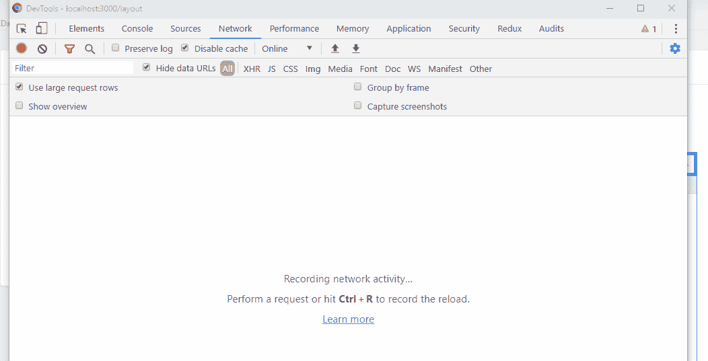
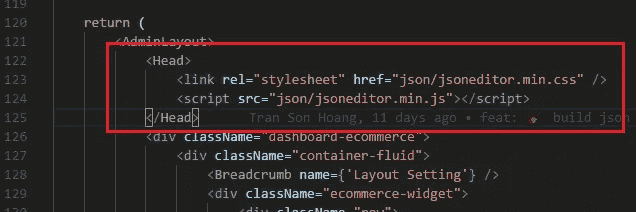
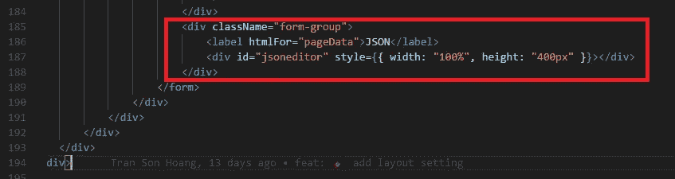
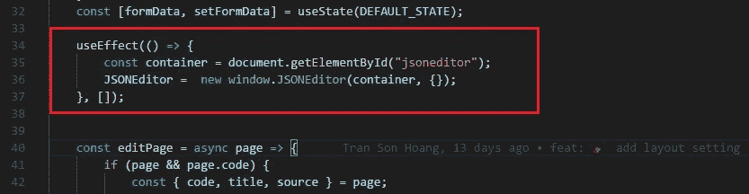
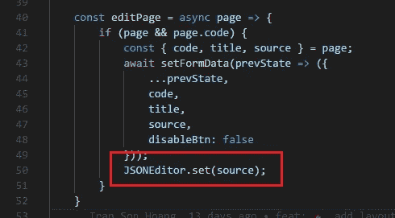
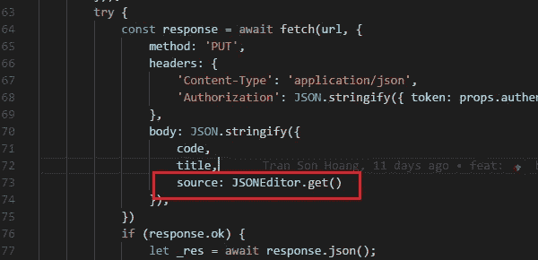

# 如何向 React + Next.js 应用程序添加 JSON 编辑器

> 原文：<https://levelup.gitconnected.com/simplest-way-to-add-json-editor-to-nextjs-application-6baa71b5b4dd>

## 反应

向使用 React 和 Next.js 构建的服务器端呈现应用程序添加 JSON 编辑器的简单指南


由 [Toa Heftiba](https://unsplash.com/@heftiba?utm_source=unsplash&utm_medium=referral&utm_content=creditCopyText) 在 [Unsplash](https://unsplash.com/s/photos/coffee?utm_source=unsplash&utm_medium=referral&utm_content=creditCopyText) 上拍摄

在本文中，我将一步一步地指导您将 JSON 编辑器添加到应用程序的 UI 中。

1.  介绍
2.  示范
3.  综合

*更多类似内容，请查看*[*https://betterfullstack.com*](https://betterfullstack.com)

# 介绍

最近，我添加了 JSON 编辑器来编辑 JSON 类型的数据，并将其发送到服务器以存储在数据库中。

应用程序使用的是 React 框架 [Next.js](https://nextjs.org/) 。在本文中，我不会对这个框架进行更多的讨论。我将重点介绍如何向服务器端呈现应用程序添加 JSON 编辑器。

我使用了 [json-editor](https://github.com/json-editor/json-editor) 库来构建一个 json 编辑器。这个库将帮助您格式化 UI 中的 JSON 数据，并允许用户对其进行修改。

# 示范

这是演示。



演示加载 JSON 编辑器并将数据设置到编辑器中

在上面的演示中，我做了两件事:

*   在开始时加载 JSON 编辑器
*   当用户点击编辑按钮时，在 JSON 编辑器中设置数据

下一条路径将更详细地介绍我是如何做到的。

# 综合

为了将它添加到 Nextjs 应用程序中，我们需要做 3 件事:

1.  将 CSS 和 JS 添加到 head
2.  添加 HTML
3.  添加 JavaScript 代码来初始化编辑器

**在头部添加 CSS 和 JS**

当 npm 使用以下命令安装时，可以选择从`node_modules`获取所有资源:

```
npm install @json-editor/json-editor
```

我没有遵循这个方法。我将`jsoneditor.min.js`和`jsoneditor.min.css`复制到 Next.js 中的`public`文件夹，这样可以更容易地从 **head** 标签中获取资产。



为 jsoneditor 添加样式和 js

**添加 HTML**

现在我将按照库的[自述文件中的指导添加 HTML。](https://github.com/josdejong/jsoneditor)

```
<div id="jsoneditor" style="width: 400px; height: 400px;"></div>
```

我仍然保留着`style`的属性在那里。我想快速完成这项工作，但如果你喜欢，你可以采用更优雅的造型方法。



添加 html 以加载 json 编辑器视图

**添加 JavaScript 代码来初始化编辑器**

根据页面上的逻辑，此路径可能会有所不同。在我的例子中，为了加载编辑器，我在 React 中使用了[效果挂钩](https://reactjs.org/docs/hooks-effect.html)，这在 16.8 版本中可用。



使用效果挂钩来加载 JSON 编辑器

我必须使用 Effect 钩子的原因是确保钩子内的代码段将从客户端运行，因为`window is undefined`在服务器端。

对于上面的效果挂钩，我将第二个参数作为`[]`传递。我这样做是因为我只想让这个钩子只运行一次来创建 JSON 编辑器。

在[的 React 文档](https://reactjs.org/docs/hooks-effect.html#tip-optimizing-performance-by-skipping-effects)中，他们说:

> 如果您想运行一个效果并只清理一次(在挂载和卸载时)，您可以传递一个空数组(`[]`)作为第二个参数。这告诉 React 你的效果不依赖于道具或状态的任何值，所以它不需要重新运行。这不是作为特例来处理的——它直接源于依赖关系数组的工作方式。

我在 React 上贴了这篇短文，因为我看到一些人在使用效果挂钩时犯了这个错误，这会降低你的应用程序的速度，并导致一些意想不到的错误。

有些人在 StackOverflow 中问道:

[useEffect 运行无限循环，尽管依赖关系没有变化](https://stackoverflow.com/questions/57859484/useeffect-runs-infinite-loop-despite-no-change-in-dependencies)

[为什么每次渲染都调用“useEffect”中的清理函数？](https://stackoverflow.com/questions/57023074/why-is-the-cleanup-function-from-useeffect-called-on-every-render)

确保只运行一次`[]`，或者将一些特定的值从组件范围传递给第二个参数。这将只在值改变时触发钩子，避免钩子无限运行。

如何设置编辑器:



将数据设置到 JSON 编辑器

如何向服务器发送数据:



在 JSON 编辑器中获取数据

你可以从[这里](https://github.com/josdejong/jsoneditor/blob/master/docs/api.md)阅读更多方法。

# 结论

本文包含了向应用程序添加 JSON 编辑器所需的所有信息。这些结果可以转移到任何 UI 框架，比如 Vuejs、Angular 和 React。

我希望这篇文章对你有用！你可以在[媒体](https://medium.com/@transonhoang?source=post_page---------------------------)上关注我。我也在[推特](https://twitter.com/transonhoang)上。欢迎在下面的评论中留下任何问题。我很乐意帮忙！

[](https://betterfullstack.com/stories/) [## 故事-更好的全栈

### 关于 JavaScript、Python 和 Wordpress 的有用文章，有助于开发人员减少开发时间并提高…

betterfullstack.com](https://betterfullstack.com/stories/)