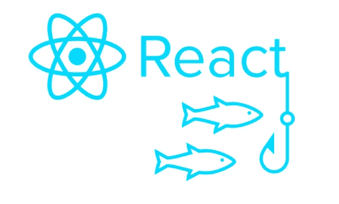
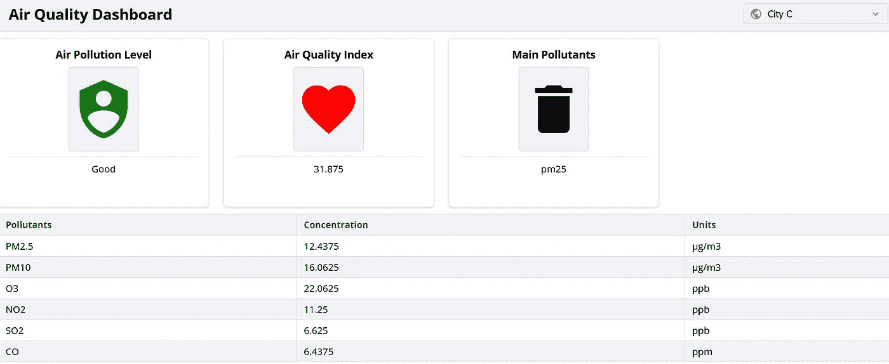
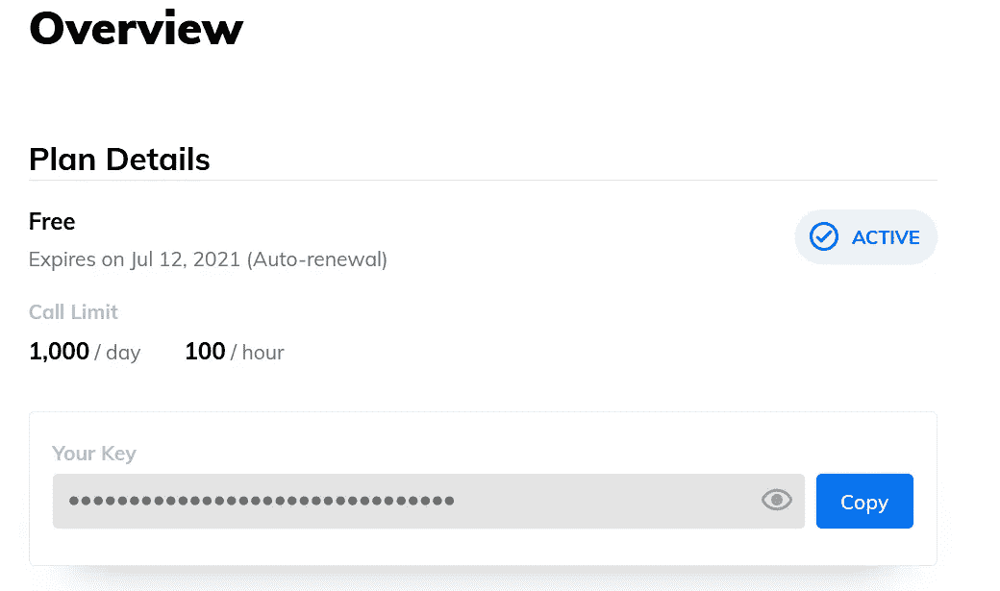

# 使用 React 挂钩简化空气质量数据获取

> 原文：<https://levelup.gitconnected.com/simplifying-air-quality-data-fetching-with-react-hooks-a15c7c6871e8>

用 AJAX、Promise 和 React 钩子构建一个监控仪表板



作者图片

通过阅读这篇文章，您将学会创建一个简单的基于 React 的监控仪表板，它根据用户选择的城市显示空气质量信息。这是一个监控仪表板的示例。



作者图片

在本教程中，我们将利用 AJAX、Promise 和 React 钩子。

# 1.反应钩

供您参考， [React 挂钩](https://reactjs.org/docs/hooks-intro.html)是

> “React 16.8 中的新功能。它们让你不用写类就能使用状态和其他 React 特性。”

Hooks 是 React 最新版本中的一个强大特性，因为它提供了一个标准化的、可重用的方法，而这是通过类无法实现的。钩子提供了一种从组件中提取逻辑和状态的方法。您可以独立地重用逻辑和状态，而无需更改组件的层次结构。

默认情况下，React 为我们提供了两种类型的挂钩:

*   状态挂钩
*   效果挂钩

## 状态挂钩

状态挂钩是一种挂钩类型，主要用于在功能组件内部添加一些本地状态。这种状态将在每次重新渲染之间保留。它是通过内置`useState`调用的。您可以轻松导入如下内容:

```
import React, { useState } from 'react';
```

`useState`返回两个变量:

*   第一个变量表示当前状态值
*   第二个变量表示一个函数，您可以在其中使用它来更新它

您可以在代码中的任何地方调用该函数。一个常见的用例是在事件处理程序中调用它，如`onChange()`或`onClick()`。这个概念或多或少与类中的`this.setState`相同，唯一的例外是它没有将新旧状态合并在一起。让我们看看下面的例子:

```
const [city, setCity] = useState('');
```

`useState`接受代表初始状态的参数。它可以是你想要的任何东西，可以是对象，字符串，甚至是整数。

## 效果挂钩

Effect Hook 增加了执行辅助操作的能力，如数据获取、订阅或从函数组件手动更改 DOM。它作为一个 API，在以下方面具有相同的功能:

*   `componentDidMount`
*   `componentDidUpdate`
*   `componentWillUnmount`

它是通过`useEffect`调用的，您可以按如下方式导入它:

```
import React, { useState, useEffect } from 'react';
```

`useEffect`通知 React 在每次渲染后对组件做些什么。让我们看看下面的例子

```
function App() { useEffect(() => {
    console.log("Call API");
    // call API during each render });}
```

默认情况下，它会在第一次渲染时以及每次更新后运行。当且仅当某些值在重新渲染之间发生变化时，您可以通过触发它来进一步优化它。简单地将一个数组作为可选的第二个参数传递给它，如下所示

```
const [data, setData] = useState(0);useEffect(() => {

  // call API if and only if data has changed}, [data]);
```

此外，通过将空数组作为第二个参数传递，您可以选择运行一个效果并只清理一次。它只会被调用一次，并且在每次更新后不会重新运行。

## 钩子的规则

强烈建议遵守[以下规则](https://reactjs.org/docs/hooks-rules.html)，以防止在 React 应用程序中使用钩子时出现任何问题或错误:

*   总是在代码的顶层使用钩子。你不能在循环或条件中调用钩子。当谈到 React Hooks 时，嵌套函数也是一个大问题。这是为了确保每次组件渲染时钩子都以相同的顺序被调用。
*   总是在 React 函数中使用钩子或者自定义钩子，而不是常规的 JavaScript 函数。这是为了防止由于在其源代码中不可见的挂钩而可能引起的任何问题或错误。

让我们继续下一部分，从安装开始。

# 2.设置

如果你是刚反应过来的，强烈建议先看完[官方教程](https://reactjs.org/tutorial/tutorial.html)再继续。如果您不确定要做什么，只需克隆下面的[库](https://github.com/Assenti/react-ui-components)并在根目录下运行`npm install`。

## 反应 UI 组件

对于本教程，我将使用以下开源的 [React UI 组件](https://github.com/Assenti/react-ui-components)来构建仪表板的界面。确保您已经在项目中安装了以下模块。

*   反应
*   反应范围

运行以下命令通过`npm`安装`React UI Components`。

```
npm install @assenti/rui-components -S
```

如果您使用的是纱线，请按照以下方式安装:

```
yarn add @assenti/rui-components
```

## 空气质量指数

为了获得最新的空气质量信息，我依靠的是 ClimaCell 的天气 API，我个人使用的是免费版本。一旦你注册了，你将得到一个免费的套餐，每天最多可以打 1000 个电话，每小时 100 个。API 附带了一些有用的信息，例如:

*   `pm25` —特殊物质< 2.5μm
*   `pm10` —特殊事项< 10 μm
*   `o3` —臭氧
*   `no2` —二氧化氮
*   `so2` —二氧化硫
*   `co` —一氧化碳
*   `epa_aqi` —符合美国环保局标准的空气质量指数。此外，还有一个基于中国 MEP 标准的版本。

注册后，您应该会看到下面的仪表板。记住 API 键，因为我们稍后将使用它来进行 AJAX 调用。



# 3.履行

让我们更深入地探讨一下基本用法，以及如何在 React 应用程序中实现数据获取。

## 索引. js /索引. ts

在您的`index`文件中添加以下进口声明。

```
import '@assenti/rui-components/css/index.css';
```

如果您已经克隆了整个目录，那么在`index.js`中应该有下面的 import 语句。

```
import './styles/index.scss';
```

## App.js / App.tsx

同样，转到您的`App`文件并添加以下导入语句。

```
import React, { useState, useEffect } from 'react';
import { TableSimple, Card, Avatar, List, Select, Icon, Header } from '[@assenti/rui-components](http://twitter.com/assenti/rui-components)';
const { Head, Body, Row, Cell } = TableSimple;
```

下一步是初始化以下变量。空气质量 API 要求纬度和经度作为查询参数的一部分。请根据您选择的位置随意修改它。

我将重用`Card`组件，将它封装在一个函数中，如下所示:

我们需要通过`XMLHttpRequest`调用 AJAX 的新函数。将它包装在一个`Promise`中，这样数据只在成功调用后更新。您可以根据自己的喜好使用新的`fetch`功能。

让我们看看下面的例子，如果调用成功，它将返回一个 JSON 对象。根据您的偏好修改查询参数。此外，您需要使用自己的 API 密钥才能使其工作。

最后一步是导出用于 React 渲染的 UI 组件。整个用户界面分类如下:

*   `Header` —显示 React 应用程序的名称和一个城市下拉列表供用户选择。
*   `Three Cards` —显示所选城市空气质量的基本信息。
*   `Table` —分别显示污染物及其浓度。

请注意，我已经声明了三个`State Hooks`和一个`Effect Hook`，每当`city`的值改变时，它们将进行 AJAX 调用并更新数据。

## 跑步反应

完成后，运行下面的代码来启动 React 的开发服务器

```
npm start
```

您应该会看到以下网页。只需通过右上角的`selection UI`更改城市，数据就会相应刷新。


作者图片

# 4.结论

让我们回顾一下今天所学的内容。

我们学习了 React 挂钩背后的基本概念，尤其是在`State Hook`和`Effect Hook`上。在我们的应用程序中使用 React 挂钩时，有两条重要的规则要遵循。

接下来，我们继续安装必要的模块。我们还签署了 **ClimaCell 的 API 免费计划**，以便获得基于纬度和经度的空气质量信息。

最后，我们实现了一个简单的 React 监控仪表板，允许用户获得所选城市的最新空气质量信息。

感谢你阅读这篇文章。希望在下一篇文章中再见到你！

# 参考

1.  [反应:引入钩子](https://reactjs.org/docs/hooks-intro.html)
2.  [React UI 组件 Github](https://github.com/Assenti/react-ui-components)
3.  [React UI 组件文档](https://assenti.github.io/react-ui-components/#/)