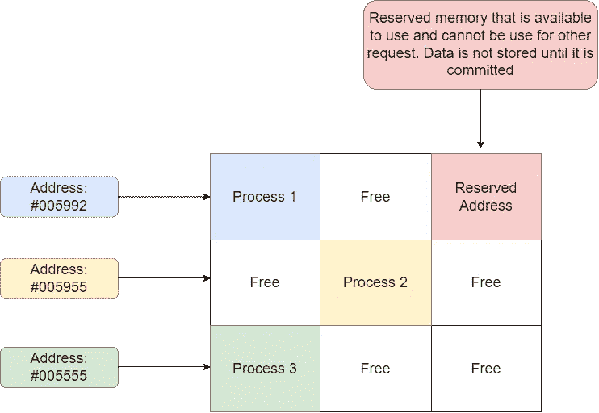
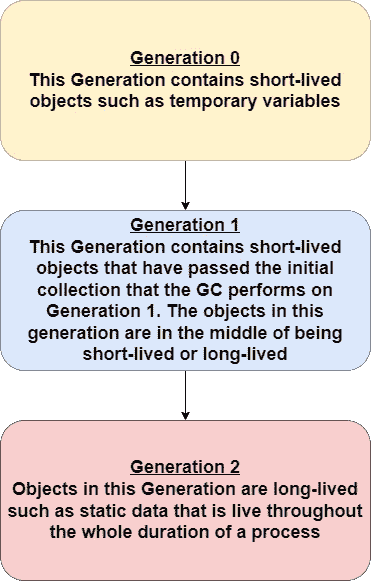

# 简化垃圾收集的工作方式。网

> 原文：<https://levelup.gitconnected.com/simplifying-how-garbage-collection-works-in-net-6c86d998328e>

## 从内存分配到释放内存

在 [Unsplash](https://unsplash.com/photos/d_3EKbSg1tg) 上由 [Bernd Dittrich](https://unsplash.com/@hdbernd) 拍摄的照片

垃圾收集器是一个内存管理器，负责为我们的应用程序分配和释放内存。这意味着开发人员无需担心编写执行内存管理任务的代码，从而降低了开发人员忘记释放内存并可能导致内存泄漏的风险。

## 简而言之，垃圾收集器做什么

*   我们已经提到过，它通过为开发人员进行内存管理来帮助他们。
*   在托管堆上分配对象。
*   识别不再使用的对象并清除内存，以便将来分配使用。
*   确保对象不能使用已经分配给另一个对象的内存。

## 记忆是什么样子的

实际上很简单，假设这些块是内存。每个进程都占用了一块内存，并有一个地址。块也可以是未使用的(空闲的)，或者它们可以被某个进程保留，但尚未使用(过渡阶段)。

## 托管堆

垃圾收集器由 CLR(公共语言运行时)初始化，然后分配一些内存来存储和管理对象。这种内存称为托管堆。

我们可以把托管堆看作两个不同的部分。第一部分存储较小的对象，而第二部分专门用于最小为 85，000 字节的较大对象。

记住这一点，让我们看看垃圾收集器是如何工作的。

## 世代

简而言之，代是将托管堆分成 3 部分以提高垃圾收集器性能的组。这背后的主要思想是:

*   压缩托管堆的一部分会更快。
*   较新的对象往往具有较短的生存期，而较旧的对象则相反，因为它们的生存期较长。

第 0 代是运行最频繁的集合。这背后的逻辑是新对象通常没有很长的生命周期。如果他们确实有更长的寿命，他们将进入第一代。GC 不经常尝试在第 1 代中释放内存，因为它知道其中的对象很有可能比第 0 代中的对象活得更长。如果 GC 在第 1 代上执行收集，并且一些对象幸存下来，它们将被提升到第 2 代，第 2 代是最不频繁收集的，因为在第 2 代中，生存期是最长的，从逻辑上讲，更频繁地检查它没有什么意义。

## 结论

开发人员并不真的需要与垃圾收集器交互，因为它为我们完成了工作，但是知道底层的工作方式总是很好的。虽然 C#足够好地为我们提供了内存管理，但有些语言却没有这种能力，深入了解内存分配和释放将会大有裨益。

 [## 通过我的推荐链接加入 Medium-Ivan Stoev

### 作为一个媒体会员，你的会员费的一部分会给你阅读的作家，你可以完全接触到每一个故事…

medium.com](https://medium.com/@ivan.zstoev/membership)