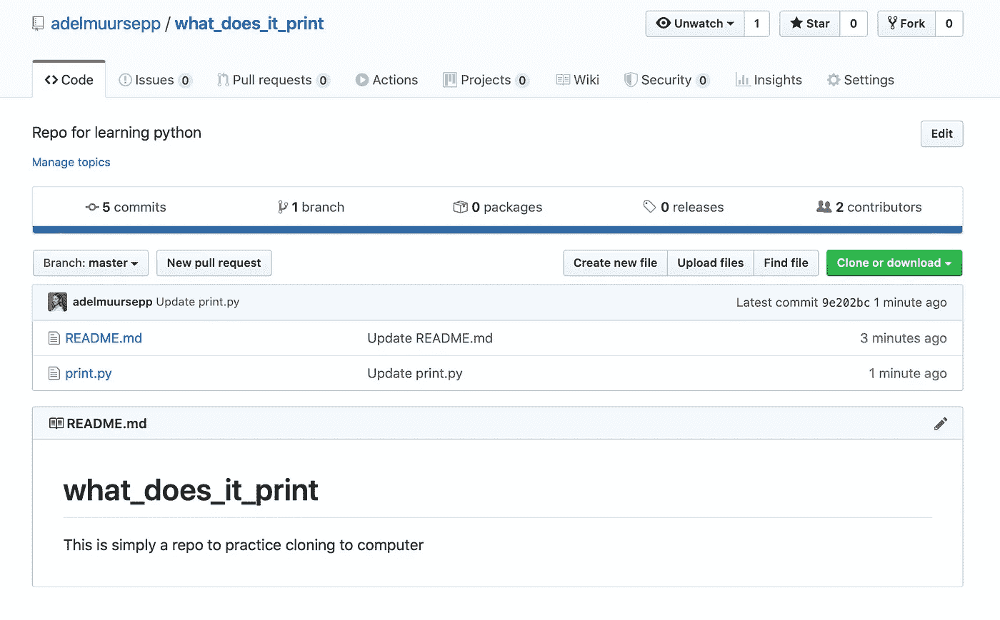
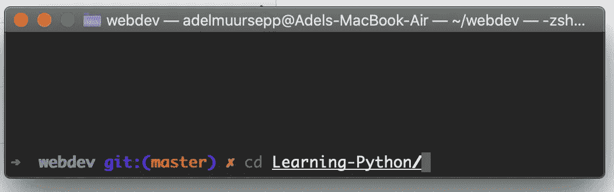
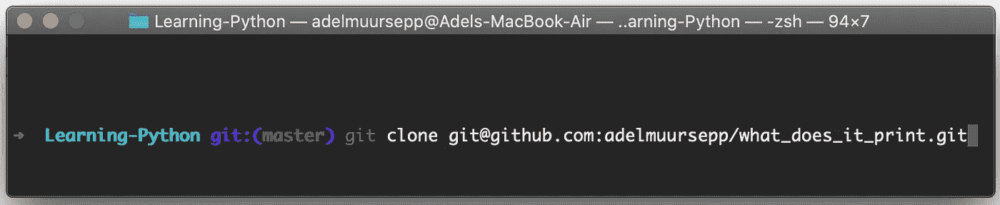

# 简单来说，我如何克隆 git 回购协议？

> 原文：<https://levelup.gitconnected.com/simply-how-do-i-clone-a-git-repo-f823ab3b805c>

这么多教程，这么多命令。我只想下载一个朋友的代码，随便玩玩。

谁能告诉我下载一个库的步骤，不要让我的终端显示疯狂错误的外星语言？

这里有一些简单的步骤，你需要把它们放入你的终端，从 Github 下载到你的电脑上。

我还概述了在同一个或您自己的回购中推送代码所需的所有步骤。

# 克隆项目的步骤

## 获取链接

*   转到 github 上的项目
*   单击绿色按钮进行克隆
*   复制链接

## 末端的

*   开放终端。按下 Cmd +空格键，输入终端
*   转到您想要下载代码的位置。为此使用`cd <here insert folder name>`命令。如果你觉得迷路了，就跳过这一步

## 克隆

*   在您选择的位置键入要终端:`git clone <paste link here>`
*   你完了！

# 将代码推送到 Github 的步骤🌎

这有点难，但是如果你按照步骤来做，你不会有任何错误。

## 更改代码

*   打开 Pycharm(如果您有其他编辑器，请使用您自己的编辑器)
*   单击“打开”并在您的计算机上找到该文件。它应该位于与 github 存储库相同的命名文件夹中
*   在里面写一些你想改变的东西
*   完成后，保存文件。为此，按下*命令* + S
*   文件已更改！

## 末端的

*   开放终端
*   找到文件夹。为此在终端中使用`cd <folder name here>`命令。这就是你克隆它的地方。
*   在右边的文件夹中(它应该和 github repo 同名)，使用命令`ls`——你应该在那里看到你的文件

## Git 添加

*   您可以键入`git status`来查看文件是否被更改——但这不是必需的
*   在终端中，键入`git add <file name here>`
*   您可以再次键入`git status`来查看文件是否被添加——但这不是必需的

## Git 提交

*   您可以键入`git status`获得一些信息
*   在终端中，键入`git commit -m'insert a message here about your change'`
*   您可以键入`git status`获得一些信息

## Git 推送

*   在终端中，键入`git push`
*   你已经推码了！！🥳🎉

## 开源代码库

*   去 github.com
*   看看你的代码在网上看起来有多漂亮！💕

注意:除非是你的回购，否则车主必须接受你的找头。如果您看到关于此的错误，不要惊慌！请求所有者将您添加为合作者。

这是 Github 的基本生存工具包。现在就去和全世界分享你的代码吧！