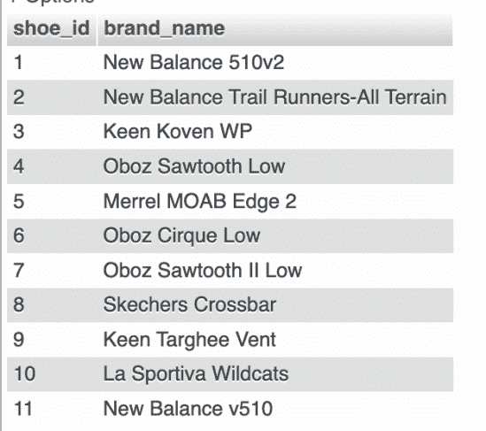
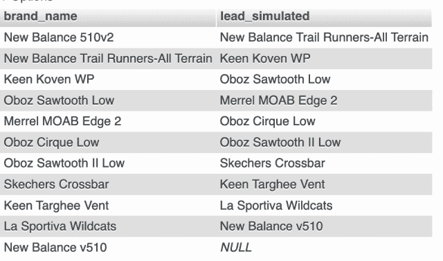
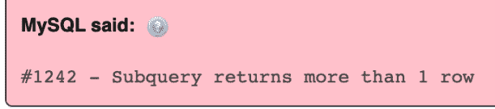
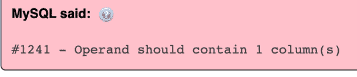

# 使用相关子查询模拟 LEAD()窗口函数

> 原文：<https://levelup.gitconnected.com/simulate-lead-window-function-using-correlated-subquery-ce8fc9900fd8>

在我看来，MS Access 是一个*数据库*的垃圾。更有可能的是，数据库是*一词过于强势*。虽然我不会在本文中使用 Access，但这里有一个故事(但我在这里不是为了举办 Access bash party)。继续阅读关于如何使用相关子查询和模拟`LEAD()`窗口函数的示例。


图片来自 [Pixabay](https://pixabay.com//?utm_source=link-attribution&utm_medium=referral&utm_campaign=image&utm_content=2389207)

## PHP 和 MySQL 开发人员的时事通讯

当您[订阅 ***OpenLampTech*** 时事通讯](http://openlamptech.substack.com)时，会收到一本我的电子书*《给每个人的 10 个 MySQL 技巧】*。

当使用支持窗口函数的现代 SQL 数据库时，人们往往会对它们的便利性感到失望。老实说，我从来没有对我通常使用的数据库的窗口函数抱有*“自己动手做”*的想法。

我的意思是不是所有的数据库都支持(窗口函数)？

我们不是(生活)在现代 SQL 时代吗？

## 大多数 SQL 数据库支持窗口函数

嗯，真正的数据库是支持窗口功能的。但是由于 MS Access 不是一个真正的数据库，所以在那个环境中没有可用的窗口函数。

所以是的，你得 ***黑掉你自己的*** 。

这正是我最近在使用 MS Access 时不得不做的事情。但是就像我以前写的那样，我不会在本文中使用 MS Access。

相反，我将使用 MySQL 和 ***假装***MySQL 没有窗口函数支持(**当然 MySQL v8+有！**)。

对于示例查询数据，我将使用一个包含我最喜欢的(过去和现在)徒步/步行鞋的表:



假设我需要从当前行进一步检查结果集中某一行的值。在更现代的 SQL *设置*中，我可以利用`LEAD()`窗口函数。

正如您可能已经猜到的那样，我将演示如果您没有那么幸运地拥有 ***staple*** 窗口函数供您使用，您将如何查看更多的行。

相反，我们可以使用一个[相关子查询](https://en.wikipedia.org/wiki/Correlated_subquery)。

如果我想根据“shoe_id”排序检查下一行的“brand_name”列值，使用相关子查询来*生成*该特定列值，可能类似于以下查询:

```
SELECT sw.brand_name,
(SELECT sw2.brand_name
FROM shoes_worn AS sw2
WHERE sw2.shoe_id > sw.shoe_id 
ORDER BY sw2.shoe_id
LIMIT 1) AS lead_simulated
FROM shoes_worn AS sw
order by sw.shoe_id ASC;
```



## 选择列表相关子查询中返回了多行

请注意，列别名“lead_simulated”实际上是从一个`SELECT`查询中派生出来的*(这里不严格地称为 T10 ),而不是通常的列名或表达式。这只是相关子查询的一个示例和用途。*

这是因为生成`SELECT`列表列或表达式值**的`SELECT`查询不能每行返回多于 1 列和值**。

在本例中，如果我从相关子查询中删除`LIMIT 1`子句，我们会得到一个错误，告诉我们(可以说有太多行):

```
SELECT sw.brand_name,
(SELECT sw2.brand_name
FROM shoes_worn AS sw2
WHERE sw2.shoe_id > sw.shoe_id 
ORDER BY sw2.shoe_id
) AS lead_simulated
FROM shoes_worn AS sw
order by sw.shoe_id ASC;
```



## 选择列表中的多个列相关子查询

另一方面，如果我在相关子查询中包含两列——不管是否存在`LIMIT 1`子句——我们也会得到一个错误:

```
SELECT sw.brand_name,
(SELECT sw2.brand_name, sw2.shoe_id
FROM shoes_worn AS sw2
WHERE sw2.shoe_id > sw.shoe_id 
ORDER BY sw2.shoe_id
LIMIT 1) AS lead_simulated
FROM shoes_worn AS sw
order by sw.shoe_id ASC;
```



根据我的经验和理解，在使用像这样的相关子查询(或一般的`LEAD()`窗口函数)时，需要注意一些事情:

*   注意*“铅样”*列中的重复值
*   您需要为*“lead-like”*列指定一个有意义的排序顺序
*   当结果集中没有剩余的行时，`NULL`将(通常)返回该行的 lead 值。

像往常一样，当我面临编码的新挑战时，我喜欢分享我学到的东西。如果您发现代码中有任何错误或知道更好的解决方案，请在评论区自由分享，这样我们都可以从这些知识中受益。

感谢你阅读这篇文章。请与同样喜欢它的人分享。

[**用一杯咖啡支持我的内容！**](https://ko-fi.com/joshlovescoffee)

[Josh Otwell](https://joshuaotwell.com/about/) 热衷于成为 PHP 开发人员、SQL 专家和技术博客/作家。

免责声明:本文中的大多数示例都是在个人发展/学习工作站环境中执行的， ***不应被视为生产质量或就绪*** 。您的特定目标和需求可能会有所不同。一如既往，你能做某事并不意味着你应该做。我的观点是我自己的。

***我能帮助的更多方面***

*   开博客？我使用 WordPress 的 ***数字猫头鹰的散文*** 博客。让我们俩[在提供的计划上省钱。](https://wordpress.com/refer-a-friend/yYnZ8Qph6LLrOLgEQb93/)
*   在[***OpenLampTech***时事通讯](http://openlamptech.substack.com/)中投放价格合理的分类广告，让您的品牌、产品或服务得到应有的关注[。](https://ko-fi.com/s/7dfe9ce108)
*   需要托管你的下一个网络应用程序或 WordPress 网站吗？我强烈推荐 [Hostinger](https://www.hostg.xyz/aff_c?offer_id=6&aff_id=94641) ，用它们来托管[我的利基鲈鱼钓鱼网站](http://louisianabassnation.com/)。该服务是首屈一指的，他们提供免费的 SSL。
*   [作为一名自学成才的开发人员，我逐渐认识到的 5 个事实](https://ko-fi.com/post/5-Truths-Ive-Come-To-Realize-As-a-Self-taught-Dev-R5R2BL9J6)

***披露*** :本帖中的一些服务和产品链接是附属链接。在没有额外费用给你，你应该通过点击其中一个购买，我会收到佣金。

当您[订阅***【OpenLampTech】***简讯](http://openlamptech.substack.com)时，收到一本我的电子书*《给每个人的 10 个 MySQL 技巧】****绝对免费*** 。

通过在 ***OpenLampTech*** 时事通讯中投放价格合理的分类广告，让您的品牌、产品或服务获得其所需的关注度[。谢谢大家的支持！](https://ko-fi.com/s/7dfe9ce108)

*原载于 2022 年 11 月 30 日 https://joshuaotwell.com*[](https://joshuaotwell.com/simulate-lead-window-function-using-correlated-subquery/)**。**