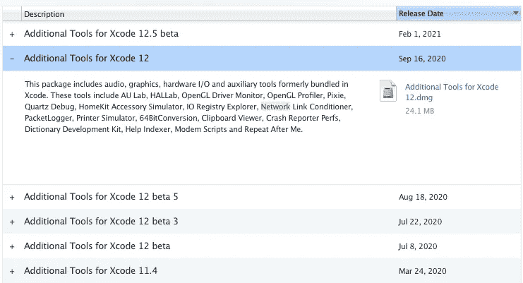
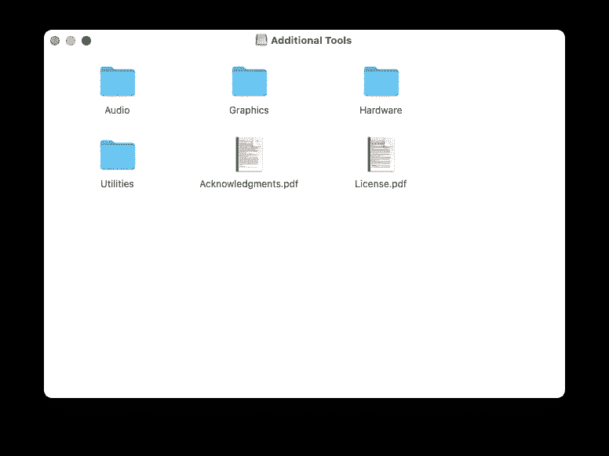
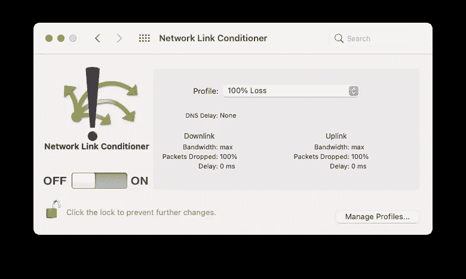
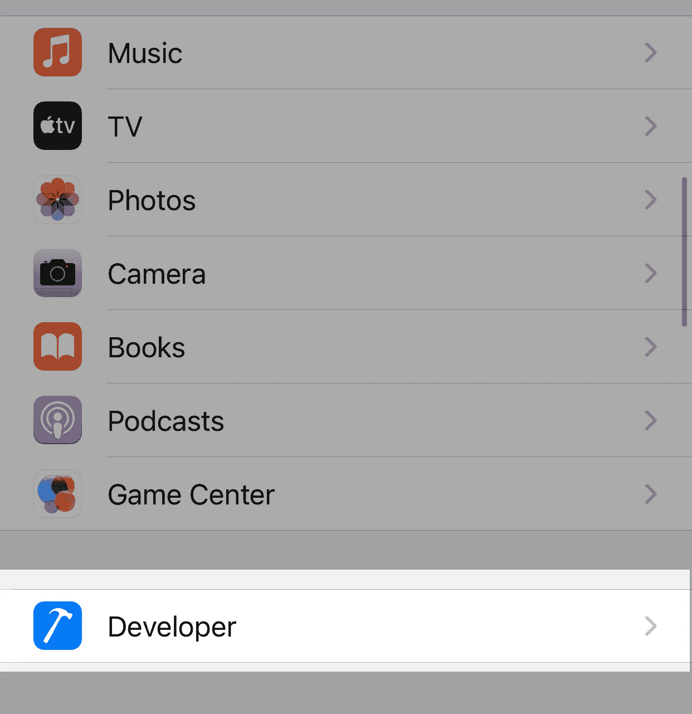
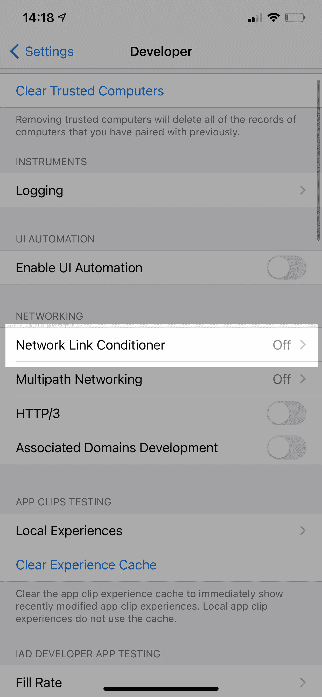
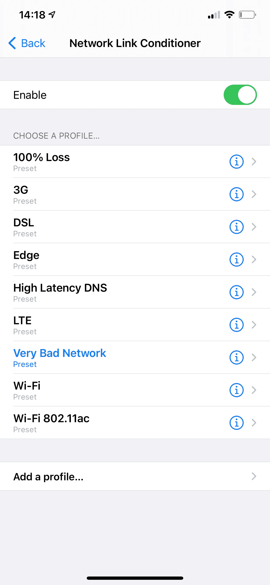
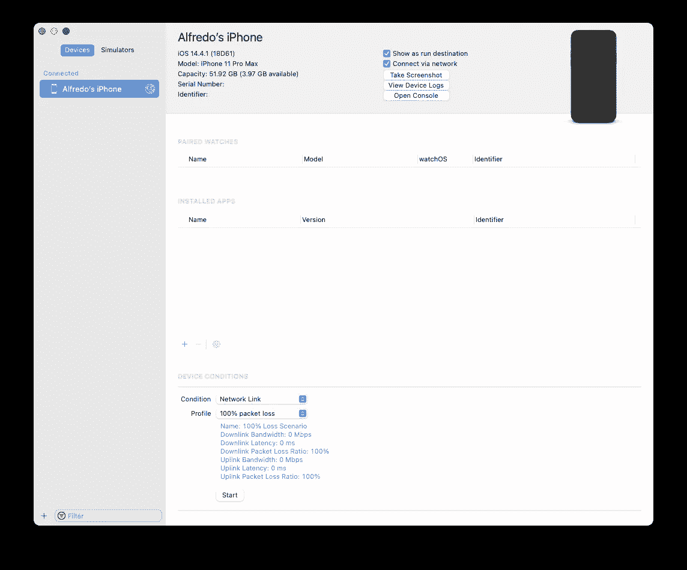
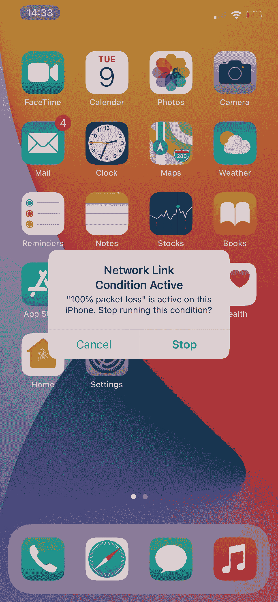

# 在 iOS 设备或模拟器上模拟较差的互联网连接

> 原文：<https://levelup.gitconnected.com/simulate-poor-internet-connection-on-ios-device-or-simulator-5e0650cb44d8>

有时我们需要在我们的 iOS 模拟器中模拟连接不良或没有连接。一种方法是从我们的 Mac 或设备上禁用我们的 WiFi，但如何模拟 3G、LTE、DSL、edge 等连接呢？

在这篇文章中，我想和你分享一些在 iOS 模拟器和真实设备中实现这一点的方法。

# iOS 模拟器

为了模拟 LTE、3G、DSL 等不同类型的网络，我们需要下载[网络链路调节器](https://developer.apple.com/download/more/)工具。寻找您的 Xcode 版本并安装它。

从[developer.apple.com](developer.apple.com/download/more/)下载您的 XCode 版本

下载后。dmg 文件，你会看到所有可用的工具。

Xcode 的附加工具

转到`Hardware`并选择`Network Link Conditioner.prefPane`完成后，我们将在系统偏好设置中看到它。

网络链路调节器

现在，您可以选择任何您需要的配置文件来模拟您想要的场景。

# iPhone 设备

进入您的设置并进入`Developer`菜单。

然后选择`Network Link Conditioner`并勾选`Enable`

像 macOS 中的网络链接调节器一样，您可以选择所需的配置文件来模拟不良连接(100%丢失)或 3G 连接等。

## 使用 Xcode

我们可以从 Xcode 中启用这个工具。只要去你的设备，选择你的 iPhone 或 iPad。你会看到链接调节器在底部选择任何你想要的配置文件。

点击开始，你会在你的 iPhone 上看到一个指示器，它会记住我们，我们正在使用这个工具。

如果要停止网络调节器，请选择指示器并停止。

在 Mac 和 iPhone 上使用完**网络链接调节器**后，不要忘记将其禁用，否则会影响您的日常使用。