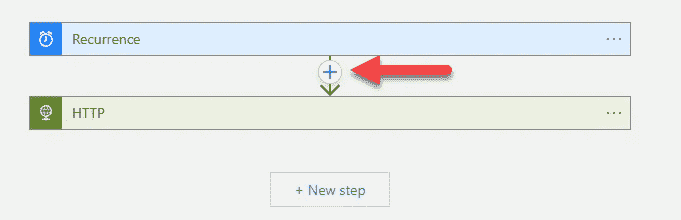
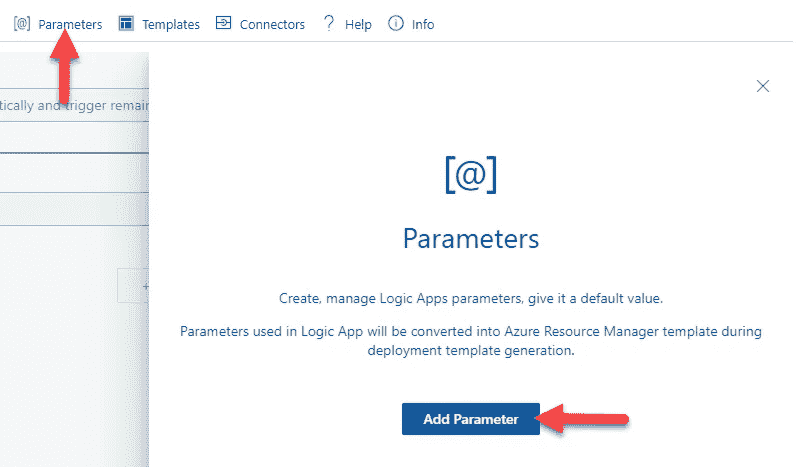

# 使用逻辑应用程序模拟到 API 的流量

> 原文：<https://levelup.gitconnected.com/simulate-traffic-to-an-api-using-logic-apps-9842ac20fb78>

## 当您的演示应用程序没有真正的用户时

[图片来源:Unsplash](https://unsplash.com/photos/7nrsVjvALnA)

# 介绍

最近，我正在准备一个关于 Azure Application Insights 及其与. NET 6 API 集成的主题的演示。该演示由多个演示组成，展示了应用洞察的各种功能，如事务搜索、自定义事件、应用地图和依赖关系、可用性测试等。

现在用一个演示来演示所有这些特性。没有人真正使用的. NET API 有点低效，因为我可能无法演示任何东西，因为不会生成日志。因此，我认为在演示之前让演示应用程序运行几周是个好主意，这样可以生成足够的日志，模拟应用程序正在运行和被使用的情况。

虽然在理论上，这听起来很棒，但我仍然有一个问题——如果没有人真正使用这个 API，日志将如何生成？本文旨在探索解决这一问题的方法。

# 解决办法

我在我的演示 API 应用程序中创建了多个 API 端点，该应用程序可公开访问并托管在 Azure 中，因此当向该端点发出请求时，它将能够向 Application Insights 发送相关日志，从而为我的演示做出贡献。

例如，我需要记录足够多的自定义事件，所以我创建了一个 API 端点，它只会在特定事件被触发时向 Application Insights 发送该事件。除此之外，它什么也不做，这就是全部的要点——因为它是一个演示应用程序，我可以按照我认为合适的方式修改它。

我现在需要在我的演示中为每个 API 端点创建样本流量。NET API，它最终会创建日志并将其发送给 Application Insights。虽然有许多网络流量生成工具，但我需要找到一种适当的平衡，即不要过于复杂，可以升级和设置，可以免费使用，并且可以按计划自动运行。这时我发现了一个基于 Azure 的解决方案，叫做[逻辑应用](https://azure.microsoft.com/services/logic-apps)。

# 先决条件

原谅我的打扰。在我们开始讨论如何使用 Logic Apps 解决上述问题之前，如果你想继续下去，那么你需要准备一些东西。

*   在这个例子中，我们将使用一个假的 API 工具 [Mocki](https://mocki.io/fake-json-api) 。我强烈推荐你使用这个工具，因为安装时间绝对是最短的。出于本文的目的，我只打算展示一个逻辑应用程序的工作方式，所以我并不真的需要实际的 Application Insights 实例和演示。NET API。话虽如此，如果您已经在一个可公开访问的位置创建并托管了一个示例 API，那么可以随意使用该应用程序中的几个 API 端点。
*   由于我们正在使用 Azure Logic 应用，如果你还没有，请创建一个[免费 Azure 账户](https://azure.microsoft.com/)。

# 实施步骤

正如在他们的[文档](https://docs.microsoft.com/en-us/azure/logic-apps/logic-apps-overview)中提到的，Azure Logic Apps 是一个基于云的平台，用于创建和运行集成你的应用、数据、服务和系统的自动化工作流。工作流是定义任务或流程的一系列步骤，每个工作流都以单个触发器开始，之后您必须添加一个或多个操作。

我们将利用 Logic Apps 的这个自动化工作流特性来生成我们的示例 API 请求。让我们开始吧。

## 步骤 1:创建逻辑应用程序

登录 Azure，然后点击左上角的菜单。接下来，点击**创建一个资源**，然后搜索 Logic App 并点击。在该屏幕上，点击**创建**按钮。

图片由作者提供

从下拉列表中选择适当的**订阅**，并选择或创建新的**资源组**。然后从下一部分选择**类型**作为**消耗**。根据消费计划，您为每次执行支付费用，而不是每小时的固定价格。前 4000 个动作是免费的，由于我们的 Logic 应用程序将低于这个限制，我们应该能够免费运行这个 Logic 应用程序。点击阅读更多关于逻辑应用[的定价计划。](https://azure.microsoft.com/en-gb/pricing/details/logic-apps/)

图片由作者提供

给逻辑应用一个合适的名字，选择一个地区，现在禁用日志分析。点击**审核+创建**按钮，然后从下一个面板中点击**创建**按钮。

## 步骤 2:配置触发器

Azure 应该在后台创建一个逻辑应用程序，几分钟后，你应该能够点击资源并导航到它。因为这是你第一次访问这个资源，还没有配置任何东西，Azure 将直接向你展示逻辑应用程序**设计器**视图，让你开始。

如前所述，我们希望让请求自动触发我们的 API。这意味着我们的逻辑应用程序将需要按照计划自动*触发*。在这种情况下，选择的触发将是**循环**。

图片由作者提供

让我们从每天早上 8:01 和晚上 8:01 运行一次 Logic 应用程序开始。如果需要，我们可以随时修改这个时间表。

如果您点击**重复**步骤，您应该能够将**间隔**设置为 **1** ，将**频率**设置为**日**，然后从**添加新参数**下拉列表中，选中**开始时间**、**在这些小时**，以及**在这些分钟**复选框。

图片由作者提供

从【T24 在这些时间】下拉菜单中选择 **8** 和**20**(24 小时格式为晚上 8 点)。接下来，从这些分钟的**文本框中，键入 **01** ，这表示该小时的第一分钟。在**预览**窗格中，您应该会看到这个用文字打印的时间表，以确认您的选择。这就是触发器所需的所有配置。**

****

**图片由作者提供**

## **步骤#3:配置第一步**

**点击 **+新步骤**按钮，在该逻辑 App 被触发后增加一个新步骤。我们想向我们的 API 端点发送一个 API 请求，所以让我们从连接器和动作池中选择 **HTTP** 。**

****

**图片由作者提供**

**从 **HTTP** 的配置选项中，选择**方法**作为 **GET** ，并在 **URI** 字段中输入 API URL 端点。在下面的截图中，我已经输入了本文使用的[模拟 API URL](https://mocki.io/v1/a3996bc1-0f57-4548-8d37-f44e5414ea09) 。**

****

**图片由作者提供**

**不要忘记定期点击**保存**按钮来保存您的进度。**

****

**图片由作者提供**

## **步骤#4:运行测试运行**

**要查看您的逻辑应用程序是否配置正确，请点击**运行触发器**按钮。这将立即运行整个工作流，是测试您的逻辑应用程序的有用方法，而不是等待实际的触发器启动。**

****

**图片由作者提供**

**过一会儿，您应该会看到 designer 面板更新，每个步骤旁边都会出现绿色复选标记。单击该步骤应该会为您提供更多的细节，您还应该能够看到从 API 端点返回的响应。**

****

**图片由作者提供**

## **步骤#5:扩展工作流以 ping 另一个 URL**

**正如本文开头所概述的，我们希望按照一个循环的时间表向多个 API 端点发送 API 请求。让我们从重复后点击加号图标开始。如果你点击 **+新步骤**，它会在 **HTTP** 步骤之后创建一个步骤，这不是我们想要的。**

****

**图片由作者提供**

**现在，从选项中，选择**添加一个并行分支**。如果你点击**添加一个动作**，它将在**重复**和 **HTTP** 之间添加一个步骤，这也不是我们想要的。**

****

**图片由作者提供**

**选择另一个 **HTTP** 动作，并重复与前面相同的步骤来配置这个 HTTP 步骤，只是这次在 **URI** 字段中输入第二个 API 端点。最后，它应该类似于下面的截图。**

****

**图片由作者提供**

**保存您的更改，然后测试它以确保它按预期工作。**

## **步骤#6:监控工作流运行**

**点击左侧面板中的**概述**菜单项，然后点击**运行历史**。这将向您显示项目列表以及每次运行的状态。如果你点击一个单独的行，你应该能够看到更多的细节。**

****

**图片由作者提供**

# **你的团队会欣赏什么？**

## **遵循良好的命名约定**

**如果你现在看一下可视化设计器，你会看到它被标为**循环**、 **HTTP** 、 **HTTP 2** 等等。这不是一个好主意，因为随着我们增加步骤，识别哪个步骤针对哪个 API 端点将变得非常困难。想象一下，当你不在的时候，另一个团队成员进来更新一些步骤。你想要实现的目标是命名这些步骤，这样就很清楚它要做什么。**

**点击三个圆点，然后点击**重命名**。这将使标签可编辑，所以你应该能够重命名它。**

****

**图片由作者提供**

**不要忘记保存所有的修改。在我重命名所有步骤后，我的 demo Logic 应用程序看起来像下面的截图。**

****

**图片由作者提供**

## **设计器与代码视图**

**默认情况下，您应该总是看到**设计器**视图。这提供了一种可视化的方式来编辑你的逻辑应用程序，这使得它很好，很容易，尤其是当你开始的时候。然而，如果你需要批量配置，如果你仅仅依靠**设计师**的观点，这将是一个非常缓慢的过程。**

**为了加快进程，点击**代码视图**按钮查看逻辑应用程序背后的代码。如果你知道语法，打出来会快很多。**

****

**图片由作者提供**

**在我们的示例中，我们已经添加了来自**设计器**的两个 API 端点，现在假设我们想要再添加几个，我们可以单击**代码视图**按钮，从 actions 对象复制一个块，然后简单地多次复制粘贴它。对于每个代码块，更新块的键，在本例中是 API 端点的`API_endpoint_NEW`和`URI`。即使在**代码视图**中，也不要忘记保存您的更改。**

## **因素**

**如果您认为每次都要使用相同的值，请考虑使用参数。要添加参数，点击标题中的**参数**，然后点击**添加参数**。**

****

**图片由作者提供**

**输入参数的名称，并给它一个默认值—之所以称之为默认值，是因为我们可以在运行时更改参数的值。然而，在本例中，我们将只使用参数的默认值。您不需要再次点击**添加参数**，因为这是为了添加另一个参数。**

****

**图片由作者提供**

**要使用该参数，点击 **HTTP** 步骤。现在，让我们用刚刚添加的参数替换基本 URL 部分。如果**动态内容**模式没有自动弹出，您可以点击**添加动态内容**链接来打开该模式，然后您应该会在列表中看到该参数。**

****

**图片由作者提供**

**保存并运行触发器进行测试——一切都应该照常运行。如果您点击**代码视图**，您应该能够看到参数是如何配置的(下面代码片段中的第 11-16 行)以及它是如何使用的(第 5 行)。**

**就是这样。感谢阅读！**