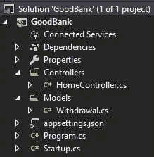
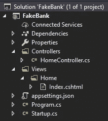
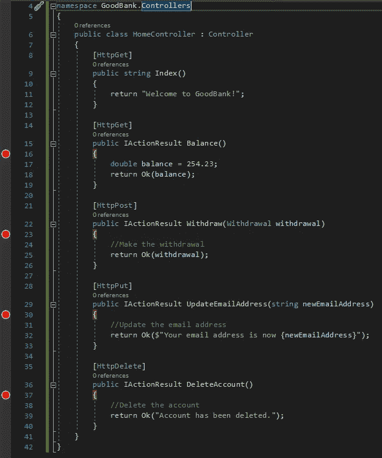
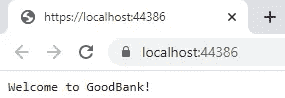
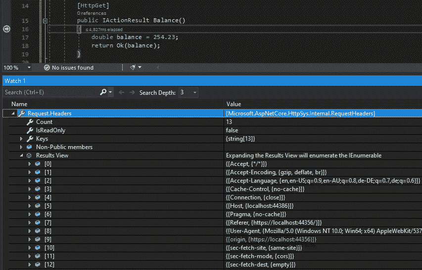
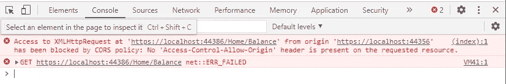

# 模拟 CSRF 攻击第 1 部分

> 原文：<https://levelup.gitconnected.com/simulating-a-csrf-attack-part-1-5ec8b0f8b152>

## 了解它如何工作的最好方法是自己做一个

这是 [2 部分](https://davidklempfner.medium.com/simulating-a-csrf-attack-part-2-bf6f378da625)系列的第 1 部分。

我将向你展示如何使用两个本地网络应用程序模拟一次 **CSRF** 攻击，然后回答我在学习这些东西时提出的一系列问题。

我还将谈一谈 **CORS** 和**同源**政策。

# 场景

您是一名网上银行用户，目前登录了 GoodBank 网站。

当您仍然登录时，您会收到一封假装来自 GoodBank 的电子邮件。

你点击邮件中的链接，它就会加载 FakeBank 的网站。

在后台，FakeBank 网站将运行向 GoodBank 发出请求的 Javascript 代码。因为您是在另一个选项卡中登录 GoodBank 的，所以浏览器会发送您的会话 cookie，其中包含 FakeBank 网站发送的恶意请求。

# 设置 web 应用程序

您将设置两个本地运行的 web 应用程序。一个代表古德班克，另一个代表恶意的 FakeBank。

## 如果在本地运行，请求将如何跨来源？

对于跨来源的请求，它必须指向至少在以下一个方面不同的 URL:

1.  协议(例如 http 而不是 https)
2.  领域(如 another.domain.com 而不是 domain.com)
3.  港口(如 domain.com:2343 而非 domain.com:2311)

多亏了 ASP.NET 核心，当你在本地运行多个网络应用时，你可以自动拥有不同的端口。

# 古德班克

使用以下文件/文件夹创建一个名为 GoodBank 的 ASP.NET 核心 3.0 MVC 应用程序:

将代码复制到相关文件中。未显示的文件可以保留默认代码:

## HomeController.cs

## 撤回. cs

## Startup.cs

# FakeBank

使用以下文件/文件夹创建一个名为 FakeBank 的 ASP.NET 核心 3.0 MVC 应用程序:

将代码复制到相关文件中。未显示的文件可以保留默认代码:

## Index.cshtml

下面代码中的端口号 44386 需要替换为用于 GoodBank web 应用程序的端口(在下一步运行时您会发现)。

## 设置断点

在 GoodBank 应用程序的`HomeController`类中的每个方法(除了`Index()`方法)的第一行放置一个断点。

## 启动应用程序

启动 GoodBank 应用程序，您应该会看到这个:

复制你的端口号(我的是 44386)并粘贴到 FakeBank 应用程序的 Index.cshtml 文件的 URL 中。

## 执行跨来源 GET 请求

现在我们要模拟攻击。

一旦 FakeBank 网站被加载，就会有 Javascript 在后台运行，向 GoodBank 发出跨源 GET 请求，以获取受害者的银行余额。

在现实生活中，如果您登录到 GoodBank，您的会话 cookie 将被发送，因此您将通过身份验证。

现在启动 FakeBank 应用程序。

当发出 GET 请求时，断点将在 GoodBank 应用程序中被命中。

## 查看请求

在观察窗口中，输入`Request.Headers`并点击结果视图。

## 原始标题

这里重要的头是源头。它的值是用户发出请求时查看的网页的 URL。

## 网络选项卡

现在回到 FakeBank 网页，点击 F12 查看控制台。

如果你看不到任何东西，你可能需要重新加载页面，然后在断点命中后继续在 GoodBank 应用中执行，以便查看日志。

## 错误

我们知道请求是成功的，因为我们看到断点在 GoodBank 应用程序中被命中，但我们也可以看到在 FakeBank 应用程序中分配给`xhr.onload()`的函数甚至没有执行！如果是的话，我们会看到`GET request finished executing. The response is:`和响应，并写入控制台。

## 注意事项

**跨源 GET 请求可以工作，但是响应对 Javascript 代码不可用。**

这是浏览器提供的安全功能。如果它允许的话，制作 FakeBank 的黑客可能已经对返回的敏感信息做了一些事情。

此功能被称为同源策略，任何知名浏览器都使用它。

## 如果黑客把 Origin 头去掉了呢？

如果您通过在浏览器中键入 URL 并按回车键来发出 GET 请求，则不会发送原始标题，因为没有为您发出请求的网页，而是您自己从浏览器中发出请求。

那么，如果在 Javascript 代码中删除了 Origin 头会怎么样呢？让我们看看如果黑客试图这么做会发生什么。

用下面的第 9 行更新 FakeBank 应用程序中的 Index.cshtml 文件:

保存文件，并刷新 FakeBank 网页。

在 GoodBank 应用程序中点击断点时，请查看标题。你会注意到原点头还在！

这是浏览器提供的另一个安全特性。
如果浏览器允许 Javascript 运行，这就改变了 Origin 头，黑客可以删除它或者用 GoodBank 的 URL 更新它，这样 GoodBank web 服务器就认为请求来自它自己的网页。

## 但是不能使用 Powershell 或 Fiddler 等来欺骗标头吗？

是的，它可以。但唯一可行的方法是黑客进入受害者的电脑，并能够使用其中一种工具发出请求。

但是这有什么意义呢？如果黑客能够进入受害者的电脑，他就能够窃取会话 cookie，这将更加有用。

# CSRF 得到的请求并不真的危险

一个 CSRF GET 请求并不是真正的“攻击”，除非受害者的银行有一个设计糟糕的 web 应用，没有使用 ReSTful APIs。

根据 ReST，GET 请求必须是安全的和幂等的。这意味着它不会在服务器上做任何改变，每次都做同样的事情。

如果 API 不是 ReSTful 的，GET 请求实际上可能会更新服务器上的内容。如果黑客知道 GET 请求的处理程序会做什么，那么网站肯定会被利用。

# 始终使用众所周知的浏览器

重要的是，同源策略是现代浏览器提供的一个很好的安全特性。但是，请记住跨域 GET 请求(以及 POST 请求，我们将在下一篇文章中看到)确实会成功，只是您无法查看响应。

在下一篇 **文章**的 [**中，我将讨论可以被利用来执行实际攻击的 POST 请求，以及当您尝试发出 PUT 或 DELETE 请求时会发生什么。**](https://davidklempfner.medium.com/simulating-a-csrf-attack-part-2-bf6f378da625)