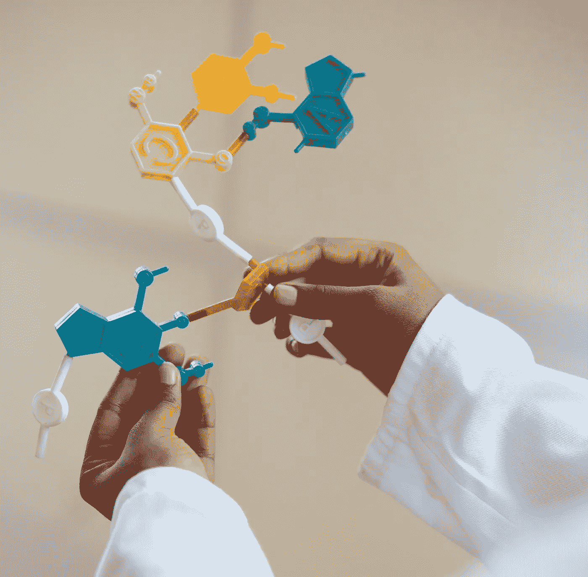
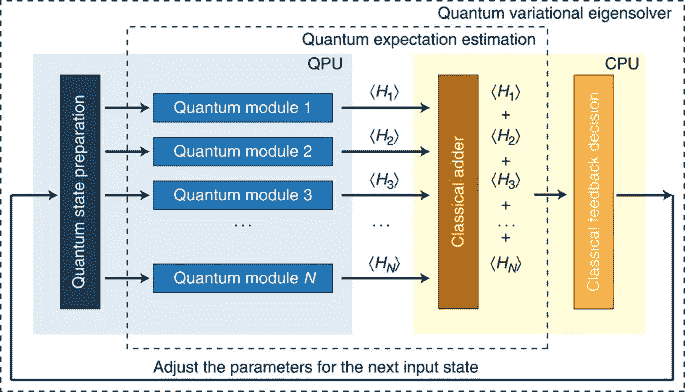
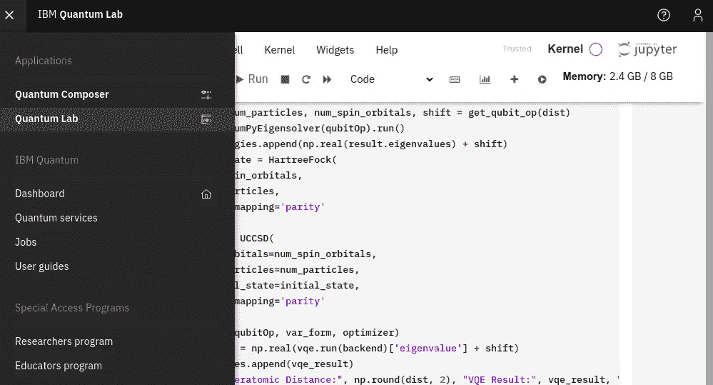
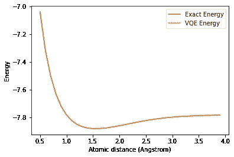

# 用量子计算模拟化学反应

> 原文：<https://levelup.gitconnected.com/simulating-chemical-reactions-with-quantum-computing-ca6857264984>

## 101 量子化学，如何开始



资料来源:Pexels

在光学硬件和量子计算的潜在用途中，有化学模拟。量子计算比经典计算快得多，给药物开发和其他化学过程带来了希望。这篇文章不适合有经验的量子研究人员。这是激励男孩和女孩进入这一领域的入门课程。为了避免信息过载，这里不讨论电路设计。如果您对此感兴趣，请单击底部的参考链接。

让我们开始:量子化学和药物开发的起点是**变分量子本征解算器** (VQE)。在实践中，VQE 是一种混合算法(部分量子和部分经典)，它计算*厄米矩阵 H(我们将稍后回来)*的特征值。除了对化学模拟感兴趣之外，它还很重要，因为它是一种混合方法。也就是说，当我们等待更好的纯量子系统工作时，我们在量子领域和经典计算机上做一些事情，但我们仍然取得了成果。

在这种情况下，你经常听到的是“比较能量”。精确计算分子特征能量的导数对于模拟化学反应是必不可少的。分子最重要的特性是它的基态能量。它代表一个分子处于基态的最低可能能量状态。**分子的能量非常重要，因为它告诉我们该分子的电子构型。这可以帮助我们在未来模拟分子。**

如果我们能计算基态能量，我们就能猜测哪些分子会相互作用。不幸的是，每当我们向系统中添加一个粒子，计算成本就会呈指数增长。这就是量子计算机和 VQE 派上用场的地方。

以下部分包括

1.  **最小背景**
2.  **VQE 的 Qiskit 实现**
3.  **进一步的阅读和结论**

# 背景

VQE 是一种利用量子力学中使用的**变分**方法的算法。如果是第一次听到“变分法”，不用担心。这意味着我们可以通过对代表分子的*波函数(称为 ansatz)* 进行有根据的猜测，来估计系统的基态能量。

也没听说过波函数？

> **波函数**是定义孤立系统量子态的函数。一般用ψ()表示，读作[psi]。
> 
> 一个**哈密顿量**只是一个系统总能量的数学描述。我们没有用完 Hs(哈密尔顿的，埃尔米特的，哈达玛的…)小心。

如果我们改变波函数，直到我们得到基态能量的最小值，给定我们的哈密顿量模型，我们可以描述一个分子的能量。此外，由于所谓的变分原理，VQE 找到了给定埃尔米特矩阵的最低可能特征值。

变分原理指出，对于给定的埃尔米特矩阵 H，其期望值必须总是等于或大于最低可能特征值。为了实现这一点，我们需要一个混合系统，既有量子的又有经典的。量子部分是奇迹发生的地方。

**量子部分:**

1.  准备 *ansatz* (例如由 *N* 角度参数化)
2.  首先我们要把分子哈密顿量映射到量子位。
3.  然后我们**测试一系列波函数**

**古典部分:**

1.  **选择新参数** ( *N* 角度)以最小化解。
2.  **重启量子计算机部分的**进程

更具体地说，我们正在将分子内部的电子轨道相互作用映射到量子位上，以便能够进行计算。由于我们不知道我们的基态能量是多少，我们计算几个波函数(给定原子间距离的特定哈密顿量)的基态能量，然后我们想计算那个电子构型的能量。安萨兹(有根据的猜测)的选择至关重要。

然后我们想要测量这些值，并**将其发送给经典优化器**，实现最低期望值，并迭代地将这些值发送回量子部分。由于它最终是一个经典的优化器，一些人推测称之为“量子机器学习”。佩鲁佐在下图中总结了这种迭代混合方法:



来源:[佩鲁佐等](https://www.nature.com/articles/ncomms5213)自然通讯 2014

“讲数学”，给定一个厄米矩阵 h，其未知的最小特征值λₘᵢₙ与本征态|ψₘᵢₙ⟩相关，VQE 得到一个估计值λθ定义为λₘᵢₙ≤λθ≡⟨ψ(θ)|H|ψ(θ)⟩，where|ψ(θ)⟩是与λθ相关的本征态。

现在让我们看看如何在实践中做到这一点。由于对 IBM 量子计算机云的访问目前是免费的，我们在 Python 中实现了 Qiskit 中的 [VQE 和](https://github.com/Qiskit/qiskit-tutorials/blob/master/tutorials/chemistry/03_ground_state_solvers.ipynb)[PySCF](https://sunqm.github.io/pyscf/)(Python 中的电子结构集合)。更具体地说，我们使用 Aqua(量子应用的算法)，在下面 0.8.0 版本的例子中。

我们可以将 *QuantumLab* 用作 *Jupyter 笔记本:*



总结 Qiskit 教程，首先我们导入所有必要的库、所有需要的 qiskist 化学和电路、numpy(生成范围、提取实数部分和近似值)以及可能的 matplotlib，用于绘制最终能量:

```
from qiskit.aqua.algorithms import VQE, NumPyEigensolver
import numpy **as** np
from qiskit.chemistry.components.variational_forms import UCCSD
from qiskit.chemistry.components.initial_states import HartreeFock
from qiskit.circuit.library import EfficientSU2
from qiskit.aqua.components.optimizers import COBYLA, SPSA, SLSQP
from qiskit.aqua.operators import Z2Symmetries
from qiskit import IBMQ, BasicAer, Aer
from qiskit.chemistry.drivers import PySCFDriver, UnitsType
from qiskit.chemistry import FermionicOperator
from qiskit.aqua import QuantumInstance
from qiskit.ignis.mitigation.measurement import CompleteMeasFitter
from qiskit.providers.aer.noise import NoiseModel
```

然后如果我们通过使用 [PySCF 库](https://sunqm.github.io/pyscf/)计算不同原子间距离的基态能量(在这种情况下为 LiH)。这是为了模拟另一个分子而改变的线。

[*费米子算符*实际上是将费米子哈密顿量映射到量子位哈密顿量的对象](https://arxiv.org/abs/1706.03637)。

```
**def** **get_qubit_op**(dist):
    driver **=** PySCFDriver(atom**=**"Li .0 .0 .0; H .0 .0 " **+** str(dist),              unit**=**UnitsType**.**ANGSTROM, charge**=**0, spin**=**0, basis**=**'sto3g')
    molecule **=** driver**.**run()
    freeze_list **=** [0]
    remove_list **=** [**-**3, **-**2]
    repulsion_energy **=** molecule**.**nuclear_repulsion_energy
    n_particles **=** molecule**.**num_alpha **+** molecule**.**num_beta
    n_spin_orbitals **=** molecule**.**num_orbitals ***** 2
    remove_list **=** [x **%** molecule**.**num_orbitals **for** x **in** remove_list]
    freeze_list **=** [x **%** molecule**.**num_orbitals **for** x **in** freeze_list]
    remove_list **=** [x **-** len(freeze_list) **for** x **in** remove_list]
    remove_list **+=** [x **+** molecule**.**num_orbitals **-** len(freeze_list)  **for** x **in** remove_list]
    freeze_list **+=** [x **+** molecule**.**num_orbitals **for** x **in** freeze_list]
    ferOp **=** FermionicOperator(h1**=**molecule**.**one_body_integrals, h2**=**molecule**.**two_body_integrals)
    ferOp, energy_shift **=** ferOp**.**fermion_mode_freezing(freeze_list)
    num_spin_orbitals **-=** len(freeze_list)
    n_particles **-=** len(freeze_list)
    ferOp **=** ferOp**.**fermion_mode_elimination(remove_list)
    num_spin_orbitals **-=** len(remove_list)
    qubitOp **=** ferOp**.**mapping(map_type**=**'parity', threshold**=**0.00000001)
    qubitOp **=** Z2Symmetries**.**two_qubit_reduction(qubitOp, n_particles)
    shift **=** energy_shift **+** repulsion_energy
    **return** qubitOp, n_particles, num_spin_orbitals, shift
```

然后，我们在 for 循环中使用上面的函数，该循环迭代整个建议距离范围(0.5 到 4.0 之间的范围，间距为 0.1)。

对于每次迭代，首先我们使用量子位算符和经典的精确本征解算器计算精确的基态能量:

```
get_qubit_op(dist) 
```

然后，初始状态|ψ⟩被创建用于定义安萨兹 minθ(|ψ(θ)⟩).

名为 VQE 的函数调用为`VQE(qubitOp, var_form, optimizer, 'paulis')`计算 h 对ψ(θ)⟩.的期望值初始状态由[哈特里-福克方法](https://en.wikipedia.org/wiki/Hartree%E2%80%93Fock_method)定义。

这种类型的优化器由泡利串的总和定义，其中每个泡利串(每个位置的泡利矩阵的乘积)使用与对应的|ψ(θ)⟩.相关的电路一旦所有这些电路都运行起来，我们就可以计算|ψ(θ)⟩.上 h 的期望值

或者，通过线性近似的约束优化(COBYLA)算法被初始化为

```
optimizer **=** COBYLA(maxiter**=**500, tol**=**0.0001)backend **=** BasicAer**.**get_backend("statevector_simulator")
distances **=** np**.**arange(0.5, 4.0, 0.1)
exact_energies **=** []
vqe_energies **=** []
optimizer **=** SLSQP(maxiter**=**5)
**for** dist **in** distances:
    qubitOp, num_particles, n_spin_orbitals, shift **=** get_qubit_op(dist)
    result **=** NumPyEigensolver(qubitOp)**.**run()
    exact_energies**.**append(np**.**real(result**.**eigenvalues) **+** shift)
    initial_state **=** HartreeFock(
        n_spin_orbitals,
        num_particles,
        qubit_mapping**=**'parity'
    ) 
    var_form **=** UCCSD(
        num_orbitals**=**n_spin_orbitals,
        num_particles**=**num_particles,
        initial_state**=**initial_state,
        qubit_mapping**=**'parity'
    )
    vqe **=** VQE(qubitOp, var_form, optimizer)
    results **=** np**.**real(vqe**.**run(backend)['eigenvalue'] **+** shift)
    vqe_energies**.**append(results)
    print("Interatomic Distance:", np**.**round(dist, 2), "VQE Result:",   results, "Exact Energy:", exact_energies[**-**1])

print("Done")
```

由此产生的能量图(*vqe _ energy 和 exact _ energy*)将如下所示:



结果非常好，实际上我们看不到准确的能量曲线，因为它隐藏在 VQE 曲线后面。所以，在这个罐子里，产生最小能量的距离，是锂原子和氢原子之间的实际原子间距。

# **进一步阅读**和结论

更先进的实现提出了[高效的对称保持状态准备电路](https://www.nature.com/articles/s41534-019-0240-1)。如果你对这个先进的 VEQ 感兴趣，我推荐 Sophia Economou 在 Qiskit 频道的演讲:

或者查看 Qiskit 的[高级 VQE 笔记本。](https://github.com/Qiskit/qiskit-tutorials/blob/master/tutorials/algorithms/04_vqe_advanced.ipynb)

替代的量子化学库是存在的，尽管你可能也需要改变量子云。那些是

*   [开放费米子](https://github.com/quantumlib/OpenFermion)
*   [Psi4](https://github.com/psi4/psi4/)
*   [OpenQemist](https://github.com/1QB-Information-Technologies/openqemist)

OpenFermion 是基于 Cirq 的 Google 量子计算机，OpenQemist 是基于 Q#的 Azure

[](https://medium.com/technology-hits/azure-quantum-computing-b7b9e009de7a) [## Azure 量子计算

### 未来的数据工程，不只是炒作

medium.com](https://medium.com/technology-hits/azure-quantum-computing-b7b9e009de7a) 

VQE 是利用量子计算进行化学模拟的起点，并且存在基于 [*冻结自然轨道*](http://1qbit.com/files/research-papers/1QBit-Research-Paper-%E2%80%93-Scaling-Up-Electronic-Structure-Calculations-on-Quantum-Computers.pdf) 的更高级的方法。然而，它很有趣，因为它用混合方法完全量子化地补偿了当前高噪声硬件中的挑战。显然，我们离模拟蛋白质对接和药物发现还很远，但这是一个开始。

# 参考

1.  光子量子处理器上的变分特征值求解器*自然通讯* 5 (2014): 4213。
2.  量子神经网络训练景观中的贫瘠高原。*自然通讯*9.1(2018):1–6。
3.  小分子和量子磁体的硬件有效的变分量子本征解算器自然 549.7671 (2017): 242。

# 想连接就连接


[@ Dr _ Alex _ 克里米](https://twitter.com/Dr_Alex_Crimi)


[@ Alec rimi 博士](https://www.instagram.com/dr.alecrimi/)


[亚历山德罗·克里米——YouTube](https://www.youtube.com/alecrimi)


[https://web.facebook.com/dralecrimi](https://web.facebook.com/dralecrimi)